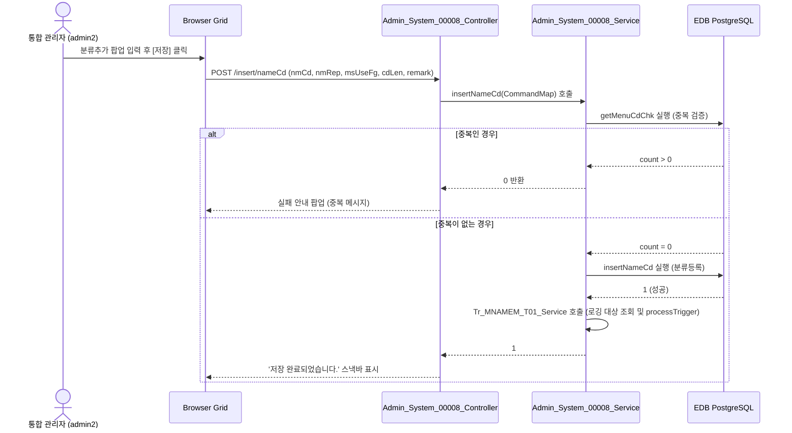

# Admin_System_00008 — 명칭코드관리 (Admin) 단위 테스트케이스

> **대상 화면**: 시스템관리 > 영업정보시스템 > 명칭코드관리 (`admin_system_00008`)  
> **API Base URL**: `POST /backoffice/data/admin/system/admin_system_00008`  
> **트랜잭션 설정**: `@Transactional(rollbackFor = {RuntimeException.class, Exception.class})`  
> **데이터 수신 방식**: `@RequestBody HashMap<String, Object> map` (전 엔드포인트 공통)  
> **DB 영향도**: `hmsfns.MNAMEMTB` (명칭 마스터) 테이블 CUD 발생 시 `Tr_MNAMEM_T01_Service` 가동을 통해 `hmsfns.MMSLOGTB` 에 이력 로깅.

---

## 1. 테스트 선행 및 세션 조건

- **로그인 ID**: `admin2` (비밀번호: `0000`)
- **권한 유형**: 통합 관리자 (SYSTEM_TYPE = ADMIN)
- **대상 테이블**: `hmsfns.MNAMEMTB`

---

## 2. 엔드포인트 명세 및 쿼리 매핑

| # | URL 엔드포인트 | HTTP Method | 기능 요약 | 데이터 반환 | 연관 테이블 |
| :--- | :--- | :---: | :--- | :--- | :--- |
| 1 | `/search/nameCd` | POST | 분류 코드 목록 조회 | `List<Map<String, Object>>` | `MNAMEMTB` (NM_FG='000') |
| 2 | `/search/nameDt` | POST | 상세 코드 목록 조회 | `List<Map<String, Object>>` | `MNAMEMTB` (NM_FG=nmCd) |
| 3 | `/insert/nameCd` | POST | 분류 코드 신규 등록 | `int` (성공 시 1, 중복 시 0) | `MNAMEMTB` |
| 4 | `/insert/nameDt` | POST | 상세 코드 신규 등록 | `int` (성공 시 1, 중복 시 0) | `MNAMEMTB` |
| 5 | `/save/nameCd` | POST | 분류 코드 수정 | `int` (성공 시 1) | `MNAMEMTB` |
| 6 | `/save/nameDt` | POST | 상세 코드 수정 | `int` (성공 시 1) | `MNAMEMTB` |
| 7 | `/delete/nameCd` | POST | 분류 코드 삭제 (하위 상세 코드 일괄 삭제) | `int` (성공 시 1) | `MNAMEMTB` |
| 8 | `/delete/nameDt` | POST | 상세 코드 삭제 | `int` (성공 시 1) | `MNAMEMTB` |

---

## 3. 로직 및 데이터 흐름 구조 (분류코드 CRUD 예시)

### 3.1 분류코드 등록 흐름

---

## 4. 소스코드 정적 분석 기반 핵심 검증 포인트

### 🟢 4.1 빈 문자열 수신 시 숫자 형변환 에러 (NumberFormatException) - 해당 없음
*   **분석**: `hmsfns.MNAMEMTB` 테이블의 모든 컬럼(`CD_LEN` 포함)은 문자열 형식(`character varying`)입니다.
*   **결과**: MyBatis 및 데이터베이스 상에서 빈 값(`''`) 유입 시 오류가 발생하지 않고 문자열 그대로 안전하게 처리됩니다.

### 🟡 4.2 UI 명칭 불일치 피드백
*   **분석**: 분류코드 목록 테이블의 Action 컬럼 명칭이 `시스템 타입`으로 오기재되어 있습니다. 실제 내용은 Edit/Delete 아이콘입니다. (단, 운영 기능상 치명적이지는 않습니다.)

---

## 5. 상세 테스트 시나리오 (E2E)

| TC ID | 테스트 시나리오 | 입력 데이터 (JSON Body) | 기대 결과 | 판정 기준 |
| :--- | :--- | :--- | :--- | :---: |
| **TC-101** | 분류코드 목록 조회 | `{"selectCondition":"0","inputCodeNm":""}` | HTTP 200, 분류코드 전체 목록 반환 | `length > 0` |
| **TC-102** | 분류코드 신규 등록 | `{"nmCd":"999","nmRep":"QA_TEST_CLASS","msUseFg":"0","cdLen":"3","remark":"E2E Test Category"}` | HTTP 200, 정상 등록 및 1 반환 | `res == 1` |
| **TC-103** | 분류코드 중복 등록 차단 | `{"nmCd":"999","nmRep":"QA_TEST_CLASS","msUseFg":"0","cdLen":"3","remark":"E2E Test Category"}` | HTTP 200, 0 반환 및 중복 안내 팝업 | `res == 0` |
| **TC-104** | 분류코드 수정 | `{"nmCd":"999","nmRep":"QA_TEST_CLASS_MOD","msUseFg":"0","cdLen":"3","remark":"E2E Test Modified Category"}` | HTTP 200, 정상 수정 및 1 반환 | `res == 1` |
| **TC-105** | 상세코드 신규 등록 | `{"nmFg":"999","dtStatusFg":"insert","nmCd":"001","nmRep":"QA_DETAIL_001","nmSub":"QA_SUB","dtRemark":"E2E Detail Code","oriNmCd":""}` | HTTP 200, 정상 등록 및 1 반환 | `res == 1` |
| **TC-106** | 상세코드 수정 | `{"nmFg":"999","dtStatusFg":"update","nmCd":"002","nmRep":"QA_DETAIL_002","nmSub":"QA_SUB_MOD","dtRemark":"E2E Detail Mod","oriNmCd":"001"}` | HTTP 200, 정상 수정 및 1 반환 | `res == 1` |
| **TC-107** | 상세코드 삭제 | `{"nmCd":"002","nmFg":"999"}` | HTTP 200, 정상 삭제 및 1 반환 | `res == 1` |
| **TC-108** | 분류코드 삭제 (일괄삭제) | `{"nmCd":"999"}` | HTTP 200, 분류 및 하위 코드 일괄 삭제 후 1 반환 | `res == 1` |
