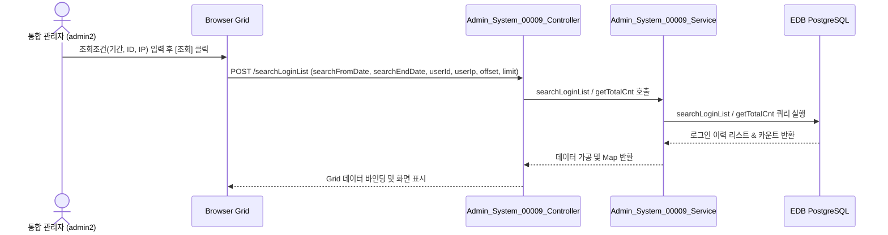

# Admin_System_00009 — 로그인 이력 조회 (Admin) 단위 테스트케이스

> **대상 화면**: 시스템관리 > 영업정보시스템 > 로그인 이력 조회 (`admin_system_00009`)  
> **API Base URL**: `POST /backoffice/data/admin/system/admin_system_00009`  
> **데이터 수신 방식**: `@RequestBody @Valid Map<String, Object> map`  
> **DB 영향도**: 단순 조회(SELECT)만 발생하는 **조회 전용 화면**이므로 데이터 변경(CUD) 및 DB 트리거 영향 없음.

---

## 1. 테스트 선행 및 세션 조건

- **로그인 ID**: `admin2` (비밀번호: `0000`)
- **권한 유형**: 통합 관리자 (SYSTEM_TYPE = ADMIN)
- **조회 대상 테이블**: `hmsfns.LOGINSTB` (로그인 이력), `hmsfns.MUSERSTB` (사용자 마스터), `hmsfns.MMEMBSTB` (매장 마스터)

---

## 2. 엔드포인트 명세 및 쿼리 매핑

| # | URL 엔드포인트 | HTTP Method | 기능 요약 | 데이터 반환 | 연관 테이블 |
| :--- | :--- | :---: | :--- | :--- | :--- |
| 1 | `/searchLoginList` | POST | 로그인 이력 조회 및 페이징 | `Map<String, Object>` (`total`: 전체 건수, `rows`: 목록) | `LOGINSTB`, `MUSERSTB`, `MMEMBSTB` |

---

## 3. 로직 및 데이터 흐름 구조

### 3.1 로그인 이력 조회 흐름

---

## 4. 소스코드 정적 분석 기반 핵심 검증 포인트

### 🟢 4.1 CUD 로직 및 트리거 여부 - 없음 (조회 전용)
*   **분석**: 본 화면에서는 데이터 등록, 수정, 삭제가 수행되지 않습니다.
*   **결과**: 데이터 변동 및 DB 트리거 영향이 없으므로 단순 조회 기능의 데이터 정합성만 검증합니다.

### 🟢 4.2 Admin 쿼리 범위
*   **분석**: `Admin_System_00009_Sql.xml` 쿼리는 본사/체인의 구분 없이 전체 시스템의 로그인 이력을 조회합니다.

---

## 5. 상세 테스트 시나리오 (E2E)

| TC ID | 테스트 시나리오 | 입력 데이터 (JSON Body) | 기대 결과 | 판정 기준 |
| :--- | :--- | :--- | :--- | :---: |
| **TC-101** | 로그인 이력 전체 조회 | `{"searchFromDate":"", "searchEndDate":"", "userId":"", "userIp":"", "offset":0, "limit":100}` | HTTP 200, 전체 로그인 이력 목록 반환 | `rows.length > 0` |
| **TC-102** | 날짜 범위 설정 조회 | `{"searchFromDate":"20260101", "searchEndDate":"20260630", "userId":"", "userIp":"", "offset":0, "limit":100}` | 해당 날짜 범위에 포함되는 로그인 이력만 반환 | 날짜 필터링 정합성 |
| **TC-103** | 요청자 ID 검색 | `{"searchFromDate":"", "searchEndDate":"", "userId":"admin", "userIp":"", "offset":0, "limit":100}` | ID나 이름에 "admin"이 포함된 이력만 반환 | 데이터 검색 필터링 |
| **TC-104** | 요청 IP 검색 | `{"searchFromDate":"", "searchEndDate":"", "userId":"", "userIp":"127.0.0.1", "offset":0, "limit":100}` | 접속 IP에 "127.0.0.1"이 포함된 이력만 반환 | 데이터 검색 필터링 |
| **TC-105** | 초기화 버튼 기능 | 폼 필드 입력 후 초기화 클릭 | 모든 조회 필드값 초기화 및 기본값 설정 | UI 필드 초기화 |
| **TC-106** | 페이징 및 페이지 크기 변경 | 페이지네이션 컴포넌트 조작 | 해당 오프셋과 크기에 맞는 데이터를 페이징 처리하여 조회 | 페이징 정상 작동 |
