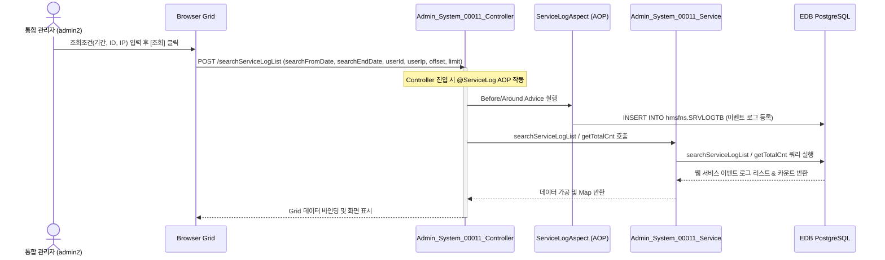

# Admin_System_00011 — 웹 서비스 이벤트 로그 조회 (Admin) 단위 테스트케이스

> **대상 화면**: 시스템관리 > 영업정보시스템 > 웹 서비스 이벤트 로그 조회 (`admin_system_00011`)  
> **API Base URL**: `POST /backoffice/data/admin/system/admin_system_00011`  
> **데이터 수신 방식**: `@RequestBody @Valid Map<String, Object> map`  
> **DB 영향도**: 조회 자체는 SELECT 이나, Controller 진입 시 Spring AOP `@ServiceLog` 어노테이션에 의해 `hmsfns.SRVLOGTB` 테이블에 웹 서비스 이벤트 로그가 자동 등록(INSERT)됨.

---

## 1. 테스트 선행 및 세션 조건

- **로그인 ID**: `admin2` (비밀번호: `0000`)
- **권한 유형**: 통합 관리자 (SYSTEM_TYPE = ADMIN)
- **조회 대상 테이블**: `hmsfns.SRVLOGTB` (웹 서비스 이벤트 로그), `hmsfns.MUSERSTB` (사용자 마스터), `hmsfns.MMEMBSTB` (매장 마스터)

---

## 2. 엔드포인트 명세 및 쿼리 매핑

| # | URL 엔드포인트 | HTTP Method | 기능 요약 | 데이터 반환 | 연관 테이블 |
| :--- | :--- | :---: | :--- | :--- | :--- |
| 1 | `/searchServiceLogList` | POST | 웹 서비스 이벤트 로그 조회 및 페이징 | `Map<String, Object>` (`total`: 전체 건수, `rows`: 목록) | `SRVLOGTB`, `MUSERSTB`, `MMEMBSTB` |

---

## 3. 로직 및 데이터 흐름 구조

### 3.1 웹 서비스 이벤트 로그 조회 흐름

---

## 4. 소스코드 정적 분석 기반 핵심 검증 포인트

### 🟢 4.1 CUD 로직 및 트리거 여부 - AOP 로그 자동 등록
*   **분석**: 화면단에서의 수동 CUD(추가, 수정, 삭제)는 발생하지 않으나, `/searchServiceLogList` API 호출 시 `@ServiceLog` AOP 어노테이션이 작동하여 `hmsfns.SRVLOGTB` 테이블에 새로운 이벤트 로그 레코드가 삽입(INSERT)됩니다.
*   **결과**: API 호출 성공 시 DB의 `hmsfns.SRVLOGTB` 테이블에 해당 호출 이력이 올바르게 누적되는지 검증해야 합니다.

### 🟢 4.2 Admin 쿼리 범위
*   **분석**: `Admin_System_00011_Sql.xml` 쿼리는 본사/체인의 구분 없이 전체 시스템의 웹 서비스 이벤트 로그를 조회합니다.

---

## 5. 상세 테스트 시나리오 (E2E)

| TC ID | 테스트 시나리오 | 입력 데이터 (JSON Body) | 기대 결과 | 판정 기준 |
| :--- | :--- | :--- | :--- | :---: |
| **TC-101** | 웹 서비스 이벤트 로그 전체 조회 | `{"searchFromDate":"", "searchEndDate":"", "userId":"", "userIp":"", "offset":0, "limit":100}` | HTTP 200, 전체 웹 서비스 이벤트 로그 목록 반환 | `rows.length > 0` |
| **TC-102** | 날짜 범위 설정 조회 | `{"searchFromDate":"20260101", "searchEndDate":"20260630", "userId":"", "userIp":"", "offset":0, "limit":100}` | 해당 날짜 범위에 포함되는 이벤트 로그만 반환 | 날짜 필터링 정합성 |
| **TC-103** | 요청자 ID/명 검색 | `{"searchFromDate":"", "searchEndDate":"", "userId":"admin2", "userIp":"", "offset":0, "limit":100}` | ID나 이름에 "admin2"가 포함된 사용자 로그만 반환 | 데이터 검색 필터링 |
| **TC-104** | 요청 IP 검색 | `{"searchFromDate":"", "searchEndDate":"", "userId":"", "userIp":"127.0.0.1", "offset":0, "limit":100}` | 접속 IP에 "127.0.0.1"이 포함된 로그만 반환 | 데이터 검색 필터링 |
| **TC-105** | 초기화 버튼 기능 | 폼 필드 입력 후 초기화 클릭 | 모든 조회 필드값 초기화 및 기본값 설정 | UI 필드 초기화 |
| **TC-106** | 페이징 및 페이지 크기 변경 | 페이지네이션 컴포넌트 조작 | 해당 오프셋과 크기에 맞는 데이터를 페이징 처리하여 조회 | 페이징 정상 작동 |
| **TC-107** | AOP 이벤트 로그 생성 확인 | API `/searchServiceLogList` 정상 호출 | DB `hmsfns.SRVLOGTB` 테이블에 호출한 사용자의 이벤트 로그 등록 | `SELECT` 실행 후 신규 로그 행 확인 |
