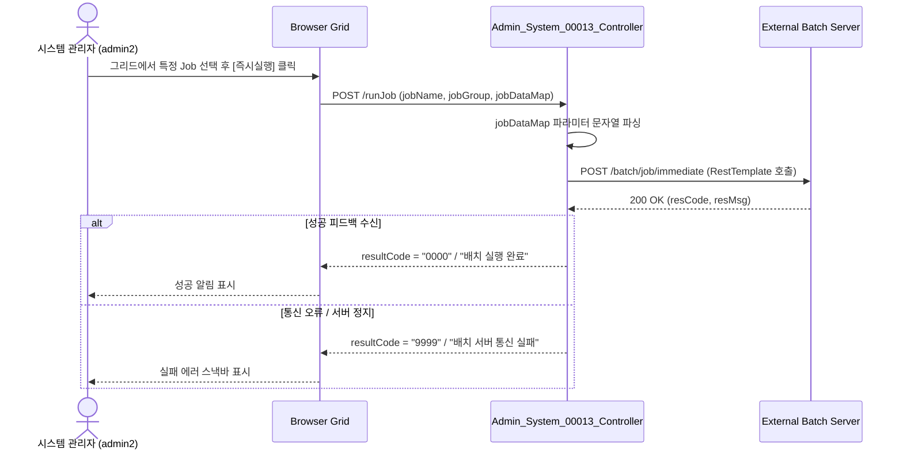

# Admin_System_00013 — 배치 관리 단위 테스트케이스

> **대상 화면**: 시스템관리 > 영업정보시스템 > 배치 관리 (`admin_system_00013`)  
> **API Base URL**: `POST /backoffice/data/admin/system/admin_system_00013`  
> **트랜잭션 설정**: 단순 조회전용으로 `@Transactional` 없음 (혹은 공통 AOP 적용)  
> **데이터 수신 방식**: `@RequestBody Map<String, Object> map`  
> **DB 영향도**: 단순 SELECT 전용. 관련 CUD 테이블 및 DB 트리거/프로시저 없음. (실제 CUD 제어는 외부 배치 서버 API 호출 연계)

---

## 1. 테스트 선행 및 세션 조건

- **로그인 ID**: `admin2` (비밀번호: `0000`)
  * *비고*: 신규 개발 화면으로 `화면별_접근가능_사용자_목록.xlsx`에는 아직 누락되어 있으나, 동일 대분류(`admin/system`) 권한을 가진 시스템 관리자 계정 `admin2`로 동일 접근이 보장됩니다.
- **권한 유형**: 시스템 관리자 (SYSTEM_TYPE = HQ)
- **대상 테이블**: 
  * `hmsfns.QRTZ_JOB_DETAILS` (Quartz 잡 정보)
  * `hmsfns.QRTZ_TRIGGERS` (Quartz 트리거 상태)
  * `hmsfns.QRTZ_CRON_TRIGGERS` (Quartz 크론 정보)

---

## 2. 엔드포인트 명세 및 쿼리 매핑

| # | URL 엔드포인트 | HTTP Method | 기능 요약 | 데이터 반환 | 연관 테이블 / 시스템 |
| :--- | :--- | :---: | :--- | :--- | :--- |
| 1 | `/searchBatchList` | POST | Quartz 배치 목록 조회 | `Map<String, Object>` | `QRTZ_JOB_DETAILS` 외 2개 테이블 |
| 2 | `/runJob` | POST | 배치 작업 즉시 기동 명령 | `Map<String, Object>` | 외부 배치 서버 호출 (`/batch/job/immediate`) |
| 3 | `/stopJob` | POST | 배치 작업 일시 중지 명령 | `Map<String, Object>` | 외부 배치 서버 호출 (`/batch/job/pause`) |
| 4 | `/startJob` | POST | 배치 작업 재개(기동) 명령 | `Map<String, Object>` | 외부 배치 서버 호출 (`/batch/job/resume`) |
| 5 | `/addJob` | POST | 배치 신규 등록 명령 | `Map<String, Object>` | 외부 배치 서버 호출 (`/batch/job/add`) |
| 6 | `/deleteJob` | POST | 배치 목록 삭제 명령 | `Map<String, Object>` | 외부 배치 서버 호출 (`/batch/job/delete`) |

---

## 3. 로직 및 데이터 흐름 구조

### 3.1 배치 제어 흐름 (예: 즉시 실행)


---

## 4. 소스코드 정적 분석 기반 핵심 검증 포인트

### 🟢 4.1 빈 문자열 수신 시 숫자 형변환 에러 (NumberFormatException) - 해당 없음
*   **분석**: 본 화면은 CUD 저장/수정 로직이 전혀 없이 데이터베이스 `QRTZ_*` 테이블로부터 조회만 수행하며, 제어 명령은 RestTemplate을 통한 문자열 파라미터 전송입니다.
*   **결과**: 사용자 입력값 중 숫자 필드가 없으므로 형변환 오류가 발생할 요지가 없습니다.

### 🔴 4.2 SQL Mapper 호환성 결함 (Oracle -> PostgreSQL)
*   **분석**: `Admin_System_00013_Sql.xml` 내의 `selectBatchListSql` 공통 SQL 조각에 Oracle 전용 내장 함수인 `DECODE()` 문이 사용되고 있습니다.
```xml
DECODE(A.REQUESTS_RECOVERY,'0','false','true') AS REQUESTS_RECOVERY
```
*   **영향**: EDB Oracle Compatibility 모드가 활성화되어 있지 않은 순수 PostgreSQL 엔진에서는 문법 에러가 발생하게 됩니다.
*   **조치 권고사항**: `CASE WHEN A.REQUESTS_RECOVERY = '0' THEN 'false' ELSE 'true' END` 표준 구문으로 변경이 권장됩니다.

---

## 5. 상세 테스트 시나리오 (E2E)

| TC ID | 테스트 시나리오 | 입력 데이터 (JSON Body) | 기대 결과 | 판정 기준 |
| :--- | :--- | :--- | :--- | :---: |
| **TC-101** | Quartz 배치 목록 조회 | `{"offset":0, "limit":10, "searchJobName":"", "searchTriggerState":""}` | HTTP 200, 전체 9건 데이터 셋 및 total=9 반환 | `total == 9` |
| **TC-102** | Job Name 전방 매칭 조회 | `{"offset":0, "limit":10, "searchJobName":"Dm", "searchTriggerState":""}` | HTTP 200, Job Name이 'Dm'으로 시작하는 로그만 필터링 반환 (4건) | `rows.length == 4` |
| **TC-103** | 트리거 상태(TRIGGER_STATE) 필터 | `{"offset":0, "limit":10, "searchJobName":"", "searchTriggerState":"PAUSED"}` | HTTP 200, 상태코드가 'PAUSED'인 배치 정보만 반환 | `rows.every(r => r.triggerState == 'PAUSED')` |
| **TC-104** | 배치 작업 즉시 기동 (통신 거부 실패 모의) | `{"jobName":"DeptJob", "jobGroup":"test", "jobDataMap":"{}"}` | HTTP 200, 통신 실패 메시지 반환 (로컬 배치 서버 오프라인 상태) | `resultCode == "9999"` |
| **TC-105** | 배치 중지/기동/삭제/등록 제어 모의 | `{"jobName":"DeptJob", "jobGroup":"test", "jobDataMap":"{}"}` | HTTP 200, 외부 배치 서버 커넥션 실패 에러 로그 발생 | `resultCode == "9999"` |
