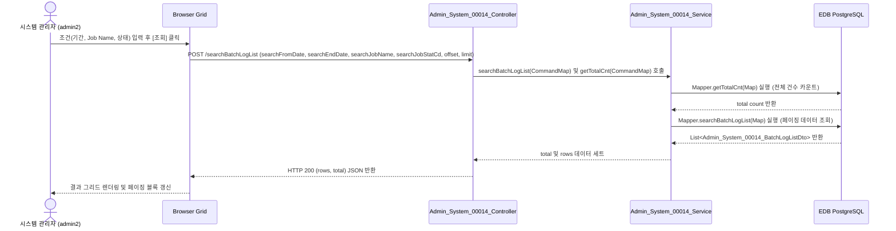

# Admin_System_00014 — 배치 실행내역 조회 단위 테스트케이스

> **대상 화면**: 시스템관리 > 영업정보시스템 > 배치 실행내역 조회 (`admin_system_00014`)  
> **API Base URL**: `POST /backoffice/data/admin/system/admin_system_00014`  
> **트랜잭션 설정**: 단순 조회전용으로 `@Transactional` 없음 (혹은 공통 AOP 적용)  
> **데이터 수신 방식**: `@RequestBody Map<String, Object> map`  
> **DB 영향도**: 단순 SELECT 전용. 관련 CUD 테이블 및 DB 트리거/프로시저 없음.

---

## 1. 테스트 선행 및 세션 조건

- **로그인 ID**: `admin2` (비밀번호: `0000`)
  * *비고*: 신규 개발 화면으로 `화면별_접근가능_사용자_목록.xlsx`에는 아직 누락되어 있으나, 동일 대분류(`admin/system`) 권한을 가진 시스템 관리자 계정 `admin2`로 동일 접근이 보장됩니다.
- **권한 유형**: 시스템 관리자 (SYSTEM_TYPE = HQ)
- **대상 테이블**: `hmsfns.QRTZ_LOG` (Quartz 스케줄러 배치 실행 결과 로그)

---

## 2. 엔드포인트 명세 및 쿼리 매핑

| # | URL 엔드포인트 | HTTP Method | 기능 요약 | 데이터 반환 | 연관 테이블 |
| :--- | :--- | :---: | :--- | :--- | :--- |
| 1 | `/searchBatchLogList` | POST | 배치 실행 내역 및 건수 조회 | `Map<String, Object>` (total, rows) | `hmsfns.QRTZ_LOG` |

---

## 3. 로직 및 데이터 흐름 구조

### 3.1 배치 실행내역 조회 흐름

---

## 4. 소스코드 정적 분석 기반 핵심 검증 포인트

### 🟢 4.1 빈 문자열 수신 시 숫자 형변환 에러 (NumberFormatException) - 해당 없음
*   **분석**: 본 화면은 CUD 저장/수정 로직이 전혀 없이 데이터베이스 `QRTZ_LOG` 테이블로부터 조회만 수행하는 **단순 Select 화면**입니다.
*   **결과**: 사용자 입력값 중 숫자 필드가 없으며, 날짜 및 ID 매칭만 문자열 비교로 이루어지므로 형변환 오류가 발생할 요지가 없습니다.

### 🔴 4.2 SQL Mapper 호환성 결함 (Oracle -> PostgreSQL)
*   **분석**: `Admin_System_00014_Sql.xml` 내의 `selectBatchLogListSql` 공통 SQL 조각에 Oracle 전용 날짜 포맷 `TO_CHAR(START_TIMESTAMP, '...FF')` 및 `DECODE()` 문이 사용되고 있습니다.
*   **영향**: EDB Oracle Compatibility 모드가 활성화되어 있지 않은 순수 PostgreSQL 엔진에서는 문법 에러가 발생하게 됩니다.
*   **조치 권고사항**: `TO_CHAR(..., '...MS')` 형태 또는 standard `CASE WHEN` 구문으로 변경이 권장됩니다.

---

## 5. 상세 테스트 시나리오 (E2E)

| TC ID | 테스트 시나리오 | 입력 데이터 (JSON Body) | 기대 결과 | 판정 기준 |
| :--- | :--- | :--- | :--- | :---: |
| **TC-101** | 실행 내역 전체 조회 | `{"offset":0, "limit":10, "searchFromDate":"", "searchEndDate":"", "searchJobName":"", "searchJobStatCd":""}` | HTTP 200, 전체 내역 및 total 반환 | `total > 1000000` |
| **TC-102** | Job Name 전방 매칭 조회 | `{"offset":0, "limit":10, "searchFromDate":"", "searchEndDate":"", "searchJobName":"Dept", "searchJobStatCd":""}` | HTTP 200, Job Name이 'Dept'로 시작하는 로그만 필터링 반환 | `rows.every(r => r.jobName.startsWith('Dept'))` |
| **TC-103** | 실행 기간 범위 조회 | `{"offset":0, "limit":10, "searchFromDate":"2026-06-01", "searchEndDate":"2026-06-02", "searchJobName":"", "searchJobStatCd":""}` | HTTP 200, 2026년 6월 1일~2일 사이의 로그만 필터링 반환 | `rows.every(r => r.startTimestamp.startsWith('2026-06-01') \|\| r.startTimestamp.startsWith('2026-06-02'))` |
| **TC-104** | 상태 코드(JOB_STAT_CD) 실패 필터 | `{"offset":0, "limit":10, "searchFromDate":"", "searchEndDate":"", "searchJobName":"", "searchJobStatCd":"99"}` | HTTP 200, 상태코드가 '99' (실패)인 로그만 반환 | `rows.every(r => r.jobStatCd == '99')` |
| **TC-105** | 페이징 이동 조회 | `{"offset":100, "limit":10, "searchFromDate":"", "searchEndDate":"", "searchJobName":"", "searchJobStatCd":""}` | HTTP 200, 101번째 행부터 110번째 행까지 정상 반환 | `rows.length == 10` |
