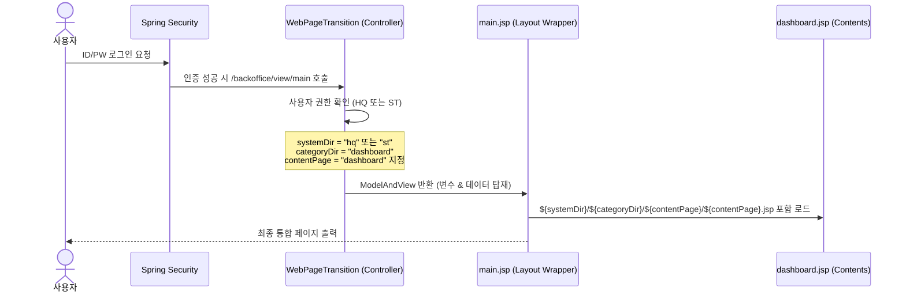

# Backoffice 로그인 후 첫 진입화면(대시보드) & 동적 레이아웃 분석

본 문서는 HMS 영업정보시스템 로그인 성공 후 첫 진입 페이지(대시보드)의 연동 원리 및 JSP/레이아웃 파일의 로딩 방식을 명세합니다.

---

## 1. 로그인 후 첫 진입 흐름 (Transition Flow)

사용자가 로그인 페이지에서 인증에 성공하면, 기본 성공 URL 경로인 `/backoffice/view/main`으로 리다이렉트됩니다. 이 경로는 컨트롤러인 [WebPageTransition.java](file:///d:/workspace/hmotors/workspace_hms20260326/backoffice/hyundai-backoffice-webapp/src/main/java/com/hyundai/backoffice/webapp/WebPageTransition.java)에서 처리합니다.



---

## 2. 컨트롤러 변수 정의 및 모델 바인딩
[WebPageTransition.java](file:///d:/workspace/hmotors/workspace_hms20260326/backoffice/hyundai-backoffice-webapp/src/main/java/com/hyundai/backoffice/webapp/WebPageTransition.java#L112-L152)는 첫 진입(`/backoffice/view/main`) 시 사용자의 소속(본사 또는 매장)에 맞춰 경로 변수들을 주입합니다.

```java
if(sPage.equals("main")) {
    SecurityUserInformation securityUserInformation = new SecurityUserInformation();
    String systemType = securityUserInformation.getUserInfo("systemType").toString();
    String chainNo    = securityUserInformation.getUserInfo("chainNo").toString();
    String msNo       = securityUserInformation.getUserInfo("msNo").toString();
    
    // 권한에 따라 hq 또는 st 폴더 지정
    systemDir   = StringUtils.lowerCase(systemType); 
    categoryDir = "dashboard";
    contentPage = "dashboard";

    HashMap<String, Object> reqMap = new HashMap<>();
    reqMap.put("chainNo"  , chainNo);
    reqMap.put("msNo"     , msNo);

    // 각 대시보드별 필요 데이터(매출액, 순위, 공지사항 등) 조회 후 모델 바인딩
    if(systemDir.equals("hq")) {
        mav.addObject("dailySalesData"   , Hq_Dashboard_Service.selectDailySalesData(reqMap));
        mav.addObject("goodsRankData"    , Hq_Dashboard_Service.selectGoodsRankData(reqMap));
        mav.addObject("noticeData"       , Hq_Dashboard_Service.selectNoticeData(reqMap));
    } else if(systemDir.equals("st")) {
        mav.addObject("dailySalesData"   , St_Dashboard_Service.selectDailySalesData(reqMap));
        mav.addObject("goodsRankData"    , St_Dashboard_Service.selectGoodsRankData(reqMap));
        mav.addObject("noticeData"       , St_Dashboard_Service.selectNoticeData(reqMap));
    }
}
mav.setViewName("/backoffice/main/main"); // 뼈대 레이아웃 뷰 반환
```

---

## 3. JSP 및 자산(Assets)의 동적 로딩 구조

### 3.1 컨텐츠 JSP 인클루드
[main.jsp](file:///d:/workspace/hmotors/workspace_hms20260326/backoffice/hyundai-backoffice-webapp/src/main/webapp/WEB-INF/views/backoffice/main/main.jsp#L34)는 JSTL / EL 표현식을 사용해 전달받은 변수명을 폴더 및 파일 경로로 치환하여 인클루드합니다:

```jsp
<jsp:include page="/WEB-INF/views/backoffice/main/contents/${systemDir}/${categoryDir}/${contentPage}/${contentPage}.jsp"></jsp:include>
```

* **본사(HQ) 로그인 시**: `/WEB-INF/views/backoffice/main/contents/hq/dashboard/dashboard/dashboard.jsp`
* **매장(ST) 로그인 시**: `/WEB-INF/views/backoffice/main/contents/st/dashboard/dashboard/dashboard.jsp`

### 3.2 CSS 및 JS 자산(Assets) 로드
[head.jsp](file:///d:/workspace/hmotors/workspace_hms20260326/backoffice/hyundai-backoffice-webapp/src/main/webapp/WEB-INF/views/backoffice/common/include/head.jsp#L45) 및 [javascript.jsp](file:///d:/workspace/hmotors/workspace_hms20260326/backoffice/hyundai-backoffice-webapp/src/main/webapp/WEB-INF/views/backoffice/common/include/javascript.jsp#L64-L66) 내부에서도 동일한 EL 변수 바인딩 규칙을 이용하여 페이지 전용 스크립트와 스타일을 읽어옵니다:

```jsp
<!-- CSS 로드 -->
<link rel="stylesheet" type="text/css" href="/backoffice/assets/main/contents/${systemDir}/${categoryDir}/${contentPage}/css/${contentPage}.css?v=${version}" />

<!-- JS 로드 -->
<script type="text/javascript" src="/backoffice/assets/main/contents/${systemDir}/${categoryDir}/${contentPage}/js/${contentPage}_bt.js?v=${version}"></script>
<script type="text/javascript" src="/backoffice/assets/main/contents/${systemDir}/${categoryDir}/${contentPage}/js/${contentPage}_chart.js?v=${version}"></script>
<script type="text/javascript" src="/backoffice/assets/main/contents/${systemDir}/${categoryDir}/${contentPage}/js/${contentPage}.js?v=${version}"></script>
```

---

## 4. 전체 화면 디렉토리(All_HMS_Screens) 통합 방안

대시보드 화면은 DB 메뉴 데이터(예: `TSYSMNTB`, `MMENUSTB` 등)에 정형 메뉴로 수록되어 있지 않은 특수한 화면 경로입니다. 

따라서 화면 검증 현황판에 포함하기 위해, 화면 분석 파일인 `All_HMS_Screens.md` 테이블의 하단에 아래와 같이 행을 추가하여 파서(`generate_screens_directory.py`)를 통해 디렉토리 대시보드상에 정상 표기되도록 설계했습니다.

```markdown
| 대시보드 | 대시보드 | hq_dashboard | 대시보드 (본사) | dashboard | /backoffice/main/contents/hq/dashboard |
| 대시보드 | 대시보드 | st_dashboard | 대시보드 (매장) | dashboard | /backoffice/main/contents/st/dashboard |
```
