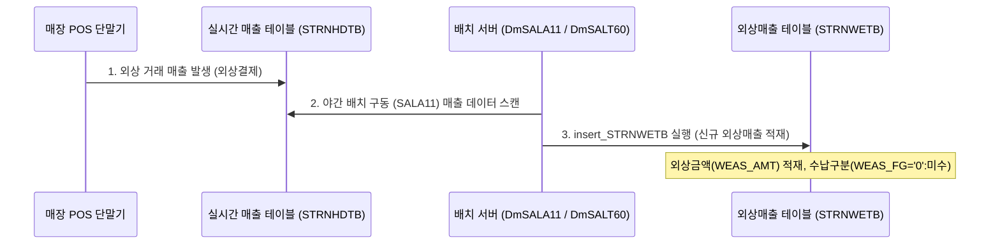

# STRNWETB (외상매출) 테이블 데이터 가공 및 적재 가이드

> **대상 화면**: 외상 매출 및 입금내역조회 (`hq_sales_00025`, `st_sales_00025`)  
> **주요 테이블**: `hmsfns.STRNWETB` (매장 외상매출 테이블), `hmsfns.WEASDTTB` (외상 입금 상세 테이블)  
> **작성 목적**: QA 테스트 시 외상 거래 데이터 및 입금 내역 데이터 정합성 검증을 위한 데이터 가공(직접 DB 주입 및 화면 발생) 방법을 안내합니다.

---

## 1. 데이터 적재 및 가공 시점 (Data Life-Cycle)

`STRNWETB` 테이블의 데이터는 실시간 웹 화면 입력이 아닌, **배치(Batch) 서비스 및 매장 POS 판매 정보 동기화**를 통해 생성 및 수정됩니다.



1. **외상 매출 적재 시점 (INSERT)**:
   * 매장에서 POS 단말기를 통해 거래처(Vendor)를 선택하고 **외상 결제**로 매출을 완료합니다.
   * 야간(새벽)에 구동되는 **`DmSALA11` 배치 프로그램**이 전일 POS 매출 데이터(`STRNHDTB` 등) 중 외상 거래 내역을 수집하여 `STRNWETB` 테이블에 인서트(`insert_STRNWETB`)합니다.
2. **입금 매칭 및 업데이트 시점 (UPDATE)**:
   * 가맹점주나 본사 직원이 웹 화면(외상입금 등록)을 통해 외상대금 수납을 등록하면 `WEASDTTB`에 적재됩니다.
   * **`DmSALT60` 배치 프로그램**이 기동하면서 `WEASDTTB`와 `STRNWETB`를 영수증번호(`ORG_BILL_NO`) 기준으로 매칭하여, **수납 금액(`PAID_AMT`)을 가산하고 수납구분(`WEAS_FG`)을 '1'(완납) 등으로 변경**합니다.

---

## 2. 테스트 데이터 가공 방법 (Data Input Methods)

E2E 및 단위 테스트 검증을 위해 데이터를 가공하는 두 가지 방법을 제공합니다.

### 방법 A: DB 직접 주입 (SQL Query 사용)

개발 DB (`192.168.10.206:5432 / edb`)에 직접 접속하여 아래 쿼리를 순서대로 실행해 테스트 데이터를 가공합니다.

#### 1단계: 외상 매출 데이터 생성 (STRNWETB)
```sql
INSERT INTO hmsfns.STRNWETB (
    SALE_DATE,       -- 매출일자 (YYYYMMDD)
    MS_NO,           -- 매장코드
    POS_NO,          -- POS번호 (2자리)
    BILL_NO,         -- 영수증번호 (4자리)
    SALE_FG,         -- 매출구분 ('0':정상, '1':반품)
    VENDOR_CD,       -- 거래처코드
    VENDOR_WE_TYPE,  -- 외상유형 (예: 'CARD')
    WEAS_FG,         -- 외상수납구분 ('0':미수, '1':완납, '2':부분수납)
    WEAS_AMT,        -- 외상원금
    PAID_AMT,        -- 입금액 (초기 0)
    REMARK,          -- 비고
    INS_DTIME,       -- 등록일시
    INS_ID,          -- 등록자
    UPD_DTIME,       -- 수정일시
    UPD_ID           -- 수정자
) VALUES (
    '20260707',
    'NC0007',
    '01',
    '9999',
    '0',
    '000002',
    'CARD',
    '0',
    50000.00,
    0.00,
    'QA TEST CREDIT SALE',
    TO_CHAR(SYSDATE, 'YYYYMMDDHH24MISS'),
    'admin2',
    TO_CHAR(SYSDATE, 'YYYYMMDDHH24MISS'),
    'admin2'
);
```

#### 2단계 (선택): 외상 입금 정보 매칭 데이터 생성 (WEASDTTB)
외상 매출금에 대한 입금 내역을 매칭시키고자 할 경우 입금 상세 테이블에 매칭 데이터를 인서트합니다.
* *주의*: `ORG_BILL_NO`는 `매출일자(8자리) + 매장코드(6자리) + POS번호(2자리) + 영수증번호(4자리)` 조합이어야 매칭이 정상 작동합니다.

```sql
INSERT INTO hmsfns.WEASDTTB (
    PAID_DATE,      -- 입금일자
    MS_NO,          -- 매장코드
    VENDOR_CD,      -- 거래처코드
    ORG_BILL_NO,    -- 원본 매출 영수증번호 조합 (20260707NC0007019999)
    PAID_AMT,       -- 입금액
    EMP_ID,         -- 처리자 ID
    INS_DTIME,      -- 등록일시
    INS_ID          -- 등록자
) VALUES (
    '20260707',
    'NC0007',
    '000002',
    '20260707NC0007019999',
    50000.00,
    'H000051cafe',
    TO_CHAR(SYSDATE, 'YYYYMMDDHH24MISS'),
    'H000051cafe'
);
```

---

### 방법 B: 업무 화면을 통한 가공 흐름

DB 직접 주입 권한이 없거나, 실제 사용자 시나리오대로 테스트를 진행하고 싶을 때 수행하는 표준 데이터 가공 절차입니다.

#### 1단계: POS 외상매출 발생
1. **POS 프로그램 로그인**: 대상 매장(`NC0007`) POS 단말기 프로그램을 기동합니다.
2. **상품 스캔**: 판매할 상품을 등록하여 결제 금액을 발생시킵니다.
3. **외상결제 선택**: 결제 수단 중 **[외상/외상매출]** 버튼을 클릭합니다.
4. **거래처(Vendor) 선택**: 등록된 거래처(예: '외상거래처_테스트')를 조회하여 지정합니다.
5. **결제 완료**: 영수증을 발행하고 매출을 완료하면 POS 서버를 통해 `STRNHDTB`로 전송됩니다.
6. **배치 수동 구동**: 배치 관리 화면(`admin_system_00013`)에 접속하여 **`DmSALA11`** 배치를 선택하고 **[즉시실행]**을 눌러 데이터를 `STRNWETB`에 반영시킵니다.

#### 2단계: 백오피스 외상입금 등록
1. **외상입금 등록 화면 진입**: 백오피스 메뉴 중 **외상입금 등록(st_sales_00026 또는 hq_sales_00026)** 화면으로 진입합니다.
2. **입금 정보 입력**: 수납된 거래처와 입금금액을 지정하여 저장을 누릅니다. (이 시점에 `WEASDTTB` 적재 완료)
3. **배치 수동 구동**: 배치 관리 화면(`admin_system_00013`)에서 **`DmSALT60`** 배치를 선택하고 **[즉시실행]**을 눌러 입금 정산 매칭 처리를 수행합니다.
4. **결과 확인**: 외상 매출 및 입금내역조회 화면에서 `완납(1)` 상태로 변경되고 수납 처리 일자 및 금액이 업데이트되었는지 확인합니다.

---

## 3. 영수증 상세내역 팝업(공통) 조회 오류 방지를 위한 사전 데이터 가공 (의존성 필수)

외상매출 그리드에서 **영수번호**를 클릭하면 `BillModuleController.getBillInfo`를 통해 공통 영수증 상세 정보 팝업이 표출됩니다.  
이 팝업은 실제 매장에서 발생한 품목별 매출 내역을 읽기 위해 **매출 헤더(`STRNHDTB`)** 및 **매출 상세(`STRNDTTB`)** 테이블을 참조합니다.  

만약 `STRNWETB` (외상매출) 테이블에만 값을 밀어 넣고 아래의 두 테이블에 매칭 데이터를 주입하지 않을 경우, 팝업 호출 시 **`NullPointerException` (서버 크래시)**이 발생합니다. 따라서 테스트 데이터 생성 시 반드시 아래 쿼리를 동시 실행하여 의존 데이터를 매칭해 주어야 합니다.

### [필수] 매출 헤더 및 상세 테이블 데이터 주입 쿼리

* **매칭 기본 규칙**: `SALE_DATE`, `MS_NO`, `POS_NO`, `BILL_NO` 복합키 값이 **`STRNWETB`에 넣은 값과 100% 일치**해야 합니다.

#### ① 매출 헤더 데이터 생성 (STRNHDTB)
```sql
INSERT INTO hmsfns.STRNHDTB (
    SALE_DATE, MS_NO, POS_NO, BILL_NO, CHAIN_NO, CHAIN_AREA,
    SALE_FG, SALE_DTIME, SALE_TOT, SALE_AMT, CASH_AMT, CARD_AMT,
    ETC_AMT, DC_AMT, VAT_AMT, DETAIL_CNT, SLIP_CNT, DC_TYPE,
    CANCEL_YN, FIRST_FG, GROUP_ID, TABLE_NO, NATIVE_CNT, FOREIGN_CNT,
    NET_SALE_AMT, INVOICE_AMT, DEPT_AMT, BLUE_USE_AMT, BLUE_SAVE_POINT,
    PARKING_FG, CASH_DC_REMANT, EMP_DC_AMT, PLAY_AMT, PETTY_AMT,
    DEPT_DC_AMT, COUPON_AMT, CUST_SEQ, CHAIN_MS_NO, ORG_BILL_NO
) VALUES (
    '20260707', 'NC0007', '01', '9999', 'C001', '000',
    '0', '20260707141500', 50000.00, 50000.00, 0.00, 0.00,
    50000.00, 0.00, 4545.00, 1, 1, '0',
    'N', '1', '1', '001', 0, 0,
    45455.00, 0.00, 0.00, 0.00, 0.00,
    'N', 0.00, 0.00, 0.00, 0.00,
    0.00, 0.00, NULL, 'NC0007', NULL
);
```

#### ② 매출 상세 데이터 생성 (STRNDTTB)
* *주의*: `GOODS_CD`는 반드시 대상 매장(`MS_NO = 'NC0007'`)에 등록된 실제 상품 코드(예: `'T0000030'`)를 사용해야 정상 조회됩니다.

```sql
INSERT INTO hmsfns.STRNDTTB (
    SALE_DATE, MS_NO, POS_NO, BILL_NO, LINE_NO, CHAIN_NO, CHAIN_AREA,
    SALE_FG, GOODS_CD, PACK_FG, UPRICE, UCOST, SALE_QTY, SALE_TOT,
    SALE_AMT, DC_AMT, STOCK_FG, VAT_AMT, NORM_DC_AMT, SERVICE_DC_AMT,
    CARD_DC_AMT, COUPON_DC_AMT, CUST_DC_AMT, NET_SALE_AMT, EMP_DC_AMT,
    CASH_DC_REMANT, DEPT_DC_AMT
) VALUES (
    '20260707', 'NC0007', '01', '9999', '01', 'C001', '000',
    '0', 'T0000030', '0', 50000.00, 30000.00, 1, 50000.00,
    50000.00, 0.00, '1', 4545.00, 0.00, 0.00,
    0.00, 0.00, 0.00, 45455.00, 0.00,
    0.00, 0.00
);
```

---

### ⚠️ [중요] ORG_BILL_NO 기본값(DEFAULT) 제약 조건 작동 원리 및 주의사항

* **테이블 제약 조건**: `STRNHDTB.ORG_BILL_NO` 컬럼은 데이터베이스 스키마 상 **`DEFAULT '0'`** 조건이 정의되어 있습니다.
* **동작 차이 분석**:
  * **수동 적재 시 (컬럼 누락)**: INSERT 쿼리문 컬럼 목록에서 `ORG_BILL_NO` 자체를 생략하면 EDB 엔진이 자동으로 기본값인 `'0'`을 채워 넣습니다. 이 경우 JSP 단에서 비어있지 않은 값으로 취급하여 `☞ 원 영수증번호:0- --` 와 같이 깨진 원거래 번호 정보가 화면에 표출됩니다.
  * **실제 연동/배치 동작 시**: 실매출 연동 배치(`DmSALA11_SQL.xml`)에서는 INSERT 쿼리에 `ORG_BILL_NO` 컬럼이 명시되어 있으며, 정상 매출 시 Java 단에서 `null`을 주입하여 전송합니다. 명시적으로 `NULL` 값을 쿼리를 통해 인서트하게 되므로, EDB의 `DEFAULT '0'` 조건은 무시되고 **최종적으로 `NULL`이 정상 적재**됩니다.
* **가이드**: 따라서 수동으로 테스트 데이터를 밀어 넣을 때는 위의 예시 쿼리와 같이 **반드시 `ORG_BILL_NO` 컬럼을 INSERT 항목에 명시하고 `NULL`을 강제 기입**해 주어야 화면이 정상적으로 출력됩니다.


