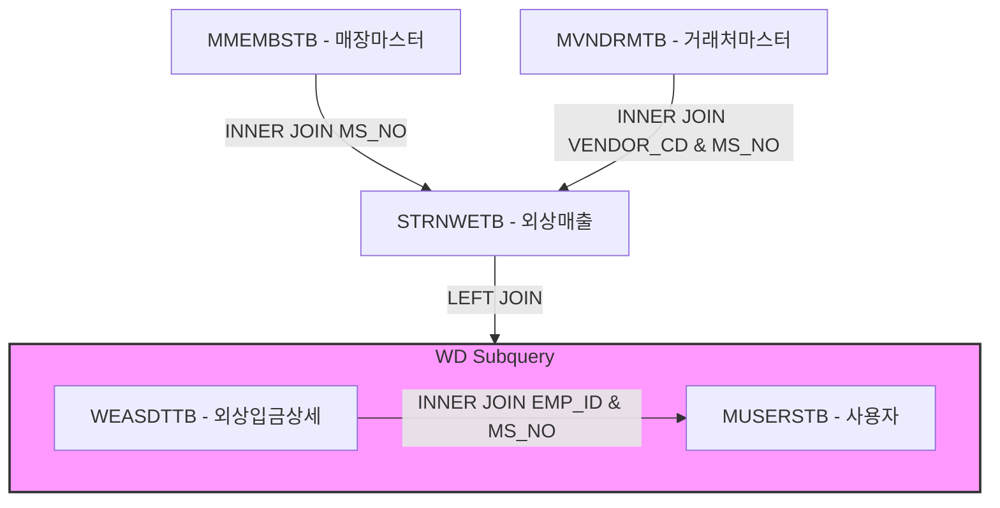

# Hq_Sales_00025 — 본사 외상 매출 및 입금내역조회 단위 테스트케이스

> **대상 화면**: 본사 매출분석 > 결제관리 > 외상 매출 및 입금내역조회 (`hq_sales_00025`)  
> **API Base URL**: `POST /backoffice/data/hq/sales/hq_sales_00025`  
> **트랜잭션 설정**: 단순 조회전용으로 `@Transactional` 없음  
> **데이터 수신 방식**: `@RequestBody Map<String, Object> map`  
> **DB 영향도**: 단순 SELECT 전용. 관련 CUD 테이블 및 DB 트리거/프로시저 없음.

---

## 1. 테스트 선행 및 세션 조건

- **로그인 ID**: `shopadmin` (비밀번호: `0000`)
- **권한 유형**: 본사 관리자 (SYSTEM_TYPE = HQ)
- **세션 정보**: `chainNo = C001`
- **조회 대상 테이블**: 
  * `hmsfns.STRNWETB` (외상 매출 내역 테이블)
  * `hmsfns.WEASDTTB` (외상 입금 상세 테이블)
  * `hmsfns.MMEMBSTB` (가맹점 마스터 테이블)
  * `hmsfns.MVNDRMTB` (거래처 마스터 테이블)
  * `hmsfns.MUSERSTB` (사용자 마스터 테이블)

---

## 2. 엔드포인트 명세 및 쿼리 매핑

| # | URL 엔드포인트 | HTTP Method | 기능 요약 | 데이터 반환 | 연관 테이블 / 쿼리 ID |
| :--- | :--- | :---: | :--- | :--- | :--- |
| 1 | `/search` | POST | 외상 매출 및 입금 내역 목록 조회 | `Map<String, Object>` | `getTotalCnt`, `searchWeasList` |

---

## 3. 데이터 결합(Join) 및 조인 구조

본 화면은 외상 매출 이력(`STRNWETB`)과 입금 처리 상세 이력(`WEASDTTB`)을 조인하여 매출 일자, 외상 금액, 입금 처리 일자, 입금 처리자명을 동시에 확인합니다.

*   **외부 조인(Outer Join) 설정**: `WEASDTTB`에 입금 정보가 매칭되지 않았더라도(아직 미입금 상태), 외상 매출 내역(`STRNWETB`)은 기본적으로 화면에 조회되어야 하므로 `WD.ORD_SALE_DATE(+)`와 같이 아우터 조인으로 조회합니다.

---

## 4. 상세 테스트 시나리오 (E2E)

| TC ID | 테스트 시나리오 | 입력 데이터 (JSON Body) | 기대 결과 | 판정 기준 |
| :--- | :--- | :--- | :--- | :---: |
| **TC-101** | 전체 기간 조회 및 페이징 | `{"offset":0, "limit":10, "searchFromDate":"20230101", "searchToDate":"20261231", "msNo":"", "vendorNm":"", "saleFg":"", "procFg":""}` | HTTP 200, 전체 9건 데이터 셋 및 total=9 반환 | `total == 9` |
| **TC-102** | 매장별(msNo) 필터링 조회 | `{"offset":0, "limit":10, "searchFromDate":"20230101", "searchToDate":"20261231", "msNo":"NC0007", "vendorNm":"", "saleFg":"", "procFg":""}` | HTTP 200, 매장코드가 'NC0007'인 외상 거래만 반환 | `rows.every(r => r.msNo == 'NC0007')` |
| **TC-103** | 거래처명(vendorNm) 부분 매칭 조회 | `{"offset":0, "limit":10, "searchFromDate":"20230101", "searchToDate":"20261231", "msNo":"", "vendorNm":"외상", "saleFg":"", "procFg":""}` | HTTP 200, 거래처명에 '외상'이 포함된 행만 리스트 반환 | `rows.every(r => r.vendorNm.includes('외상'))` |
| **TC-104** | 매출구분(saleFg) 필터링 조회 | `{"offset":0, "limit":10, "searchFromDate":"20230101", "searchToDate":"20261231", "msNo":"", "vendorNm":"", "saleFg":"1", "procFg":""}` | HTTP 200, 매출구분이 '1'(정상매출)인 데이터만 필터링 반환 | `rows.every(r => r.saleFg == '1')` |
| **TC-105** | 외상구분(procFg) 필터링 조회 | `{"offset":0, "limit":10, "searchFromDate":"20230101", "searchToDate":"20261231", "msNo":"", "vendorNm":"", "saleFg":"", "procFg":"0"}` | HTTP 200, 외상구분이 '0'인 데이터만 필터링 반환 | `rows.every(r => r.weasFg == '0')` |
