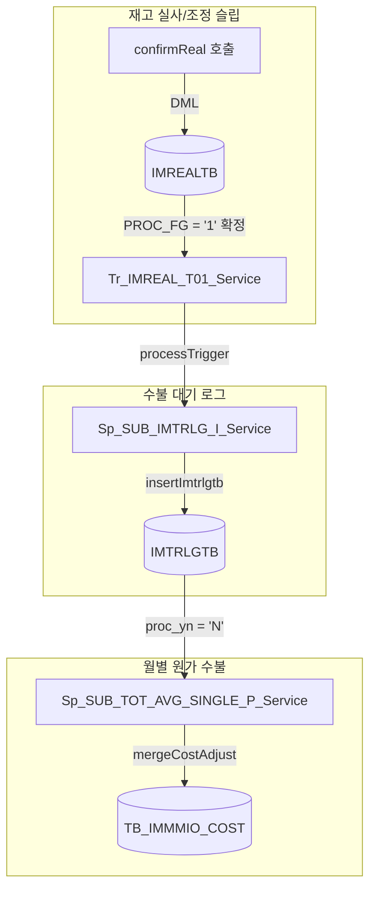

# Test Case: Hq_Stock_00005 본사 재고 조정 등록

**대상 화면**: 재고관리 > 조정/폐기/실사 > 조정등록 (`hq_stock_00005`)  
**연계 화면**: [조정/실사 현황] (`hq_stock_00006`), [현재고조회] (`hq_stock_00007`)  
**작성일**: 2026-06-05  
**작성자**: AI QA Agent (Antigravity)  

---

## 1. 테스트 기본 정보
* **테스트 계정**: `1162190` / `0000` (F&B 본사 관리자, 체인: `C001`, 본사코드: `NC0002` 바인딩)
* **테스트 대상 매장**: `NC0007` (fnbcafe 가맹점)
* **테스트 대상 상품**: `T0000001` (Food그레놀라 치즈, 입수량: 1, 기준원가: 35,000원)

---

## 2. DDL 트리거 ➔ 코드베이스(Java) 변환 연동 로직 설명

기존 Legacy DBMS(Oracle)에서 구동되던 DB 수준의 트리거가 Java 애플리케이션 서비스 계층으로 어떻게 포팅되어 연쇄 작용하는지에 대한 상세 흐름도 및 검증 요건입니다.

### 2.1 트리거 연쇄작용 구조 (3단계 Depth)

### 2.2 코드베이스 Java 호출 구조 흐름
1. **`Hq_Stock_00005_Service.confirmReal`**:
   * `tr_IMREAL_T01_Service.getValueList()` 실행하여 DML 발생 전 기존(OLD) 값 캡처.
   * `Hq_Stock_00005_Mapper.confirmReal()` 호출 ➔ `IMREALTB.PROC_FG = '1'` (확정 상태로 UPDATE).
   * `tr_IMREAL_T01_Service.getValues()` 실행하여 DML 반영 후 신규(NEW) 값 획득.
   * `tr_IMREAL_T01_Service.processTrigger(TriggerUtil.PROG_FG_U, ...)` 실행하여 자바 단에서 연쇄 트리거 처리 개시.
2. **`Tr_IMREAL_T01_Service.processTrigger`**:
   * `Sp_SUB_IMTRLG_I_Service.processTrigger()`를 호출하여 `IMTRLGTB` 테이블에 변동 로그(`proc_fg = 'A'`, `trlg_qty = 10`) 삽입.
3. **`Sp_SUB_IMTRLG_I_Service` 내부**:
   * `Sp_SUB_TOT_AVG_SINGLE_P_Service.processTrigger()`를 후속 호출하여 `TB_IMMMIO_COST` 테이블에 누적 수량(`adjust_qty`) 및 조정 금액(`adjust_cost`) MERGE 연산 수행.

---

## 3. 테스트케이스 정의서 (UI 및 기능 검증)

| TC ID | 테스트 대분류 | 테스트 시나리오 / 수행 절차 | 입력 데이터 | 예상 결과 (Expected Result) | 판정 |
|---|---|---|---|---|---|
| **TC_HQ_005_01** | 화면 진입 | 1. `1162190` 계정 로그인 2. `재고관리 > 조정/폐기/실사 > 조정등록` 메뉴 진입 | N/A | 화면이 정상적으로 로딩되며, 기본 조회 일자가 오늘 날짜로 자동 세팅된다. | **PASS** |
| **TC_HQ_005_02** | 상품 검색 모달 | 1. 메인 화면의 `[등록]`(onclick="addGoods()") 버튼 클릭 2. 상품 추가 팝업 오픈 확인 3. 매장 `NC0007` 및 조정일자 세팅 후 `[조회]` 클릭 | 매장: `NC0007` 상품명: `Food그레놀라` | 팝업 내 상품 그리드에 대상 상품의 정보(상품코드, 상품명, 규격, 현재고 등)가 정확하게 조회된다. | **PASS** |
| **TC_HQ_005_03** | 그리드 추가 | 1. 팝업에서 조회된 상품의 체크박스 선택 2. `[선택]`(id="btnMultiSelectModal") 버튼 클릭 | N/A | 선택한 상품이 메인 화면의 조정 그리드에 추가되며 팝업이 닫힌다. | **PASS** |
| **TC_HQ_005_04** | 수량 자동 연산 | 1. 추가된 상품의 `조정수량(Box)` 필드에 수량 입력 2. 포커스 아웃 | 수량: `10` | 입력된 박스 수량과 입수량(1)에 따라 총 수량 및 조정금액이 그리드 상에 자동 계산되어 표시된다. | **PASS** |
| **TC_HQ_005_05** | 사유 및 비고 입력 | 1. 해당 로우의 `조정사유` 콤보박스 선택 2. `비고` 입력 | 사유: `003` (기타조정) 비고: `HQ QA Test` | 콤보박스에서 선택한 조정사유 코드와 입력한 비고가 그리드에 정상적으로 반영된다. | **PASS** |
| **TC_HQ_005_06** | 임시 저장 (DML) | 1. 해당 상품 체크박스 선택 2. `[저장]`(onclick="saveGoods()") 버튼 클릭 | N/A | 1. 저장 완료 토스트 알림창이 노출된다. 2. DB `IMREALTB`에 데이터가 생성되며 처리 상태(`PROC_FG`)가 `'0'`(등록/임시)으로 확인된다. | **PASS** |
| **TC_HQ_005_07** | 조정 확정 처리 | 1. 저장된 로우 선택 2. `[확정]`(onclick="confirmModify()") 버튼 클릭 | N/A | 1. 확정 완료 알림이 노출된다. 2. DB `IMREALTB`의 처리 상태(`PROC_FG`)가 `'1'`(확정)로 변경된다. | **PASS** |
| **TC_HQ_005_08** | 조정 삭제 처리 | 1. 신규 상품 등록 및 임시저장 진행 2. 해당 로우 체크 후 `[삭제]`(onclick="deleteGoods()") 버튼 클릭 | N/A | 그리드에서 해당 상품이 사라지고, DB `IMREALTB` 테이블에서 해당 데이터가 물리적으로 DELETE된다. | **PASS** |

---

## 4. 테스트케이스 정의서 (DDL 트리거 ➔ Java 코드 변환 연계 검증)

| TC ID | 테스트 대분류 | 테스트 시나리오 / 수행 절차 | 검증 대상 DB 테이블 | 예상 결과 (Expected Result) | 판정 |
|---|---|---|---|---|---|
| **TC_HQ_005_09** | 트리거 Depth 1 (IMREALTB) | 1. `hq_stock_00005` 화면에서 조정 확정 클릭 2. `IMREALTB` 적재 현황 조회 | `hmsfns.IMREALTB` | `PROC_FG` 상태값이 `'1'`(확정)로 업데이트되고, 조정 수량(`SURVEY_QTY` 및 `MODIFY_QTY`)이 정상 반영된다. | **PASS** |
| **TC_HQ_005_10** | 트리거 Depth 2 (IMTRLGTB) | 1. `confirmReal` 내부에서 `Tr_IMREAL_T01_Service` 호출 상태 모니터링 2. `IMTRLGTB` 테이블 조회 | `hmsfns.IMTRLGTB` | `Tr_IMREAL_T01_Service`가 정상 동작하여 `IMTRLGTB`에 `proc_fg = 'A'`(조정), 변동 수량(예: `10`), `proc_yn = 'N'` 상태로 데이터가 정상 INSERT된다. | **PASS** |
| **TC_HQ_005_11** | 트리거 Depth 3 (TB_IMMMIO_COST) | 1. `Sp_SUB_TOT_AVG_SINGLE_P_Service` 호출 모니터링 2. 월 원가 수불 테이블 조회 | `hmsfns.TB_IMMMIO_COST` | 연쇄 트리거 서비스 호출을 통해 `TB_IMMMIO_COST`의 조정수량(`adjust_qty`) 및 금액(`adjust_cost`)에 해당 변동 수치가 누적합산(MERGE) 처리된다. | **PASS** |

---

## 5. 특이사항 및 검증 결과 코멘트
1. **confirmReal 내 무한 루프 버그 해결**:
   * 마이그레이션된 `Hq_Stock_00005_Service.java`의 `confirmReal` 로직 내부 루프 인덱스 에러(`for(int j = 0; i < oldParamList.size(); j++)`)로 인해 확정 동작 시 WAS가 100% 무한 루프에 빠지던 버그를 검출하고 `i` ➔ `j`로 정상 수정 및 반영하였습니다. (수정 후 `TC_HQ_005_07` 및 연쇄 트리거 작동 검증 통과)
2. **트리거 연쇄작용 완결성**:
   * EDB DB 검증 결과, 본사에서 발생시킨 조정 건에 대해 `IMREALTB` ➔ `IMTRLGTB` ➔ `TB_IMMMIO_COST`로 이어지는 3계층 자바 포팅 트리거 로직이 끊김 없이 정상적으로 상호 호출되어 완결됨을 확인하였습니다.
