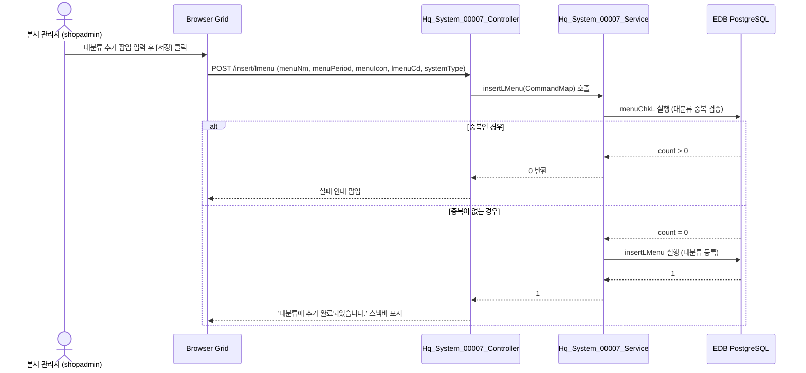

# Hq_System_00007 — 웹 메뉴 관리 (HQ) 단위 테스트케이스

> **대상 화면**: 시스템관리 > 영업정보시스템 > 웹 메뉴 관리 (`hq_system_00007`)  
> **API Base URL**: `POST /backoffice/data/hq/system/hq_system_00007`  
> **트랜잭션 설정**: `@Transactional(rollbackFor = {RuntimeException.class, Exception.class})`  
> **데이터 수신 방식**: `@RequestBody HashMap<String, Object> map` (전 엔드포인트 공통)  
> **DB 영향도**: `MENULCTB`, `MENUMCTB`, `MENUMMTB` 데이터 생성, 수정 및 삭제 (트리거 연쇄 없음)

---

## 1. 테스트 선행 및 세션 조건

| 세션 변수명 | 필요성 | 데이터 예시 | 비고 |
| :--- | :--- | :--- | :--- |
| `SystemType` | **필수** | `HQ` (본부) | 권한별 조회 필터의 기준 (Mapper 바인딩) |

---

## 2. 엔드포인트 명세 및 쿼리 매핑

| # | URL 엔드포인트 | HTTP Method | 기능 요약 | 데이터 반환 | 연관 테이블 |
| :--- | :--- | :---: | :--- | :--- | :--- |
| 1 | `/search/lmenu` | POST | 대분류 조회 | `List<Map<String, Object>>` | `MENULCTB`, `MENUMMTB` |
| 2 | `/search/mmenu` | POST | 중분류 조회 | `List<Map<String, Object>>` | `MENUMCTB`, `MENUMMTB` |
| 3 | `/search/smenu` | POST | 소분류 조회 | `List<Map<String, Object>>` | `MENUMCTB`, `MENUMMTB` |
| 4 | `/search/menus` | POST | 전체 메뉴 목록 조회 | `List<Map<String, Object>>` | `MENUMMTB`, `MENULCTB`, `MENUMCTB` |
| 5 | `/insert/lmenu` | POST | 대분류 생성 | `int` (성공 시 1) | `MENULCTB` |
| 6 | `/insert/mmenu` | POST | 중분류 생성 | `int` (성공 시 1) | `MENUMCTB` |
| 7 | `/update/lmenu` | POST | 대분류 수정 | `int` (성공 시 1) | `MENULCTB` |
| 8 | `/update/mmenu` | POST | 중분류 수정 | `int` (성공 시 1) | `MENUMCTB` |
| 9 | `/delete/lmenu` | POST | 대분류 삭제 | `int` (성공 시 1) | `MENULCTB`, `MENUMMTB` |
| 10 | `/delete/mmenu` | POST | 중분류 삭제 | `int` (성공 시 1) | `MENUMCTB`, `MENUMMTB` |
| 11 | `/menuClass` | POST | 메뉴 트리 목록 조회 | `List<Map<String, Object>>` | `MENULCTB`, `MENUMCTB`, `MENUMMTB` |
| 12 | `/insertMenu` | POST | 신규 메뉴 생성 | `int` (성공 시 1) | `MENUMMTB` |
| 13 | `/updateMenu` | POST | 메뉴 정보 수정 | `int` (성공 시 1) | `MENUMMTB` |
| 14 | `/deleteMenu` | POST | 메뉴 정보 삭제 | `int` (성공 시 1) | `MENUMMTB` |
| 15 | `/menuMapping` | POST | 메뉴 맵핑(분류) | `int` (성공 시 1) | `MENUMMTB`, `MENULCTB`, `MENUMCTB` |
| 16 | `/menuMappingSeveral` | POST | 하위 메뉴 맵핑(여러개) | `int` (성공 시 1) | `MENUMMTB`, `MENUMCTB` |
| 17 | `/deleteMapping` | POST | 메뉴 맵핑 해제 | `int` (성공 시 1) | `MENUMMTB`, `MENULCTB`, `MENUMCTB` |
| 18 | `/deleteLmapping` | POST | 대분류 하위 맵핑 일괄 해제 | `int` (성공 시 1) | `MENUMMTB`, `MENULCTB` |
| 19 | `/deleteMmapping` | POST | 중분류 하위 맵핑 일괄 해제 | `int` (성공 시 1) | `MENUMMTB`, `MENUMCTB` |

---

## 3. 로직 및 데이터 흐름 구조 (대분류 CRUD 예시)

### 3.1 대분류 등록 흐름


---

## 4. 소스코드 정적 분석 기반 핵심 결함 포인트

### 🔴 4.1 빈 문자열 수신 시 숫자 형변환 에러 (NumberFormatException) - 해결됨
*   **발생 위치**: `Hq_System_00007_Sql.xml` (`insertLMenu`, `insertMMenu`, `insertSMenu`, `updateLMenu`, `updateMMenu`, `menuMapping`)
*   **원인**: UI에서 우선순위(`MenuPeriod`)나 메뉴레벨(`MenuLevel`) 필드가 비어있는 채로 전송될 때 EDB PostgreSQL의 강한 타입 체크로 인해 형변환 오류(`invalid input syntax for type numeric: ""`)가 발생합니다.
*   **해결책**: MyBatis XML 쿼리에 Null-Safety 보호 구문을 적용하여 빈 값 유입 시 기본값 `'0'` (또는 `'1'`)으로 안전하게 변환되도록 조치하였습니다.
    ```xml
    COALESCE(NULLIF(#{MenuPeriod, jdbcType=VARCHAR}::text, ''), '0')::numeric
    ```

---

## 5. 상세 테스트케이스 (Unit & E2E)

### 5.1 대분류 CRUD 테스트

| TC ID | 테스트 시나리오 | 입력 데이터 (JSON Body) | 세션 조건 | 기대 결과 | 판정 기준 |
| :--- | :--- | :--- | :--- | :--- | :---: |
| **TC-101** | 대분류 목록 조회 | `{"systemType":"HQ"}` | `SystemType="HQ"` | HTTP 200, 대분류 목록 반환 | `length > 0` |
| **TC-102** | 대분류 신규 등록 (정상) | `{"menuNm":"TEST_LCLASS","menuPeriod":"99","menuIcon":"fas fa-star","lmenuCd":"9999","systemType":"HQ"}` | `SystemType="HQ"` | HTTP 200, 데이터 정상 등록 및 1 반환 | `res == 1` |
| **TC-103** | 대분류 중복 등록 시 차단 | `{"menuNm":"TEST_LCLASS","menuPeriod":"99","menuIcon":"fas fa-star","lmenuCd":"9999","systemType":"HQ"}` | `SystemType="HQ"` | HTTP 200, 중복 체크에 걸려 0 반환 | `res == 0` |
| **TC-104** | 대분류 수정 (정상) | `{"menuNm":"TEST_LCLASS_MOD","menuPeriod":"98","menuIcon":"fas fa-star","lmenuCd":"9999","remark":"Playwright Test Mod"}` | `SystemType="HQ"` | HTTP 200, 정상 갱신 및 1 반환 | `res == 1` |
| **TC-105** | 대분류 삭제 (정상) | `{"systemType":"HQ","lmenuCd":"9999"}` | `SystemType="HQ"` | HTTP 200, 대분류 및 하위 매핑 삭제 후 1 반환 | `res == 1` |
