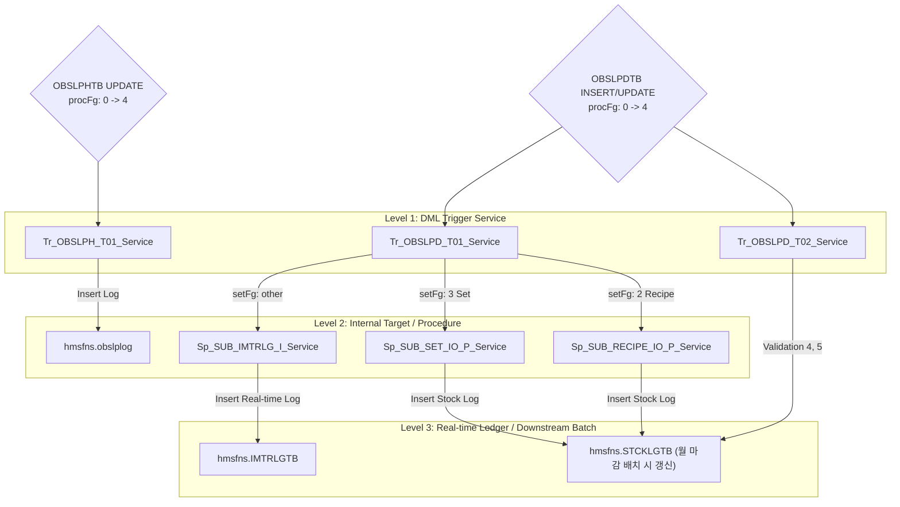

# Hq_Vendor_00007 — 반품관리 단위 테스트케이스

> **화면**: [HQ] 거래처 > 반품관리  
> **URL Prefix**: `POST /backoffice/data/hq/vendor/hq_vendor_00007`  
> **@Transactional**: rollbackFor = {RuntimeException.class, Exception.class} (CUD 트랜잭션 보장 및 롤백 설정)  
> **요청 방식**: `@RequestBody` 및 `@RequestParam` 혼용
> **DB 트리거 영향도**: 있음 (OBSLPHTB, OBSLPDTB CUD에 따른 재고/수불 연쇄 처리 및 로그 인서트 발생)

---

## 세션 공통 선행 조건

| 세션 키 | 값 예시 | 사용 엔드포인트 |
|---------|---------|---------------|
| `chainNo` | `C001` | 전 엔드포인트 |
| `msNo` | `NC0002` | getVatFg, selectVendorOrderList, selectVendorGoodsList, saveVendorOrder, updateVendorOrder |
| `ID` | `shopadmin` | saveVendorOrder, updateVendorOrder, confirmVendorOrder |

---

## 엔드포인트 목록 (10개)

| # | URL | 기능 | 반환 | Type | 관련 테이블 |
|---|---|---|---|---|---|
| 1 | `/getVatFg` | 부가세 포함 여부 조회 | `String` | SELECT | MMEMBSTB |
| 2 | `/selectVendorOrderList` | 반품전표 목록 조회 | `List` | SELECT | OBSLPHTB |
| 3 | `/selectVendorOrderDetailList` | 반품전표 상세내역 조회 | `List` | SELECT | OBSLPDTB, MGOODSTB |
| 4 | `/selectVendorGoodsList` | 반품대상 상품 조회 | `List` | SELECT | MGOODSTB |
| 5 | `/saveVendorOrder` | 반품전표 신규 등록 | `String` | INSERT | OBSLPHTB, OBSLPDTB |
| 6 | `/updateVendorOrder` | 기존 전표에 상품 추가 | `String` | INSERT | OBSLPDTB |
| 7 | `/confirmVendorOrder` | 반품전표 확정 (재고 연쇄 반영) | `String` | UPDATE | OBSLPHTB, OBSLPDTB |
| 8 | `/deleteVendorOrder` | 반품전표 삭제 | `String` | DELETE | OBSLPHTB, OBSLPDTB |
| 9 | `/updateRemark` | 반품요청 비고 저장 | `String` | UPDATE | OBSLPHTB |
| 10| `/saveVendorOrderGoods` | 전표 상품 수량 수정 / 일부 삭제 | `String` | UPDATE/DELETE | OBSLPDTB, OBSLPHTB |

---

## DB 트리거 및 프로시저 연쇄 반응 구조 (Depth 3)

본 화면의 CUD 작업은 `hmsfns.OBSLPHTB`(Header) 및 `hmsfns.OBSLPDTB`(Detail) 테이블에 DML을 수행하며, 마이그레이션된 Java 트리거 서비스와 프로시저를 통해 재고/수불 연동이 연쇄적으로 일어납니다.



---

## 1. `/getVatFg` — 부가세 포함 여부 조회

| No | Request | 예상값 |
|----|---------|-------|
| 1-1| `{}` | 해당 매장의 부가세 사용 여부 코드 반환 (`"0"`: 부가세 별도, `"1"`: 부가세 포함 등) |

---

## 2. `/selectVendorOrderList` — 반품전표 목록 조회

| No | RequestBody | 예상값 |
|----|-------------|-------|
| 2-1| `{"searchFromDate":"20240201","searchEndDate":"20240201"}` | `2024-02-01`에 해당하는 반품 전표 목록 List 반환 |
| 2-2| `{"searchFromDate":"","searchEndDate":""}` | 날짜 조건 누락 시 전체 목록 혹은 빈 List 반환 |

---

## 3. `/selectVendorOrderDetailList` — 반품전표 상세내역 조회

| No | RequestBody | 예상값 |
|----|-------------|-------|
| 3-1| `{"orderDate":"20240201","slipNo":"9001","msNo":"NC0007"}` | 해당 전표의 상세 반품 품목 리스트 반환 |

---

## 4. `/selectVendorGoodsList` — 반품대상 상품 조회

| No | RequestBody | 예상값 |
|----|-------------|-------|
| 4-1| `{"vendor":"000001","goodsClass":""}` | 해당 거래처에서 공급하는 반품 가능한 상품 목록 반환 |

---

## 5. `/saveVendorOrder` — 반품전표 신규 등록

**특이사항**: `@RequestParam`을 사용하므로, Key-Value Form-Data 형식으로 호출해야 합니다.

| No | Parameters | 예상값 |
|----|------------|-------|
| 5-1| `orderDate=20240201&deliveryDate=20240201&vendor=000001&vatFg=0&goodsCd[]=G001&inQty[]=10&orderQty[]=10&orderEaQty[]=0&usuprice[]=1000&orderVat[]=1000&orderAmt[]=10000` | 신규 반품 전표 채번(slipNo) 후 Header 및 Detail 인서트. `Tr_OBSLPD_T02` (EXTRA_COST 검증), `Tr_OBSLPD_T01` (A) 정상 트리거 동작 완료 후 `"registerVendorOrder"` 반환. |
| 5-2| `goodsExtraCostYn != 'N'` 인 상품 저장 시 | `Tr_OBSLPD_T02` 검증 3에 의해 **`RuntimeException` 발생 (500 에러)** |

---

## 6. `/updateVendorOrder` — 기존 전표에 상품 추가

| No | Parameters | 예상값 |
|----|------------|-------|
| 6-1| `orderDate=20240201&slipNo=9001&goodsCd[]=G002&inQty[]=5&orderQty[]=5&orderEaQty[]=0&usuprice[]=2000&orderVat[]=1000&orderAmt[]=10000` | 해당 전표(9001)에 신규 라인번호를 채번하여 상품 Detail 인서트. `Tr_OBSLPD` 트리거 및 `updateVendorOrderHd`로 합계 재산정 완료 후 `"addGoodsList"` 반환. |

---

## 7. `/confirmVendorOrder` — 반품전표 확정 (재고 연쇄 반영)

| No | RequestBody | 예상값 |
|----|-------------|-------|
| 7-1| `[{"orderDate":"20240201","slipNo":"9001","msNo":"NC0007"}]` | `procFg`가 `"4"`(확정)로 UPDATE되며, `Tr_OBSLPH_T01`(U) 및 `Tr_OBSLPD_T01`(U) 트리거가 실행되어 수불 및 실재고 차감 처리 완료 후 `"success"` 반환. |

---

## 8. `/deleteVendorOrder` — 반품전표 삭제

| No | RequestBody | 예상값 |
|----|-------------|-------|
| 8-1| `[{"orderDate":"20240201","slipNo":"9001","msNo":"NC0007"}]` | 미확정 전표인 경우 삭제 성공 및 `"success"` 반환. `Tr_OBSLPD_T02`(D) 트리거가 정상 작동하여 정합성 검증 수행. |
| 8-2| `procFg == '4'` (이미 확정된 전표) 삭제 시 | `Tr_OBSLPD_T02` 검증 2에 의해 **`RuntimeException: PURCH PROC_FG ERROR!!` 발생 (500 에러)** |

---

## 9. `/updateRemark` — 반품요청 비고 저장

| No | RequestBody | 예상값 |
|----|-------------|-------|
| 9-1| `{"orderDate":"20240201","slipNo":"9001","msNo":"NC0007","deliveryRemark":"반품 요청 비고 테스트"}` | Header의 `deliveryRemark` 정상 수정 후 `"success"` 반환. |

---

## 10. `/saveVendorOrderGoods` — 전표 상품 수량 수정 / 일부 삭제

| No | RequestBody | 예상값 |
|----|-------------|-------|
| 10-1| `[{"orderDate":"20240201","msNo":"NC0007","slipNo":"9001","lineNo":"0001","goodsCd":"G001","purchQty":5,"purchUcost":1000,"purchAmt":5000,"purchVat":500,"inQty":5}]` | 해당 라인의 수량 수정 처리. `Tr_OBSLPD_T01/T02` (U) 트리거가 실행되어 값 정합성 검증 후 `"success"` 반환. |
| 10-2| `purchQty = 0` 또는 `""` 인 상품 포함 송신 | 해당 Detail 행 삭제 처리 (`deleteVendorOrderGoods`). `Tr_OBSLPD_T02` (D) 트리거 실행 후 `"success"` 반환. |
| 10-3| 전표 내 모든 상품의 `purchQty = 0`으로 송신 | Detail 데이터 전체 삭제 후 Header 전표 자체를 삭제 (`deleteVendorOrderSlip`) 처리. |

---

## 주요 검증 포인트
```
□ saveVendorOrder / updateVendorOrder 호출 시 @RequestParam 및 form-urlencoded 매핑 정상 처리 여부
□ confirmVendorOrder 호출 시 Tr_OBSLPH_T01 및 Tr_OBSLPD_T01, T02 (U) 트리거가 동작하여 obslplog 인서트 및 실시간 수불 로그(IMTRLGTB) 연쇄 프로시저 정상 호출 여부
□ 이미 확정된 전표(procFg='4')를 삭제 시도 시 Tr_OBSLPD_T02(D)에 의해 Exception(PURCH PROC_FG ERROR) 발생 및 롤백 정상 수행 여부
□ saveVendorOrderGoods에서 수량 0 지정 시 개별 행 삭제(Tr_OBSLPD_T02 D 실행) 및 전체 수량 0 지정 시 전표 자동 삭제 기능의 정합성
```
