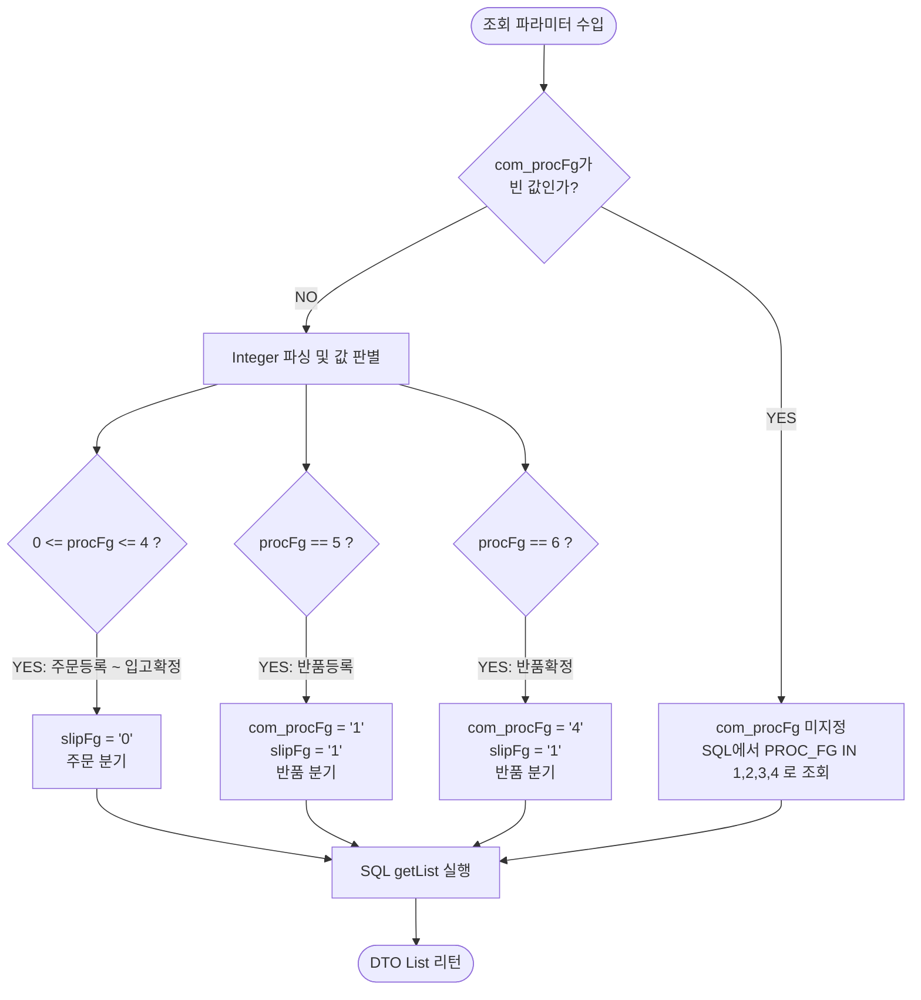
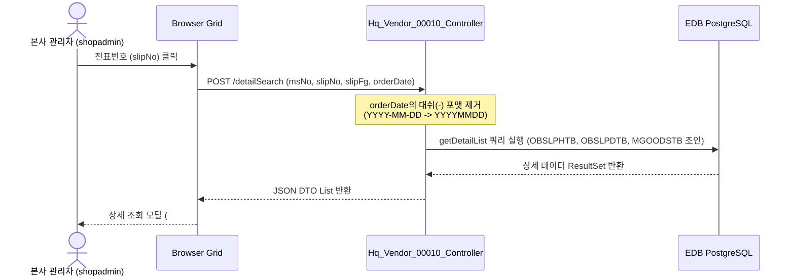

# Hq_Vendor_00010 — 거래처별 발주 현황 단위 테스트케이스 (v2)

> **대상 화면**: [HQ] 매입발주 > 매입현황 > 거래처별 발주 현황 (`hq_vendor_00010`)  
> **API Base URL**: `POST /backoffice/data/hq/vendor/hq_vendor_00010`  
> **트랜잭션 설정**: `@Transactional(rollbackFor = {RuntimeException.class, Exception.class})` (SELECT 전용)  
> **데이터 수신 방식**: `@RequestBody Map<String, Object> commandMap` (전 엔드포인트 공통)  
> **DB 영향도**: 단순 데이터 조회 화면으로 CUD/트리거 연쇄 영향 없음 (Depth 3 Side Effect 없음)

---

## 1. 테스트 선행 및 세션 조건

| 세션 변수명 | 필요성 | 데이터 예시 | 비고 |
| :--- | :--- | :--- | :--- |
| `chainNo` | **필수** | `C001` (HMS F&B 체인) | 권한별 조회 필터의 기준 (Mapper 바인딩) |

---

## 2. 엔드포인트 명세 및 쿼리 매핑

| # | URL 엔드포인트 | HTTP Method | 기능 요약 | 데이터 반환 | 연관 테이블 |
| :--- | :--- | :---: | :--- | :--- | :--- |
| 1 | `/search` | POST | 거래처별 발주 현황 목록 조회 | `List<Hq_Vendor_00010_GetListDto>` | `OBSLPHTB`, `MVNDRMTB`, `MMEMBSTB`, `MUSERSTB` |
| 2 | `/detailSearch` | POST | 상품별 매입 상세정보 조회 | `List<Hq_Vendor_00010_GetDetailListDto>` | `OBSLPHTB`, `OBSLPDTB`, `MGOODSTB` |

---

## 3. 로직 및 데이터 흐름 구조 (흐름도)

### 3.1 진행구분(com_procFg)에 따른 전표구분(slipFg) 및 파라미터 분기 구조
컨트롤러 조회(`/search`) 호출 시 유입되는 `com_procFg` 값에 따라 내부적으로 전표구분 및 진행단계를 매핑하는 로직 흐름입니다.



### 3.2 상세 전표 클릭 시 데이터 연동 흐름


---

## 4. 소스코드 정적 분석 기반 핵심 결함 포인트

### 🔴 3.1 `com_procFg` 누락에 의한 NullPointerException (NPE)
*   **발생 위치**: `Hq_Vendor_00010_Controller.java` (L67)
*   **원인**: 컨트롤러의 `/search` 메소드 내부에서 진행구분 필터 정보인 `com_procFg` 파라미터가 API 요청에서 아예 누락되어 들어올 경우, null 객체에 대해 바로 `.equals()`를 호출하여 서버 500 에러를 터뜨립니다.
    ```java
    // 방어 코드 결여로 인한 NPE 유발 코드
    if(!(commandMap.get("com_procFg").equals(""))){ ... }
    ```
*   **해결책**: `if (commandMap.get("com_procFg") != null && !commandMap.get("com_procFg").toString().isEmpty())` 로 Null-Safe하게 체크를 감싸 주어야 합니다.

### 🔴 3.2 `orderDate` 누락에 의한 NullPointerException (NPE)
*   **발생 위치**: `Hq_Vendor_00010_Controller.java` (L101)
*   **원인**: 상세 내역 조회(/detailSearch) 호출 시 `orderDate` 파라미터가 누락되었을 경우, 이에 대해 `.toString()`을 바로 호출하면서 즉시 NPE가 발생합니다.
    ```java
    commandMap.put("orderDate", commandMap.get("orderDate").toString().replaceAll("-", ""));
    ```
*   **해결책**: `orderDate` 값의 유효성 검사 코드를 상위에 추가하여 null이 아닐 때만 파싱하도록 변경해야 합니다.

---

## 5. 상세 테스트케이스 (Unit & E2E)

### 5.1 `/search` — 거래처별 발주 현황 조회

| TC ID | 테스트 시나리오 | 입력 데이터 (JSON Body) | 세션 조건 | 기대 결과 | 판정 기준 |
| :--- | :--- | :--- | :--- | :--- | :---: |
| **TC-101** | 정상 발주일자 기준 데이터 조회 | `{"searchFromDate":"20240201","searchEndDate":"20240201","com_inqDateType":"O","com_procFg":""}` | `chainNo="C001"` | HTTP 200, 해당 일자의 발주 데이터 목록 4건 반환 | `List.size() == 4` |
| **TC-102** | 매장 필터 조회 (정상) | `{"searchFromDate":"20240201","searchEndDate":"20240201","com_inqDateType":"O","com_procFg":"","com_selectMsNo":"NC0007"}` | `chainNo="C001"` | `NC0007` 매장 기준 데이터만 필터 조회 완료 | 매장 필터 바인딩 |
| **TC-103** | **`com_procFg` 누락 시 결함 검증** | `{"searchFromDate":"20240201","searchEndDate":"20240201","com_inqDateType":"O"}` | `chainNo="C001"` | **HTTP 500 (Internal Server Error)** 발생 | **`NullPointerException`** |
| **TC-104** | 데이터가 없는 기간 조회 (정상) | `{"searchFromDate":"19990101","searchEndDate":"19990101","com_inqDateType":"O","com_procFg":""}` | `chainNo="C001"` | HTTP 200, 빈 배열 반환 | `[]` 반환 |
| **TC-105** | 특정 거래처 및 매장 필터 조회 | `{"searchFromDate":"20240201","searchEndDate":"20240201","com_inqDateType":"O","com_procFg":"","com_searchVendr":"000002"}` | `chainNo="C001"` | 해당 거래처에 대한 발주 현황만 필터링 조회 | `vendor` 필터 바인딩 |

<br>

### 5.2 `/detailSearch` — 상품별 매입 상세정보 조회

| TC ID | 테스트 시나리오 | 입력 데이터 (JSON Body) | 세션 조건 | 기대 결과 | 판정 기준 |
| :--- | :--- | :--- | :--- | :--- | :---: |
| **TC-201** | 정상 발주 상세 목록 조회 | `{"msNo":"NC0007","orderDate":"20240201","slipNo":"00001","slipFg":"0"}` | `chainNo="C001"` | HTTP 200, 해당 전표에 속한 발주 상세 상품 리스트 반환 | `detailList.size() > 0` |
| **TC-202** | **`orderDate` 누락 시 상세조회** | `{"msNo":"NC0007","slipNo":"00001","slipFg":"0"}` | `chainNo="C001"` | **HTTP 500** 발생 | **`NullPointerException`** |

---

## 6. SQL 마이그레이션 호환성 체크리스트 (Warning 요소)

본 화면의 MyBatis Mapper [Hq_Vendor_00010_Sql.xml](file:///d:/workspace/hmotors/workspace_hms20260326/backoffice/hyundai-backoffice-webapp/src/main/resources/sqlmapper/vendor/Hq_Vendor_00010_Sql.xml) 쿼리 내 오라클 전용 문법 검사항목입니다.

- [ ] **Oracle NVL 함수 잔존 (L42)**: `NVL(RTRIM(BH.REMARK), '')` $\rightarrow$ PostgreSQL 표준 `COALESCE` 함수로 치환 권장.
- [ ] **Oracle DECODE 함수 잔존 (L87-92)**: `DECODE(OH.SLIP_FG, '0', OD.ORDER_QTY, 0)` $\rightarrow$ ANSI 표준 문법인 `CASE WHEN` 구문으로 리팩토링 권장.
- [ ] **오라클 TO_DATE 날짜 연산**: `TO_DATE(BH.PURCH_DTIME, 'YYYYMMDDHH24MISS')` 등 $\rightarrow$ PostgreSQL의 다양한 형변환 내장 기법 및 표준 포맷 함수 활용 권장.
