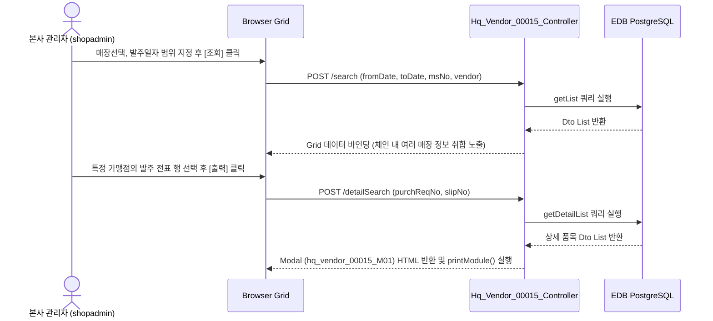

# Hq_Vendor_00015 — 검수서 출력 단위 테스트케이스

> **대상 화면**: [HQ] 매입발주 > 매입현황 > 검수서 출력 (`hq_vendor_00015`)  
> **API Base URL**: `POST /backoffice/data/hq/vendor/hq_vendor_00015`  
> **트랜잭션 설정**: `@Transactional(rollbackFor = {RuntimeException.class, Exception.class})`  
> **데이터 수신 방식**: `@RequestBody Map<String, Object> commandMap` (전 엔드포인트 공통)  
> **DB 영향도**: **단순 조회(SELECT)만 수행**하며, CUD(등록/수정/삭제) 작업이 발생하지 않음. 관련 프로시저 및 트리거 연쇄 없음.

---

## 1. 테스트 선행 및 세션 조건

| 세션 변수명 | 필요성 | 데이터 예시 | 비고 |
| :--- | :--- | :--- | :--- |
| `chainNo` | **필수** | `C001` (HMS F&B 체인) | 로그인 사용자의 소속 체인 번호 (Controller 자동 바인딩) |

---

## 2. 엔드포인트 명세 및 쿼리 매핑

| # | URL 엔드포인트 | HTTP Method | 기능 요약 | 데이터 반환 | 연관 테이블 |
| :--- | :--- | :---: | :--- | :--- | :--- |
| 1 | `/search` | POST | 검수서 출력 목록 조회 | `List<Hq_Vendor_00015_GetCheckPrintDto>` | `OBSLPHTB`, `OBSLPDTB`, `OBREQHTB`, `TVNDRMTB`, `MMEMBSTB` |
| 2 | `/detailSearch` | POST | 검수서 상세 출력 내용 조회 (JSP Modal 렌더링) | `ModelAndView` (hq_vendor_00015_M01) | `OBSLPHTB`, `OBSLPDTB`, `OBREQHTB`, `OBREQDTB`, `TGOODSTB`, `TVNDRMTB`, `MMEMBSTB`, `TCHAINTB`, `MNAMEMTB` |

---

## 3. 로직 및 데이터 흐름 구조 (흐름도)

### 3.1 검수서 출력 목록 조회 및 상세 출력 흐름 (본사 권한)

---

## 4. 소스코드 정적 분석 기반 핵심 포인트

### 🟢 4.1 CUD 및 프로시저/트리거 연쇄 여부
*   **분석 결과**: 본 화면은 본사 권한에서 가맹점들의 매입 전표(`OBSLPHTB`, `OBSLPDTB`) 내역을 통합 확인하고 인쇄하기 위한 **단순 조회(Select-Only) 화면**입니다.
*   본사 또는 가맹점 마스터에 영향을 주는 Insert, Update, Delete 및 DB 프로시저, 트리거 로직은 본 화면 소스코드 내에서 **호출되거나 발생하지 않음**을 확인했습니다.

### 🟡 4.2 매장용 화면(St_Vendor_00013)과의 차이점
*   **매장 필터링**: 매장용은 로그인 세션의 `msNo`로 고정되어 해당 매장 자료만 조회하지만, 본사용(`Hq_Vendor_00015`)은 체인 번호(`chainNo`)에 해당하는 전체 매장 리스트 조회가 가능하며, 선택박스(`#selectMsPos_ms_select`)를 통해 특정 매장만 필터링하여 조회할 수 있습니다.
*   **조인 테이블 차이**: 매장용은 가맹점 로컬 마스터(`hmsfns.MGOODSTB`, `hmsfns.MVNDRMTB`)를 조인하지만, 본사용은 본사 표준 마스터(`hmsfns.TGOODSTB`, `hmsfns.TVNDRMTB`)를 기준으로 데이터를 조인합니다.

---

## 5. 상세 테스트케이스 (Unit & E2E)

### 5.1 `/search` — 검수서 출력 목록 조회

| TC ID | 테스트 시나리오 | 입력 데이터 (JSON Body) | 세션 조건 | 기대 결과 | 판정 기준 |
| :--- | :--- | :--- | :--- | :--- | :---: |
| **TC-101** | 특정 매장(NC0007) 지정 조회 | `{"fromDate":"20240201","toDate":"20240201","msNo":"NC0007","vendor":""}` | `chainNo="C001"` | HTTP 200, NC0007 매장의 발주 전표 3건 반환 | `List.length == 3` |
| **TC-102** | 매장 미선택 전체 조회 (기간 범위) | `{"fromDate":"20240201","toDate":"20240201","msNo":"","vendor":""}` | `chainNo="C001"` | HTTP 200, C001 체인 내 모든 가맹점 전표 취합 반환 | 조회 성공 및 리스트 반환 |
| **TC-103** | 거래처 필터 지정 조회 | `{"fromDate":"20240201","toDate":"20240201","msNo":"NC0007","vendor":"000001"}` | `chainNo="C001"` | HTTP 200, 삼성웰스토리 거래처 데이터만 정상 조회 | `List[0].vendorNm == '삼성웰스토리'` |

### 5.2 `/detailSearch` — 검수서 상세 팝업 출력

| TC ID | 테스트 시나리오 | 입력 데이터 (JSON Body) | 세션 조건 | 기대 결과 | 판정 기준 |
| :--- | :--- | :--- | :--- | :--- | :---: |
| **TC-201** | 정상 전표 상세 출력 | `{"purchReqNo":"240201000701","slipNo":"0001"}` | `chainNo="C001"` | HTTP 200, 렌더링된 modal HTML 반환, 발주 품목 상세 노출 | HTML 내 `T0000011` 품목 포함 |
| **TC-202** | 전표 체크 없이 출력 시도 | getSelections() empty 상태 | `chainNo="C001"` | 화면 상에서 "출력할 발주건을 체크하여 주십시오." 경고 노출 | Bootbox Alert 경고창 확인 |
