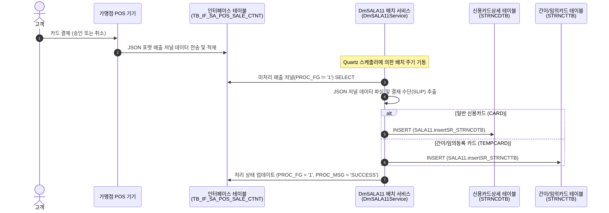

# 당일 승인현황 (카드 매출) 데이터 흐름 가이드 (DataFlow Guide)

당일 승인현황 조회 화면(`hq_appr_00001`, `st_appr_00001`)에서 표시하는 카드 매출 정보(`STRNCDTB`, `STRNCTTB`)가 생성 및 적재되는 원천 데이터의 흐름과 배치의 작동 방식을 설명합니다.

---

## 1. 카드 매출 데이터 처리 개요

매장에서 발생한 신용카드 승인/취소 결제 정보는 실시간성 인터페이스와 Quartz 배치 프로그램을 통해 최종적으로 DB 테이블에 적재됩니다.



---

## 2. 세부 처리 프로세스

### 2.1 POS 결제 및 인터페이스 적재 (1 ~ 2단계)
1. **POS 결제 발생**: 가맹점에서 고객이 카드로 결제를 수행(또는 승인 취소)하면 POS기에서 결제 내역과 승인번호 등이 포함된 JSON 포맷 저널(`JOURNAL_CTNT`)을 생성합니다.
2. **실시간 인터페이스**: POS 기기에서 서버로 저널 데이터를 전송하여 인터페이스 테이블인 **`hmsfns.TB_IF_SA_POS_SALE_CTNT`**에 임시 적재됩니다.
   - 이때 인터페이스 처리 플래그(`PROC_FG`)는 미처리 상태인 `0` 또는 기본값으로 들어옵니다.

### 2.2 DmSALA11 배치 기동 및 파싱 (3 ~ 4단계)
1. **배치 서비스 기동**: Quartz 스케줄러를 통해 주기적으로 **`DmSALA11Service.java`** 배치가 호출됩니다.
2. **미처리 저널 조회**: 배치 프로그램은 `TB_IF_SA_POS_SALE_CTNT` 테이블에서 `PROC_FG != '1'`인 레코드를 조회해옵니다.
3. **JSON 파싱**: 매출 저널에 있는 결제 수단 정보인 `SLIP` 오브젝트를 파싱하여 결제 카드 종류를 구분합니다.

### 2.3 대상 테이블 분기 적재 및 완료 (5 ~ 6단계)
1. **테이블 분기 `INSERT`**:
   - **`STRNCDTB` (매출 TRAN CARD)**: 일반 신용카드 결제(`CARD`) 정보가 들어있을 때 `SALA11.insertSR_STRNCDTB` 쿼리를 수행해 실시간 카드 매출 테이블에 적재합니다. (화면에서 결제구분 **'승인'**으로 노출)
   - **`STRNCTTB` (임의등록/간이카드)**: 간이 영수증 또는 수동 임의등록 카드(`TEMPCARD`) 정보가 들어있을 때 `SALA11.insertSR_STRNCTTB` 쿼리를 수행해 적재합니다. (화면에서 결제구분 **'임의등록'**으로 노출)
2. **인터페이스 상태 업데이트**: 최종 처리가 완료되면 `TB_IF_SA_POS_SALE_CTNT.PROC_FG` 상태값을 `'1'` (성공)로 업데이트하고 `'SUCCESS'` 로그를 기록합니다.

---

## 3. 원천 소스코드 분석

### 3.1 DmSALA11Service.java (Slip 처리 분기)
```java
// 3. Slip 처리
if ( trData.get("SLIP") != null ) {
    Map<String, Object> slipMap = (Map<String, Object>) trData.get("SLIP");

    // 3.1 STRNCDTB (CARD) -> 실시간 신용카드 승인현황
    procStep = "STRNCDTB";
    processListOrMap(slipMap.get("CARD"), commonMap, "SALA11.insertSR_STRNCDTB");

    // 3.4 STRNCTTB (TEMPCARD) -> 임의등록/간이카드 승인현황
    procStep = "STRNCTTB";
    processListOrMap(slipMap.get("TEMPCARD"), commonMap, "SALA11.insertSR_STRNCTTB");
}
```

### 3.2 DmSALA11_SQL.xml (INSERT 쿼리 ID)
* `insertSR_STRNCDTB`: `insert into hmsfnb.strncdtb ...`
* `insertSR_STRNCTTB`: `insert into hmsfnb.strncttb ...`

---

## 4. 데이터 조회 시점 결론
사용자가 본사/매장 **"당일 승인현황"** 화면에서 데이터를 조회했을 때 최신 승인 정보가 화면에 표시되는 시점은, **POS 결제가 완료된 후 `DmSALA11` 배치 프로그램이 구동되어 `STRNCDTB` 및 `STRNCTTB` 테이블에 최종 적재 완료한 직후**입니다.
