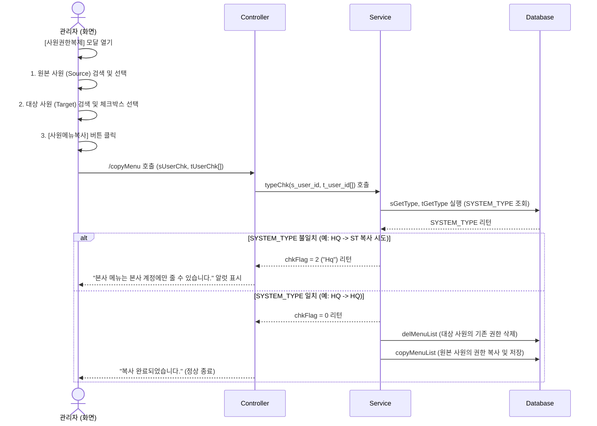

# 사원 메뉴 권한 복사 및 계정 구분 설정 가이드

본 문서는 본사/매장 사원 계정 등록 방법부터 메뉴 권한을 복사하고 이를 시스템이 검증하는 전체 화면 Workflow를 설명합니다.

---

## 1. 사원 계정 등록 (HQ / ST 구분 설정)

사원관리 화면에서 어떤 탭을 선택하고 등록하느냐에 따라 계정의 시스템 유형(`SYSTEM_TYPE`)이 결정됩니다.

### [본사 계정 (HQ) 등록]
1. 사원관리 화면 상단의 **"본사직원 사용자 관리"** 탭을 선택합니다.
2. 우측 상단의 **[사원추가]** 버튼을 클릭합니다.
3. **[ID 중복확인]**을 수행한 후, 사원 정보(사용자명, 이메일 등)를 입력하고 **[저장]**합니다.
   * *이때 매장 정보(`ms_no`)는 입력하지 않고 빈 값으로 저장됩니다.*
   * **결과**: DB(`hmsfns.MUSERSTB`)에 **`SYSTEM_TYPE = 'HQ'`**로 자동 설정됩니다. (소속 매장 `MS_NO`는 등록한 관리자의 소속 매장으로 자동 입력됩니다.)

### [매장 계정 (ST) 등록]
1. 사원관리 화면 상단의 **"매장직원 사용자 관리"** 탭을 선택합니다.
2. 좌측 조건창에서 등록할 **[매장을 선택]**합니다 (예: `NC0003`).
3. 우측 상단의 **[사원추가]** 또는 **[매장 직원 추가]** 버튼을 클릭합니다.
4. **[ID 중복확인]**을 수행한 후, 사원 정보와 권한을 입력하고 **[저장]**합니다.
   * **결과**: DB(`hmsfns.MUSERSTB`)에 해당 매장 코드(`NC0003` 등)가 저장되며, **`SYSTEM_TYPE = 'ST'`**로 자동 설정됩니다.

---

## 2. 사원 메뉴 권한 복사 및 검증 Workflow

사원의 메뉴 권한을 다른 사원(들)에게 복사할 때 화면과 서버 내부에서 일어나는 처리 흐름입니다.

<div class="mermaid-wrapper" style="position: relative; margin-bottom: 20px;">
  <button onclick="navigator.clipboard.writeText(this.nextElementSibling.innerText); alert('Mermaid 코드가 복사되었습니다.');" style="position: absolute; right: 10px; top: 10px; z-index: 100; background: #2563EB; color: white; border: none; padding: 5px 10px; border-radius: 6px; cursor: pointer; font-size: 11px; font-weight: 600; box-shadow: 0 2px 5px rgba(0,0,0,0.1);">코드 복사</button>

```text
sequenceDiagram
    actor Admin as 관리자 (화면)
    participant Ctrl as Controller
    participant Svc as Service
    participant DB as Database

    Admin->>Admin: [사원권한복제] 모달 열기
    Admin->>Admin: 1. 원본 사원 (Source) 검색 및 선택
    Admin->>Admin: 2. 대상 사원 (Target) 검색 및 체크박스 선택
    Admin->>Admin: 3. [사원메뉴복사] 버튼 클릭
    
    Admin->>Ctrl: /copyMenu 호출 (sUserChk, tUserChk[])
    Ctrl->>Svc: typeChk(s_user_id, t_user_id[]) 호출
    Svc->>DB: sGetType, tGetType 실행 (SYSTEM_TYPE 조회)
    DB-->>Svc: SYSTEM_TYPE 리턴
    
    alt SYSTEM_TYPE 불일치 (예: HQ -> ST 복사 시도)
        Svc-->>Ctrl: chkFlag = 2 ("Hq") 리턴
        Ctrl-->>Admin: "본사 메뉴는 본사 계정에만 줄 수 있습니다." 알럿 표시
    else SYSTEM_TYPE 일치 (예: HQ -> HQ)
        Svc-->>Ctrl: chkFlag = 0 리턴
        Svc->>DB: delMenuList (대상 사원의 기존 권한 삭제)
        Svc->>DB: copyMenuList (원본 사원의 권한 복사 및 저장)
        Ctrl-->>Admin: "복사 완료되었습니다." (정상 종료)
    end
```


</div>

### [단계별 세부 흐름]
1. **사원권한복제 모달 호출**: 우측의 **[사원권한복제]** 버튼을 클릭해 복사 창을 호출합니다.
2. **원본 사원(Source) 지정**: 복사할 기준 권한을 가진 사원을 검색 후 더블클릭하여 지정합니다.
3. **대상 사원(Target) 지정**: 권한을 새로 부여할 사원들을 우측에서 검색한 후, 좌측 체크박스를 선택합니다.
4. **복사 실행 및 검증**: **[사원메뉴복사]** 버튼을 클릭하면 서버의 `typeChk` 로직이 먼저 실행되어 복사 대상 간의 `SYSTEM_TYPE`을 대조합니다.
   * **검증 실패 (알럿 발생)**:
     * **본사 사원(`HQ`)**의 권한을 **매장 사원(`ST`)**에게 복사 시도 시: `"본사 메뉴는 본사 계정에만 줄 수 있습니다."` 경고창을 띄우며 복사를 거부합니다.
     * **매장 사원(`ST`)**의 권한을 **본사 사원(`HQ`)**에게 복사 시도 시: `"매장 메뉴는 매장 계정에만 줄 수 있습니다."` 경고창을 띄우며 복사를 거부합니다.
   * **검증 성공 (복사 수행)**:
     * 계정 타입이 일치할 때에만 대상 사용자의 기존 메뉴 권한을 초기화(`delMenuList`)하고, 원본 사원의 메뉴 권한을 새롭게 추가(`copyMenuList`)합니다.
