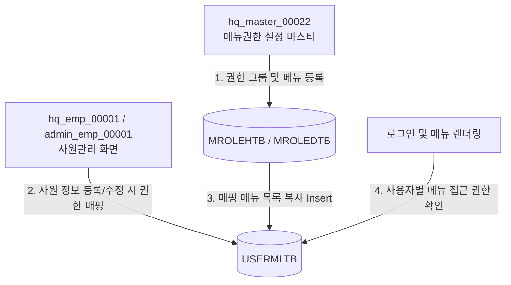

# 사원관리 권한(Role) 데이터 흐름 및 테이블 관계 가이드

이 가이드는 HMS 시스템 내에서 권한(Role)을 설정하는 화면과 이를 소모하는 화면의 역할 정의, 데이터베이스 테이블 간의 관계, 그리고 권한 그룹 삭제/수정 시 기존 사용자에게 미치는 영향 분석을 다룹니다.

---

## 1. 권한 설정(생성) 및 소모(매핑) 아키텍처

HMS 시스템의 권한 체계는 권한 그룹과 사용자별 접근 권한이 물리적으로 분리되어 있으며, **"풀어쓰는 방식(복사 및 비정규화)"**으로 제어됩니다.



### A. 설정 및 정의처 (Configuration)
* **대상 화면**: **`hq_master_00022` (웹 메뉴 권한 설정 마스터관리)**
* **역할**: 
  - 권한 그룹 코드(`ROLE_CD`) 및 명칭(`ROLE_NM`)을 새롭게 정의합니다.
  - 정의된 권한 그룹에 포함될 개별 메뉴(`MENU_SEQ`)와 메뉴별 CRUD 권한 상세 설정을 정의합니다.
  - 관련 테이블: `MROLEHTB` (권한그룹 헤더), `MROLEDTB` (권한그룹 상세 메뉴)

### B. 소모 및 매핑처 (Consumption & Mapping)
* **대상 화면**: 
  - **`hq_emp_00001` (본사 사원관리)**
  - **`admin_emp_00001` (어드민 사원관리)**
* **역할**: 
  - 사원 등록 및 정보 수정 팝업에서 특정 권한 그룹을 선택하여 저장합니다.
  - 저장 시, 백엔드 로직은 선택한 권한 그룹에 지정되어 있는 메뉴 목록(`MROLEDTB`)을 조회하여 해당 사용자의 사용자 ID와 엮어서 **`USERMLTB` (사용자별 메뉴 권한 테이블)**에 레코드로 직접 복사하여 적재합니다.

### C. 최종 권한 소비 및 검증 (Usage)
* **대상 프로세스**: 사용자 로그인 및 메뉴 로드
* **역할**: 
  - 사용자가 로그인한 후 메뉴 바를 그리거나 특정 화면에 접근할 때, 시스템은 마스터 테이블이 아닌 **`USERMLTB` 테이블을 직접 조회**하여 해당 사용자가 권한을 가졌는지 판단합니다.

---

## 2. 권한 관련 데이터베이스 테이블 구조

모든 권한 정보는 다음 4개의 테이블을 기반으로 독립적이면서도 연기적으로 운용됩니다.

| 테이블명 | 테이블 영문명 | 주요 식별자(PK) | 주요 비기능 및 역할 |
| :--- | :--- | :--- | :--- |
| **권한그룹 마스터 헤더** | `hmsfns.MROLEHTB` | `ROLE_CD` | 권한 그룹 자체(예: 매장 관리자, 본사 관리자)를 정의하는 테이블 |
| **권한그룹 마스터 상세** | `hmsfns.MROLEDTB` | `ROLE_CD`, `MENU_SEQ` | 각 권한 그룹에 어떤 메뉴들이 매핑되어 있는지 1:N으로 기록하는 테이블 |
| **사용자별 메뉴 권한** | `hmsfns.USERMLTB` | `USER_ID`, `MENU_SEQ` | **[실제 권한 검증처]** 사용자별로 접근 가능한 메뉴 목록을 다건으로 소유한 테이블 |
| **사용자 마스터** | `hmsfns.MUSERSTB` | `USER_ID` | 사용자의 인적 사항 및 시스템 구분(`SYSTEM_TYPE`) 정보를 갖는 테이블 |

---

## 3. 삭제 및 수정 시 상호 영향성 분석 (가장 중요)

설정 테이블(`MROLEHTB`, `MROLEDTB`)과 소모 테이블(`USERMLTB`)은 **물리적 외래키(FK)나 Cascade 제약 조건이 설정되어 있지 않은 완전히 별개의 독립된 테이블**입니다. 이에 따른 동작 양상은 다음과 같습니다.

### ① 권한 그룹 삭제 시 영향 (`hq_master_00022`에서 삭제)
* **동작**: 메뉴권한 마스터 화면에서 특정 권한 그룹(`ROLE_CD`)을 삭제하면, `MROLEHTB`와 `MROLEDTB`에서 해당 행이 삭제됩니다.
* **영향성**: 
  - **기존 사용자 권한 유지**: 이미 해당 권한 그룹을 지정받아 `USERMLTB`에 개별 메뉴 목록이 복사된 사용자들은 **아무런 영향을 받지 않고 메뉴를 정상 이용**할 수 있습니다.
  - **신규 사원 매핑 불가**: 사원관리 화면에서 신규 사원을 추가하거나 기존 사원을 수정할 때는 삭제된 권한 그룹이 콤보박스에 나타나지 않으므로 더 이상 매핑할 수 없습니다.

### ② 권한 그룹 메뉴 구성 변경 시 영향 (`hq_master_00022`에서 메뉴 추가/삭제)
* **동작**: 특정 권한 그룹에 포함된 메뉴 리스트를 추가하거나 변경합니다.
* **영향성**:
  - **기존 사용자 자동 갱신 안 됨**: 이미 기존에 해당 권한 그룹을 부여받은 사용자의 `USERMLTB` 데이터는 실시간으로 연동되거나 자동으로 추가/삭제되지 않습니다.
  - **수동 재갱신 필요**: 변경된 권한 그룹 구성을 기존 사용자에게 반영하려면, **사원관리 화면(`hq_emp_00001` 또는 `admin_emp_00001`)에 진입하여 해당 사용자의 상세 정보를 다시 한번 [저장]**해 주어야 합니다. 
  - **이유 (MyBatis 쿼리 구조)**: 사원 수정 저장 프로세스 시, 기존 사용자의 권한을 완전히 날린 후 (`deleteUserMl`), 최신 권한그룹 구성을 다시 복사해 오기 때문입니다 (`updateUserRole`).
    ```sql
    -- 1단계: 기존 권한 완전 삭제
    DELETE FROM hmsfns.USERMLTB WHERE USER_ID = #{editUserId};
    
    -- 2단계: 최신 권한 상세(MROLEDTB)로부터 복사 삽입
    INSERT INTO hmsfns.USERMLTB (USER_ID, MENU_SEQ, ...)
    SELECT #{editUserId}, B.MENU_SEQ, ...
      FROM hmsfns.MROLEHTB A, hmsfns.MROLEDTB B
     WHERE A.ROLE_CD = B.ROLE_CD AND A.ROLE_CD = #{userRole};
    ```

---

## 4. 요약
- **권한 마스터 테이블과 실사용자 권한 테이블은 물리적으로 분리되어 있습니다.**
- 권한 마스터 정보를 삭제하거나 변경하더라도 이미 매핑이 완료되어 `USERMLTB`에 생성된 사용자 권한은 **자동으로 삭제되거나 업데이트되지 않습니다 (동기화되지 않음).**
- 따라서 변경 사항을 사용자에게 반영하려면 사원관리 화면에서 해당 사원을 다시 조회하여 **수정 및 저장**해 주어야 안전하게 동기화가 이루어집니다.
