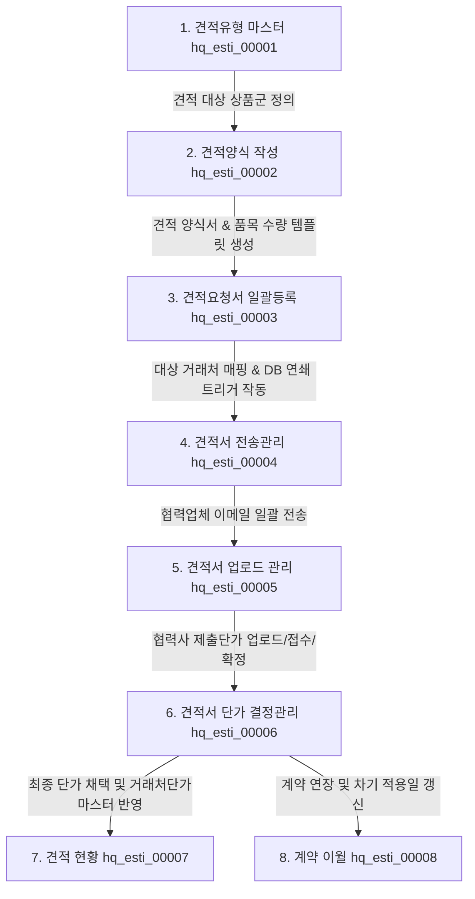

# HMS 견적관리 화면군 (hq_esti_00001 ~ 00008) 전체 업무 흐름 가이드

본 문서는 HMS 영업정보시스템 본사(HQ) 견적관리 모듈 내 8개 화면 간의 유기적인 비즈니스 흐름, 데이터 연관 관계 및 라이프사이클을 정리한 가이드라인입니다.

---

## 1. 견적관리 전체 프로세스 라이프사이클 (Mermaid Flowchart)

---

## 2. 화면별 역할 및 주요 데이터베이스(DB) 매핑 정보

### 2.1 [hq_esti_00001] 견적유형 마스터
* **역할**: 식자재, 비소모품 등 견적 업무의 구분이 되는 **견적유형**을 분류 등록하고, 해당 유형에 해당하는 상품군을 사전에 매핑하여 관리합니다.
* **핵심 기능**: 견적유형 등록/수정/삭제, 유형별 대상 상품 등록/삭제
* **주요 매핑 DB**: `TESMTMTB` (견적유형 마스터), `TESMTDTB` (견적유형별 대상 상품 목록)

### 2.2 [hq_esti_00002] 견적서 양식작성
* **역할**: 정의된 견적유형을 바탕으로 견적 적용 기간과 접수 기간이 지정된 **견적양식서 템플릿**을 빌드하고, 필요한 예상 소요 품목 및 수량을 구성합니다.
* **핵심 기능**: 양식 작성, 엑셀 폼 다운로드/업로드 방식을 통한 대상 품목 및 수량 일괄 업데이트 (`/goodsUpload`)
* **주요 매핑 DB**: `TESFRHTB` (견적양식 헤더 마스터), `TESFRDTB` (견적양식 상세 품목/수량)

### 2.3 [hq_esti_00003] 견적요청서 일괄등록
* **역할**: 빌드된 견적양식 템플릿에 견적서 작성을 요청할 **대상 협력업체(거래처)**를 선택하여 일괄 등록합니다.
* **핵심 기능**: 미등록 거래처 일괄 매핑 저장 (`/save`), 기존 매핑 삭제 (`/delete`)
* **연쇄 트리거 작동 (중요)**:
  * 거래처 저장 시 `Tr_TESFRV_T01_Service` 자바 트리거 서비스가 작동하여, 원본 양식(`TESFRDTB`)에 등록된 품목 리스트를 기반으로 **거래처별 개별 견적 단가 입력용 테이블(`TESVDUTB`)**에 데이터를 **자동 연쇄 복사 적재**합니다.
* **주요 매핑 DB**: `TESFRVTB` (양식별 거래처 매핑), `TESVDUTB` (거래처별 견적서 상품 매핑)

### 2.4 [hq_esti_00004] 견적서 전송관리
* **역할**: 거래처 정보가 등록된 견적요청서를 이메일 연동 모듈을 사용하여 **협력사 이메일 주소로 일괄 발송**하고 전송 상태를 이력 관리합니다.
* **핵심 기능**: 견적요청서 메일 전송 (`/sendMail` 등), 메일 이력 조회
* **주요 매핑 DB**: `POS_MAIL_INTERFACE` / `TIBERO_MAIL_INTERFACE` (메일 인터페이스 테이블 연동)

### 2.5 [hq_esti_00005] 견적서 업로드 관리
* **역할**: 협력사(거래처)가 메일을 통해 회신해온 단가를 시스템에 등록(수동 또는 엑셀 일괄 업로드)하고, 최종적으로 **접수 처리 및 확정**을 진행합니다.
* **핵심 기능**: 협력사 단가 엑셀 일괄 업로드 (`/goodsUpload`), 개별 단가 수동 수정/저장, 접수 처리 (`/receipt`), 확정 처리 (`/confirm`)
* **주요 매핑 DB**: `TESVDUTB` (견적 단가 필드 업데이트)

### 2.6 [hq_esti_00006] 견적서 단가 결정관리
* **역할**: 여러 협력사가 각기 제출하여 확정된 견적서들의 단가를 품목별로 비교 분석하여 **최종 단가를 채택하고 결정**합니다.
* **핵심 기능**: 다자간 견적 단가 비교 조회, 최종 채택 단가 확정 및 마스터 일괄 반영 (`/applyPrice`)
* **주요 매핑 DB**: `TVNDRGDS` (거래처별 취급 상품 단가 마스터 테이블에 최종 단가 강제 반영 처리)

### 2.7 [hq_esti_00007] 견적 현황
* **역할**: 모든 프로세스가 완결된 견적서 및 최종 채택 단가 현황을 품목별, 업체별로 조회하고 파일로 백업할 수 있는 종합 리포트 화면입니다.
* **핵심 기능**: 다차원 견적 현황 상세 조회, 엑셀 파일 내보내기
* **주요 매핑 DB**: `TESFRHTB`, `TESFRVTB`, `TESVDUTB` 종합 조인 뷰 조회

### 2.8 [hq_esti_00008] 계약 이월
* **역할**: 기존 견적 계약 단가의 만료일이 도래했을 때, 동일 계약 단가를 다음 계약 기간으로 이월 연장하거나 갱신 처리합니다.
* **핵심 기능**: 기존 계약 기간 연장 이월 처리 (`/extendDate`)
* **주요 매핑 DB**: `TESFRHTB` (적용 시작/종료일 갱신 및 차기 마스터 이관)
