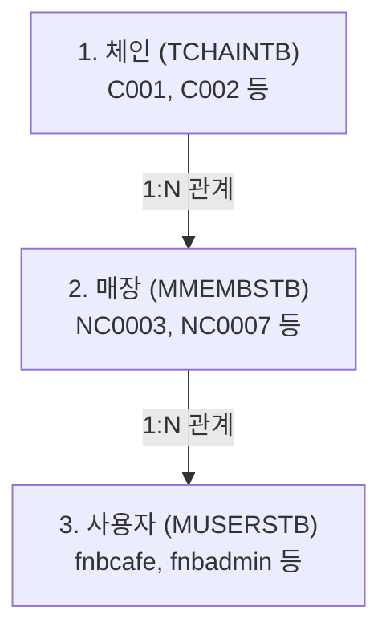

# HMS 마스터 데이터 셋업 및 정합성 가이드 (체인-매장-사용자)

본 문서는 HMS 시스템 내에서 권한 제어와 전표 조회의 기준이 되는 **체인(본부), 매장, 사용자(사원)** 마스터 데이터의 논리적 구조와 올바른 매핑 관계를 정의합니다. 

로컬 개발 환경을 새로 구축하거나 테스트 데이터를 재설정할 때, 본 가이드의 정합성 규칙에 맞추어 셋업을 진행해야 조회 누락 등의 오작동을 방지할 수 있습니다.

---

## 1. 마스터 데이터 계층 및 조인(JOIN) 관계

HMS 시스템은 아래와 같은 3단계 계층 구조로 매장 권한을 필터링합니다.

<div class="mermaid-wrapper" style="position: relative; margin-bottom: 20px;">
  <button onclick="navigator.clipboard.writeText(this.nextElementSibling.innerText); alert('Mermaid 코드가 복사되었습니다.');" style="position: absolute; right: 10px; top: 10px; z-index: 100; background: #2563EB; color: white; border: none; padding: 5px 10px; border-radius: 6px; cursor: pointer; font-size: 11px; font-weight: 600; box-shadow: 0 2px 5px rgba(0,0,0,0.1);">코드 복사</button>

```text
graph TD
    A["1. 체인 (TCHAINTB)<br>C001, C002 등"] -->|1:N 관계| B["2. 매장 (MMEMBSTB)<br>NC0003, NC0007 등"]
    B -->|1:N 관계| C["3. 사용자 (MUSERSTB)<br>fnbcafe, fnbadmin 등"]
```


</div>

### 🔗 데이터베이스 조인 공식
```sql
SELECT U.USER_ID, U.USER_NM, M.MS_NO, M.MS_NM, C.CHAIN_NO, C.CHAIN_NM
FROM hmsfns.MUSERSTB U
INNER JOIN hmsfns.MMEMBSTB M ON U.MS_NO = M.MS_NO
INNER JOIN hmsfns.TCHAINTB C ON M.CHAIN_NO = C.CHAIN_NO;
```

---

## 2. 데이터 구성 및 매핑 테이블 (정상 설계 기준)

### 2.1 체인 마스터 기준 (`TCHAINTB`)
체인은 **계열 구분(Affiliate)**과 **지역 구분(Place)**의 조합으로 구성됩니다.
* **계열 구분 (`AFFILIATE_COMPANY`)**: `0` = F&B(식음료), `1` = SHOP(리테일 샵)
* **지역 구분 (`PLACE`)**: `0` = 수도권(본사), `1` = 부산/영남권

| 체인 코드 | 체인 명칭 | 계열 구분 (`affiliate_company`) | 지역 구분 (`place`) | 권장 매장 유형 |
| :--- | :--- | :--- | :--- | :--- |
| **`C001`** | **본부_HMS SHOP** | **`1` (SHOP)** | `0` (수도권) | 수도권 지역 샵/리테일 매장 |
| **`C002`** | **본부_고양 F&B** | **`0` (F&B)** | `0` (수도권) | 수도권 지역 카페/식음료 매장 |
| **`C003`** | **본부_부산 SHOP** | **`1` (SHOP)** | `1` (부산) | 영남권 지역 샵/리테일 매장 |
| **`C004`** | **본부_부산 F&B** | **`0` (F&B)** | `1` (부산) | 영남권 지역 카페/식음료 매장 |

---

### 2.2 올바른 매장 & 사용자 매핑 매트릭스
원래 시나리오상 업무 권한을 올바르게 매칭한 구성안입니다. 본사 담당자와 매장 매니저는 반드시 **동일한 체인 코드** 내에 묶여 있어야 상호 전표 조회가 가능합니다.

| 분류 | **SHOP 계열 (수도권)** | **F&B 계열 (수도권)** |
| :--- | :--- | :--- |
| **적용 체인** | **`C001`** | **`C002`** |
| **본사 관리자 계정** | **`shopadmin`** (본부_SHOP) | **`fnbadmin`** (본부_고양 F&B) |
| **본사 매장 (MS_NO)** | `NC0002` (본부_SHOP) | `NC0005` (본부_고양 F&B) |
| **매장 매니저 계정** | **`shopbrand`** (샵 매니저) | **`fnbcafe`** (카페 매니저) |
| **매장 (MS_NO)** | `NC0003` (고양 Shop) | `NC0007` (CAFE) |

> [!WARNING]
> **현대개발 원천 DB의 데이터 오류 주의 (히스토리)**
> 현대개발 개발용 DB(오라클)에서는 카페 매장인 **`NC0007` (CAFE)**의 체인 코드가 잘못하여 **`C001` (SHOP 본부)**로 매핑되어 있습니다.
> 이로 인해 `fnbcafe`가 발주한 내역이 `fnbadmin`에서 보이지 않고, `shopadmin`에서 조회되는 기현상이 발생했습니다. 로컬 테스트나 데이터를 다시 셋업할 때는 아래 SQL을 이용해 반드시 정합성을 맞추어야 합니다.

---

## 3. 마스터 데이터 보정 및 셋업 SQL 스크립트

추후 데이터를 새롭게 적재하거나 꼬인 데이터를 보정할 때 사용할 수 있는 표준 SQL 스크립트입니다.

### 3.1 [보정] 카페 매장 체인 정합성 수정 (필수)
카페 매장(`NC0007`)이 정상적으로 F&B 체인(`C002`) 및 F&B 본사 관리자(`fnbadmin`)의 통제를 받도록 보정합니다.
```sql
-- 1. 매장 마스터의 체인 코드 보정
UPDATE hmsfns.MMEMBSTB 
SET CHAIN_NO = 'C002' 
WHERE MS_NO = 'NC0007';

-- 2. (필요 시) 이미 작성된 매입 전표 헤더들의 체인 보정
-- (테스트 데이터 적재 후 조회가 안 될 때 실행)
UPDATE hmsfns.OBSLPHTB 
SET CHAIN_NO = 'C002' 
WHERE MS_NO = 'NC0007';
```

### 3.2 [신규 셋업] 테스트용 신규 F&B 매장 및 매니저 추가 템플릿
기존 `NC0007` 매장 외에 완전히 깨끗한 F&B 매장을 새로 만들어 테스트하고 싶을 때 사용하는 셋업 쿼리입니다.

```sql
-- 1. F&B 매장 신규 등록 (체인을 C002로 명확히 지정)
INSERT INTO hmsfns.MMEMBSTB (
    MS_NO, MS_NM, CHAIN_NO, MS_FG, USE_YN, CREATE_DTIME, CREATE_ID, LAST_DTIME, LAST_ID
) VALUES (
    'NC0099', '고양 신규 F&B 매장', 'C002', '1', 'Y', 
    TO_CHAR(NOW(), 'YYYYMMDDHH24MISS'), 'ADMIN', TO_CHAR(NOW(), 'YYYYMMDDHH24MISS'), 'ADMIN'
);

-- 2. 해당 매장의 매니저 사용자(사원) 등록
INSERT INTO hmsfns.MUSERSTB (
    USER_ID, USER_NM, PASSWD, MS_NO, USE_YN, CREATE_DTIME, CREATE_ID, LAST_DTIME, LAST_ID
) VALUES (
    'newfnbcafe', '신규카페매니저', '0', 'NC0099', 'Y', 
    TO_CHAR(NOW(), 'YYYYMMDDHH24MISS'), 'ADMIN', TO_CHAR(NOW(), 'YYYYMMDDHH24MISS'), 'ADMIN'
);
```

### 3.3 [검증] 정합성 이상 여부 체크 쿼리
마스터 데이터를 셋업한 후, 본사 계정과 매장 계정 간의 체인이 달라 전표 조회가 누락될 가능성이 있는 꼬인 데이터를 찾아내는 쿼리입니다.

```sql
-- 매장의 체인과, 소속된 사용자의 본사 체인이 불일치하는 유저 목록 추출
SELECT U.USER_ID, U.USER_NM, U.MS_NO AS USER_MS_NO, M.MS_NM, M.CHAIN_NO AS STORE_CHAIN
FROM hmsfns.MUSERSTB U
INNER JOIN hmsfns.MMEMBSTB M ON U.MS_NO = M.MS_NO
WHERE U.USER_ID LIKE '%cafe%' AND M.CHAIN_NO != 'C002'; -- C002(F&B)가 아닌 다른 체인에 묶여 있는 F&B 계정 탐색
```

---

## 4. 시스템 내부 자동 생성 로직 (체인 신규 등록 시)

HMS 백오피스 프로그램은 신규 체인을 등록할 때 **실거래가 없는 본사 역할의 본부매장을 자동으로 생성**해 주는 비즈니스 로직을 탑재하고 있습니다.

### 4.1 구현 소스 위치
* **Java 서비스**: [Admin_Master_00003_Service.java](file:///d:/workspace/hmotors/workspace_hms20260326/backoffice/hyundai-backoffice-layer-service/src/main/java/com/hyundai/backoffice/webapp/service/admin/master/Admin_Master_00003_Service.java#L89-L133) 내 `saveChain()` 메소드
* **MyBatis 쿼리 매퍼**: [Admin_Master_00003_Sql.xml](file:///d:/workspace/hmotors/workspace_hms20260326/backoffice/hyundai-backoffice-webapp/src/main/resources/sqlmapper/master/Admin_Master_00003_Sql.xml#L125-L148)

### 4.2 체인 신규 저장 시 자동 연쇄 인서트 테이블
1. **`hmsfns.MMEMBSTB` (매장 마스터)**
   * 신규 체인코드 등록 시 자동으로 새 가맹점 코드(예: `NC0008` 등 순번 채번)가 할당되어 본사 매장 정보가 생성됩니다.
   * **`CHAIN_HQ_YN = 'Y'`** (본사 여부: 예) 및 `MS_NM = #{chainNm}` (체인 이름과 매장 이름이 동일하게 매핑) 설정으로 실거래가 없는 본부매장 성격을 띱니다.
   * 대표자(`홍길동`), 전화번호(`0200000000`), 사업자번호(`0000000000`) 등 기본 시스템 데이터가 자동으로 삽입됩니다.
2. **`hmsfns.WFNENVTB` (웹 환경설정)**
   * 매출대비 자동입고 관리 관련 매장 설정(56번 설정) 등이 디폴트인 `'1'`로 자동 삽입됩니다.
3. **`hmsfns.MMEMBVTB` (매장 디폴트 환경설정)**
   * 과세 구분, 단가 단위 등 매장에 대한 기본 공통 환경 정보 레코드가 생성됩니다.
4. **`hmsfns.MMEMBPTB` (매장 디폴트 포스 설정)**
   * 본사 관리를 위해 기본 포스 번호 `'01'` 정보가 강제로 생성됩니다.

> [!NOTE]
> **테스트 매장 셋업 시 주의사항**
> * **본부매장(본사)**: 화면(체인 등록 화면)에서 체인을 생성하면 내부 Java 로직에 의해 자동으로 위 4개 테이블에 본부매장 정보가 밀려 들어가므로, **DB에 수동으로 직접 인서트하지 않아도 됩니다.**
> * **일반매장(실거래 매장)**: 실제 전표를 끊고 거래를 일으킬 가맹점 매장은 자동으로 생성되지 않으므로, **[가맹점/매장 관리] 화면에서 추가로 신규 등록**하거나 DB에 직접 SQL(`CHAIN_HQ_YN = 'N'`)로 넣어 주어야 합니다.
