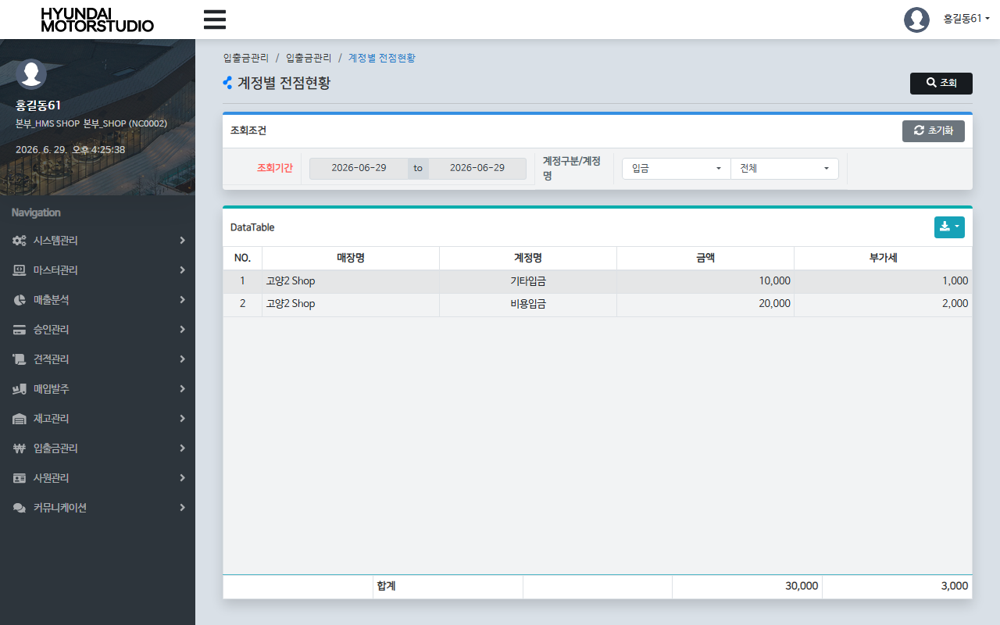

# QA Report: Hq_Cash_00003 계정별 전점현황 (월간지출내역조회)
**작성일**: 2026-06-29  
**작성자**: AI QA Agent (Antigravity)  
**대상 화면**: 현금관리 > 입출금관리 > 계정별 전점현황 (`hq_cash_00003`)  
**테스트 환경**: localhost:8080 (로컬 WAS 개발 서버)  
**대상 데이터베이스**: `192.168.10.206 / edb` (schema: `hmsfns`)  
**테스트 계정**: `shopadmin` (비밀번호: `0000`)

---

## 1. 분석 개요

### 1.1 분석 대상 파일 목록

| 구분 | 파일 경로 |
|------|-----------|
| Controller | `com.hyundai.backoffice.webapp.controller.hq.cash.Hq_Cash_00003_Controller.java` |
| Service | `com.hyundai.backoffice.webapp.service.hq.cash.Hq_Cash_00003_Service.java` |
| Mapper (Interface) | `com.hyundai.backoffice.webapp.dao.hq.cash.Hq_Cash_00003_Mapper.java` |
| SQL XML | `hyundai-backoffice-webapp/src/main/resources/sqlmapper/cash/Hq_Cash_00003_Sql.xml` |
| JSP | `hyundai-backoffice-webapp/src/main/webapp/WEB-INF/views/backoffice/main/contents/hq/cash/hq_cash_00003/hq_cash_00003.jsp` |
| JS | `hyundai-backoffice-webapp/src/main/webapp/WEB-INF/views/backoffice/main/contents/hq/cash/hq_cash_00003/js/hq_cash_00003.js` |
| JS BT | `hyundai-backoffice-webapp/src/main/webapp/WEB-INF/views/backoffice/main/contents/hq/cash/hq_cash_00003/js/hq_cash_00003_bt.js` |

---

## 2. 엔드포인트 분석

### 2.1 Base URL
```
POST /backoffice/data/hq/cash/hq_cash_00003/{endpoint}
```

### 2.2 엔드포인트 목록

| 엔드포인트 | HTTP | 기능 | ServiceLog | 관련 테이블 |
|-----------|------|------|------------|------------|
| `/searchList` | POST | 본사 기준 기간 내 전 매장 계정별 시재 현황 조회 | SELECT | `hmsfns.MACCIOTB`, `hmsfns.MMACNTTB`, `hmsfns.MMEMBSTB` |
| `/selectAcntCd` | POST | 특정 계정구분값에 따른 지출 계정 콤보박스 목록 조회 | SELECT | `hmsfns.TMACNTTB` |

---

## 3. 서비스 로직 및 DB 영향도 분석

### 3.1 계정별 전점현황 조회 (`searchList` -> `selectList`)
* 본사 체인 소속 가맹점 매장들의 특정 기간(`searchFromDate` ~ `searchEndDate`) 동안 발생한 입출금 실적을 계정구분(`acntFg`) 및 계정코드(`acntCd`) 조건으로 집계합니다.
* 입출금 거래 테이블(`MACCIOTB`), 매장 계정마스터(`MMACNTTB`), 가맹점 매장마스터(`MMEMBSTB`)를 조인하여 매장명 및 계정명 기준의 총 거래 금액(`SUM(ACNT_AMT)`) 및 총 부가세(`SUM(VAT)`)를 집계 반환합니다.

### 3.2 CUD 및 트리거/프로시저 영향도 검증
* **단순 조회(Select-Only) 전용 스펙**:
  * 소스 코드 및 MyBatis XML 정적 분석 결과, 본 화면은 일체의 CUD(INSERT/UPDATE/DELETE) 쿼리가 수행되지 않는 **단순 조회용 화면**입니다.
  * 따라서 테이블 상태의 물리적 변경을 수반하지 않으므로 데이터베이스 트리거 작동이나 프로시저 연쇄 반응(Depth 2 ~ Depth 3) 등 2차적인 데이터 동기화 영향도가 전혀 존재하지 않습니다. (CUD 없음 명시)

### 3.3 형변환 결함 에러 체크
* 본 화면의 모든 쿼리 파라미터는 조회 대상 일자 및 코드 문자열 바인딩 형식으로 매핑되어 동작합니다.
* 숫자로의 강제 캐스팅이 발생하는 구문이 없으므로 형변환 결함으로 인한 쿼리 에러 발생 리스크는 없습니다.

---

## 4. E2E 테스트 시나리오 및 결과

### 4.1 E2E 테스트 개요
* **수행 방식**: Playwright 기반 E2E 자동화 스크립트 작성 및 실행
* **계정 정보**: `shopadmin` (본사 관리자 권한, 체인코드: `C001`)
* **테스트 일자**: `2026-06-29`
* **선행 DB 데이터 세팅**: 
  * E2E 검증을 위해 `hmsfns.MACCIOTB` 테이블에 임시 입금 데이터 1건(가맹점 NC0002, 금액 `250,000` / 부가세 `25,000`)을 사전 삽입한 후 진행하였습니다.
* **검증 시나리오**:
  1. `shopadmin` 계정 로그인 후 `hq_cash_00003` 화면으로 이동.
  2. 조회 조건 기간을 `'2026-06-29'` ~ `'2026-06-29'`로 설정하고 [조회]를 클릭.
  3. 테이블에 가맹점별로 입금 실적 데이터가 정확하게 바인딩되는지 확인. ✅
  4. 조회 성공 후 임시 DB 데이터 원복 확인. ✅

### 4.2 스크린샷 검증
* **조회 완료 화면**:
  

---

## 5. 종합 판정

| 검증 항목 | 결과 | 비고 |
|------|------|------|
| 화면 로딩 및 레이아웃 | ✅ PASS | 정상 로딩 완료 |
| 계정 콤보박스 바인딩 | ✅ PASS | selectAcntCd 정상 동작 |
| 기간별 전점 집계 조회 | ✅ PASS | MACCIOTB 집계 정상 확인 |
| CUD 및 DB 파급도 | ✅ PASS | 조회 전용 스펙 확인 (CUD 없음) |
| **종합 판정** | **✅ PASS** | **본사 차원 가맹점별 월간지출 시재 현황 집계 기능 안정성 검증 완료** |

---
*본 리포트는 Playwright E2E 브라우저 테스트 및 EDB PostgreSQL DB 검증을 통하여 작성되었습니다.*
