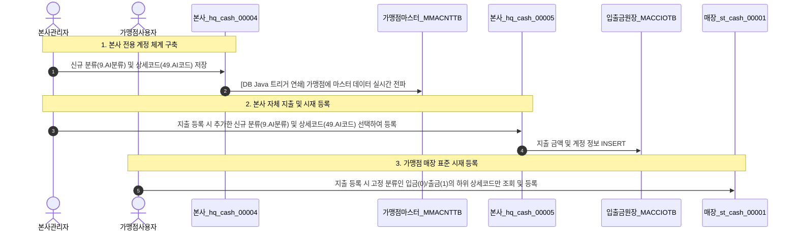

# 월간지출계정관리 (hq_cash_00004) 데이터 활용 가이드
본 문서에서는 **월간지출계정관리 (hq_cash_00004)** 화면에서 등록 및 관리되는 지출 계정 분류와 계정 코드가 실제 백오피스 시스템의 어떤 화면에서 참조되고 입력되는지 화면 간 비즈니스 연결 관계를 설명합니다.

---

## 1. 지출 계정 데이터 라이프사이클 개요

본사 지출관리자 화면(`hq_cash_00004`)에서 입력한 계정 마스터 정보는 아래와 같이 **본사 회계 영역**과 **매장 회계 영역**으로 분리되어 각각 활용됩니다.

<div class="mermaid-wrapper" style="position: relative; margin-bottom: 20px;">
  <button onclick="navigator.clipboard.writeText(this.nextElementSibling.innerText); alert('Mermaid 코드가 복사되었습니다.');" style="position: absolute; right: 10px; top: 10px; z-index: 100; background: #2563EB; color: white; border: none; padding: 5px 10px; border-radius: 6px; cursor: pointer; font-size: 11px; font-weight: 600; box-shadow: 0 2px 5px rgba(0,0,0,0.1);">코드 복사</button>

```text
sequenceDiagram
    autonumber
    actor 본사관리자
    actor 가맹점사용자
    
    Note over 본사관리자, 본사_hq_cash_00004: 1. 본사 전용 계정 체계 구축
    본사관리자->>본사_hq_cash_00004: 신규 분류(9.AI분류) 및 상세코드(49.AI코드) 저장
    본사_hq_cash_00004->>가맹점마스터_MMACNTTB: [DB Java 트리거 연쇄] 가맹점에 마스터 데이터 실시간 전파
    
    Note over 본사관리자, 본사_hq_cash_00005: 2. 본사 자체 지출 및 시재 등록
    본사관리자->>본사_hq_cash_00005: 지출 등록 시 추가한 신규 분류(9.AI분류) 및 상세코드(49.AI코드) 선택하여 등록
    본사_hq_cash_00005->>입출금원장_MACCIOTB: 지출 금액 및 계정 정보 INSERT
    
    Note over 가맹점사용자, 매장_st_cash_00001: 3. 가맹점 매장 표준 시재 등록
    가맹점사용자->>매장_st_cash_00001: 지출 등록 시 고정 분류인 입금(0)/출금(1)의 하위 상세코드만 조회 및 등록
```


</div>

---

## 2. 데이터 소비 화면 분류 및 연결 관계

지출 계정 데이터(`acnt_fg`, `acnt_cd`)는 매장과 본사의 **[입력/등록 화면]**과 **[조회/집계 화면]**에 따라 소비 영역이 다르게 작동합니다.

### 2.1 매장(가맹점) 데이터 등록 및 입력 화면

가맹점 직원이 매일의 매장 현금 시재 변동이나 지출비용을 입력할 때 분류 기준으로 사용합니다.

#### 1) 현금 시재 입출금 등록 (`st_cash_00001`)
* **화면 경로**: 매장 > 입출금관리 > 시재관리 > 현금시재입출금등록
* **데이터 소비 방식 및 화면 제약**:
  * **고정 대분류 제약**: 매장 화면의 **"계정구분(대분류)"** 콤보박스는 UI 단에서 **`입금`(0)과 `출금`(1)으로 하드코딩(Static)**되어 있습니다.
  * **조회 쿼리 제약**: 계정 구분이 변경되면 `fnAcntCdSelect()` Ajax 함수가 **본사 계정코드 마스터(`TMACNTTB`)**를 즉시 쿼리하는데, 이때 매개변수로 하드코딩된 대분류 값(`0` 또는 `1`)만 넘겨주어 조회합니다.
  * **결과**: 따라서 본사 화면(`hq_cash_00004`)에서 추가한 대분류 `9` 등의 신규 분류는 **매장 화면 `st_cash_00001`에서 원천적으로 조회되지 않으며**, 매장에서는 오직 기본 표준 분류(`0`과 `1`)에 소속된 상세 계정코드만 소비하게 됩니다.

---

### 2.2 본사(HQ) 자체 지출 및 시재 등록 화면

본사 자체적인 자금 집행 건 및 본부 시재를 등록할 때 공통 분모로 사용합니다.

#### 2) 본사 시재 입출금 등록/조회 (`hq_cash_00005`)
* **화면 경로**: 본사 > 입출금관리 > 월간지출관리 > 본사시재입출금등록
* **데이터 소비 방식**:
  * **본사 등록 데이터 소비**: 본사 화면인 `hq_cash_00004`에서 등록한 신규 대분류(`2`, `3`, `9` 등) 하위의 계정코드를 실질적으로 소비하는 입력 화면입니다.
  * **조회 쿼리 제약**: 이 화면의 데이터 조회 쿼리(`selectMmaList`)에는 **`AND NC.ACNT_FG NOT IN ('0', '1')`** 조건이 들어있어, 매장용 기본 분류(`0`, `1`)를 제외한 **본사에서 독자적으로 설계한 분류의 데이터만 필터링하여 등록/집계**하도록 설계되어 있습니다.

---

### 2.3 조회 및 통계 분석 화면

가맹점 및 본사의 거래 실적을 모니터링하고 분석하는 집계 기준으로 사용합니다.

#### 3) 계정별 전점현황 (`hq_cash_00003`)
* **화면 경로**: 본사 > 입출금관리 > 월간지출관리 > 계정별전점현황
* **데이터 소비 방식**:
  * 특정 지출 계정코드(예: 통신비, 수도광열비 등)를 선택하여 검색하면, 체인 내 **전 가맹점이 해당 계정코드로 지출한 총금액의 누적 합계**를 한눈에 요약해 주는 모니터링 화면입니다.
  * 파라미터로 넘어온 `acntFg` (입력된 분류 코드)와 일치하는 실거래 내역(`MACCIOTB`) 데이터를 가맹점 마스터(`MMACNTTB`) 기준으로 `GROUP BY`하여 실적을 집계합니다.

#### 4) 매장별 입출금현황 (`st_cash_00002` / `hq_cash_00002`)
* 특정 기간 동안 매장에서 집행한 입출금 원장 목록을 일자별, 계정코드별로 상세 조회하고 분석할 때 기준 정보로 기능합니다.

---

## 3. 핵심 비즈니스 룰 및 자주 묻는 질문 (FAQ)

### Q1. `hq_cash_00004` 화면은 목록만 관리하는 것 같은데, 왜 시재 등록이나 비용집계 얘기가 나오나요?
* **답변**: `hq_cash_00004` 화면은 직접 돈을 입출금하거나 시재를 등록하는 화면이 아닙니다. 회계 장부를 작성할 때 기준이 되는 **'계정과목 분류 마스터 템플릿(설계도)'**을 수립하는 화면입니다.
* 이 분류 체계가 본사에서 사전에 등록되어 있어야만,
  1. 본사 시재등록(`hq_cash_00005`) 또는 가맹점 시재등록(`st_cash_00001`)에서 해당 항목(예: 통신비, 수도료 등)을 선택하여 **현금 시재 지출을 등록**할 수 있고,
  2. 본사 집계화면(`hq_cash_00003`)에서 전 가맹점이 입력한 지출액을 항목별로 모아 **비용을 집계 및 분석**할 수 있습니다.
* 즉, 전체 시스템 시재/비용 관리 프로세스의 **'기준 정보(Master Data)'** 역할을 담당합니다.

### Q2. 본사에서 추가한 목록은 모든 매장이 다 동일하게 사용하는 건가요?
* **답변**: **네, 그렇습니다.**
* 본사 `hq_cash_00004` 화면에서 등록한 계정분류와 계정코드는 데이터베이스의 연쇄 처리(트리거 등)를 통해 체인에 소속된 **모든 매장의 가맹점 계정 마스터 테이블(`MMACNTTB`)로 복제 전파**됩니다.
* 가맹점별로 계정 체계를 따로 설정하여 사용하지 않으며, 본사의 일관성 있는 비용 관리를 위해 **모든 가맹점이 완전히 동일한 표준 분류 체계를 공유**하여 사용합니다.

### Q3. 본사(`hq_cash_00004`)에서 계정분류와 계정코드를 추가했는데, 매장 화면(`st_cash_00001`)에서 보이지 않는 이유는 무엇인가요?
* **답변**: **계정구분(대분류)의 소비 영역 이원화 설계** 때문입니다.
* 매장 화면(`st_cash_00001`)의 대분류는 입금(`0`)과 출금(`1`)으로 하드코딩되어 고정되어 있으며, 하위 콤보박스 조회 시에도 이 대분류 `0`과 `1`에 매핑된 데이터만 불러옵니다.
* 반면, 본사 화면 UI(`hq_cash_00004`)에서는 대분류 `0`과 `1`을 수정하지 못하게 가두어 두었기 때문에, 사용자가 UI에서 추가한 임의의 대분류(예: `2` 또는 `3`)는 매장 화면에서는 조회 대상에서 제외됩니다. (본사 추가 분류는 `hq_cash_00005` 화면에서 소비됨)
* **테스트용 해결 방안 (DB 직접 주입)**: 만약 매장 화면의 '출금(1)' 콤보박스에 새로운 계정코드가 나타나게 하려면, 화면 UI가 아닌 **DB에서 직접 SQL을 실행하여 `ACNT_FG = '1'` (출금) 상태의 데이터를 강제 주입**해 주어야 합니다.

  ```sql
  -- 1) 본사 마스터 테이블(TMACNTTB)에 출금('1') 계정코드 강제 주입 (예: 코드 '99', 명칭 '테스트출금')
  INSERT INTO hmsfns.TMACNTTB (
      CHAIN_NO, ACNT_FG, ACNT_CD, ACNT_NM, USE_YN, CREATE_DTIME, CREATE_ID, LAST_DTIME, LAST_ID
  ) VALUES (
      'C001',           -- 본사 체인코드
      '1',              -- ACNT_FG (0: 입금, 1: 출금)
      '99',             -- ACNT_CD (원하는 신규 계정코드, 중복되지 않는 값)
      '테스트출금',       -- ACNT_NM (계정명)
      'Y',              -- 사용 여부
      TO_CHAR(SYSDATE, 'YYYYMMDDHH24MISS'),
      'SYSTEM',
      TO_CHAR(SYSDATE, 'YYYYMMDDHH24MISS'),
      'SYSTEM'
  );

  -- 2) 가맹점 마스터 테이블(MMACNTTB)에도 동일하게 강제 복제 전파
  -- (매장 화면 조회 및 실거래 내역 조회 시 MMACNTTB 조인을 타므로 필수 입력)
  INSERT INTO hmsfns.MMACNTTB (
      MS_NO, ACNT_FG, ACNT_CD, ACNT_NM, CREATE_FG, CREATE_DTIME, CREATE_ID, LAST_DTIME, LAST_ID, USE_YN
  ) VALUES (
      'NC0021',         -- 대상 가맹점 매장코드 (예: I000034b 사용자의 매장코드)
      '1',              -- ACNT_FG (0: 입금, 1: 출금)
      '99',             -- ACNT_CD (상세 계정코드)
      '테스트출금',       -- ACNT_NM (계정명)
      '1',
      TO_CHAR(SYSDATE, 'YYYYMMDDHH24MISS'),
      'SYSTEM',
      TO_CHAR(SYSDATE, 'YYYYMMDDHH24MISS'),
      'SYSTEM',
      'Y'
  );
  ```

### Q4. 새로 추가한 계정코드가 본사 비용집계(`hq_cash_00003`) 화면에서 조회되지 않는 이유는 무엇인가요?
* **답변**: **실제 지출 거래 데이터(실적)의 종속성** 때문입니다.
* 본사 비용집계 화면(`hq_cash_00003`)은 단순히 마스터 테이블의 코드를 나열하는 화면이 아닌, 가맹점들이 실제 지출을 기록한 **입출금 원장(`MACCIOTB`) 테이블 데이터를 집계**하여 보여주는 실적 리포트 화면입니다.
* 즉, 새로 등록한 계정코드가 데이터베이스 마스터에 존재하더라도, 가맹점에서 **실제로 해당 계정코드를 선택하여 비용을 지출한 거래 내역이 단 1건도 없다면** 집계 화면의 결과 목록에는 표시되지 않습니다.
* **해결 방안**: 테스트 데이터가 정상적으로 집계 화면에 나타나는지 확인하려면, 가맹점 계정으로 접속하여 `st_cash_00001` 화면을 통해 해당 계정코드로 **지출 등록(저장)을 최소 1건 이상 완료**한 후 조회해야 합니다.

---

## 4. 화면별 데이터 조인 관계 (MyBatis Mapping)

SQL XML 코드상에서 각 화면들이 지출 계정을 조회하고 조인하는 핵심 관계 쿼리는 다음과 같습니다.

| 화면 ID | 관련 SQL XML | 핵심 조인 관계 | 설명 |
|---------|-------------|--------------|------|
| **`st_cash_00001`** | `St_Cash_00001_Sql.xml` | `FROM hmsfns.TMACNTTB` | 매장 지출 등록 시 본사 계정코드 마스터에서 직접 콤보박스 로딩 (ACNT_FG = '0' 또는 '1') |
| **`hq_cash_00005`** | `Hq_Cash_00005_Sql.xml` | `FROM hmsfns.TMACNCTB NC, hmsfns.TMACNTTB NT` | 본사 지출 등록 시 본사 계정분류 및 코드 마스터 테이블을 직접 콤보박스에 바인딩 (ACNT_FG NOT IN ('0','1')) |
| **`hq_cash_00003`** | `Hq_Cash_00003_Sql.xml` | `FROM hmsfns.MACCIOTB A, hmsfns.MMACNTTB B` | 전점의 입출금 원장(`MACCIOTB`) 데이터를 가맹점 코드 테이블(`MMACNTTB`) 기준으로 `GROUP BY`하여 요약 |

---

## 5. 결론 및 권고사항

* **데이터 정합성의 중요성**: 
  월간지출계정관리(`hq_cash_00004`)에서 분류나 코드를 등록/수정/삭제하는 행위는 **매장의 실제 회계 지출 입력 화면(`st_cash_00001`)과 본사 비용 집계 화면(`hq_cash_00003`) 전체에 즉시 영향**을 미치게 됩니다.
* **삭제 시 주의**:
  본사에서 임의로 계정 코드를 삭제하려고 할 경우, 이미 가맹점에서 그 코드를 사용하여 지출 등록을 한 거래 내역(`MACCIOTB`)이 1건이라도 존재하면 데이터 무결성을 위해 **삭제가 차단(`deleteDtChk` 작동)**되도록 제약 조건이 설계되어 있습니다. 
  비즈니스 운영 시 더 이상 쓰지 않는 계정은 물리 삭제보다 **사용여부(`use_yn`)를 `'N'` (미사용)으로 수정**하여 매장 입력 화면에서만 비활성화되도록 유도하는 것이 안전합니다.
