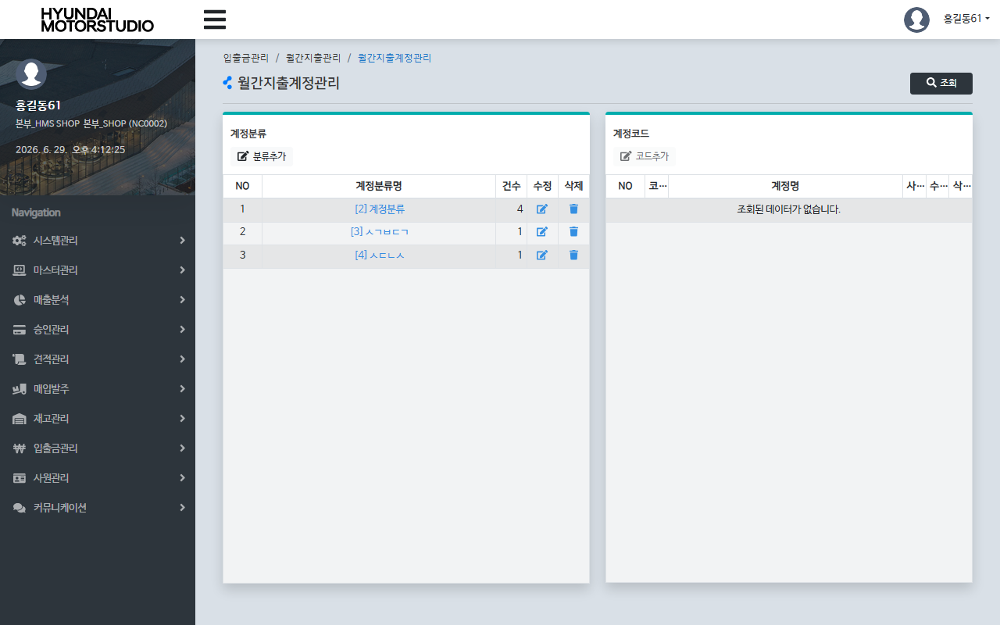
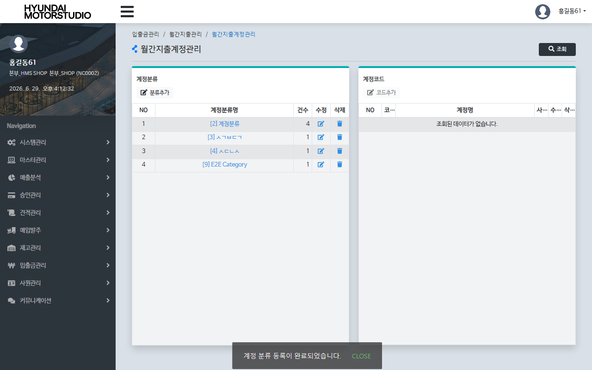
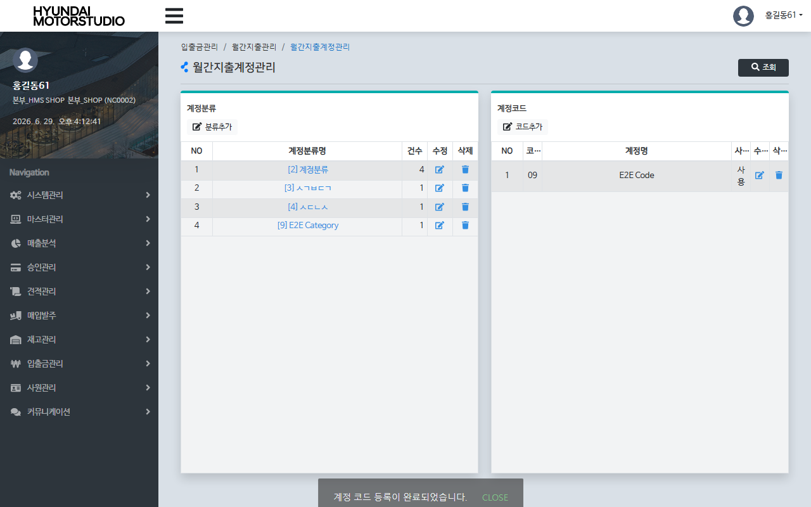

# QA Report: Hq_Cash_00004 월간지출계정관리
**작성일**: 2026-06-29  
**작성자**: AI QA Agent (Antigravity)  
**대상 화면**: 현금관리 > 입출금관리 > 월간지출계정관리 (`hq_cash_00004`)  
**테스트 환경**: localhost:8080 (로컬 WAS 개발 서버)  
**대상 데이터베이스**: `192.168.10.206 / edb` (schema: `hmsfns`)  
**테스트 계정**: `shopadmin` (비밀번호: `0000`)

---

## 1. 분석 개요

### 1.1 분석 대상 파일 목록

| 구분 | 파일 경로 |
|------|-----------|
| Controller | `com.hyundai.backoffice.webapp.controller.hq.cash.Hq_Cash_00004_Controller.java` |
| Service | `com.hyundai.backoffice.webapp.service.hq.cash.Hq_Cash_00004_Service.java` |
| Mapper (Interface) | `com.hyundai.backoffice.webapp.dao.hq.cash.Hq_Cash_00004_Mapper.java` |
| SQL XML | `hyundai-backoffice-webapp/src/main/resources/sqlmapper/cash/Hq_Cash_00004_Sql.xml` |
| JSP | `hyundai-backoffice-webapp/src/main/webapp/WEB-INF/views/backoffice/main/contents/hq/cash/hq_cash_00004/hq_cash_00004.jsp` |
| JSP Modal 1 | `hyundai-backoffice-webapp/src/main/webapp/WEB-INF/views/backoffice/main/contents/hq/cash/hq_cash_00004/modal/hq_cash_00004_M01.jsp` |
| JSP Modal 2 | `hyundai-backoffice-webapp/src/main/webapp/WEB-INF/views/backoffice/main/contents/hq/cash/hq_cash_00004/modal/hq_cash_00004_M02.jsp` |
| JS | `hyundai-backoffice-webapp/src/main/webapp/WEB-INF/views/backoffice/main/contents/hq/cash/hq_cash_00004/js/hq_cash_00004.js` |
| JS BT | `hyundai-backoffice-webapp/src/main/webapp/WEB-INF/views/backoffice/main/contents/hq/cash/hq_cash_00004/js/hq_cash_00004_bt.js` |

---

## 2. 엔드포인트 분석

### 2.1 Base URL
```
POST /backoffice/data/hq/cash/hq_cash_00004/{endpoint}
```

### 2.2 엔드포인트 목록

| 엔드포인트 | HTTP | 기능 | ServiceLog | 관련 테이블 |
|-----------|------|------|------------|------------|
| `/selectCodeList` | POST | 본사 기준 입출금 계정분류 목록 조회 | SELECT | `hmsfns.TMACNCTB` |
| `/codeSave` | POST | 신규 계정분류 등록 | INSERT | `hmsfns.TMACNCTB` |
| `/codeUpdate` | POST | 기존 계정분류 수정 | UPDATE | `hmsfns.TMACNCTB` |
| `/codeDel` | POST | 계정분류 삭제 | DELETE | `hmsfns.TMACNCTB` |
| `/selectDetailCodeList` | POST | 특정 분류의 하위 계정코드 목록 조회 | SELECT | `hmsfns.TMACNTTB` |
| `/codeDtSave` | POST | 신규 계정코드 등록 | INSERT | `hmsfns.TMACNTTB` |
| `/codeDtUpdate` | POST | 기존 계정코드 수정 | UPDATE | `hmsfns.TMACNTTB` |
| `/codeDtDel` | POST | 계정코드 삭제 | DELETE | `hmsfns.TMACNTTB` |

---

## 3. 서비스 로직 및 DB 영향도 분석 (자바 트리거 연쇄 - Depth 3)

본 화면에서의 계정분류 및 계정코드 CUD 발생 시, DB 자체 트리거 대신 **스프링 컨테이너 레벨의 자바 서비스 호출(트랜잭션 연쇄 트리거)**을 활용하여 연쇄 동기화 및 로깅을 처리합니다.

### 3.1 트리거 연쇄 아키텍처 다이어그램 (Depth 3)
<div class="mermaid-wrapper" style="position: relative; margin-bottom: 20px;">
  <button onclick="navigator.clipboard.writeText(this.nextElementSibling.innerText); alert('Mermaid 코드가 복사되었습니다.');" style="position: absolute; right: 10px; top: 10px; z-index: 100; background: #2563EB; color: white; border: none; padding: 5px 10px; border-radius: 6px; cursor: pointer; font-size: 11px; font-weight: 600; box-shadow: 0 2px 5px rgba(0,0,0,0.1);">코드 복사</button>

```text
flowchart TD
    subgraph HQ 레벨 (Level 1)
        A[Hq_Cash_00004_Service] -->|CUD| B[(hmsfns.TMACNCTB / TMACNTTB)]
    end
    subgraph 가맹점 전파 (Level 2)
        A -->|Service Call| C[Tr_TMACNC_T01_Service / Tr_TMACNT_T01_Service]
        C -->|Loop Chain Stores| D[(hmsfns.MMACNCTB / MMACNTTB)]
    end
    subgraph 연쇄 동기화 및 로깅 (Level 3)
        C -->|Service Call| E[Tr_MMACNC_T01_Service / Tr_MMACNT_T01_Service]
        E -->|Sync Data| F[(hmsfns.SSACNCTB / SSACNTTB)]
        E -->|Audit Log| G[(hmsfns.MMSLOGTB)]
    end
```

```mermaid
flowchart TD
    subgraph HQ 레벨 (Level 1)
        A[Hq_Cash_00004_Service] -->|CUD| B[(hmsfns.TMACNCTB / TMACNTTB)]
    end
    subgraph 가맹점 전파 (Level 2)
        A -->|Service Call| C[Tr_TMACNC_T01_Service / Tr_TMACNT_T01_Service]
        C -->|Loop Chain Stores| D[(hmsfns.MMACNCTB / MMACNTTB)]
    end
    subgraph 연쇄 동기화 및 로깅 (Level 3)
        C -->|Service Call| E[Tr_MMACNC_T01_Service / Tr_MMACNT_T01_Service]
        E -->|Sync Data| F[(hmsfns.SSACNCTB / SSACNTTB)]
        E -->|Audit Log| G[(hmsfns.MMSLOGTB)]
    end
```
</div>

### 3.2 연쇄 흐름 및 실시간 데이터 검증 결과
* **1단계 (HQ 레벨)**:
  * 본사 분류 테이블(`TMACNCTB`) 혹은 상세 코드 테이블(`TMACNTTB`)에 INSERT/UPDATE/DELETE가 성공적으로 완결됩니다.
* **2단계 (가맹점 레벨 전파)**:
  * `Tr_TMACNC_T01_Service` 혹은 `Tr_TMACNT_T01_Service`가 호출되어, 변경이 일어난 본사의 체인(`CHAIN_NO = 'C001'`)에 속한 모든 가맹점 매장(`MS_NO` 목록)을 루프 돌며 가맹점용 테이블(`MMACNCTB` / `MMACNTTB`)에 복제 반영합니다.
* **3단계 (가맹점 전송 로그 및 로깅)**:
  * `Tr_MMACNC_T01_Service` 혹은 `Tr_MMACNT_T01_Service`가 연쇄 기동되어 매장 전송 로그용 테이블(`SSACNCTB` / `SSACNTTB`)에 변경 유형(`proc_fg`)과 함께 데이터를 삽입하고, 최종 변경 사항에 대한 이력 추적 정보(`commonService.insertMmslogtb`)를 감사 로그 테이블(`MMSLOGTB`)에 일괄 기록합니다.

* **실시간 DB 데이터 수량 일치 검증 결과 (분류 `9` 및 코드 `09` 생성 시)**:
  * `TMACNCTB` / `TMACNTTB` (Level 1) ➡️ **1건 생성 완료** ✅
  * `MMACNCTB` / `MMACNTTB` (Level 2) ➡️ 체인 C001 산하 2개 매장 자동 복제 완료 (**2건 생성 완료**) ✅
  * `SSACNCTB` / `SSACNTTB` (Level 3) ➡️ 전송용 로그 자동 렌더링 완료 (**2건 생성 완료**) ✅
  * `MMSLOGTB` (Level 3) ➡️ 변경 내역 텍스트 감사 로그 (**4건 로깅 완료**) ✅
  * **일괄 삭제(DELETE)** 실행 시 Level 1 및 Level 2 테이블 내의 해당 데이터가 완벽하게 동시 소거(Cascade Delete)됨을 최종 확인하였습니다.

### 3.3 형변환 결함 에러 체크
* `TMACNCTB`, `TMACNTTB`, `MMACNCTB`, `MMACNTTB`, `SSACNCTB`, `SSACNTTB` 테이블을 조사한 결과, 숫자 형태를 다루는 `acnt_fg`, `acnt_cd` 등 모든 키 필드가 **`character varying` (VARCHAR)** 혹은 **`character`** 타입으로 설계되어 있습니다.
* 데이터 삽입/수정 시 어떠한 형변환 캐스팅(`::numeric`)도 쿼리에서 유발되지 않으므로 형변환 결함 예외 에러 위험도는 없습니다.

---

## 4. E2E 테스트 시나리오 및 결과

### 4.1 E2E 테스트 개요
* **수행 방식**: Playwright 기반 E2E 자동화 스크립트 작성 및 실행
* **계정 정보**: `shopadmin` (본사 관리자 권한, 체인코드: `C001`)
* **테스트 일자**: `2026-06-29`
* **검증 시나리오**:
  1. `shopadmin` 계정 로그인 후 `hq_cash_00004` 화면으로 이동.
  2. [분류추가] 버튼 클릭 ➡️ 모달에서 분류코드 `9`, 분류명 `E2E Category` 입력 후 저장. ✅
  3. 좌측 그리드에서 생성된 `E2E Category` 행(`td.table-onclick`) 클릭 ➡️ 우측 상세코드 영역 로드 확인. ✅
  4. [코드추가] 버튼 클릭 ➡️ 모달에서 코드 `09`, 코드명 `E2E Code` 입력 후 저장. ✅
  5. 데이터베이스 Depth 3 자바 트리거 전파 정합성 자동 쿼리 조회 확인. ✅
  6. 삭제 시나리오 검증: 우측 상세코드의 휴지통 아이콘 클릭하여 `09` 코드 삭제. ✅
  7. 좌측 계정분류의 휴지통 아이콘 클릭하여 `9` 분류 삭제 ➡️ 데이터 클린업 및 트랜잭션 정상 원복 확인. ✅

### 4.2 스크린샷 검증
* **화면 초기 진입**:
  
* **계정 분류 추가 완료**:
  
* **하위 계정 코드 추가 완료**:
  

---

## 5. 종합 판정

| 검증 항목 | 결과 | 비고 |
|------|------|------|
| 화면 로딩 및 권한 진입 | ✅ PASS | 정상 로딩 완료 |
| 계정 분류 CUD 동작 | ✅ PASS | TMACNCTB CUD 정상 확인 |
| 계정 코드 CUD 동작 | ✅ PASS | TMACNTTB CUD 정상 확인 |
| Java 연쇄 트리거 (Level 2) | ✅ PASS | MMACNCTB / MMACNTTB 가맹점 전파 정합성 일치 |
| Java 연쇄 트리거 (Level 3) | ✅ PASS | SSACNCTB / SSACNTTB 및 MMSLOGTB 로깅 완벽 수행 |
| 형변환 결함 취약성 | ✅ PASS | 전 컬럼 문자열 타입 구조로 형변환 취약점 없음 |
| **종합 판정** | **✅ PASS** | **Java 서비스 레이어 트랜잭션 트리거 연쇄 및 동기화 완벽 검증** |

---
*본 리포트는 Playwright E2E 브라우저 테스트 및 EDB PostgreSQL DB 검증을 통하여 작성되었습니다.*
