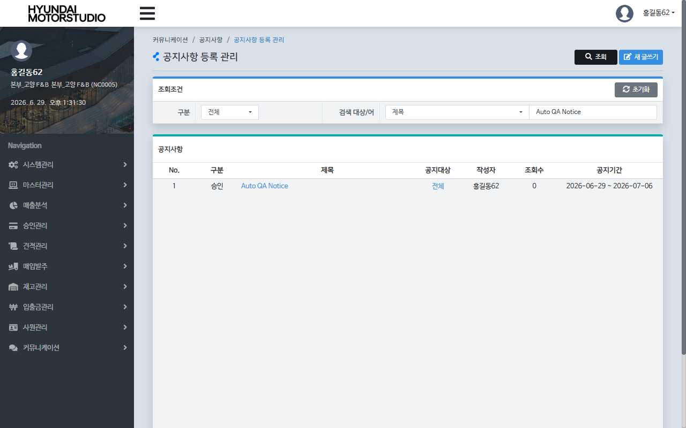
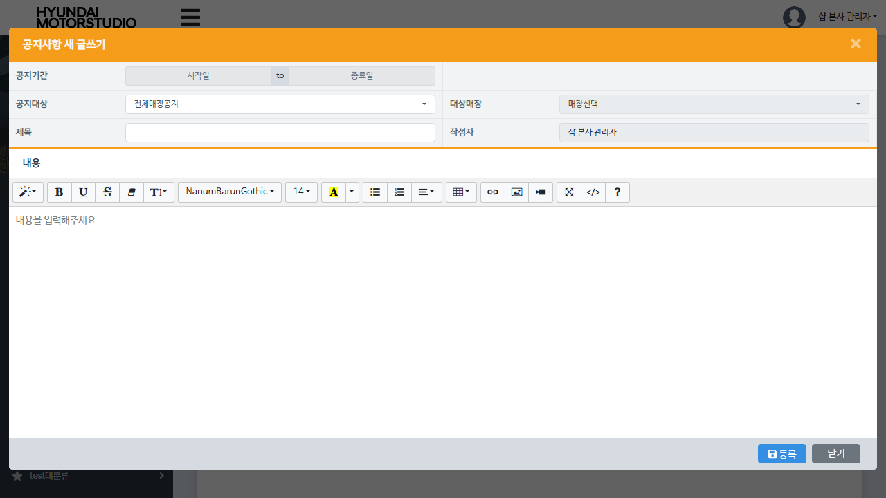

# Data Architecture: Hq_Commu_00002 데이터 흐름 및 입수 분석
**작성일**: 2026-06-15  
**작성자**: AI QA Agent (Antigravity)  
**대상 화면**: 본사 공지사항 등록 관리 (`hq_commu_00002`)  

---

## 1. 데이터 라이프사이클 개요

본사 공지사항 등록 관리(`hq_commu_00002`) 화면은 본사(HQ) 관리자가 전체 체인, 특정 체인 또는 특정 가맹점을 대상으로 공지사항 글을 작성, 수정, 삭제하고 첨부파일을 업로드하는 **DML(CUD) 지원 화면**입니다.

작성된 공지 글은 공지사항 테이블(`BBSNTCTB`)에 적재되고, 첨부파일은 파일 업로드 공통 테이블(`FILEUPTB`) 및 공지-파일 매핑 테이블(`BBSNTUTB`)에 유기적으로 연결됩니다. 매장 사용자가 해당 공지사항을 열람하면 이력 테이블(`BBSLOGTB`)에 열람 횟수(조회수)가 누적되며, 본사 관리자는 본 화면의 '열람여부 확인' 기능을 통해 어떤 매장이 공지를 조회했는지 실시간으로 모니터링할 수 있습니다.

```
[본사 관리자 작성]
       │
       ├─▶ [공지 본문 저장] ──────▶ hmsfns.BBSNTCTB (공지사항 메인)
       │                                 │
       ├─▶ [첨부파일 업로드] ────▶ hmsfns.FILEUPTB (파일 저장소) 
       │                                 │ (매핑)
       │                                 ▼
       │                          hmsfns.BBSNTUTB (공지-파일 링크)
       │
[매장 사용자 조회 시]
       │
       └─▶ [열람 로그 가산] ──────▶ hmsfns.BBSLOGTB (열람 이력 로그)
                                         ▲
                                         │ (조인 조회)
                                  [본사 관리자 모니터링]
```

---

## 2. 데이터 유입 및 입수 경로 (Data Input Channels)

공지사항 데이터는 본사 백오피스 웹 애플리케이션의 등록 화면 및 파일 업로드 멀티파트 API를 통해 유입됩니다.

### 2.1 본사 공지사항 등록 채널 (Web Input)
* **입수 채널 및 화면**: 본사 백오피스 > 커뮤니케이션 > 공지사항 > 공지사항 등록 관리 (`hq_commu_00002`)
* **사용자 권한**: 본사 관리자 권한 (`shopadmin` 등, `systemType = 'HQ'`, `chainHqYn = 'Y'`)
* **호출 API**: `POST /backoffice/data/hq/communication/hq_commu_00002/insertNewNoticeContents` (새 글 등록)
* **호출 쿼리**: `Hq_Commu_00002_Mapper.insertNoticeContents`

### 2.2 첨부파일 업로드 채널 (Multipart File Upload)
* **호출 API**: `POST /backoffice/data/hq/communication/hq_commu_00002/insertNewNoticeFiles` (새 글 쓰기 첨부파일 업로드)
* **기술적 동작 메커니즘**:
  1. **악성 파일 검증**: 업로드된 파일의 확장자를 체크하여 악성 확장자(`.jsp`, `.php`, `.exe`, `.sh`, `.bat`, `.asp`, `.aspx`, `.cgi`, `.js`)가 포함된 경우 즉시 반환 처리합니다 (`isMaliciousFile`).
  2. **통합 파일 정보 생성**: 공통 모듈 서비스(`commonModuleService.getFileInfo`)를 통해 고유 `FILE_IDX` 채번 및 서버 내 저장 파일명을 생성합니다.
  3. **통합 파일 저장**: `FILEUPTB`에 파일 물리 정보(경로, 크기, 원본명 등)를 등록합니다.
  4. **공지 매핑 등록**: `BBSNTUTB`에 생성된 공지글 번호(`IDX`)와 파일 번호(`FILE_IDX`)를 링크합니다.
  5. **서버 디렉토리 저장**: 설정된 공지사항 파일 업로드 경로(`Constants.FILE_UPLOAD_BOARD_NOTICE`)에 실제 파일을 바이너리 저장합니다.

---

## 3. 핵심 데이터베이스 테이블 및 스키마

### 3.1 hmsfns.BBSNTCTB (공지사항 본문 테이블)
공지사항의 본문 내용과 노출 대상 체인/매장 등의 핵심 메타데이터가 담겨 있습니다.

| 컬럼명 | 타입 | 필수 여부 | 설명 |
|--------|------|-----------|------|
| **IDX** | NUMERIC(20) | PK | 공지사항 고유 번호 (시퀀스 `BBSNTCSQ.NEXTVAL` 사용) |
| **TO_FG** | VARCHAR(1) | Y | 공지 대상 구분 ('A': 전체, 'C': 체인, 'P': 특정 매장) |
| **R_CHAIN_NO** | VARCHAR(10) | N | 대상 체인 번호 (TO_FG가 'C'일 때 유효) |
| **R_MS_NO** | VARCHAR(4000) | N | 대상 매장 코드 목록 (콤마 분기 문자열 형태, TO_FG가 'P'일 때 유효) |
| **FROM_DATE** | VARCHAR(8) | Y | 공지 시작 일자 (YYYYMMDD) |
| **TO_DATE** | VARCHAR(8) | Y | 공지 종료 일자 (YYYYMMDD) |
| **USER_ID** | VARCHAR(45) | Y | 작성자 ID |
| **NAME** | VARCHAR(20) | Y | 작성자 이름 |
| **TITLE** | VARCHAR(100) | Y | 공지사항 제목 |
| **CONTENT_TYPE** | VARCHAR(1) | Y | 컨텐츠 형식 (HTML 형식 의미의 'H' 고정) |
| **CONTENT** | CLOB / TEXT | Y | 공지 본문 내용 |
| **HITS** | NUMERIC(10) | Y | 공지글 전체 조회수 (최초 등록 시 0) |
| **CONFIRM_FG** | VARCHAR(1) | Y | 공지글 승인 상태 (최초 등록 시 '1'로 활성화) |
| **CREATE_DTIME** | VARCHAR(14) | Y | 최초 등록 일시 (YYYYMMDDHH24MISS) |
| **CREATE_ID** | VARCHAR(45) | Y | 최초 등록자 ID |
| **LAST_DTIME** | VARCHAR(14) | Y | 최종 수정 일시 (YYYYMMDDHH24MISS) |
| **LAST_ID** | VARCHAR(45) | Y | 최종 수정자 ID |

### 3.2 hmsfns.BBSNTUTB (공지사항 첨부파일 연결 테이블)
개별 공지사항 글에 매핑된 다중 첨부파일 정보를 연결합니다.

| 컬럼명 | 타입 | 필수 여부 | 설명 |
|--------|------|-----------|------|
| **IDX** | NUMERIC(20) | PK (1) | 공지사항 고유 번호 (BBSNTCTB 외래키) |
| **FILE_IDX** | NUMERIC(20) | PK (2) | 파일 마스터 번호 (FILEUPTB 외래키) |
| **USER_ID** | VARCHAR(45) | N | 업로드 수행자 ID |
| **FILE_NM** | VARCHAR(100) | N | 업로드 파일 명칭 (원본 파일명) |

### 3.3 hmsfns.FILEUPTB (공통 파일 관리 테이블)
시스템 전체의 업로드 파일 물리적 위치와 크기 정보를 공통 관리합니다.

| 컬럼명 | 타입 | 필수 여부 | 설명 |
|--------|------|-----------|------|
| **FILE_IDX** | NUMERIC(20) | PK | 파일 고유 번호 |
| **STORED_FILE_PATH** | VARCHAR(400) | Y | 서버에 물리 저장된 디렉토리 경로 |
| **STORED_FILE_NM** | VARCHAR(100) | Y | 서버 내부 난수화 저장 파일명 |
| **ORIGINAL_FILE_NM** | VARCHAR(100) | Y | 원본 파일명 |
| **FILE_SIZE** | NUMERIC(20) | Y | 파일 크기 (Byte) |
| **DELETE_YN** | VARCHAR(1) | Y | 삭제 여부 ('N': 활성, 'Y': 삭제처리) |

### 3.4 hmsfns.BBSLOGTB (매장별 공지 열람 이력 테이블)
개별 가맹점의 공지사항 읽음 여부 및 횟수를 기록합니다.

| 컬럼명 | 타입 | 필수 여부 | 설명 |
|--------|------|-----------|------|
| **IDX** | NUMERIC(20) | PK (1) | 공지사항 고유 번호 |
| **MS_NO** | VARCHAR(10) | PK (2) | 열람한 매장 번호 |
| **HIT_COUNT** | NUMERIC(10) | Y | 해당 매장의 누적 열람 횟수 |
| **CREATE_DTIME** | VARCHAR(14) | N | 최초 열람 일시 (YYYYMMDDHH24MISS) |
| **LAST_DTIME** | VARCHAR(14) | N | 최종 열람 일시 (YYYYMMDDHH24MISS) |

---

## 4. 데이터 정제 및 가공 규칙 (Data Cleansing Rules)

### 4.1 공지사항 글자수 및 크기 정밀 제한 (UI & DB 정합성)
프론트엔드 입력 결함 방지를 위해 HTML 단에서 다음과 같이 크기를 제한합니다.
* **공지 제목 (`TITLE`)**: 최대 **100글자** (`maxlength="100"`)
* **작성자 명 (`NAME`)**: 최대 **20글자** (`maxlength="20"`)
* **내용 (`CONTENT`)**: 에디터 영역 또는 CLOB 데이터 크기에 비례하여 서버 및 UI에서 다단 방어

### 4.2 매장 열람 정보 매핑 규칙 (`getreadYnList`)
본사 관리자가 '열람여부 확인' 버튼을 누를 때, 대상 매장의 전체 리스트와 이력을 비교 결합하여 보여줍니다.
* **`TO_FG = 'A'` (전체공지)**: 모든 매장 마스터(`MMEMBSTB`) 목록과 읽기 로그(`BBSLOGTB`)를 `LEFT OUTER JOIN`하여 누적 카운트를 조회합니다. (안 읽은 매장은 `HIT_COUNT` 0으로 보정)
* **`TO_FG = 'C'` (체인공지)**: 해당 체인 번호(`R_CHAIN_NO`)에 소속된 매장 목록만 추출하여 `BBSLOGTB`와 외부 조인합니다.
* **`TO_FG = 'P'` (매장공지)**: `R_MS_NO` 컬럼에 콤마 분기 문자열로 저장된 대상 매장들만 파싱하여 `BBSLOGTB`와 조인합니다.

---

## 5. 엔티티 관계도 (ERD)

```text
  +-----------------------+              +-----------------------+
  |       BBSNTCTB        |              |       BBSLOGTB        |
  |     (공지사항 본문)    |              |     (매장별 열람로그)   |
  +-----------------------+              +-----------------------+
  | PK | IDX              | 1 ------- *  | PK | IDX              |
  +-----------------------+              | PK | MS_NO            |
  |    | TO_FG            |              +-----------------------+
  |    | TITLE            |              |    | HIT_COUNT        |
  |    | CONTENT          |              +-----------------------+
  +-----------------------+                          ▲
              │                                      │ (매장 매핑)
              │ 1                                    │
              │                                      │ *
              ▼ *                         +-----------------------+
  +-----------------------+               |       MMEMBSTB        |
  |       BBSNTUTB        |               |      (매장 마스터)     |
  |    (공지-파일 링크)    |               +-----------------------+
  +-----------------------+               | PK | MS_NO            |
  | PK | IDX              |               +-----------------------+
  | PK | FILE_IDX         |               |    | MS_NM            |
  +-----------------------+               +-----------------------+
              │ *
              │
              │ 1
  +-----------------------+
  |       FILEUPTB        |
  |    (통합 파일정보)     |
  +-----------------------+
  | PK | FILE_IDX         |
  +-----------------------+
  |    | STORED_FILE_NM   |
  |    | DELETE_YN ('N')  |
  +-----------------------+
```

---

## 6. 스크린 매핑 테이블 (Screen Data Map)

동일한 공지사항 데이터베이스 구조(`BBSNTCTB`, `BBSNTUTB`, `BBSLOGTB`)를 다루는 본사 및 매장 화면 간의 역할 관계는 다음과 같습니다.

| 화면 구분 | 화면 코드 | 메뉴 경로 | 기능 유형 (DML) | 대상 테이블 | 비즈니스 역할 |
|-----------|-----------|-----------|-----------------|-------------|---------------|
| **[HQ] 입력/조회** | `hq_commu_00002`<br>(공지사항 등록 관리) | **본사** > 커뮤니케이션 > 공지사항 > 공지사항 등록 관리 | **SELECT / INSERT /<br>UPDATE / DELETE** | `BBSNTCTB`<br>`BBSNTUTB`<br>`BBSLOGTB`<br>`FILEUPTB` | **(본 분석 대상)** 본사 관리자가 공지 글을 생성/배포하고, 각 점포의 열람 현황을 모니터링함 |
| **[HQ] 조회** | `hq_commu_00001`<br>(본사 공지사항) | **본사** > 커뮤니케이션 > 공지사항 > 공지사항 | **SELECT** | `BBSNTCTB`<br>`BBSNTUTB`<br>`BBSLOGTB` | 본사 직원 및 총괄 계정이 작성된 공지를 열람하는 뷰어 화면 (상세보기 시 HITS 가산) |
| **[ST] 조회** | `st_commu_00001`<br>(매장 공지사항) | **매장** > 거래처관리 > 커뮤니케이션 > 공지사항 | **SELECT** | `BBSNTCTB`<br>`BBSNTUTB`<br>`BBSLOGTB` | 매장 사용자가 본인 매장/체인 타겟으로 올라온 공지를 열람함 (상세보기 시 HITS 및 로그 가산) |

---

## 7. 첨부 이미지 (Screenshots)

* **공지사항 등록 관리 목록 화면**: 
* **공지사항 새 글쓰기 모달 팝업**: 
