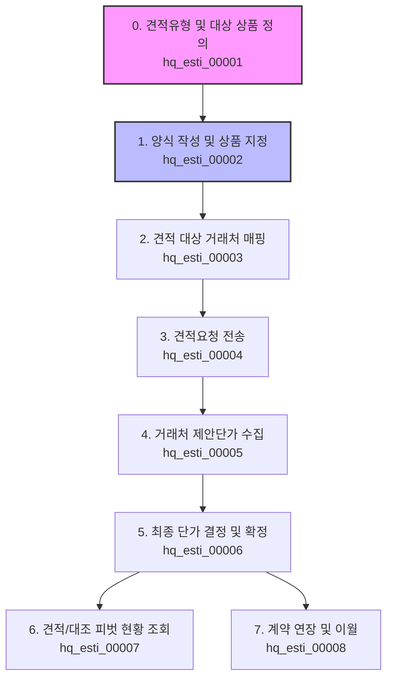
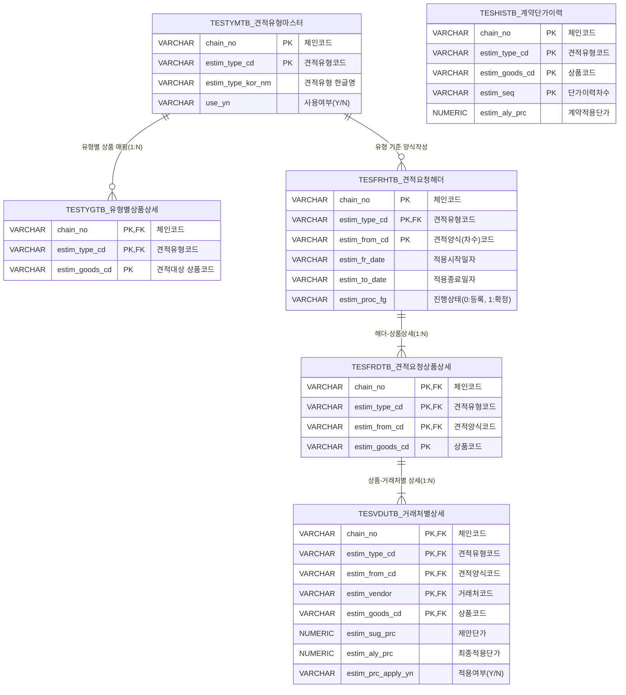

# 본사 견적관리(Hq_Esti) 시스템 데이터 흐름 및 테스트 가이드
**최종 수정일**: 2026-06-26  
**작성자**: AI QA Agent (Antigravity)  

본 가이드는 본사 견적관리 시스템(`Hq_Esti_00001` ~ `Hq_Esti_00008`) 전체의 비즈니스 프로세스, 테이블 연동 규격, 그리고 정합성 검증을 위한 테스트 수행 순서를 정리한 문서입니다.

---

## 0. 선행 필수 데이터 구성

견적서 양식 작성(`hq_esti_00002`) 및 후행 견적 프로세스를 진행하기 위해서는 아래 두 단계의 **선행 필수 데이터(기준정보 및 견적 마스터)**가 데이터베이스에 존재해야 합니다.

### 0.1 [단계 1] 상품 분류 및 상품 마스터 등록 (기준정보 모듈)
* **목적**: 시스템 전반에서 사용할 상품 카테고리와 상품 원천 데이터를 생성합니다.
* **1) 상품 분류 등록 (`hq_master_00005` - 상품 분류 관리)**:
  * 본사가 취급할 상품 카테고리를 대분류 ➡️ 중분류 ➡️ 소분류 순서로 트리 구조로 등록합니다.
  * **DB 적재 테이블**: 
    - 대분류: `hmsfns.TMLCLSTB`
    - 중분류: `hmsfns.TMMCLSTB`
    - 소분류: `hmsfns.TMSCLSTB`
* **2) 상품 마스터 등록 (`hq_master_00006` - 상품 등록/조회)**:
  * 신규 상품 코드(`GOODS_CD`), 상품명, 규격, 카테고리 지정 및 기초 단가(원가, 판매가 등)를 입력하여 저장합니다.
  * **DB 적재 테이블 및 동작**:
    1. **상품 마스터 (`hmsfns.TGOODSTB`)**: 지정한 소속 카테고리(`LCLASS_CD`, `MCLASS_CD`, `SCLASS_CD`) 및 기초 상품 규격 정보가 바인딩되어 적재됩니다.
    2. **단가 마스터 (`hmsfns.TPRICETB`)**: 상품 저장 시, 해당 상품에 대해 3가지 종류의 기준 단가 레코드가 동시 생성되어 적재됩니다.
       * `PRICE_FG = '0'` (판매가): 입력한 판매단가(`uprice`) 적용
       * `PRICE_FG = '1'` (공급가): 입력한 공급단가(`usuprice`) 적용
       * `PRICE_FG = '2'` (예정원가): 입력한 예정원가(`ucost`) 적용

### 0.2 [단계 2] 견적유형 마스터 정의 및 대상 상품군 매핑 (견적 모듈 선행 단계)
* **목적**: 견적 업무의 기본 단위가 되는 견적유형을 정의하고, 해당 유형에서 취급할 상품 매핑 데이터(`TESTYGTB`)를 생성합니다. (이 매핑이 누락되면 `hq_esti_00002` 화면에서 견적서 양식에 담을 상품을 검색할 때 아무 품목도 조회되지 않습니다.)
* **화면명**: 견적유형 마스터 (`hq_esti_00001`)
* **호출 경로**: `/backoffice/main/contents/hq/estimate/hq_esti_00001`
* **등록 로직 및 DB 적재 테이블**:
  1. **견적유형 정의 (`hmsfns.TESTYMTB`)**: 신규 견적유형 코드를 추가하여 기본 유형 정보를 저장합니다.
  2. **견적 대상 상품군 매핑 (`hmsfns.TESTYGTB`)**: 생성된 견적유형을 선택한 뒤, 우측 상품 목록에서 견적을 수행할 대상 상품들을 체크하여 **[추가]**합니다.

---

## 1. 견적 업무 라이프사이클 개요

본사의 견적 업무는 사전 등록된 상품 마스터를 기반으로 견적의 분류와 대상 상품군을 정의하는 **견적유형 마스터**부터 시작하여, 양식 작성, 거래처 매핑, 제안단가 수집, 최종 단가 결정 및 이력 조회에 이르기까지 총 7단계의 유기적인 라이프사이클을 가집니다.

<div class="mermaid-wrapper" style="position: relative; margin-bottom: 20px;">
  <button onclick="navigator.clipboard.writeText(this.nextElementSibling.innerText); alert('Mermaid 코드가 복사되었습니다.');" style="position: absolute; right: 10px; top: 10px; z-index: 100; background: #2563EB; color: white; border: none; padding: 5px 10px; border-radius: 6px; cursor: pointer; font-size: 11px; font-weight: 600; box-shadow: 0 2px 5px rgba(0,0,0,0.1);">코드 복사</button>

```text
flowchart TD
    Step0[0. 견적유형 및 대상 상품 정의<br/>hq_esti_00001] --> Step1[1. 양식 작성 및 상품 지정<br/>hq_esti_00002]
    Step1 --> Step2[2. 견적 대상 거래처 매핑<br/>hq_esti_00003]
    Step2 --> Step3[3. 견적요청 전송<br/>hq_esti_00004]
    Step3 --> Step4[4. 거래처 제안단가 수집<br/>hq_esti_00005]
    Step4 --> Step5[5. 최종 단가 결정 및 확정<br/>hq_esti_00006]
    Step5 --> Step6[6. 견적/대조 피벗 현황 조회<br/>hq_esti_00007]
    Step5 --> Step7[7. 계약 연장 및 이월<br/>hq_esti_00008]
    
    style Step0 fill:#f9f,stroke:#333,stroke-width:2px
    style Step1 fill:#bbf,stroke:#333,stroke-width:2px
```


</div>

---

## 2. 관련 주요 테이블 정의 및 조인 관계

견적 모듈에서 사용하는 주요 물리 테이블 목록과 필드 구성은 다음과 같습니다.

### 2.1 테이블 정의
1. **`hmsfns.TESTYMTB` (견적유형 마스터)**
   * 견적의 대분류 유형을 관리합니다. (예: `001`: 일반식자재 견적, `003`: 신선식품 견적 등)
2. **`hmsfns.TESTYGTB` (견적유형별 상품 상세)**
   * 각 견적유형 마스터에 매핑된 상품군 목록입니다. (양식 작성 시 풀이 되는 원천 데이터)
3. **`hmsfns.TESFRHTB` (견적요청 헤더)**
   * 견적서 양식의 식별키 및 적용 기간, 진행 상태를 관리합니다.
   * `ESTIM_PROC_FG` (진행상태): `0` (등록/요청), `1` (최종확정)
4. **`hmsfns.TESFRDTB` (견적요청 상품 상세)**
   * 작성된 견적 양식에 포함된 견적 대상 상품 목록입니다.
5. **`hmsfns.TESVDUTB` (견적요청 거래처별 상세)**
   * **[견적 상품 × 요청 거래처]** 조합의 실질적인 견적서 본문 테이블입니다.
   * `ESTIM_SUG_PRC` (거래처 제안단가), `ESTIM_ALY_PRC` (최종 결정단가)
   * `ESTIM_PRC_APPLY_YN` (최종 채택여부): `Y` (채택), `N` (미채택)
6. **`hmsfns.TESHISTB` (견적 계약 단가 이력)**
   * 최종 확정된 단가들이 차수(`ESTIM_SEQ`)별로 누적 적재되는 단가 이력 로그 테이블입니다.

### 2.2 관계 스키마 (ERD)

<div class="mermaid-wrapper" style="position: relative; margin-bottom: 20px;">
  <button onclick="navigator.clipboard.writeText(this.nextElementSibling.innerText); alert('Mermaid 코드가 복사되었습니다.');" style="position: absolute; right: 10px; top: 10px; z-index: 100; background: #2563EB; color: white; border: none; padding: 5px 10px; border-radius: 6px; cursor: pointer; font-size: 11px; font-weight: 600; box-shadow: 0 2px 5px rgba(0,0,0,0.1);">코드 복사</button>

```text
erDiagram
    TESTYMTB_견적유형마스터 {
        VARCHAR chain_no PK "체인코드"
        VARCHAR estim_type_cd PK "견적유형코드"
        VARCHAR estim_type_kor_nm "견적유형 한글명"
        VARCHAR use_yn "사용여부(Y/N)"
    }
    TESTYGTB_유형별상품상세 {
        VARCHAR chain_no PK, FK "체인코드"
        VARCHAR estim_type_cd PK, FK "견적유형코드"
        VARCHAR estim_goods_cd PK "견적대상 상품코드"
    }
    TESFRHTB_견적요청헤더 {
        VARCHAR chain_no PK "체인코드"
        VARCHAR estim_type_cd PK, FK "견적유형코드"
        VARCHAR estim_from_cd PK "견적양식(차수)코드"
        VARCHAR estim_fr_date "적용시작일자"
        VARCHAR estim_to_date "적용종료일자"
        VARCHAR estim_proc_fg "진행상태(0:등록, 1:확정)"
    }
    TESFRDTB_견적요청상품상세 {
        VARCHAR chain_no PK, FK "체인코드"
        VARCHAR estim_type_cd PK, FK "견적유형코드"
        VARCHAR estim_from_cd PK, FK "견적양식코드"
        VARCHAR estim_goods_cd PK "상품코드"
    }
    TESVDUTB_거래처별상세 {
        VARCHAR chain_no PK, FK "체인코드"
        VARCHAR estim_type_cd PK, FK "견적유형코드"
        VARCHAR estim_from_cd PK, FK "견적양식코드"
        VARCHAR estim_vendor PK, FK "거래처코드"
        VARCHAR estim_goods_cd PK, FK "상품코드"
        NUMERIC estim_sug_prc "제안단가"
        NUMERIC estim_aly_prc "최종적용단가"
        VARCHAR estim_prc_apply_yn "적용여부(Y/N)"
    }
    TESHISTB_계약단가이력 {
        VARCHAR chain_no PK "체인코드"
        VARCHAR estim_type_cd PK "견적유형코드"
        VARCHAR estim_goods_cd PK "상품코드"
        VARCHAR estim_seq PK "단가이력차수"
        NUMERIC estim_aly_prc "계약적용단가"
    }

    TESTYMTB_견적유형마스터 ||--o{ TESTYGTB_유형별상품상세 : "유형별 상품 매핑(1:N)"
    TESTYMTB_견적유형마스터 ||--o{ TESFRHTB_견적요청헤더 : "유형 기준 양식작성"
    TESFRHTB_견적요청헤더 ||--|{ TESFRDTB_견적요청상품상세 : "헤더-상품상세(1:N)"
    TESFRDTB_견적요청상품상세 ||--|{ TESVDUTB_거래처별상세 : "상품-거래처별 상세(1:N)"
```


</div>

---

## 3. 화면별 상세 데이터 흐름 및 테이블 변화

### ⓪ 견적유형 마스터 정의 (`hq_esti_00001`)
* **목적**: 견적 업무의 가장 기초가 되는 **견적유형 코드**와 해당 유형에서 취급할 **대상 상품군**을 사전 등록합니다.
* **DB 변화**:
  ```sql
  -- 1. 견적유형 등록 (예: E001 신규 유형 생성)
  INSERT INTO hmsfns.TESTYMTB (CHAIN_NO, ESTIM_TYPE_CD, ESTIM_TYPE_KOR_NM, USE_YN, INS_DTIME, INS_ID, ...)
  VALUES ('C002', '001', '일반식자재 견적', 'Y', '20260626150000', 'fnbadmin', ...);

  -- 2. 견적유형별 대상 상품군 다중 매핑 등록
  INSERT INTO hmsfns.TESTYGTB (CHAIN_NO, ESTIM_TYPE_CD, ESTIM_GOODS_CD, INS_DTIME, INS_ID, ...)
  VALUES ('C002', '001', 'T0000558', '20260626150000', 'fnbadmin', ...);
  ```

### ① 견적서 양식 작성 (`hq_esti_00002`)
* **목적**: 기 등록된 견적유형을 기반으로 견적 진행을 위한 기본 기간 및 실제 견적을 받을 품목들을 지정하여 양식을 작성합니다.
* **DB 변화**:
  ```sql
  -- 1. 견적서 헤더 신규 생성
  INSERT INTO hmsfns.TESFRHTB (CHAIN_NO, ESTIM_TYPE_CD, ESTIM_FROM_CD, ESTIM_FROM_NM, ESTIM_FR_DATE, ESTIM_TO_DATE, ESTIM_PROC_FG, ...)
  VALUES ('C002', '001', '0003', 'Auto_QA_Template_01', '20260701', '20261231', '0', ...);
  
  -- 2. 견적 대상 상품 목록 등록 (hq_esti_00001의 TESTYGTB 상품 풀에서 선택하여 바인딩)
  INSERT INTO hmsfns.TESFRDTB (CHAIN_NO, ESTIM_TYPE_CD, ESTIM_FROM_CD, ESTIM_GOODS_CD, ESTIM_GOODS_QTY, ...)
  VALUES ('C002', '001', '0003', 'T0000558', 0, ...);
  ```

### ② 견적요청서 일괄등록 (`hq_esti_00003`)
* **목적**: 견적 양식에 지정된 품목별로 제안을 받을 거래처 목록을 매핑해 줍니다.
* **DB 변화**:
  * 선택된 거래처(`TVNDRMTB`)들과 양식 상품(`TESFRDTB`)들을 조합하여 거래처별 공란 단가 테이블을 벌크 인서트합니다.
  ```sql
  INSERT INTO hmsfns.TESVDUTB (CHAIN_NO, ESTIM_TYPE_CD, ESTIM_FROM_CD, ESTIM_VENDOR, ESTIM_GOODS_CD, ESTIM_SUG_PRC, ESTIM_ALY_PRC, ESTIM_PRC_APPLY_YN)
  SELECT A.CHAIN_NO, A.ESTIM_TYPE_CD, A.ESTIM_FROM_CD, V.VENDOR, A.ESTIM_GOODS_CD, 0, 0, 'N'
  FROM hmsfns.TESFRDTB A
  CROSS JOIN hmsfns.TVNDRMTB V
  WHERE A.CHAIN_NO = 'C002' AND A.ESTIM_TYPE_CD = '001' AND A.ESTIM_FROM_CD = '0003' AND V.VENDOR IN ('000001', '000002');
  ```

### ③ 견적서 업로드 관리 (`hq_esti_00005`)
* **목적**: 이메일이나 파일로 회신된 거래처별 제안단가를 일괄 업데이트합니다.
* **DB 변화**:
  ```sql
  -- 특정 거래처가 제안한 견적가(ESTIM_SUG_PRC)를 해당 상품 레코드에 갱신
  UPDATE hmsfns.TESVDUTB
     SET ESTIM_SUG_PRC = 200.000
   WHERE CHAIN_NO = 'C002'
     AND ESTIM_TYPE_CD = '001'
     AND ESTIM_FROM_CD = '0003'
     AND ESTIM_VENDOR = '000001'
     AND ESTIM_GOODS_CD = 'T0000558';
  ```

### ④ 견적서 단가 결정관리 (`hq_esti_00006`)
* **목적**: 제안 단가들을 대조하여 본사 관리자가 최종 계약 단가로 채택할 대상을 결정 및 확정합니다.
* **DB 변화**:
  ```sql
  -- 1. 최종 채택된 거래처의 적용 여부 플래그를 'Y'로 세팅 및 적용 단가 반영
  UPDATE hmsfns.TESVDUTB
     SET ESTIM_PRC_APPLY_YN = 'Y'
       , ESTIM_ALY_PRC = 200.000
   WHERE CHAIN_NO = 'C002' AND ESTIM_TYPE_CD = '001' AND ESTIM_FROM_CD = '0003' 
     AND ESTIM_VENDOR = '000001' AND ESTIM_GOODS_CD = 'T0000558';
     
  -- 2. 견적요청서 상태를 '1'(최종 확정)로 변경
  UPDATE hmsfns.TESFRHTB
     SET ESTIM_PROC_FG = '1'
   WHERE CHAIN_NO = 'C002' AND ESTIM_TYPE_CD = '001' AND ESTIM_FROM_CD = '0003';
  ```
* **후행 연쇄 동작**:
  * `TESFRHTB` 테이블에 `UPDATE`가 발생하여 `ESTIM_PROC_FG`가 `'1'`이 되면, 데이터베이스의 **`Tr_TESFRH_T01` 트리거(또는 자바 서비스)**가 가동되어 최종 채택된 거래처의 단가 정보들을 계약 이력 테이블인 `TESHISTB`에 이력 차수(`ESTIM_SEQ`) 번호를 매겨 기록 보존합니다.

---

## 4. 정합성 검증을 위한 화면 테스트 시나리오 순서

화면과 데이터의 정합성을 완벽하게 테스트하려면 아래 순서대로 물 흐르듯 데이터를 생성하며 검증해야 합니다.

### 0단계: 견적유형 정의 및 대상 상품 지정 (`hq_esti_00001`)
1. 본사 관리자(`fnbadmin` 등)로 로그인합니다.
2. **견적유형 마스터** 화면에서 신규 유형(`001` 등)을 추가하고 저장합니다.
3. 해당 유형을 선택한 뒤, 우측 패널에서 견적을 진행할 상품 리스트(`T0000558` 등)들을 찾아 **[추가]**합니다.
4. **DB 검증**: `TESTYMTB` (유형 마스터)와 `TESTYGTB` (유형별 상품 매핑)에 값이 정상 저장되었는지 확인합니다.

### 1단계: 견적서 양식 작성 및 상품 지정 (`hq_esti_00002`)
1. 견적 양식 작성 화면에서 0단계에서 정의한 견적유형(`001`)을 선택합니다.
2. 적용/접수 기간 및 양식명(`Auto_QA_Template_01`)을 채우고 **[저장]**하여 신규 양식 코드(`0003` 등)를 발급받습니다.
3. 양식을 선택하고 우측 패널에서 **[상품추가]**를 눌러, 해당 유형의 상품군 중 일부를 양식 대상 품목으로 등록합니다.
4. **DB 검증**: `TESFRHTB` (양식 헤더)와 `TESFRDTB` (양식별 상품 상세)에 데이터가 정상 생성되었는지 확인합니다.

### 2단계: 거래처 매핑 검증 (`hq_esti_00003`)
1. 견적요청서 일괄등록 화면에서 1단계에서 작성한 견적 양식을 불러옵니다.
2. 단가를 제안받을 거래처(`000001`, `000002` 등)들을 체크하고 **[일괄 저장]**을 클릭합니다.
3. **DB 검증**: `TESVDUTB`에 `[상품코드 × 거래처코드]` 조합으로 단가가 `0`으로 세팅된 빈 행들이 정상적으로 벌크 인서트 되었는지 확인합니다.

### 3단계: 거래처 제안단가 수집 검증 (`hq_esti_00005`)
1. 견적서 업로드 화면에서 해당 양식에 대해 거래처가 제안한 단가 엑셀을 업로드하거나, 테스트 편의상 DB에 `ESTIM_SUG_PRC` 데이터를 직접 채웁니다.
2. **DB 검증**: `TESVDUTB.ESTIM_SUG_PRC`에 각 거래처별 제안 금액이 반영되었는지 확인합니다.

### 4단계: 최종 단가 결정 및 확정 검증 (`hq_esti_00006`)
1. 견적서 단가 결정관리 화면으로 이동하여 거래처들의 제안가를 대조한 뒤, 한 업체의 단가를 선택하고 **[단가결정 및 최종확정]**을 클릭합니다.
2. **DB 검증**:
   * `TESVDUTB.ESTIM_PRC_APPLY_YN`이 `'Y'`로 바뀌었는지 확인합니다.
   * `TESFRHTB.ESTIM_PROC_FG` 상태가 `'1'`(확정)로 업데이트 되었는지 확인합니다.
   * **(트리거 연동 확인)**: `TESHISTB` 이력 테이블에 차수별 최종 계약 단가 레코드가 자동 복사 및 누적 적재되었는지 확인합니다.

### 5단계: 최종 피벗 현황 대조 모니터링 검증 (`hq_esti_00007`)
1. 본사 견적 현황 화면에 진입하여 해당 견적유형과 차수를 조건으로 **[조회]**합니다.
2. **화면 검증**:
   * 사전 매핑된 거래처들이 가로축 그리드 컬럼으로 동적 전개되는지 확인합니다.
   * 각 상품 로우별로 거래처들이 제안한 금액들이 피벗되어 한눈에 대조 표시되는지 검증합니다.
   * 최종 채택된 단가 정보 및 이전 이력단가 대비 인상/인하 갭이 정확하게 매핑 렌더링되는지 확인합니다. (성공 시 `PASS`)
