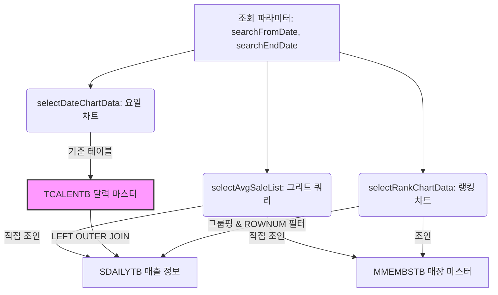

# Data Flow Guide: Hq_Sales_00004 본사 기간평균 매출현황

본 문서는 본사 기간평균 매출현황(`hq_sales_00004`) 화면의 데이터가 정상적으로 조회 및 차트(요일별 전체 순매출 및 매장별 순위)로 표출되기 위해 필요한 **사전 마스터 데이터 요구사항** 및 **데이터 흐름 조건**을 정리한 가이드입니다.

---

## 1. 사전 필수 마스터 데이터 (Pre-requisites)

본 화면의 쿼리는 매출 집계 시 기준정보 테이블 및 순위 분석 인라인뷰 조인을 수행하므로, 아래 테이블들의 마스터 데이터가 EDB PostgreSQL DB 상에 사전에 올바르게 적재(Seeding)되어 있어야 합니다.

### 1.1 달력 마스터 테이블 (`hmsfns.TCALENTB`) - [중요 ★★★]
* **역할**: 조회 기간(`searchFromDate` ~ `searchEndDate`)에 해당하는 요일별 매출액 추이를 집계할 때 사용되는 **기준(Driving) 테이블**입니다.
* **영향도**: 본 테이블에 조회 대상 기간의 날짜 데이터가 한 건도 없을 경우, 아우터 조인(`(+)`) 시 요일별 전체 순매출 차트 쿼리(`selectDateChartData`)의 조회 결과가 **0건**으로 반환되어 차트 상에 **"데이터가 없습니다"** 문구가 표출됩니다.
* **필수 시딩 대상 컬럼**:
  - `CAL_DATE`: `YYYYMMDD` 형식의 날짜 (Primary Key)
  - `DAY_CD`: 요일 코드 (1: 일요일, 2: Wol요요일, ..., 7: 토요일)
  - `DAY_NM`: 요일 약어 ('일', '월', '화' ...)
  - `DAY_NAME`: 요일명 ('일요일', '월요일' ...)

#### 💡 2026년 2분기(4월~6월) 달력 마스터 적재 SQL 예시
```sql
INSERT INTO hmsfns.TCALENTB (CAL_DATE, CAL_YEAR, CAL_YYMM, CAL_MONTH, DAY_CD, DAY_NM, DAY_NAME, DAYS, WEEKS, QUARTER)
VALUES 
('20260601', '2026', '202606', '06', '2', '월', '월요일', 1, 23, '2'),
('20260602', '2026', '202606', '06', '3', '화', '화요일', 2, 23, '2'),
('20260603', '2026', '202606', '06', '4', '수', '수요일', 3, 23, '2');
-- (조회 범위 내의 일자 전체 적재 필수)
```


### 1.2 달력 데이터 관리 방식 및 적재 생명주기 (시스템 아키텍처)
* **주기적 배치 로직 없음**: 본 프로그램 내부에는 달력 데이터를 매일/매월 주기적으로 자동 생성하여 밀어 넣는 스케줄러나 배치 프로그램이 **존재하지 않습니다.**
* **1회성 선행 적재**: 캘린더 테이블은 최초 시스템 구축(DB 셋업) 시점에 미래 수십 년 치의 달력을 한 번에 연산하여 적재해 두는 **정적 마스터(Seed) 테이블**입니다.
  - *운영 환경*: 실제 운영 데이터베이스에는 최초 셋업 시 **2000년 1월 1일부터 2050년 12월 31일까지의 50년 치 달력 데이터(18,629건)가 이미 영구 적재**되어 원활히 가동 중입니다.
  - *개발/테스트 환경*: 개발/로컬 DB 신규 이관 또는 마이그레이션 과정에서 테이블 껍데기(DDL)만 생성되고, 이 정적 마스터 데이터(DML)의 이관이 누락되어 차트 조회가 누락되었던 것입니다. (개발 서버의 경우, 운영 DB의 `TCALENTB` 테이블 데이터를 덤프하여 적재하면 근본 해결됩니다.)

### 1.3 매장 마스터 테이블 (`hmsfns.MMEMBSTB`)
* **역할**: 본사 로그인 세션의 제휴사코드(`chainNo`) 하위에 매장 정보들이 유효하게 등록되어 있어야 하며, 본사 매출 목록 및 순위 집계(`selectRankChartData`) 시 조인 대상으로 사용됩니다.

---

## 2. 영업 실데이터 요구사항 (DML Data)

### 2.1 일별 매출 집계 테이블 (`hmsfns.SDAILYTB`)
* **역할**: 본사 소속 가맹점들의 일자별 매출 원천 데이터가 적재되는 테이블입니다.
* **필수 조건**:
  - `CHAIN_NO`: 로그인 세션의 제휴사코드와 일치해야 함.
  - `MS_NO`: `MMEMBSTB`에 존재하는 매장 코드들과 연치해야 함.
  - `SALE_DATE`: 조회하는 기간 범위 내에 속해야 함.
  - `SALE_AMT`: 순매출액이 0이 아니어야 집계 및 랭킹 차트에 합산됩니다 (`SALE_AMT <> 0`).

---

## 3. 데이터 흐름 및 쿼리 매핑 관계



* **그리드 데이터 흐름**: `SDAILYTB` ➡️ `MMEMBSTB` 직접 조인 (달력 데이터가 없어도 수치는 정상 표출)
* **요일 차트 데이터 흐름**: `TCALENTB` (달력 기준) ➡️ `SDAILYTB` (매출 아우터 조인) ➡️ 요일별 그룹핑 (달력 데이터 유실 시 차트 렌더링 불가)
* **랭킹 차트 데이터 흐름**: `SDAILYTB` 매출 집계 ➡️ `MMEMBSTB` 매장명 조인 ➡️ 매출액 순 정렬 ➡️ 상위 5개 추출 (`ROWNUM <= 5`)
