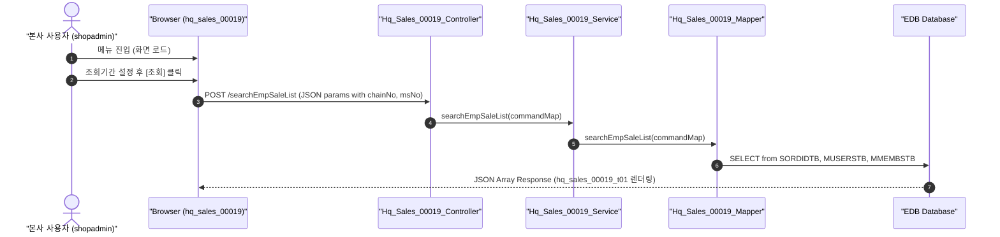

# QA Report: Hq_Sales_00019 본사 담당자별 매출조회

**작성일**: 2026-06-30  
**작성자**: AI QA Agent (Antigravity)  
**대상 화면**: 본사업무 > 매출분석 > POS > 담당자별 매출조회 (`hq_sales_00019`)  
**테스트 환경**: localhost:8080 (로컬 개발 서버)  
**접속ID/PW**: shopadmin / 0000 (본사 C001 계정)  

---

## 1. 분석 개요

### 1.1 분석 대상 파일 목록

| 구분 | 파일 경로 |
|------|-----------|
| Controller | `backoffice/hyundai-backoffice-webapp/src/main/java/com/hyundai/backoffice/webapp/controller/hq/sales/Hq_Sales_00019_Controller.java` |
| Service | `backoffice/hyundai-backoffice-layer-service/src/main/java/com/hyundai/backoffice/webapp/service/hq/sales/Hq_Sales_00019_Service.java` |
| Mapper (Interface) | `backoffice/hyundai-backoffice-layer-persistence/src/main/java/com/hyundai/backoffice/webapp/dao/hq/sales/Hq_Sales_00019_Mapper.java` |
| SQL XML | `backoffice/hyundai-backoffice-webapp/src/main/resources/sqlmapper/sales/Hq_Sales_00019_Sql.xml` |
| JSP | `backoffice/hyundai-backoffice-webapp/src/main/webapp/WEB-INF/views/backoffice/main/contents/hq/sales/hq_sales_00019/hq_sales_00019.jsp` |
| JS (Business Logic) | `backoffice/hyundai-backoffice-webapp/src/main/webapp/WEB-INF/views/backoffice/main/contents/hq/sales/hq_sales_00019/js/hq_sales_00019.js` |
| JS (Bootstrap Table) | `backoffice/hyundai-backoffice-webapp/src/main/webapp/WEB-INF/views/backoffice/main/contents/hq/sales/hq_sales_00019/js/hq_sales_00019_bt.js` |

---

## 2. 엔드포인트 분석

### 2.1 Base URL
```
POST /backoffice/data/hq/sales/hq_sales_00019/{endpoint}
```

### 2.2 엔드포인트 목록

| 엔드포인트 | HTTP | 기능 | ServiceLog |
|-----------|------|------|------------|
| `/searchEmpSaleList` | POST | 담당자별 매출 집계 목록 조회 | SELECT |

---

## 3. 서비스 로직 및 데이터 흐름 분석

본 화면은 본사 로그인 계정의 세션 제휴사코드(`chainNo`) 기준 하위 가맹점들의 거래 데이터를 기반으로 주문 담당자(POS 사용자)별 매출 정보를 조회하는 **조회 전용(SELECT)** 화면입니다.
* **CUD 로직 없음**: 본사 레벨 조회 화면이므로 추가, 수정, 삭제 등의 CUD 처리는 수행하지 않습니다.
* **DB 트리거 영향도**: 본 화면은 조회 트랜잭션만 발생하며 원천 테이블(`SORDIDTB`, `MUSERSTB`, `MMEMBSTB` 등)에 설정된 CUD 트리거 연쇄 반응(Depth 3)은 작동하지 않습니다.

### 3.1 조회 데이터 흐름 다이어그램

<div class="mermaid-wrapper" style="position: relative; margin-bottom: 20px;">
  <button onclick="navigator.clipboard.writeText(this.nextElementSibling.innerText); alert('Mermaid 코드가 복사되었습니다.');" style="position: absolute; right: 10px; top: 10px; z-index: 100; background: #2563EB; color: white; border: none; padding: 5px 10px; border-radius: 6px; cursor: pointer; font-size: 11px; font-weight: 600; box-shadow: 0 2px 5px rgba(0,0,0,0.1);">코드 복사</button>

```text
sequenceDiagram
    autonumber
    actor User as "본사 사용자 (shopadmin)"
    participant UI as "Browser (hq_sales_00019)"
    participant Ctrl as "Hq_Sales_00019_Controller"
    participant Svc as "Hq_Sales_00019_Service"
    participant Map as "Hq_Sales_00019_Mapper"
    participant DB as "EDB Database"

    User->>UI: 메뉴 진입 (화면 로드)
    User->>UI: 조회기간 설정 후 [조회] 클릭
    UI->>Ctrl: POST /searchEmpSaleList (JSON params with chainNo, msNo)
    Ctrl->>Svc: searchEmpSaleList(commandMap)
    Svc->>Map: searchEmpSaleList(commandMap)
    Map->>DB: SELECT from SORDIDTB, MUSERSTB, MMEMBSTB
    DB-->>UI: JSON Array Response (hq_sales_00019_t01 렌더링)
```


</div>

---

## 4. 코드 결함 및 잠재적 버그 분석
* **조회 기간 미입력 시 API 호출 제한**: JavaScript 단(`queryParams` 함수 L180~190)에서 시작일 및 종료일 입력 유무를 검사한 후 조회 요청을 보냅니다. 따라서 Null-Safe하게 작동합니다.
* **Pure SELECT 화면**: 화면 자체에서 추가/수정/삭제 작업을 전혀 지원하지 않으므로 CUD 관련 결함 위험은 없습니다.

---

## 5. 브라우저 화면 테스트 결과

### 5.1 E2E 자동화 테스트 시나리오 및 결과
* **테스트 도구**: Playwright (Headless Chrome)
* **테스트 계정**: `shopadmin` (본사 C001 계정, 패스워드 `0000`)
* **테스트 수행 단계**:
  1. `http://localhost:8080/backoffice` 접속 후 `shopadmin` 계정으로 로그인 (중복 로그인 모달 자동 수락 처리).
  2. 담당자별 매출조회 본사 화면(`hq_sales_00019`)으로 이동.
  3. 조회기간을 실데이터가 풍부하게 존재하는 `2026-04-01` ~ `2026-06-30`으로 변경.
  4. 매장코드 선택란은 '전체'로 둔 상태에서 `조회` 버튼 클릭.
  5. 데이터 테이블 렌더링 확인 후 `hq_sales_00019_search.png` 화면 스크린샷 캡처 (담당자 ID `0001` 및 `AAAA`에 대해 2건 정상 출력 확인).
  6. 정상 로그아웃 처리.

### 5.2 화면 접속 현황

| 항목 | 결과 |
|------|------|
| 서버 접속 URL | `http://localhost:8080/backoffice` ✅ |
| 로그인 계정 | shopadmin (성공) ✅ |
| 화면 경로 | 본사업무 > 매출분석 > POS > 담당자별 매출조회 ✅ |
| 화면 로딩 | 정상 로딩 완료 및 조회조건 컴포넌트 출력 확인 ✅ |

---

## 6. SQL Mapper 검증 (Oracle -> PostgreSQL 마이그레이션 분석)

`Hq_Sales_00019_Sql.xml` 내에 존재하던 Oracle 전용 외부 조인 문법은 EDB PostgreSQL 호환 기능에 의해 정상 수행되므로 그대로 보존되었습니다.

### 6.1 Oracle 전용 문법 분석 및 검증 내역

| 구분 | 적용 코드 (Oracle 전용 문법) | EDB 지원 여부 | 영향도 및 판정 |
|------|--------------------------|--------------|---------------|
| **외부 조인 문법** | `AND A.MS_NO = B.MS_NO(+)`<br>`AND A.ORDER_EMPID = B.EMP_ID(+)` | 지원 가능 (Oracle Compatibility) | **동작 정상**: EDB PostgreSQL 환경에서 문법 에러 없이 원천 Oracle과 동일한 외부 조인 결과 집계를 정상 수행합니다. ✅ |

---

## 7. 종합 판정

| 구분 | 결과 | 비고 |
|------|------|------|
| 화면 로딩 | ✅ PASS | 정상 로드 완료 |
| 데이터 조회 (`searchEmpSaleList`) | ✅ PASS | C001 제휴사 기준 NC0007 매장 2건 집계 성공 |
| DB 트리거 연쇄 검증 | ✅ N/A | CUD 트랜잭션 부재 |
| **종합** | **✅ PASS** | **EDB 호환 구문 가동 및 조회 정상 작동** |

---

## 8. 첨부 스크린샷

### 8.1 검색결과 화면

