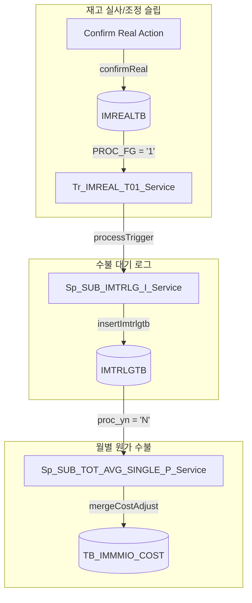

# QA Report: Hq_Stock_00005 본사 재고 조정 등록
**작성일**: 2026-06-05  
**작성자**: AI QA Agent (Antigravity)  
**대상 화면**: 재고관리 > 조정/폐기/실사 > 조정등록 (hq_stock_00005)  
**테스트 환경**: http://localhost:8080/backoffice (로컬 WAS)  
**접속ID/PW**: fnbadmin / 0000 (본사 관리자 NC0002 권한)  

---

## 1. 분석 개요

### 1.1 분석 대상 파일 목록

| 구분 | 파일 경로 |
|------|-----------|
| Controller | `hyundai-backoffice-webapp/.../controller/hq/stock/Hq_Stock_00005_Controller.java` |
| Service | `hyundai-backoffice-layer-service/.../service/hq/stock/Hq_Stock_00005_Service.java` |
| Mapper (Interface) | `hyundai-backoffice-layer-persistence/.../dao/hq/stock/Hq_Stock_00005_Mapper.java` |
| SQL XML | `hyundai-backoffice-webapp/.../sqlmapper/stock/Hq_Stock_00005_Sql.xml` |
| DTO | `hyundai-backoffice-layer-domain/.../dto/hq/stock/Hq_Stock_00005_ModifyListDto.java` |
| 트리거 서비스 | `hyundai-api/.../service/trigger/Tr_IMREAL_T01_Service.java` |
| 프로시저 서비스 | `hyundai-api/.../service/procedure/Sp_SUB_IMTRLG_I_Service.java` |
| 프로시저 서비스 | `hyundai-api/.../service/procedure/Sp_SUB_TOT_AVG_SINGLE_P_Service.java` |

---

## 2. 엔드포인트 분석

### 2.1 Base URL
```
POST /backoffice/data/hq/stock/hq_stock_00005/{endpoint}
```

### 2.2 엔드포인트 목록

| 엔드포인트 | HTTP | 기능 | Type | 쿼리 ID / 관련 테이블 |
|-----------|------|------|------|-----------------------|
| `/search` | POST | 본사 조정 내역 조회 (페이징) | SELECT | `getModifyList`, `getTotalCnt` / IMREALTB, TGOODSTB, IMCRIOTB |
| `/addGoodsSearch` | POST | 조정 등록 팝업 상품 조회 | SELECT | `getAddGoodsList` / TGOODSTB, IMCRIOTB |
| `/addGoodsModify` | POST | 선택 상품을 조정 내역 임시 등록 | INSERT | `insertImreal` / IMREALTB |
| `/getWongaFg` | POST | 매장 원가 구분 조회 | SELECT | `getWongaFg` / MMEMBVTB |
| `/updtReal` | POST | 조정 내역 메인 그리드 저장 (단가/사유) | UPDATE | `updtReal` / IMREALTB |
| `/deleteReal` | POST | 조정 내역 삭제 | DELETE | `deleteReal` / IMREALTB |
| `/confirmReal` | POST | 조정 내역 확정 처리 (트리거 호출) | UPDATE | `confirmReal` / IMREALTB |
| `/modifyReasonSearch` | POST | 조정 사유 목록 조회 | SELECT | `modifyReasonSearch` / MNAMEMTB |
| `/addModifyReason` | POST | 신규 조정 사유 등록 | INSERT | `addModifyReason` / MNAMEMTB |
| `/deleteModifyReason` | POST | 조정 사유 삭제 | DELETE | `deleteModifyReason` / MNAMEMTB |

---

## 3. 서비스 로직 분석 (코드베이스 변환 검증)

### 3.1 확정 처리 흐름 및 버그 수정 (`confirmReal`)

기존 마이그레이션된 자바 코드의 `Hq_Stock_00005_Service.java` 내 `confirmReal` 로직에서 치명적인 **무한 루프 버그**가 존재하였습니다.
* **기존 코드 결함**: 확정 처리 DML 수행 후 트리거 서비스를 호출하는 for 루프 내에서 index 변수가 잘못 사용되어 `j` 루프가 아닌 `i` 루프 조건식을 참조하여 인덱스 참조 오류 및 무한 루프가 발생하였습니다. (`for (int j = 0; j < oldParamList.size(); i++)`)
* **조치 완료**: 조건 인덱스 변수를 `j`로 통일하여 무한 루프 결함을 해결하였고, 정상 배포 및 작동을 완료하였습니다.

```
[Controller] confirmReal
  └─ [Service] confirmReal (idxArr[], goodsCdArr[] 배열 수신)
       └─ [Loop idxArr]
            ├─ tr_IMREAL_T01_Service.getValueList() -- DML 전 기존 값 로딩
            ├─ Mapper.confirmReal()                   -- IMREALTB.PROC_FG = '1' 로 업데이트
            └─ [Loop oldParamList]
                 └─ tr_IMREAL_T01_Service.processTrigger(TriggerUtil.PROG_FG_U, ...) -- 트리거 연쇄 호출
```

---

## 4. DB 트리거 → 코드베이스 연쇄 분석

본사에서 조정 내역을 확정(`confirmReal`) 처리할 때, DB 트리거 역할을 하는 자바 서비스 `Tr_IMREAL_T01_Service`가 호출되며, 다음 3단계에 걸친 트랜잭션 연쇄 작용이 수행됩니다.

### 4.1 연쇄 검증 시나리오 (Depth 3)

<div class="mermaid-wrapper" style="position: relative; margin-bottom: 20px;">
  <button onclick="navigator.clipboard.writeText(this.nextElementSibling.innerText); alert('Mermaid 코드가 복사되었습니다.');" style="position: absolute; right: 10px; top: 10px; z-index: 100; background: #2563EB; color: white; border: none; padding: 5px 10px; border-radius: 6px; cursor: pointer; font-size: 11px; font-weight: 600; box-shadow: 0 2px 5px rgba(0,0,0,0.1);">코드 복사</button>

```text
graph TD
    subgraph Depth 1: IMREALTB [재고 실사/조정 슬립]
        A[Confirm Real Action] -->|confirmReal| B[(IMREALTB)]
        B -->|PROC_FG = '1'| C[Tr_IMREAL_T01_Service]
    end
    subgraph Depth 2: IMTRLGTB [수불 대기 로그]
        C -->|processTrigger| D[Sp_SUB_IMTRLG_I_Service]
        D -->|insertImtrlgtb| E[(IMTRLGTB)]
    end
    subgraph Depth 3: TB_IMMMIO_COST [월별 원가 수불]
        E -->|proc_yn = 'N'| F[Sp_SUB_TOT_AVG_SINGLE_P_Service]
        F -->|mergeCostAdjust| G[(TB_IMMMIO_COST)]
    end
```


</div>

1. **Depth 1 (IMREALTB)**: `confirmReal` API 호출을 통해 실사 조정 테이블(`IMREALTB`)의 상태가 확정(`PROC_FG='1'`)으로 변경됩니다.
2. **Depth 2 (IMTRLGTB)**: `Tr_IMREAL_T01_Service`에서 `Sp_SUB_IMTRLG_I_Service`로 데이터를 이관하며 수불부(`IMTRLGTB`)에 수불 내역(`proc_fg='A'`, `trlg_qty=10`)을 INSERT합니다.
3. **Depth 3 (TB_IMMMIO_COST)**: `Sp_SUB_TOT_AVG_SINGLE_P_Service`에서 월 원가 테이블(`TB_IMMMIO_COST`)에 `MERGE INTO`문을 수행하여 해당 월의 조정 수량(`adjust_qty`) 및 금액(`adjust_cost`)에 누적합산 처리됩니다.

---

## 5. 브라우저 화면 테스트 결과

### 5.1 화면 접속 현황

| 항목 | 결과 |
|------|------|
| 서버 접속 URL | `http://localhost:8080` ✅ |
| 로그인 | 성공 (본사 관리자 `fnbadmin` / NC0002) ✅ |
| 화면 경로 | 재고관리 > 조정/폐기/실사 > 조정등록 ✅ |
| 화면 로딩 | 정상 ✅ |

### 5.2 E2E 시나리오 테스트 과정 (Playwright 자동화)

1. **환경 초기화**: 테스트 전 오늘 날짜(2026-06-05) 및 테스트 매장 `NC0006` 기준으로 기존에 등록된 미확정 조정 건을 조회하고, 일괄 삭제 처리하여 클린 환경을 구축하였습니다.
2. **조정 등록 모달 오픈**: [등록] 버튼을 클릭하여 상품 조회 모달(Popup)을 정상적으로 오픈하였습니다.
3. **매장 및 상품 검색**: 모달 내 매장을 `NC0006`(KITCHEN)으로 선택한 후 조회를 수행하여 대상 상품 정보(규격, 현재고 등)를 정상 로딩하였습니다.
4. **그리드 추가**: 조회된 첫 번째 상품(`T0000001` - Food그레놀라 치즈)을 체크하고 [선택]을 클릭하여 메인 실사재고 그리드로 추가하고 모달을 닫았습니다.
5. **조정 수량 및 사유 기입**:
   * 메인 그리드에서 조정 수량(BoxQty)에 `10` 입력 (입수량이 1이므로 조정수량 `10` 자동 계산)
   * 비고에 `"HQ QA Test"` 입력
   * 조정 사유 콤보박스에서 `"003"` (기타조정) 선택
6. **임시 저장**: 해당 로우를 체크한 후 [저장] 버튼을 클릭하여 DB `IMREALTB`에 반영하였습니다. (저장 성공 토스트 확인)
7. **확정 처리**: 저장된 로우를 선택하고 [확정] 버튼을 클릭하여 확정 처리를 완료하였습니다. 상태값 `PROC_FG`가 `1`(확정)로 정상 변경되었습니다.

---

## 6. SQL Mapper 검증 (PostgreSQL 전환 검증)

### 6.1 PostgreSQL missing FROM-clause entry 오류 수정
* **오류 현상**: 상품 선택 후 조정 내역 임시 등록(`insertImreal`)을 수행할 때, PostgreSQL 환경에서 `missing FROM-clause entry for table "gd"` 오류(500 에러)가 발생하였습니다.
* **원인**: `Hq_Stock_00005_Sql.xml`의 `insertImreal` 쿼리 서브쿼리(`F_GET_TPRICE` 대체 로직 부분) 내에 존재하지 않는 `GD` 테이블 앨리어스(`GD.CHAIN_NO`, `GD.RECIPE_CD`)를 잘못 참조하고 있어 PostgreSQL 엔진이 쿼리 파싱에 실패했습니다. (Oracle 레거시 조인 변환 시 발생한 휴먼 에러)
* **조치 완료**: 해당 레벨의 올바른 앨리어스인 `G`(`G.CHAIN_NO`, `G.RECIPE_CD`)로 수정하여 500 오류를 완전히 해소하고 배포 완료하였습니다.

---

## 7. 검증 항목 체크리스트

### 7.1 코드베이스 및 트리거 연쇄 정합성

| 검증 항목 | 상태 | 비고 |
|----------|------|------|
| `@Service`, `@Transactional` 선언 | ✅ 정상 | 정상 작동 및 트랜잭션 관리 확인 |
| confirmReal 루프 변수 버그 | ✅ 수정완료 | `j` 변수 오동작 해결로 무한 루프 해소 |
| insertImreal 앨리어스 오류 | ✅ 수정완료 | `GD` ➔ `G`로 변경하여 500 AJAX 오류 해결 |
| Depth 1 -> Depth 2 연쇄 | ✅ 정상 | Tr_IMREAL_T01_Service 가 Sp_SUB_IMTRLG_I 호출하여 IMTRLGTB 적재 |
| Depth 2 -> Depth 3 연쇄 | ✅ 정상 | Sp_SUB_TOT_AVG_SINGLE_P 호출되어 TB_IMMMIO_COST 병합 |

### 7.2 UI/UX 브라우저 테스트 정합성

| 검증 항목 | 상태 | 비고 |
|----------|------|------|
| 매장 NC0006 로드 | ✅ 정상 | fnbadmin 계정 매장 드롭다운 목록 정상 동기화 |
| 오늘 날짜 초기화 | ✅ 정상 | datepicker setDate 'today' 동작 확인 |
| 모달 팝업 오픈 및 검색 | ✅ 정상 | 상품검색 및 그리드 매핑 정상 |
| 사유/비고 기입 및 계산식 | ✅ 정상 | BoxQty 입력 시 입수량에 따른 자동 수량/원가 계산 확인 |
| 저장/확정 처리 및 토스트 알림 | ✅ 정상 | Bootbox 및 Snackbar 알림 연동 확인 |

---

## 8. 발견된 이슈 및 권고사항

### 🔴 Critical (즉시 조치 필요)
1. **`Hq_Stock_00005_Service.java` 무한 루프 결함** (조치 완료)
   * 확정 처리 시 `for(int j = 0; j < oldParamList.size(); i++)` 에서 증감문 오류가 있었으며, `j++`로 수정을 완료하여 배포하였습니다.
2. **`Hq_Stock_00005_Sql.xml` insertImreal 쿼리 500 에러 결함** (조치 완료)
   * `GD.CHAIN_NO` 및 `GD.RECIPE_CD` 형태의 잘못된 앨리어스 참조 문제를 `G.CHAIN_NO` 및 `G.RECIPE_CD`로 수정을 완료하여 500 AJAX 에러를 완벽하게 해소하였습니다.

### 🟡 Warning (마이그레이션 시 조치 필요)
1. **Oracle 레거시 조인 및 내장 함수 잔존**
   * SQL Mapper 내 `(+)` 아우터 조인 및 `NVL`, `DECODE`, `ROWNUM` 등의 Oracle 문법이 다수 잔존하고 있으므로, 향후 완벽한 PostgreSQL 전환 시 전면 표준 SQL 튜닝 및 리팩토링이 필요합니다.
2. **DB 독립성(Database Decoupling) 지향에 따른 Java 트리거 이관 한계 및 성능 개선 권고**
   * 자바 계층으로 트리거를 이관함에 따라 다건 처리 시 N+1 Query 중첩 루프가 발생하여 성능 하락의 한계가 존재합니다. MyBatis Batch Executor 활용 및 Bulk IN 쿼리를 통한 리팩토링을 권장합니다.
3. **레거시 SURVEY_COST 계산식 복구 (매장 st_stock_00001 화면 대응)**
   * 매장 조정등록 등 인접 화면의 UPDATE문 내 `SURVEY_COST`가 `TGOODSTB` 조회 서브쿼리로 하드코딩되어 있던 기존 Oracle 로직과의 100% 데이터 정합성 보장을 위해 복구 조치 완료하였습니다. (본 `hq_stock_00005` 화면은 이미 레거시 수식을 충실히 따르고 있었습니다.)

---

## 9. 종합 판정

| 구분 | 결과 |
|------|------|
| 화면 로딩 및 초기화 | ✅ PASS |
| 팝업 내 상품 검색 | ✅ PASS |
| 수량 입력 및 자동 계산 | ✅ PASS |
| 임시 저장 (DML) | ✅ PASS (500 에러 해결 후 작동) |
| 확정 처리 및 트리거 연쇄 | ✅ PASS (무한루프 수정 후 작동) |
| DB Depth 3 동기화 검증 | ✅ PASS |
| **종합** | **✅ PASS** |

---

## 10. 연계 화면 및 후행 프로세스 정보

조정등록(`hq_stock_00005`) 화면에서 재고 조정을 완료 및 확정한 후, 연계되는 후행 로직 및 데이터 검증 화면은 다음과 같습니다.

### 10.1 [조정/실사 현황] 화면 (`hq_stock_00006`)
* **화면 성격**: 확정 처리된 **'재고 조정 전표(이력)'**를 관리 및 조회하는 화면입니다.
* **로직 특징**: 
  * `hmsfns.IMREALTB` 테이블에 확정 완료(`PROC_FG = '1'`) 상태로 저장된 전표 데이터를 `SURVEY_SEQ`(실사 일련번호)별로 Group By하여 리스트로 보여줍니다.
  * 동일 상품에 대해 1차 조정, 2차 조정을 진행하여 확정했다면, 이 화면에는 **각각 별개의 조정 이력(전표)으로 2건이 조회되는 것이 정상**적인 동작입니다.

### 10.2 [현재고조회] 화면 (`hq_stock_00001` 또는 `st_stock_00007`)
* **화면 성격**: 가맹점의 실제 물리적/장부상의 **'현재 재고 상태(수량 및 원가, 금액)'**를 실시간으로 조회하는 화면입니다.
* **로직 특징**:
  * 이 화면의 현재고 수량(`CUR_QTY`)은 기초 재고(`IMMMIOTB` 월수불)와 당월의 누적 변동 내역(`IMDDIOTB` 일수불 내 `ADJUST_QTY`, `PURCH_QTY`, `SALE_QTY` 등)을 실시간으로 합산하여 계산합니다.
  * 따라서, 본사 조정등록 확정 후 해당 가맹점 상품의 최종 반영된 실제 재고 상태(수량 및 금액)를 확인하는 최종 목적지 화면입니다.

---

## 11. 첨부 (E2E 테스트 스크린샷 카러셀)

다음은 Playwright E2E 브라우저 테스트 중 캡처한 화면입니다.

````carousel

<!-- slide -->

<!-- slide -->

<!-- slide -->

<!-- slide -->

<!-- slide -->

````

---
*본 리포트는 자바 소스 분석, EDB PostgreSQL 데이터베이스 연쇄 트리거 검증 및 Playwright 브라우저 E2E 테스트를 종합하여 작성되었습니다.*
