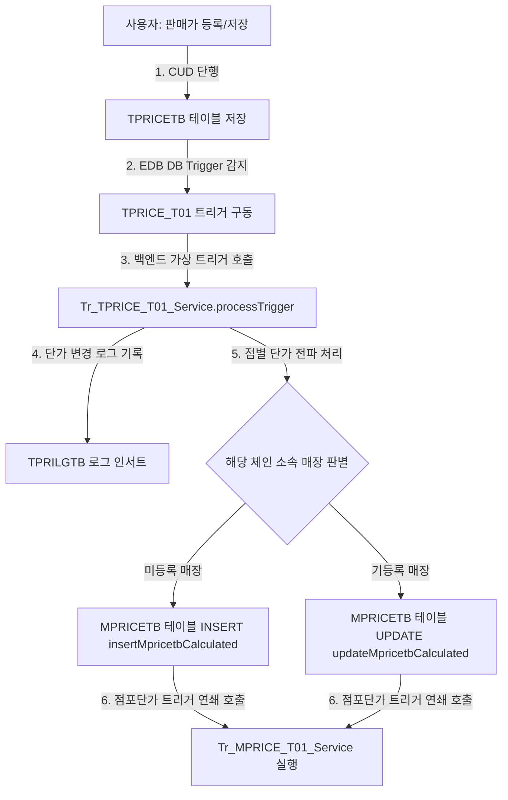

# 본사 폐기현황 (hq_stock_00008) 판매가 및 마진율 노출을 위한 데이터 입력 가이드

`hq_stock_00008` (본사 폐기현황) 화면 및 `st_stock_00004` (매장 폐기현황) 화면의 상세 그리드에서 **판매가, 마진율, 매가금액**이 `0` 또는 `0%`로 표출될 경우, 아래 가이드에 따라 본사 마스터 가격 정보를 등록해야 합니다.

---

## 1. 판매가 0 및 마진율 0% 발생 원인

1. **상세 조회 쿼리의 판매가 조회 방식**:
   - [Hq_Stock_00008_Sql.xml](file:///D:/workspace/hmotors/workspace_hms20260326/backoffice/hyundai-backoffice-webapp/src/main/resources/sqlmapper/stock/Hq_Stock_00008_Sql.xml) 내 `selectListDetail` 쿼리는 상품 마스터 가격 테이블(`TPRICETB`)에서 **`PRICE_FG = '0'` (판매가)** 조건으로 판매 단가를 조회하여 `UPRICE` 컬럼으로 바인딩합니다.
2. **단가 데이터 부재**:
   - 현재 데이터베이스의 C001 체인(Shop)에 대해 `T0000291` (`1:38포니(레드)`) 상품은 **`PRICE_FG = '2'` (기타 단가)** 데이터만 존재하고, **`PRICE_FG = '0'`인 판매단가 데이터가 등록되어 있지 않습니다.**
   - 판매가가 `NULL`로 반환됨에 따라 화면에는 기본값인 `0`으로 표시됩니다.
3. **연산 항목들의 0% / 0원 고착화**:
   - **마진율 (MARGIN)**: 판매가가 분모에 위치하므로, 판매가가 `0`일 때는 SQL `DECODE` 처리에 의해 나누기 0 에러 방지를 위해 `0%`로 계산됩니다.
   - **매가금액 (calcurCost)**: 자바스크립트 포맷터에서 `row.uprice * disuseQty ...` 연산을 수행하나, `row.uprice`가 `0`이므로 결과도 `0`원이 됩니다.

---

## 2. 판매가 등록 방법 (`hq_master_00011`)

본사 관리자 계정으로 로그인하여 가격 마스터에 판매가(`PRICE_FG = '0'`)를 추가하는 절차입니다.

### 📌 데이터 등록 단계
1. **로그인 및 화면 접속**
   - **접속 ID / PW**: `shopadmin` / `0000` (샵 본사 관리자)
   - **메뉴 경로**: **마스터관리 > 가격관리 > 판매가 변경 (`hq_master_00011`)**으로 이동합니다.
   - **관련 파일**:
     - [hq_master_00011.jsp](file:///D:/workspace/hmotors/workspace_hms20260326/backoffice/hyundai-backoffice-webapp/src/main/webapp/WEB-INF/views/backoffice/main/contents/hq/master/hq_master_00011/hq_master_00011.jsp)
     - [hq_master_00011.js](file:///D:/workspace/hmotors/workspace_hms20260326/backoffice/hyundai-backoffice-webapp/src/main/webapp/WEB-INF/views/backoffice/main/contents/hq/master/hq_master_00011/js/hq_master_00011.js)
     - [hq_master_00011_bt.js](file:///D:/workspace/hmotors/workspace_hms20260326/backoffice/hyundai-backoffice-webapp/src/main/webapp/WEB-INF/views/backoffice/main/contents/hq/master/hq_master_00011/js/hq_master_00011_bt.js)

2. **대상 상품 및 조건 검색**
   - **체인구분**: `SHOP` (체인코드 `C001`) 선택
   - **상품명**: `1:38포니(레드)` 또는 **상품코드**: `T0000291` 입력 후 **[조회]** 버튼 클릭.

3. **판매 단가 입력**
   - 조회된 상품 목록 그리드에서 `T0000291` 라인을 선택합니다.
   - **판매가 구분**: `0` (판매가)를 지정합니다. 
   - **시작일자 / 종료일자**: 현재 폐기 데이터를 확인하려는 일자(예: `2026-06-05`)를 반드시 포함하도록 지정해야 합니다. (권장: `2026-06-05` ~ `2099-12-31`)
   - **판매단가**: 판매가 수치(예: `10,000`원)를 입력합니다.

4. **저장 및 반영**
   - 우측 상단의 **[저장]** 버튼을 클릭합니다.
   - 저장 완료와 함께 데이터베이스의 `TPRICETB`에 `PRICE_FG = '0'` 단가 정보가 인서트/업데이트됩니다.

---

## 3. 가격 전파 및 트리거 로직 (`Tr_TPRICE_T01_Service`)

`hq_master_00011` 화면에서 판매가가 등록되면 데이터베이스와 백엔드 연쇄 트리거 서비스에 의해 소속 가맹점의 점별 가격 테이블(`MPRICETB`)로 가격이 자동 복사됩니다.

### 📌 데이터 흐름 및 전파 다이어그램

<div class="mermaid-wrapper" style="position: relative; margin-bottom: 20px;">
  <button onclick="navigator.clipboard.writeText(this.nextElementSibling.innerText); alert('Mermaid 코드가 복사되었습니다.');" style="position: absolute; right: 10px; top: 10px; z-index: 100; background: #2563EB; color: white; border: none; padding: 5px 10px; border-radius: 6px; cursor: pointer; font-size: 11px; font-weight: 600; box-shadow: 0 2px 5px rgba(0,0,0,0.1);">코드 복사</button>

```text
graph TD
    A[사용자: 판매가 등록/저장] -->|1. CUD 단행| B[TPRICETB 테이블 저장]
    B -->|2. EDB DB Trigger 감지| C[TPRICE_T01 트리거 구동]
    C -->|3. 백엔드 가상 트리거 호출| D[Tr_TPRICE_T01_Service.processTrigger]
    D -->|4. 단가 변경 로그 기록| E[TPRILGTB 로그 인서트]
    D -->|5. 점별 단가 전파 처리| F{해당 체인 소속 매장 판별}
    F -->|미등록 매장| G[MPRICETB 테이블 INSERT insertMpricetbCalculated]
    F -->|기등록 매장| H[MPRICETB 테이블 UPDATE updateMpricetbCalculated]
    G & H -->|6. 점포단가 트리거 연쇄 호출| I[Tr_MPRICE_T01_Service 실행]
```


</div>

### 📌 상세 트리거 동작 원리
1. **`TPRILGTB` 로그 적재**:
   - [Tr_TPRICE_T01_Service.java](file:///D:/workspace/hmotors/workspace_hms20260326/backoffice/hyundai-api/src/main/java/com/hyundai/api/service/trigger/Tr_TPRICE_T01_Service.java)는 판매가 변경 이벤트(`procFg = 'A'` 또는 `'U'`)를 전달받으면, 우선 단가 이력 로그 테이블인 `hmsfns.TPRILGTB`에 변경 로그를 남깁니다 ([Tr_TPRICE_T01_Sql.xml - insertTprilgtb](file:///D:/workspace/hmotors/workspace_hms20260326/backoffice/hyundai-api/src/main/resources/sqlmapper/trigger/Tr_TPRICE_T01_Sql.xml#L63-L94)).
2. **점별 가격 테이블 (`MPRICETB`) 갱신**:
   - 로그인된 본사의 체인(`C001`)에 소속된 모든 활성화 매장(`MMEMBSTB.OPEN_FG != '4'`)을 대상으로 가격 데이터를 배포합니다.
   - 기존에 해당 시작일에 가격 데이터가 존재하던 매장은 `updateMpricetbCalculated`를 통해 새로운 가격으로 `UPDATE`되고, 가격이 없는 매장에는 `insertMpricetbCalculated`를 사용하여 `INSERT`됩니다.
   - 이에 따라 가맹점 `NC0007` (CAFE) 매장의 `MPRICETB` 테이블에도 `PRICE_FG = '0'` 단가가 자동으로 복제됩니다.

---

## 4. 데이터베이스 검증 SQL

데이터 등록 후, 트리거와 백엔드 서비스가 문제없이 작동하여 DB에 저장되었는지 확인하는 SQL 쿼리입니다.

### ① 본사 가격 마스터 테이블 (`TPRICETB`) 등록 확인
```sql
SELECT CHAIN_NO, GOODS_CD, PRICE_FG, START_DATE, END_DATE, PRE_PRICE, PRICE
  FROM hmsfns.TPRICETB
 WHERE GOODS_CD = 'T0000291'
   AND CHAIN_NO = 'C001'
   AND PRICE_FG = '0';
```

### ② 매장 가격 테이블 (`MPRICETB`) 전파 확인
```sql
SELECT MS_NO, GOODS_CD, PRICE_FG, START_DATE, END_DATE, PRE_PRICE, PRICE
  FROM hmsfns.MPRICETB
 WHERE GOODS_CD = 'T0000291'
   AND MS_NO = 'NC0007'
   AND PRICE_FG = '0';
```

---

## 5. 화면 검증 결과 비교

단가 데이터를 `10,000`원으로 올바르게 설정한 후 `hq_stock_00008` (본사 폐기현황) 화면을 재조회하면 다음과 같은 결과 변화를 볼 수 있습니다.

| 항목 | 가격 설정 전 (현재 상태) | 가격 설정 후 (정상 상태) | 비고 / 계산 공식 |
|------|------------------------|------------------------|------------------|
| **판매가 (UPRICE)** | `0` | **`10,000`** | `TPRICETB` 혹은 `MPRICETB`에서 `PRICE_FG = '0'`인 가격 |
| **매입가 (GD.UCOST)** | `4,800` | **`4,800`** | 상품 원가 유지 |
| **마진율 (MARGIN)** | `0%` | **`52%`** | `((판매가 10,000 - 매입가 4,800) / 판매가 10,000) * 100` |
| **폐기수량 (DISUSE_QTY)** | `1` | **`1`** | 입력된 폐기 수량 |
| **폐기금액 (DISUSE_COST)** | `4,800` | **`4,800`** | `매입가 4,800 * 폐기수량 1` |
| **매가금액 (calcurCost)** | `0` | **`10,000`** | `판매가 10,000 * 폐기수량 1` |

> [!NOTE]
> **실시간 단가 연동 정책**
> 본사 폐기현황(`hq_stock_00008`) 화면의 판매가와 마진율 정보는 과거의 폐기 확정 시점 데이터를 고정하는 형태가 아닌, **조회 시점 기준의 유효 가격 마스터(`TPRICETB`)**를 실시간으로 조회하여 매칭하는 구조입니다.
> 따라서 가격 정보를 사후에 등록하더라도, 기존에 등록된 폐기 이력에 소급 적용되어 정상 금액과 마진율이 출력됩니다.
