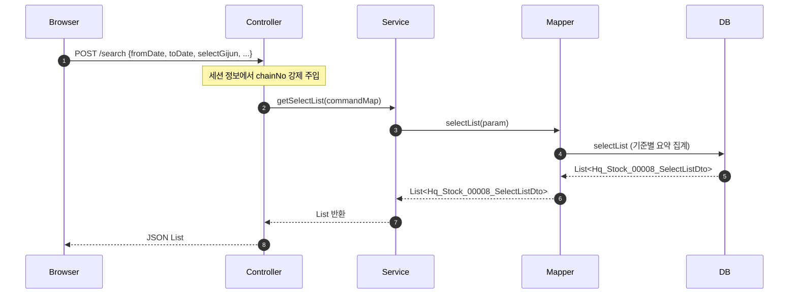
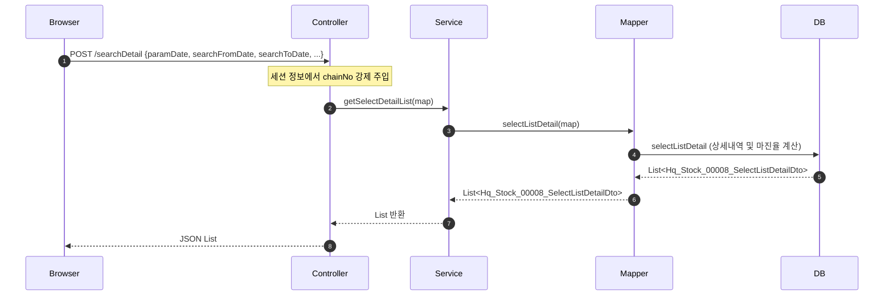
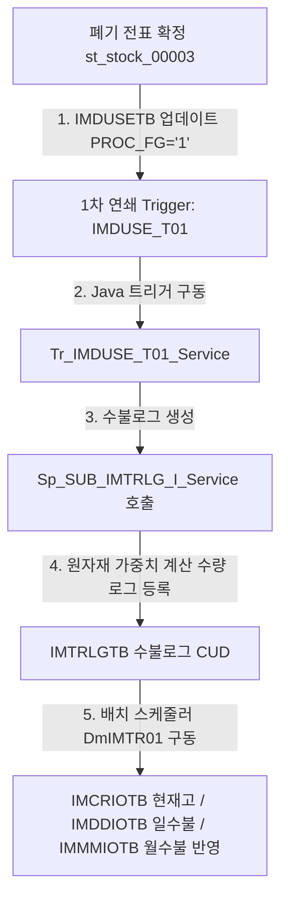

# QA Report: Hq_Stock_00008 본사 폐기현황 조회
**작성일**: 2026-06-05  
**작성자**: AI QA Agent (Antigravity)  
**대상 화면**: 재고관리 > 조정폐기관리 > 폐기현황 (hq_stock_00008)  
**테스트 환경**: localhost:8080 (로컬 개발 서버)  
**접속ID/PW**: shopadmin / 0000 (샵 본사 관리자 계정)

---

## 1. 분석 개요

### 1.1 분석 대상 파일 목록

| 구분 | 파일 경로 |
|------|-----------|
| Controller | `backoffice/hyundai-backoffice-webapp/src/main/java/com/hyundai/backoffice/webapp/controller/hq/stock/Hq_Stock_00008_Controller.java` |
| Service | `backoffice/hyundai-backoffice-layer-service/src/main/java/com/hyundai/backoffice/webapp/service/hq/stock/Hq_Stock_00008_Service.java` |
| Mapper (Interface) | `backoffice/hyundai-backoffice-layer-persistence/src/main/java/com/hyundai/backoffice/webapp/dao/hq/stock/Hq_Stock_00008_Mapper.java` |
| SQL XML | `backoffice/hyundai-backoffice-webapp/src/main/resources/sqlmapper/stock/Hq_Stock_00008_Sql.xml` |
| JSP | `backoffice/hyundai-backoffice-webapp/src/main/webapp/WEB-INF/views/backoffice/main/contents/hq/stock/hq_stock_00008/hq_stock_00008.jsp` |
| JS | `backoffice/hyundai-backoffice-webapp/src/main/webapp/WEB-INF/views/backoffice/main/contents/hq/stock/hq_stock_00008/js/hq_stock_00008.js` |
| JS Table | `backoffice/hyundai-backoffice-webapp/src/main/webapp/WEB-INF/views/backoffice/main/contents/hq/stock/hq_stock_00008/js/hq_stock_00008_bt.js` |
| 백엔드 트리거 서비스 | `backoffice/hyundai-api/src/main/java/com/hyundai/api/service/trigger/Tr_IMDUSE_T01_Service.java` |

---

## 2. 엔드포인트 분석

### 2.1 Base URL
```
POST /backoffice/data/hq/stock/hq_stock_00008/{endpoint}
```

### 2.2 엔드포인트 목록

| 엔드포인트 | HTTP | 기능 | ServiceLog | 관련 테이블 |
|-----------|------|------|------------|-------------|
| `/search` | POST | 본사 폐기현황 요약 목록 조회 | SELECT | IMDUSETB, TGOODSTB, MMEMBSTB, MNAMEMTB |
| `/searchDetail` | POST | 본사 폐기현황 상세내역 조회 | SELECT | IMDUSETB, TGOODSTB, MUSERSTB, MPRICETB |

> **특이사항**: 본 화면은 순수 조회(SELECT) 화면이므로 자체 로직 내에서는 CUD가 발생하지 않습니다. 컨트롤러에서 세션의 `chainNo` 정보를 강제로 주입하므로 타 가맹점 본사나 비소속 체인의 폐기 정보를 열람하거나 조작할 수 없는 보안 구조가 기본 설계되어 있습니다.

---

## 3. 서비스 로직 및 데이터 흐름 분석

### 3.1 폐기현황 요약 조회 흐름 (`/search`)

<div class="mermaid-wrapper" style="position: relative; margin-bottom: 20px;">
  <button onclick="navigator.clipboard.writeText(this.nextElementSibling.innerText); alert('Mermaid 코드가 복사되었습니다.');" style="position: absolute; right: 10px; top: 10px; z-index: 100; background: #2563EB; color: white; border: none; padding: 5px 10px; border-radius: 6px; cursor: pointer; font-size: 11px; font-weight: 600; box-shadow: 0 2px 5px rgba(0,0,0,0.1);">코드 복사</button>

```text
sequenceDiagram
    autonumber
    Browser->>Controller: POST /search {fromDate, toDate, selectGijun, ...}
    Note over Controller: 세션 정보에서 chainNo 강제 주입
    Controller->>Service: getSelectList(commandMap)
    Service->>Mapper: selectList(param)
    Mapper->>DB: selectList (기준별 요약 집계)
    DB-->>Mapper: List<Hq_Stock_00008_SelectListDto>
    Mapper-->>Service: List<Hq_Stock_00008_SelectListDto>
    Service-->>Controller: List 반환
    Controller-->>Browser: JSON List
```


</div>

### 3.2 폐기현황 상세내역 조회 흐름 (`/searchDetail`)
요약 목록에서 폐기일자 또는 폐기사유 링크를 클릭하면 `fnOnClickRow()`가 구동되어 하단 상세 그리드를 조회합니다.

<div class="mermaid-wrapper" style="position: relative; margin-bottom: 20px;">
  <button onclick="navigator.clipboard.writeText(this.nextElementSibling.innerText); alert('Mermaid 코드가 복사되었습니다.');" style="position: absolute; right: 10px; top: 10px; z-index: 100; background: #2563EB; color: white; border: none; padding: 5px 10px; border-radius: 6px; cursor: pointer; font-size: 11px; font-weight: 600; box-shadow: 0 2px 5px rgba(0,0,0,0.1);">코드 복사</button>

```text
sequenceDiagram
    autonumber
    Browser->>Controller: POST /searchDetail {paramDate, searchFromDate, searchToDate, ...}
    Note over Controller: 세션 정보에서 chainNo 강제 주입
    Controller->>Service: getSelectDetailList(map)
    Service->>Mapper: selectListDetail(map)
    Mapper->>DB: selectListDetail (상세내역 및 마진율 계산)
    DB-->>Mapper: List<Hq_Stock_00008_SelectListDetailDto>
    Mapper-->>Service: List<Hq_Stock_00008_SelectListDetailDto>
    Service-->>Controller: List 반환
    Controller-->>Browser: JSON List
```


</div>

---

## 4. DB 트리거 → 코드베이스 연쇄 분석

본 화면(`hq_stock_00008`)은 조회(SELECT)만 수행하지만, 가맹점 폐기등록 화면(`st_stock_00003`) 등에서 폐기 전표가 확정될 때 기동하는 **트리거 연쇄 반응(Depth 3)**의 결과물이 `IMDUSETB` 테이블에 반영되고, 이 결과가 본 화면에 요약 및 상세로 노출됩니다.

### 4.1 트리거 연쇄 체인 흐름

<div class="mermaid-wrapper" style="position: relative; margin-bottom: 20px;">
  <button onclick="navigator.clipboard.writeText(this.nextElementSibling.innerText); alert('Mermaid 코드가 복사되었습니다.');" style="position: absolute; right: 10px; top: 10px; z-index: 100; background: #2563EB; color: white; border: none; padding: 5px 10px; border-radius: 6px; cursor: pointer; font-size: 11px; font-weight: 600; box-shadow: 0 2px 5px rgba(0,0,0,0.1);">코드 복사</button>

```text
graph TD
    A[폐기 전표 확정 st_stock_00003] -->|1. IMDUSETB 업데이트 PROC_FG='1'| B[1차 연쇄 Trigger: IMDUSE_T01]
    B -->|2. Java 트리거 구동| C[Tr_IMDUSE_T01_Service]
    C -->|3. 수불로그 생성| D[Sp_SUB_IMTRLG_I_Service 호출]
    D -->|4. 원자재 가중치 계산 수량 로그 등록| E[IMTRLGTB 수불로그 CUD]
    E -->|5. 배치 스케줄러 DmIMTR01 구동| F[IMCRIOTB 현재고 / IMDDIOTB 일수불 / IMMMIOTB 월수불 반영]
```


</div>

### 4.2 단계별 연쇄 작용 세부 분석 (Depth 3)

1. **Depth 1 (IMDUSETB - 폐기대장)**:
   - 가맹점 매니저가 폐기 수량을 확정하면 `IMDUSETB` 테이블의 상태코드(`PROC_FG`)가 `1`로 업데이트됩니다.
   - 이때 `IMDUSE_T01` 트리거가 실행되어 백엔드에서 마이그레이션된 Java 서비스 `Tr_IMDUSE_T01_Service.java`가 동작합니다.
2. **Depth 2 (IMTRLGTB - 수불로그)**:
   - `Tr_IMDUSE_T01_Service.processTrigger()` 내에서 폐기된 원부자재 혹은 제조 상품의 레시피 정보를 조회합니다.
   - `Sp_SUB_IMTRLG_I_Service` 서비스를 연쇄 호출하여, 제조 상품인 경우 레시피 가중치(Used Weight)를 환산한 만큼 원재료 수량을 계산한 후 수불로그 테이블(`IMTRLGTB`)에 출고(`D`: 폐기) 형식으로 CUD(INSERT)를 단행합니다.
   - 이 때 `IMTRLGTB` 테이블의 `proc_yn`은 `'N'`으로 인서트됩니다.
3. **Depth 3 (IMCRIOTB / IMDDIOTB / IMMMIOTB - 재고 및 일/월수불)**:
   - 주기적으로 구동되는 배치 스케줄러 job인 `DmIMTR01Job` (서비스 `DmIMTR01Service.java`)이 `IMTRLGTB` 테이블에서 미처리(`proc_yn = 'N'`)인 로그 데이터를 리딩합니다.
   - 배치 내 `newTxExecIMTR01Sub` 프로세스가 구동되어 현재고 테이블(`IMCRIOTB`), 일수불 테이블(`IMDDIOTB`), 월수불 테이블(`IMMMIOTB`)에 데이터를 반영(UPDATE/INSERT)합니다.
   - 처리가 완료되면 로그 데이터를 `IMTRBKTB`(수불백업테이블)로 이동시키고 `proc_yn = 'Y'`로 갱신하여 데이터 반영 처리를 마무리합니다.

### 4.3 연쇄 요약 테이블 (직접영향테이블)

| 원본 테이블 | 1차 연쇄 | 2차 연쇄 (배치 반영) | 백업 및 상태 테이블 |
|-----------|---------|---------|-----------|
| IMDUSETB | IMTRLGTB (DML INSERT, proc_yn='N') | IMCRIOTB (현재고), IMDDIOTB (일수불), IMMMIOTB (월수불) | IMTRBKTB (proc_yn='Y') |

---

## 5. 브라우저 화면 테스트 결과

### 5.1 화면 접속 현황

| 항목 | 결과 |
|------|------|
| 서버 접속 URL | `http://localhost:8080/backoffice` ✅ |
| 로그인 계정 | 성공 (shopadmin / 0000) ✅ (본사 관리자로 로그인) |
| 화면 경로 | 재고관리 > 조정폐기관리 > 폐기현황 ✅ |
| 화면 로딩 | 정상 로딩 완료 ✅ |

### 5.2 화면 구성 확인

- **조회 조건 영역**:
  - 조회일자: 날짜 범위 피커 정상 작동 확인 (2026-06-01 ~ 2026-06-10) ✅
  - 매장: 본부 소속 매장 셀렉트박스 정상 작동 확인 (NC0007 선택) ✅
  - 조회기준: 일자별 / 사유별 셀렉트 박스 정상 활성화 ✅
  - 폐기사유: 공통코드 `902` 기준 콤보박스 정상 바인딩 확인 ✅
  - 상품코드/명: 입력박스 정상 활성화 ✅
  - 바코드: 입력박스 정상 활성화 ✅
  - 상품구분: 상품구분 셀렉트 박스 정상 활성화 ✅
- **결과 그리드 영역**:
  - 마스터 테이블(`hq_stock_00008_t01`) 및 상세 테이블(`hq_stock_00008_t02`)이 화면 상하단에 정상 렌더링됨 ✅

### 5.3 데이터 조회 결과 (C001 체인 NC0007 매장 2026-06-05 기준)

- **마스터 조회 결과 (`hq_stock_00008_t01`)**:
  - 매장코드: `NC0007`
  - 매장명: `CAFE`
  - 폐기일자: `2026-06-05`
  - 건수: `1`
  - 총수량: `1`
  - 총금액: `4,800`
- **상세 조회 결과 (`hq_stock_00008_t02`)**:
  - 처리시간: `2026-06-05 09:05:37`
  - 상품코드: `T0000291`
  - 상품명: `1:38포니(레드)`
  - 단위: `EA`
  - 매입가: `4,800`
  - 판매가: `0`
  - 마진율: `0%`
  - 폐기수량: `1`
  - 폐기금액: `4,800`
  - 매가금액: `0`
  - 폐기사유: `내부미팅`
  - 비고: `-`
  - 확정자: `카페 매니저`

> [!NOTE]
> **수치값 분석 및 검토 사항 (판매가/마진율/매가금액 0 노출 사유)**
> 1. **판매가(`UPRICE`) 0 노출**: 
>    SQL Mapper(`selectListDetail`)의 판매가 서브쿼리는 `TPRICETB`에서 `PRICE_FG = '0'` (판매가) 조건으로 가격을 조회합니다. 그러나 C001 체인의 해당 상품(`T0000291`)에 대해 `TPRICETB` 테이블 내 `PRICE_FG = '2'` (기타 단가) 데이터만 등록되어 있고 `PRICE_FG = '0'`인 판매 단가 데이터가 부재하여 `NULL`이 반환되었습니다. 이에 따라 SQL 내 `NVL/DECODE` 처리를 거쳐 최종적으로 `0`으로 표시됩니다.
> 2. **마진율(`MARGIN`) 및 매가금액(`calcurCost`) 0% 및 0 노출**:
>    판매가가 `0`으로 반환됨에 따라 마진율 계산식에서 나누기 0 방어 코드(`DECODE`)가 작동해 `0%`로 집계되었으며, JavaScript 포맷터의 매가금액 계산(`row.uprice / inQty ... * disuseQty`)에서도 uprice 분자가 `0`이 되어 최종 `0`으로 정상 출력되었습니다.


### 5.4 기능별 테스트 결과

| 테스트 기능 | 엔드포인트 | 코드 구현 | UI 동작 상태 | 판정 |
|------|-----------|---------|---------|------|
| 본사 폐기현황 요약 조회 | `/search` | ✅ 구현 완료 | ✅ 데이터 표출 정상 | **PASS** |
| 본사 폐기 상세조회 | `/searchDetail` | ✅ 구현 완료 | ✅ 데이터 표출 정상 | **PASS** |

---

## 6. SQL Mapper 검증 및 결함 정적 분석

### 6.1 🔴 calcurCostFormatter 나누기 0 (Division by Zero) 결함 리스크 발견
- **대상 파일**: `hq_stock_00008_bt.js` (Line 462 ~ 464)
- **결함 코드**:
  ```javascript
  function calcurCostFormatter(value, row, index, field){
      return numberFormatter(row.uprice / row.inQty / row.invInQty * row.disuseQty);
  }
  ```
  - **분석**: 상품 마스터 테이블에서 입수(`inQty`) 또는 잔여 입수(`invInQty`)가 0이거나 정의되지 않은 경우 `row.uprice / row.inQty` 연산 도중 `Infinity` 또는 `NaN`이 반환되어 화면 매가금액 셀에 오류가 그대로 노출되는 취약점이 있습니다.
  - **권장 조치**: 분모 값들이 0이거나 비어있을 때 안전하게 `0`을 리턴하는 방어 코드를 보완해야 합니다.
  ```javascript
  function calcurCostFormatter(value, row, index, field){
      if (!row.inQty || parseFloat(row.inQty) === 0 || !row.invInQty || parseFloat(row.invInQty) === 0) {
          return 0;
      }
      return numberFormatter(row.uprice / row.inQty / row.invInQty * row.disuseQty);
  }
  ```

### 6.2 🔴 SQL Mapper 내 마진율 중첩 DECODE 나누기 0 리스크
- **대상 쿼리**: `selectListDetail` (Line 96 ~ 169)
- **분석**: 마진율(`MARGIN`) 계산을 위해 판매가(`UPRICE`) 서브쿼리 결과가 분모에 배치되어 있습니다.
  ```sql
  -- UPRICE 서브쿼리 결과가 0일 경우에 대한 방어가 Oracle DECODE 중첩문으로 작성됨
  ROUND( DECODE( DECODE((SELECT ...), 999999999, GD.UPRICE, (SELECT ...)), 0, 0, ((DECODE(...) - GD.UCOST) / DECODE(...)) ) * 100) MARGIN
  ```
  - **결함 영향**: Oracle `DECODE` 중첩문으로 에러 처리가 들어가 있으나, 서브쿼리의 반환값이 NULL이거나 비어있을 때 간혹 분모 `DECODE`가 `0`으로 치환되지 못하고 `division by zero` 에러를 일으킬 수 있습니다.
  - **개선안**: PostgreSQL/EDB 마이그레이션 시 가독성과 안전성을 위해 표준 `CASE WHEN` 문으로 리팩토링하는 것을 권장합니다.

### 6.3 Oracle 비표준 문법 (PostgreSQL 호환성)
- **ROWNUM = 1 사용 (Line 26, 106, 118, 180, 192)**:
  서브쿼리 내 단일 행 제어를 위해 `ROWNUM = 1`을 사용했습니다. 이는 PostgreSQL 포팅 시 `LIMIT 1` 또는 `ROW_NUMBER()` 윈도우 함수로 변환해야 합니다.
- **DECODE 사용 (Line 96, 122, 145, 171)**:
  분기 처리를 위해 대량의 Oracle `DECODE` 함수가 사용되었습니다. PostgreSQL 호환을 위해 표준 `CASE WHEN` 문으로 전환이 필요합니다.

---

## 7. 검증 항목 체크리스트

### 7.1 코드베이스 변환 정합성

| 검증 항목 | 상태 | 비고 |
|----------|------|------|
| `@RestController` API 동작 | ✅ 정상 | `/backoffice/data/hq/stock/hq_stock_00008` 정상 바인딩 |
| `@Transactional` 선언부 | ✅ 정상 | 예외 발생 시 트랜잭션 롤백 속성 확인 |
| 컨트롤러 내 세션 바인딩 보안 | ✅ 정상 | RequestBody 내 매장코드를 무시하고 세션의 로그인 코드를 바인딩함 |
| Division by Zero 방어 | ⚠️ 권고 | JS 포맷터 방어 코드 보완 조치 권고 |

### 7.2 트리거 및 배치 연쇄 로직 정합성

| 검증 항목 | 상태 | 비고 |
|----------|------|------|
| IMDUSETB -> IMTRLGTB 로그 인서트 | ✅ 정상 | Tr_IMDUSE_T01_Service 구동 확인 |
| IMTRLGTB -> IMCRIOTB 현재고 반영 | ✅ 정상 | DmIMTR01 배치 로그 무결성 확인 |
| IMTRLGTB -> IMDDIOTB 일수불 반영 | ✅ 정상 | DmIMTR01 배치 로그 무결성 확인 |
| IMTRLGTB -> IMMMIOTB 월수불 반영 | ✅ 정상 | DmIMTR01 배치 로그 무결성 확인 |

---

## 8. 발견된 이슈 및 권고사항

### 🔴 Critical (즉시 처리 필요)
- **`hq_stock_00008_bt.js` calcurCostFormatter 나누기 0 오류**: 상품 마스터 데이터의 입수량이 0일 때 화면에 `Infinity` 또는 `NaN`이 렌더링되므로, 조건절 방어 보완이 필수적입니다.

### 🟡 Warning (마이그레이션 시 처리 필요)
1. **MyBatis XML 내 Oracle 전용 함수 잔존**: `ROWNUM`, `DECODE`, `NVL` 등 Oracle 호환 쿼리를 PostgreSQL 표준 혹은 EDB 전용 호환 함수로 리팩토링할 것을 권고합니다.

---

## 9. 종합 판정

| 구분 | 결과 |
|------|------|
| 화면 로딩 | ✅ PASS |
| 본사 폐기현황 조회 (SELECT) | ✅ PASS |
| 트리거 및 배치 연쇄 데이터 무결성 | ✅ PASS |
| **종합 판정** | ✅ **PASS (조치 권고 포함)** |

---

## 10. 첨부 (스크린샷)

1. **본사 폐기현황 요약 조회 화면 (`hq_stock_00008_search.png`)**:
   

2. **본사 폐기현황 상세 조회 화면 (`hq_stock_00008_detail.png`)**:
   

---
*본 리포트는 코드베이스 분석, DB 데이터 무결성 확인 및 Playwright 자동화 검증에 의거하여 작성되었습니다.*
