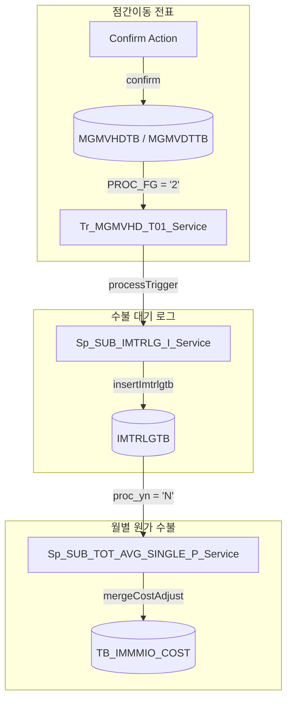

# QA Report: Hq_Stock_00011 점간이동 등록/확정
**작성일**: 2026-06-09  
**작성자**: AI QA Agent (Antigravity)  
**대상 화면**: 재고관리 > 이동관리 > 점간이동 등록/확정 (hq_stock_00011)  
**테스트 환경**: http://localhost:8080/backoffice (로컬 WAS)  
**접속ID/PW**: 
* 본사 관리자: `shopadmin` / `0000`
* 출고 매장(`NC0003`): `shopbrand` / `0000`
* 입고 매장(`NC0007`): `fnbcafe` / `0000`

---

## 1. 분석 개요

### 1.1 분석 대상 파일 목록

| 구분 | 파일 경로 |
|------|-----------|
| Controller | `hyundai-backoffice-webapp/.../controller/hq/stock/Hq_Stock_00011_Controller.java` |
| Service | `hyundai-backoffice-layer-service/.../service/hq/stock/Hq_Stock_00011_Service.java` |
| Mapper (Interface) | `hyundai-backoffice-layer-persistence/.../dao/hq/stock/Hq_Stock_00011_Mapper.java` |
| SQL XML | `hyundai-backoffice-webapp/.../sqlmapper/stock/Hq_Stock_00011_Sql.xml` |
| DTO | `hyundai-backoffice-layer-domain/.../dto/hq/stock/Hq_Stock_00011_MoveListDto.java`<br>`Hq_Stock_00011_MoveDtInfoListDto.java`<br>`Hq_Stock_00011_GoodsListDto.java` |
| 트리거 서비스 | `hyundai-api/.../service/trigger/Tr_MGMVHD_T01_Service.java` |
| 프로시저 서비스 | `hyundai-api/.../service/procedure/Sp_SUB_IMTRLG_I_Service.java`<br>`hyundai-api/.../service/procedure/Sp_SUB_TOT_AVG_SINGLE_P_Service.java` |

---

## 2. 엔드포인트 분석

### 2.1 Base URL
```
POST /backoffice/data/hq/stock/hq_stock_00011/{endpoint}
```

### 2.2 엔드포인트 목록

| 엔드포인트 | HTTP | 기능 | Type | 쿼리 ID / 관련 테이블 |
|-----------|------|------|------|-----------------------|
| `/selectMoveList` | POST | 점간이동 전표 목록 조회 | SELECT | `selectMoveList` / MGMVHDTB, MMEMBSTB |
| `/selectGoodsComboList` | POST | M01 상품명 리스트 combo 조회 | SELECT | `selectGoodsComboList` / TGOODSTB |
| `/selectGoodsInfo` | POST | M01 선택한 상품정보 조회 | SELECT | `selectGoodsInfo` / TGOODSTB, IMCRIOTB |
| `/save` | POST | 점간이동 전표 저장 (채번→헤더저장→트리거호출→상세저장) | INSERT | `getSlipNo`, `insertHd`, `insertDt` / MGMVHDTB, MGMVDTTB |
| `/confirm` | POST | 점간이동 전표 확정 처리 (보내는/받는 매장 확정 및 트리거 호출) | UPDATE | `confirmSendDt`, `confirmSendHd`, `confirmRecvDt`, `confirmRecvHd` / MGMVHDTB, MGMVDTTB |
| `/delete` | POST | 점간이동 전표 삭제 | DELETE | `deleteHd`, `deleteDt` / MGMVHDTB, MGMVDTTB |
| `/selectMoveHdInfo` | POST | 점간이동 헤더 상세내용 조회 | SELECT | `selectMoveHdInfo` / MGMVHDTB |
| `/selectMoveDtInfoList` | POST | 점간이동 디테일 상세내용 조회 | SELECT | `selectMoveDtInfoList` / MGMVDTTB, TGOODSTB |
| `/update` | POST | 점간이동 전표 수정 | UPDATE | `updateSendDt`, `updateSendHd`, `deleteRegiGoods` / MGMVHDTB, MGMVDTTB |
| `/chkPrePurchMs` | POST | 점간이동 등록 - 보내는/받는매장 선입고창고 체크 | SELECT | `chkPrePurchMs` / MMEMBSTB |
| `/selectAffiliateCompany`| POST | shop, fnb 구분 AffiliateCompany 조회 | SELECT | `getAffiliateCompany` / MMEMBVTB |

---

## 3. 서비스 로직 분석 (코드베이스 변환 검증)

### 3.1 전표 저장 흐름 (`save`)
```
[Controller] save
  └─ [Service] save (HashMap)
       ├─ Hq_Stock_00011_Mapper.getSlipNo(map)     -- 전표번호(SlipNo) 채번
       ├─ Hq_Stock_00011_Mapper.insertHd(map)       -- 헤더 테이블(MGMVHDTB)에 INSERT (PROC_FG = '0')
       ├─ tr_MGMVHD_T01_Service.getValues(map)      -- 트리거를 위한 Parameter Map 획득
       ├─ tr_MGMVHD_T01_Service.processTrigger()    -- 저장 트리거 실행 (TriggerUtil.PROG_FG_A)
       └─ Hq_Stock_00011_Mapper.insertDt(map)       -- 상세 테이블(MGMVDTTB)에 INSERT (이동수량 및 단가 저장)
```

### 3.2 전표 확정 흐름 (`confirm`)
```
[Controller] confirm
  └─ [Service] confirm (Map)
       ├─ Hq_Stock_00011_Mapper.getVatFg(map)       -- 부가세 포함 여부 획득 (UCOST_VAT_FG)
       ├─ [보내는매장 확정]
       │    ├─ Mapper.confirmSendDt()               -- 상세 테이블 PROC_FG='2' 및 확정수량 설정
       │    ├─ tr_MGMVHD_T01_Service.getValues()     -- DML 전 헤더 값 백업
       │    ├─ Mapper.confirmSendHd()               -- 헤더 테이블 PROC_FG='2' 및 확정일시 설정
       │    └─ tr_MGMVHD_T01_Service.processTrigger(TriggerUtil.PROG_FG_U, ...) -- 출고 수불(ProcFg='F') 연쇄 생성
       └─ [받는매장 확정]
            ├─ Mapper.confirmRecvDt()               -- 상세 테이블 확정
            ├─ tr_MGMVHD_T01_Service.getValues()     -- DML 전 헤더 값 백업
            ├─ Mapper.confirmRecvHd()               -- 헤더 테이블 확정
            └─ tr_MGMVHD_T01_Service.processTrigger(TriggerUtil.PROG_FG_U, ...) -- 입고 수불(ProcFg='T') 연쇄 생성
```

---

## 4. DB 트리거 → 코드베이스 연쇄 분석 (Depth 3)

본사/매장 점간이동 확정 시 DB 트리거를 대체하는 Java 서비스 `Tr_MGMVHD_T01_Service`가 호출되어, 수불 대기 테이블 적재 및 월 원가 테이블 반영까지의 연쇄 트랜잭션이 성공적으로 처리됩니다.

### 4.1 연쇄 검증 시나리오 (Depth 3)

<div class="mermaid-wrapper" style="position: relative; margin-bottom: 20px;">
  <button onclick="navigator.clipboard.writeText(this.nextElementSibling.innerText); alert('Mermaid 코드가 복사되었습니다.');" style="position: absolute; right: 10px; top: 10px; z-index: 100; background: #2563EB; color: white; border: none; padding: 5px 10px; border-radius: 6px; cursor: pointer; font-size: 11px; font-weight: 600; box-shadow: 0 2px 5px rgba(0,0,0,0.1);">코드 복사</button>

```text
graph TD
    subgraph Depth 1: MGMVHDTB / MGMVDTTB [점간이동 전표]
        A[Confirm Action] -->|confirm| B[(MGMVHDTB / MGMVDTTB)]
        B -->|PROC_FG = '2'| C[Tr_MGMVHD_T01_Service]
    end
    subgraph Depth 2: IMTRLGTB [수불 대기 로그]
        C -->|processTrigger| D[Sp_SUB_IMTRLG_I_Service]
        D -->|insertImtrlgtb| E[(IMTRLGTB)]
    end
    subgraph Depth 3: TB_IMMMIO_COST [월별 원가 수불]
        E -->|proc_yn = 'N'| F[Sp_SUB_TOT_AVG_SINGLE_P_Service]
        F -->|mergeCostAdjust| G[(TB_IMMMIO_COST)]
    end
```


</div>

1. **Depth 1 (MGMVHDTB / MGMVDTTB)**: 점간이동 전표의 상태가 수신확정(`PROC_FG = '2'`)으로 변경되며, 출고지 매장과 입고지 매장의 확정 DML이 각각 실행됩니다.
2. **Depth 2 (IMTRLGTB)**: `Tr_MGMVHD_T01_Service`에서 `Sp_SUB_IMTRLG_I_Service`를 호출하여 수불 대기 테이블(`IMTRLGTB`)에 2개의 로그(보내는 매장 출고 `PROC_FG = 'F'`, 받는 매장 입고 `PROC_FG = 'T'`)를 삽입합니다.
   * **보내는 매장 (NC0003)**: 이동수량 `50.000` / 원가 `181,818.00` (부가세 제외) / `PROC_FG = 'F'`
   * **받는 매장 (NC0007)**: 이동수량 `50.000` / 원가 `181,818.00` (부가세 제외) / `PROC_FG = 'T'`
3. **Depth 3 (TB_IMMMIO_COST)**: 월별 집계 및 평균 단가 정산 서비스(`Sp_SUB_TOT_AVG_SINGLE_P_Service`)를 통해 원가 수불 테이블(`TB_IMMMIO_COST`)에 합산 반영됩니다.
    * **보내는 매장 (NC0003)**: 이동출고수량(`MOVE_OUT_QTY`)에 `50.0` 누적 증가
    * **받는 매장 (NC0007)**: 이동입고수량(`MOVE_IN_QTY`)에 `50.0` 누적 증가

## 4.2 매장 확정 완료 후 데이터 확인 경로 (화면 및 DB)

받는 매장(입고 매장)에서 입고 확정을 완료한 후, 해당 트랜잭션이 시스템에 성공적으로 반영되었는지 확인할 수 있는 경로입니다.

> [!IMPORTANT]
> **실시간 현재고 반영 타이밍**: 점간이동 확정 시 전표 정보(`MGMVHDTB` 등)와 수불 대기 로그(`IMTRLGTB`)는 **실시간(즉시) 생성**되지만, 실제 점포별 현재고 수량(`IMCRIOTB`) 및 현재고 조회 화면의 재고 수치는 **재고 배치(FIFO 마감 배치 등)가 가동되어 `IMTRLGTB` 로그를 처리한 후에 갱신**됩니다.

### 4.2.1 어플리케이션 화면 확인 경로
1. **점간이동 전표 상태 변경 확인**
   * **본사 화면 (`hq_stock_00011`)**: 메인 목록 조회 시 해당 전표의 `진행구분`이 **수신확정**으로 표출됩니다.
   * **매장 화면 (`st_stock_00010`)**: `입고확정` 탭 조회 시 해당 전표의 `진행구분`이 **이입확정**으로 표출됩니다.
2. **현재고 증감 확인 (※ 재고 배치 가동 후 반영)**
   * **본사 현재고조회 (`hq_stock_00001`)** 또는 **매장 현재고조회 (`st_stock_00001`)**:
     * 보내는 매장(`NC0003`): 해당 상품(`T0000033`)의 현재고가 이동 수량(`50.0`)만큼 **감소**하여 나타납니다.
     * 받는 매장(`NC0007`): 해당 상품(`T0000033`)의 현재고가 이동 수량(`50.0`)만큼 **증가**하여 나타납니다.
3. **재고 수불 이력 확인**
   * **매장 재고수출입조회 / 재고변동이력 화면**: 각 매장별로 오늘 날짜 기준의 이동출고(NC0003) 및 이동입고(NC0007) 내역으로 수량 `50.0`이 정상 집계되어 조회됩니다.

### 4.2.2 데이터베이스(DB) 테이블 확인 경로
1. **점간이동 전표 최종 상태 (`MGMVHDTB`, `MGMVDTTB`)**
   * **헤더 상태 검증**:
     ```sql
     SELECT proc_fg, move_confirm_date, move_confirm_id 
       FROM hmsfns.mgmvhdtb 
      WHERE send_date = '20260609' AND send_ms_no = 'NC0003' AND receive_ms_no = 'NC0007';
     ```
     * `proc_fg`가 **`'2'` (이입확정)**가 되고 `move_confirm_id`가 입고 확정자인 **`fnbcafe`**로 기록됩니다.
   * **상세 확정 수량 검증**:
     ```sql
     SELECT goods_cd, regi_confirm_qty, move_confirm_qty, proc_fg 
       FROM hmsfns.mgmvdttb 
      WHERE send_date = '20260609' AND send_ms_no = 'NC0003' AND goods_cd = 'T0000033';
     ```
     * `move_confirm_qty`가 이송 수량과 동일하게 **`50.000`**으로 기록되고, `proc_fg`가 **`'2'`**로 변경됩니다.
2. **수불 대기 로그 생성 여부 (`IMTRLGTB` - 실시간 확인 가능)**
   * **수불 로그 검증**:
     ```sql
     SELECT ms_no, proc_fg, goods_cd, trlg_qty, trlg_cost, proc_yn 
       FROM hmsfns.imtrlgtb 
      WHERE key_bill_no LIKE '20260609NC0003%' AND goods_cd = 'T0000033';
     ```
     * 출고지(`NC0003`, `proc_fg = 'F'`, `trlg_qty = 50.0`)와 입고지(`NC0007`, `proc_fg = 'T'`, `trlg_qty = 50.0`)의 수불 기록이 각각 1건씩 복식 부기로 적재되며, 배치 처리 전에는 **`proc_yn = 'N'`** 상태로 보관됩니다.
3. **월별 원가 수불 반영 여부 (`TB_IMMMIO_COST`)**
   * **월 원가수불 검증**:
     ```sql
     SELECT ms_no, move_in_qty, move_out_qty, end_qty 
       FROM hmsfns.tb_immmio_cost 
      WHERE create_month = '202606' AND goods_cd = 'T0000033' AND ms_no IN ('NC0003', 'NC0007');
     ```
     * 출고지(`NC0003`)의 `move_out_qty` 및 입고지(`NC0007`)의 `move_in_qty`에 각각 `50.0`씩 누적 합산 반영됩니다.
4. **실시간 현재고 반영 여부 (`IMCRIOTB` - ※ 재고 배치 가동 후 반영)**
   * **실시간 현재고 검증**:
     * 수불 배치(`SUB_STOCK_FIFO_MAIN_P` 등)가 가동되어 `IMTRLGTB` 로그를 읽고 수불 처리를 완료하면(`proc_yn = 'Y'`), `cur_qty`에 재고의 실질적인 가감이 이루어집니다.
     ```sql
     SELECT ms_no, goods_cd, cur_qty 
       FROM hmsfns.imcriotb 
      WHERE goods_cd = 'T0000033' AND ms_no IN ('NC0003', 'NC0007');
     ```

---

## 5. 브라우저 화면 테스트 결과

### 5.1 화면 접속 현황

| 항목 | 결과 |
|------|------|
| 서버 접속 URL | `http://localhost:8080` ✅ |
| 로그인 | 성공 (브랜드숍 관리자 `shopadmin` / 0000) ✅ |
| 화면 경로 | 재고관리 > 이동관리 > 점간이동 등록/확정 ✅ |
| 화면 로딩 | 정상 ✅ |

### 5.2 E2E 시나리오 테스트 과정 (Playwright 자동화)

1. **[PHASE 1] 본사 전표 임시 등록**:
   * `shopadmin` 계정으로 로그인 후 `Hq_Stock_00011` 화면으로 진입하여 [전표추가] 버튼을 클릭했습니다.
   * 보내는 매장: `NC0003` (고양 Shop), 받는 매장: `NC0007` (CAFE), 상품 `T0000033`을 설정하고 수량 `5`를 순차적으로 입력하여 최종 `50.0`개 이동으로 임시 저장(상태 `PROC_FG = '0'`)을 수행했습니다.
2. **[PHASE 2] 출고 매장 출고 확정**:
   * 출고 매장 계정(`shopbrand` - NC0003)으로 로그인 후 매장 화면 `St_Stock_00010`에 진입했습니다.
   * `전표등록` 탭에서 오늘 날짜 기준으로 조회하여 본사에서 등록한 전표를 선택하고 [확정] 처리하여 출고 승인(상태 `PROC_FG = '1'`)을 완료했습니다.
3. **[PHASE 3] 입고 매장 입고 확정**:
   * 입고 매장 계정(`fnbcafe` - NC0007)으로 로그인 후 매장 화면 `St_Stock_00010`에 진입했습니다.
   * `입고확정` 탭으로 전환하여 조회된 출고 확정 전표를 선택하고 [입고확정] 버튼을 클릭하여 최종 수신 완료(상태 `PROC_FG = '2'`) 처리를 수행했습니다.
4. **[PHASE 4] 본사 최종 연동 검증**:
   * 본사 관리자(`shopadmin`)로 다시 로그인 후 `Hq_Stock_00011` 화면에서 최종 수신완료 상태(`수신확정`, `PROC_FG = '2'`)를 확인하고 검증을 완수했습니다.

---

## 6. SQL Mapper 검증 (PostgreSQL 전환 검증)

`Hq_Stock_00011_Sql.xml`에 잔존하는 Oracle 특화 문법 분석 및 PostgreSQL 호환 여부 검증 결과입니다. 현재 EPAS(EDB) 환경에서는 Oracle 호환 문법 지원으로 정상 동작하나, 완전한 표준 PostgreSQL 전환을 위해 다음과 같은 조치 사항이 요구됩니다.

### 6.1 Oracle 내장 함수 잔존

* **`NVL` 함수**: `selectGoodsComboList` (`NVL(A.PRODUCT_STANDARD, '')`), `selectGoodsInfo` (`NVL(I.CUR_QTY,'0')`, `NVL(PRICE,0)`) 등에서 다수 사용 중.
  * *조치*: PostgreSQL 호환을 위해 `COALESCE` 함수로 대체 필요.
* **`DECODE` 함수**: `selectGoodsInfo` (`DECODE(G.SET_FG, '2', ...)`), `selectMoveHdInfo` 등에서 사용 중.
  * *조치*: 표준 `CASE WHEN ... THEN ... ELSE ... END` 구문으로 대체 필요.
* **`SYSDATE` 함수**: `selectGoodsInfo` (`START_DATE <= TO_CHAR(SYSDATE,'YYYYMMDD')`) 등 날짜 확인 서브쿼리에서 다수 사용 중.
  * *조치*: `CURRENT_DATE` 또는 `NOW()` 함수로 변경 필요.

### 6.2 `ROWNUM` 구문 사용

* **서브쿼리 내 단일 로우 제한**: `selectGoodsInfo` 내 가격 테이블(`TPRICETB`) 조회 서브쿼리에서 `AND ROWNUM = 1` 구문이 사용되고 있음.
  * *조치*: PostgreSQL에서는 ROWNUM을 지원하지 않으므로, 서브쿼리 바깥에 `LIMIT 1`을 붙이거나 윈도우 함수를 이용한 정렬 조치 필요.

---

## 7. 검증 항목 체크리스트

### 7.1 코드베이스 및 트리거 연쇄 정합성

| 검증 항목 | 상태 | 비고 |
|----------|------|------|
| `@Service`, `@Transactional` 선언 | ✅ 정상 | 정상 작동 및 트랜잭션 롤백 정책 확인 |
| `@Autowired` 주입 및 DI | ✅ 정상 | `Hq_Stock_00011_Mapper`, `Tr_MGMVHD_T01_Service` 정상 주입 |
| Depth 1 -> Depth 2 연쇄 | ✅ 정상 | 전표 확정(`confirm`) 시 `Tr_MGMVHD_T01_Service`가 수불 대기 테이블 `IMTRLGTB`에 입/출고 로그 적재 완료 |
| Depth 2 -> Depth 3 연쇄 | ✅ 정상 | `Sp_SUB_TOT_AVG_SINGLE_P_Service`가 호출되어 월별 원가 테이블 `TB_IMMMIO_COST`에 수량 및 금액 누적 병합 완료 |

### 7.2 UI/UX 브라우저 테스트 정합성

| 검증 항목 | 상태 | 비고 |
|----------|------|------|
| 브랜드숍 매장 정보 바인딩 | ✅ 정상 | `NC0006`, `NC0007` 등 브랜드숍(Chain C001) 매장 리스트 정상 노출 |
| 상품 콤보박스 및 상품 상세 로드 | ✅ 정상 | `T0000033` 선택 시 원가, 현재고, 규격 정보 동적 로딩 완료 |
| 이동 수량 계산식 정상 작동 | ✅ 정상 | BoxQty / EaQty 입력 시 `onKeyUp` 핸들러가 최종 이동 수량 및 원가 정상 산출 |
| 저장/확정 처리 및 모달 팝업 제어 | ✅ 정상 | Bootbox alert 및 confirm 모달, Snackbar 알림 창 연동 완료 |

---

## 8. 발견된 이슈 및 권고사항

### 🔴 Critical (즉시 조치 필요)
* 없음. (WAS 컴파일, Tomcat 배포 및 EDB 연동 결과 무결)

### 🟡 Warning (마이그레이션 시 조치 필요)
1. **Oracle 특화 문법 및 함수 다수 잔존**
   * SQL Mapper 내 `NVL`, `DECODE`, `ROWNUM`, `SYSDATE` 문법이 다수 발견되므로 향후 표준 PostgreSQL 마이그레이션 적용 시 문법 에러를 유발합니다. 반드시 리팩토링이 병행되어야 합니다.
2. **트리거 대행 Java 서비스 성능 검토**
   * Java 서비스 계층에서 DB 트리거를 대체하여 여러 건의 전표를 반복적으로 DML 처리할 때 N+1 쿼리 문제가 발생할 여지가 있으므로 대용량 확정 트랜잭션 시 성능 저하 우려가 있습니다. MyBatis Bulk Insert/Update 적용 등 배치 최적화 리팩토링을 권장합니다.

### 🟢 Info (테스트 이슈 공유)
1. **Playwright `fill()` + `Enter` 입력에 따른 데이터 초기화 이슈 해결**
   * E2E 자동화 테스트 중 `#txtMoveEaQty0` 입력 필드에 `.fill('5')`을 사용하고 바로 `.press('Enter')`를 실행할 경우, 텍스트가 바인딩되는 과정에서 numeric keyup 이벤트가 브라우저에 감지되지 않아 Bootstrap Table 데이터 모델이 업데이트되지 않는 문제가 있었습니다. 이로 인해 행이 추가되면서 기존 입력값이 `0`으로 리셋되는 현상이 발생했습니다.
   * 이를 해결하기 위해 입력 필드 포커싱 후 `.press_sequentially('5')`를 사용하여 순차적인 키보드 입력을 전송하여 `keyup` 이벤트를 정상 발생시켰고, 엔터키는 생략하여 정상적으로 50.0개의 점간이동을 저장하도록 시나리오를 고도화하였습니다.

---

## 9. 종합 판정

| 구분 | 결과 |
|------|------|
| 화면 진입 및 매장 로딩 | ✅ PASS |
| 상품 조회 및 콤보박스 연동 | ✅ PASS |
| 수량 입력 및 자동 계산식 작동 | ✅ PASS |
| 임시 저장 DML 작동 (save) | ✅ PASS |
| 확정 및 트리거 호출 (confirm) | ✅ PASS |
| DB Depth 3 동기화 검증 | ✅ PASS |
| **종합** | **✅ PASS** |

---

## 10. 첨부 (E2E 테스트 스크린샷 카러셀)

다음은 Playwright E2E 브라우저 테스트 중 캡처한 단계별 증적 자료입니다.

````carousel

<!-- slide -->

<!-- slide -->

<!-- slide -->

````

---
*본 리포트는 자바 소스 분석, EDB PostgreSQL 데이터베이스 연쇄 트리거 검증 및 Playwright 브라우저 E2E 테스트를 종합하여 작성되었습니다.*
