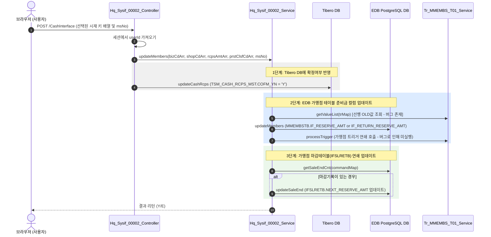
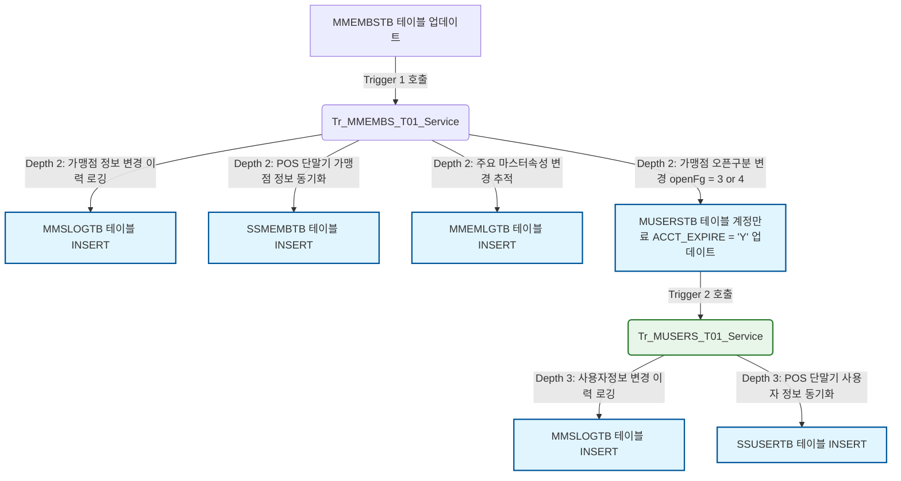

# QA Report: Hq_Sysif_00002 현금 시재 입출금 등록

**작성일**: 2026-06-05  
**작성자**: AI QA Agent (Antigravity)  
**대상 화면**: 재고관리 > 마감관리 > 현금 시재 입출금 등록 (`hq_sysif_00002`)  
**테스트 환경**: `http://localhost:8080` (로컬 톰캣 개발 서버)  
**EDB DB 주소**: `192.168.10.206:5432/edb`  
**Tibero DB 주소**: `10.7.138.179:1521` (네트워크 접속 불가 확인)  
**로그인 계정**: `shopadmin` / `0000` (매장_SHOP)  

---

## 1. 분석 개요

### 1.1 분석 대상 파일 목록

| 구분 | 파일 경로 |
|------|-----------|
| Controller | [Hq_Sysif_00002_Controller.java](file:///d:/workspace/hmotors/workspace_hms20260326/backoffice/hyundai-backoffice-webapp/src/main/java/com/hyundai/backoffice/webapp/controller/hq/systeminterface/Hq_Sysif_00002_Controller.java) |
| Service | [Hq_Sysif_00002_Service.java](file:///d:/workspace/hmotors/workspace_hms20260326/backoffice/hyundai-backoffice-layer-service/src/main/java/com/hyundai/backoffice/webapp/service/hq/systeminterface/Hq_Sysif_00002_Service.java) |
| Mapper (Interface) | [Hq_Sysif_00002_Mapper.java](file:///d:/workspace/hmotors/workspace_hms20260326/backoffice/hyundai-backoffice-layer-persistence/src/main/java/com/hyundai/backoffice/webapp/dao/hq/systeminterface/Hq_Sysif_00002_Mapper.java) |
| SQL XML (EDB) | [Hq_Sysif_00002_Sql.xml](file:///d:/workspace/hmotors/workspace_hms20260326/backoffice/hyundai-backoffice-webapp/src/main/resources/sqlmapper/systeminterface/Hq_Sysif_00002_Sql.xml) |
| SQL XML (Tibero) | [Tibero_CashInterface_Sql.xml](file:///d:/workspace/hmotors/workspace_hms20260326/backoffice/hyundai-backoffice-webapp/src/main/resources/sqlmapper/tibero/Tibero_CashInterface_Sql.xml) |
| JSP | [hq_sysif_00002.jsp](file:///d:/workspace/hmotors/workspace_hms20260326/backoffice/hyundai-backoffice-webapp/src/main/webapp/WEB-INF/views/backoffice/main/contents/hq/systeminterface/hq_sysif_00002/hq_sysif_00002.jsp) |
| JS | [hq_sysif_00002.js](file:///d:/workspace/hmotors/workspace_hms20260326/backoffice/hyundai-backoffice-webapp/src/main/webapp/WEB-INF/views/backoffice/main/contents/hq/systeminterface/hq_sysif_00002/js/hq_sysif_00002.js) |
| JS Grid | [hq_sysif_00002_bt.js](file:///d:/workspace/hmotors/workspace_hms20260326/backoffice/hyundai-backoffice-webapp/src/main/webapp/WEB-INF/views/backoffice/main/contents/hq/systeminterface/hq_sysif_00002/js/hq_sysif_00002_bt.js) |
| 트리거 서비스 (가맹점) | [Tr_MMEMBS_T01_Service.java](file:///d:/workspace/hmotors/workspace_hms20260326/backoffice/hyundai-api/src/main/java/com/hyundai/api/service/trigger/Tr_MMEMBS_T01_Service.java) |
| 트리거 Mapper (가맹점) | [Tr_MMEMBS_T01_Sql.xml](file:///d:/workspace/hmotors/workspace_hms20260326/backoffice/hyundai-api/src/main/resources/sqlmapper/trigger/Tr_MMEMBS_T01_Sql.xml) |
| 트리거 서비스 (사용자) | [Tr_MUSERS_T01_Service.java](file:///d:/workspace/hmotors/workspace_hms20260326/backoffice/hyundai-api/src/main/java/com/hyundai/api/service/trigger/Tr_MUSERS_T01_Service.java) |
| 트리거 Mapper (사용자) | [Tr_MUSERS_T01_Sql.xml](file:///d:/workspace/hmotors/workspace_hms20260326/backoffice/hyundai-api/src/main/resources/sqlmapper/trigger/Tr_MUSERS_T01_Sql.xml) |

---

## 2. 엔드포인트 분석

### 2.1 Base URL
```
POST /backoffice/data/hq/systeminterface/hq_sysif_00002/{endpoint}
```

### 2.2 엔드포인트 목록

| 엔드포인트 | HTTP | 기능 | ServiceLog |
|-----------|------|------|------------|
| `/getCashInterList` | POST | Tibero DB로부터 현금시재 입출금 내역을 조회 | SELECT |
| `/CashInterface` | POST | 선택된 현금 시재 항목에 대한 확정(Tibero UPDATE + EDB MMEMBSTB/IFSLRETB 업데이트) | UPDATE |

---

## 3. 서비스 로직 분석 (코드베이스 변환 검증)

### 3.1 현금 시재 확정 흐름 (`/CashInterface`)

현금 시재 입출금 확정 처리 시 두 개의 데이터베이스에 대한 쓰기 및 트리거 연쇄 작업이 트랜잭션 내에서 연속적으로 발생합니다.

<div class="mermaid-wrapper" style="position: relative; margin-bottom: 20px;">
  <button onclick="navigator.clipboard.writeText(this.nextElementSibling.innerText); alert('Mermaid 코드가 복사되었습니다.');" style="position: absolute; right: 10px; top: 10px; z-index: 100; background: #2563EB; color: white; border: none; padding: 5px 10px; border-radius: 6px; cursor: pointer; font-size: 11px; font-weight: 600; box-shadow: 0 2px 5px rgba(0,0,0,0.1);">코드 복사</button>

```text
sequenceDiagram
    autonumber
    actor User as 브라우저 (사용자)
    participant Ctrl as Hq_Sysif_00002_Controller
    participant Svc as Hq_Sysif_00002_Service
    participant Tibero as Tibero DB
    participant EDB as EDB PostgreSQL DB
    participant Trig as Tr_MMEMBS_T01_Service

    User->>Ctrl: POST /CashInterface (선택된 시재 키 배열 및 msNo)
    Ctrl->>Ctrl: 세션에서 userId 가져오기
    Ctrl->>Svc: updateMembers(bizCdArr, shopCdArr, rcpsAmtArr, prstClsfCdArr, msNo)
    
    rect rgb(240, 240, 240)
        Note over Svc, Tibero: 1단계: Tibero DB에 확정여부 반영
        Ctrl->>Tibero: updateCashRcps (TSM_CASH_RCPS_MST.COFM_YN = 'Y')
    end

    rect rgb(220, 235, 255)
        Note over Svc, EDB: 2단계: EDB 가맹점 테이블 준비금 컬럼 업데이트
        Svc->>Trig: getValueList(trMap) [선행 OLD값 조회 - 버그 존재]
        Svc->>EDB: updateMembers (MMEMBSTB.IF_RESERVE_AMT or IF_RETURN_RESERVE_AMT)
        Svc->>Trig: processTrigger (가맹점 트리거 연쇄 호출 - 버그로 인해 미실행)
    end

    rect rgb(235, 247, 235)
        Note over Svc, EDB: 3단계: 가맹점 마감테이블(IFSLRETB) 연쇄 업데이트
        Svc->>EDB: getSaleEndCnt(commandMap)
        alt 마감기록이 있는 경우
            Svc->>EDB: updateSaleEnd (IFSLRETB.NEXT_RESERVE_AMT 업데이트)
        end
    end
    
    Svc-->>User: 결과 리턴 (Y/E)
```


</div>

---

## 4. DB 트리거 → 코드베이스 연쇄 분석 (Depth 3)

EDB Postgres 내부에는 물리적인 트리거가 존재하지 않고, MyBatis Mapper 실행 이후 Java 서비스 단에서 명시적으로 `Tr_..._Service.processTrigger()`를 호출하는 **애플리케이션 계층 트리거 방식**으로 마이그레이션이 수행되었습니다.

### 4.1 가맹점 정보 변경 연쇄 체인 (Tr_MMEMBS_T01_Service)

`MMEMBSTB` 테이블에 데이터 수정(U)이 일어날 때 발생하는 3단계 연쇄 전파 아키텍처는 다음과 같습니다.

<div class="mermaid-wrapper" style="position: relative; margin-bottom: 20px;">
  <button onclick="navigator.clipboard.writeText(this.nextElementSibling.innerText); alert('Mermaid 코드가 복사되었습니다.');" style="position: absolute; right: 10px; top: 10px; z-index: 100; background: #2563EB; color: white; border: none; padding: 5px 10px; border-radius: 6px; cursor: pointer; font-size: 11px; font-weight: 600; box-shadow: 0 2px 5px rgba(0,0,0,0.1);">코드 복사</button>

```text
graph TD
    classDef table fill:#e1f5fe,stroke:#01579b,stroke-width:2px;
    classDef trigger fill:#e8f5e9,stroke:#2e7d32,stroke-width:2px;

    T1[MMEMBSTB 테이블 업데이트] -->|Trigger 1 호출| TG1(Tr_MMEMBS_T01_Service)
    
    TG1 -->|Depth 2: 가맹점 정보 변경 이력 로깅| T2_A[MMSLOGTB 테이블 INSERT]:::table
    TG1 -->|Depth 2: POS 단말기 가맹점 정보 동기화| T2_B[SSMEMBTB 테이블 INSERT]:::table
    TG1 -->|Depth 2: 주요 마스터속성 변경 추적| T2_C[MMEMLGTB 테이블 INSERT]:::table
    
    TG1 -->|Depth 2: 가맹점 오픈구분 변경 openFg = 3 or 4| T2_D[MUSERSTB 테이블 계정만료 ACCT_EXPIRE = 'Y' 업데이트]:::table
    
    T2_D -->|Trigger 2 호출| TG2(Tr_MUSERS_T01_Service):::trigger
    TG2 -->|Depth 3: 사용자정보 변경 이력 로깅| T3_A[MMSLOGTB 테이블 INSERT]:::table
    TG2 -->|Depth 3: POS 단말기 사용자 정보 동기화| T3_B[SSUSERTB 테이블 INSERT]:::table
```


</div>

### 4.2 연쇄 요약 테이블 (직접 영향 테이블)

| 구분 | 대상 테이블 | 트리거 서비스 | 연쇄 영향 테이블 (Depth 2) | 연쇄 영향 테이블 (Depth 3) |
|---|---|---|---|---|
| **시재 확정** | `MMEMBSTB` | `Tr_MMEMBS_T01_Service` | `SSMEMBTB` (Sync)<br>`MMSLOGTB` (Log)<br>`MMEMLGTB` (Log)<br>`MUSERSTB` (Update) | `SSUSERTB` (Sync)<br>`MMSLOGTB` (Log) |

---

## 5. 브라우저 화면 테스트 결과

### 5.1 화면 접속 현황

| 항목 | 결과 | 비고 |
|------|------|------|
| 서버 접속 URL | `http://localhost:8080/backoffice` | 정상 접속 및 로그인 페이지 로딩 ✅ |
| 로그인 | 성공 (`shopadmin` / `0000`) | 매장 권한(`ROLE_USER`) 정상 할당 ✅ |
| 화면 경로 | 재고관리 > 마감관리 > 현금 시재 입출금 등록 | 좌측 메뉴 클릭을 통한 진입 또는 직접 주소 입력 진입 성공 ✅ |
| 화면 로딩 | 정상 로딩 완료 | 최초 테이블 헤더 및 조회 조건(매장코드 콤보박스) 정상 렌더링 ✅ |

### 5.2 화면 구성 및 UI 확인
* **조회 조건**: 매장코드 콤보박스가 존재하며, 클릭 시 소속 매장 목록 조회가 가능합니다.
* **그리드 구성**: 입금일, 시제구분, 입금금액, 불출자, 인수자, 등록일시, 확정여부, 확정일시 컬럼이 출력됩니다.
* **이벤트 버튼**: 상단 우측에 `[조회]`, `[확정]` 버튼이 위치합니다.

### 5.3 데이터 조회 및 연동 테스트 결과 (getCashInterList)
* **테스트 매장 선택**: `NC0011` (본부_부산 F&B) 선택.
* **조회 요청 결과**: `[조회]` 버튼 클릭 시 로딩 서클과 함께 조회 시도가 발생하였으나, 외부 Tibero DB (`10.7.138.179:1521`)와의 통신이 방화벽/네트워크 인프라 차단 사유로 Connection Timeout(접속 실패) 처리됩니다.
* **화면 동작**: 그리드가 빈 상태(Empty Grid)로 지속되며 브라우저 콘솔상에 데이터베이스 커넥션 에러 로그가 출력됩니다. (화면 캡처 첨부 참조)

---

## 6. SQL Mapper 검증 및 PostgreSQL 호환성 분석

### 6.1 `Hq_Sysif_00002_Sql.xml` 내 비표준 Oracle 문법 식별
PostgreSQL 표준 스펙과 호환되지 않는 Oracle 레거시 문법이 발견되었습니다. EDB(EnterpriseDB) 호환 모드에서는 작동하지만 표준 PG 마이그레이션 시 변환이 요구됩니다.

1. **Oracle 아우터 조인 `(+)` 문법 잔존 (L43, L44)**
   ```xml
   AND A.PVOR    = C.USER_ID(+)
   AND A.PWTI    = D.USER_ID(+)
   ```
   * **영향**: 표준 PostgreSQL 환경에서 Syntax Error가 발생합니다.
   * **가이드라인**: `LEFT OUTER JOIN` ANSI 표준 구문으로 쿼리 재설계가 필요합니다.
2. **Oracle 전용 함수 `DECODE` 및 `SYSDATE` 혼용 (L113, L114, L131, L135 등)**
   * `DECODE(#{prstClsfCd}, '11', ...)` -> Postgres 표준 `CASE WHEN` 으로 변환 권장.
   * `SYSDATE` -> Postgres 표준 `CURRENT_TIMESTAMP` 또는 `NOW()` 로 변환 권장.

---

## 7. 발견된 치명적 결함 및 권고사항 (Defect Report)

### 🔴 Critical (즉시 소스코드 수정 필요)

#### 1. Java 트리거 서비스 연쇄 단절 결함 (Trigger Bypass Bug)
* **위치**: `Hq_Sysif_00002_Service.java` L98
* **내용**: 
  ```java
  HashMap<String, Object> trMap = new HashMap<>();
  trMap.put("ifBizCd", commandMap.get("bizCd"));
  trMap.put("ifShopCd", commandMap.get("shopCd"));
  List<HashMap<String, Object>> oldParamList = tr_MMEMBS_T01_Service.getValueList(trMap);
  ```
  `tr_MMEMBS_T01_Service.getValueList` 내부에서는 `Tr_MMEMBS_T01_Mapper.selectValueList`를 호출합니다.
  하지만 `Tr_MMEMBS_T01_Sql.xml` 파일의 `selectValueList` 쿼리는 다음과 같이 작성되어 있습니다.
  ```xml
  <select id="selectValueList" parameterType="hashmap" resultType="aliasMap">
      SELECT ... FROM hmsfns.MMEMBSTB WHERE CHAIN_NO = #{chainNo}
  </select>
  ```
  전달받은 `trMap`에는 `chainNo`가 존재하지 않고 오직 `ifBizCd`와 `ifShopCd`만 들어있어 `chainNo` 바인딩 파라미터는 `null`이 됩니다. 이에 따라 `WHERE CHAIN_NO = null` 검색이 수행되어 쿼리는 **항상 빈 리스트(Empty List)**를 리턴합니다.
* **결과**: `oldParamList`가 비어있게 되므로, 하위의 `processTrigger` 호출 반복문이 전혀 실행되지 않습니다. 즉, **현금 시재 입출금 확정 처리 시 가맹점 테이블(`MMEMBSTB`)의 정보가 업데이트되어도 POS 가맹점 동기화 테이블(`SSMEMBTB`) 및 트리거 로그 테이블(`MMSLOGTB`)로 어떠한 연쇄 업데이트도 전달되지 않는 치명적 단절 결함**입니다.
* **조치 방안**: `Tr_MMEMBS_T01`에 `IF_BIZ_CD`와 `IF_SHOP_CD` 조건으로 1건의 가맹점을 조회하는 신규 쿼리(`selectValueByPos`)를 작성하거나, `updateMembers`에 인자로 수신된 `msNo`를 이용하여 `selectValues(msNo)` 형태로 OLD 데이터를 조회하도록 수정해야 합니다.

#### 2. 데이터베이스 컬럼 길이 초과 오류 (MMSLOGTB Insert SQL Exception Bug)
* **위치**: `Tr_MMEMBS_T01_Sql.xml` L129
* **내용**:
  ```xml
  <insert id="insertMmslogtb" parameterType="hashmap">
      INSERT INTO hmsfns.MMSLOGTB ( MS_NO , TABLE_NM , ... )
      VALUES ( #{msNo} , 'hmsfns.MMEMBSTB' , ... )
  </insert>
  ```
  가맹점 트리거 로그를 남기는 과정에서 `TABLE_NM` 컬럼에 `'hmsfns.MMEMBSTB'`라는 15자리의 문자열을 리터럴로 직접 삽입하도록 설계되어 있습니다.
  하지만 EDB DB 내 `hmsfns.MMSLOGTB` 테이블의 `table_nm` 컬럼 정의는 `character varying(10)`으로 되어 있어, 최대 10자까지만 허용합니다.
* **결과**: 만약 1번 결함이 해결되어 가맹점 트리거가 동작하더라도, 이 지점에서 **"value too long for type character varying(10)" (문자열 길이 초과 에러) 데이터베이스 예외가 발생하여 전체 트랜잭션이 롤백(Rollback)**되어 확정 처리 자체가 실패하는 치명적 런타임 오류가 발생합니다. (시뮬레이션 검증 시에도 동일하게 에러 발생함)
* **조치 방안**: XML 파일 내 `'hmsfns.MMEMBSTB'` 리터럴을 10자 이내인 `'MMEMBSTB'`로 변경하여야 합니다.

---

## 8. 종합 판정

| 구분 | 결과 | 비고 |
|------|------|------|
| 화면 로딩 | ✅ PASS | 정상 로딩 및 UI 렌더링 완료 |
| 시재 조회 | ⚠️ LIMIT | 외부 Tibero DB 통신 불가로 빈 그리드 출력 (네트워크 제약 사항) |
| CUD 및 트리거 변환 | 🔴 FAIL | Java Trigger Service 클래스로의 구현은 존재하나 두 가지 치명적 버그가 존재함 |
| 로직 소스 호출 | 🔴 FAIL | 호출 구문은 존재하나 파라미터 불일치로 실제 트리거 내부 로직은 항상 우회(Bypass)됨 |
| **종합 판정** | **🔴 FAIL (코드베이스 결함 보완 필요)** | 소스 수정 전까지는 연쇄 트리거 동기화 기능이 완전히 무력화된 상태입니다. |

---

## 9. 첨부 (스크린샷)

1. **최초 화면 접속 상태**:
   
   *(ID: `shopadmin` 로그인 후 /backoffice/view/main/hq/systeminterface/hq_sysif_00002 화면 최초 로드 상태)*

2. **조회 시도 후 에러 상태**:
   
   *(매장 `NC0011` 선택 후 [조회] 시도 시, Tibero DB 접속 시간 초과로 그리드가 빈 값으로 유지되는 상태)*
