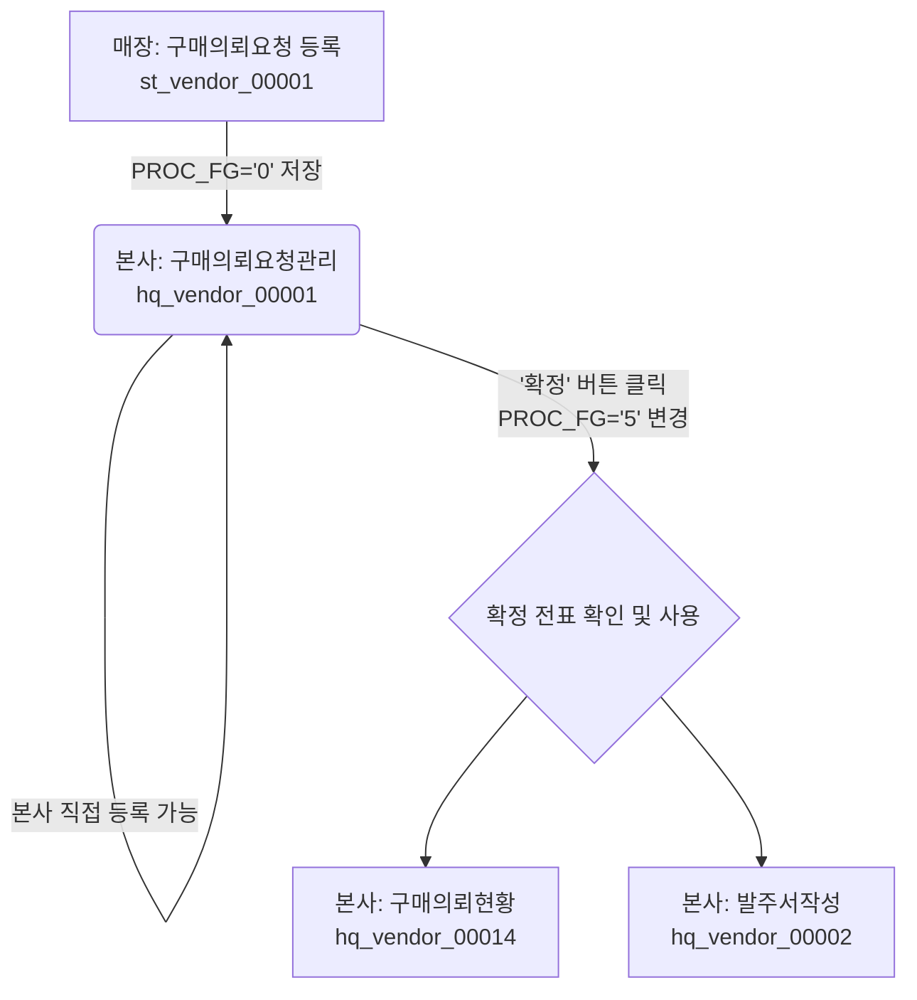
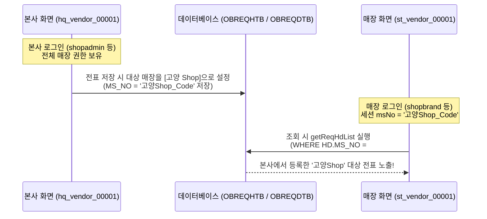

# Hq_Vendor_00001 (구매의뢰요청관리) 화면 검증을 위한 데이터 명세서

이 문서는 본사 > 매입발주 > 매입관리 > 구매의뢰요청관리 화면의 검증을 원활하게 수행하기 위해, 상품 및 거래선 마스터 테이블의 데이터 구조와 화면 조회 조건을 정리한 명세서입니다.

---

## 1. 상품 마스터 테이블 (TGOODSTB) 스키마 분석
상품 마스터에는 체인 식별 컬럼으로 `chainCd`가 아닌 **`chain_no`** 컬럼이 사용됩니다.

* **테이블명**: `hmsfns.TGOODSTB`
* **체인 식별 컬럼**: `chain_no` (VARCHAR(4), NOT NULL)
* **상품 식별 컬럼**: `goods_cd` (VARCHAR(20), NOT NULL)
* **주요 조회 조건 컬럼**:
  * `product_standard` (규격 - 화면 상품 조회 시 필수 조건)
  * `ord_unit` (발주 단위 코드 - `MNAMEMTB` 공통코드 `121`과 조인)

---

## 2. 화면에서 1개만 조회되는 현상 원인 및 데이터 통계
EPAS 개발 DB 기준 데이터 분포 현황은 다음과 같습니다:

* **TGOODSTB 전체 상품 수**: 574개
* **체인별 상품 분포**:
  * `C002` 체인: 558개
  * `C001` 체인: 16개 (현재 테스트 계정이 사용하는 체인)
* **TVNDRGTB (거래선 취급 상품) 등록 수**: 204개

### 상품 조회 API (/getNotReqGoodsList) 필터링 조건
화면에서 미등록 상품 조회를 수행할 때 적용되는 SQL 필터링 조건은 다음과 같습니다.
1. `A.CHAIN_NO = 'C001'` (로그인 세션 체인 코드)
2. `A.PRODUCT_STANDARD IS NOT NULL` (규격 정보가 필수)
3. `EXISTS (SELECT 1 FROM TVNDRGTB X WHERE X.CHAIN_NO = A.CHAIN_NO AND X.GOODS_CD = A.GOODS_CD)` (해당 체인의 거래선 취급 상품으로 등록 필수)

**결과**: 이 조건들을 충족하는 데이터가 DB 상에 **`T0000555` (탄산수)** 단 1개만 존재하여 화면에 1개만 조회됩니다. (현재는 테스트 편의를 위해 15개 상품의 규격을 업데이트하여 16개가 모두 노출됩니다.)

---

## 3. 화면 검증을 위한 테스트 데이터 생성 가이드 (SQL)
화면에서 다양한 상품이 정상적으로 조회되고 추가되는 시나리오를 검증하기 위해, 테스트 데이터를 추가/보완하는 SQL 예시입니다.

### 1단계: TGOODSTB에 C001 체인용 테스트 상품 추가 (또는 규격 업데이트)
현재 `C001` 체인에 등록된 16개 상품 중 규격이 비어 있는 상품에 규격을 입력하거나 신규 상품을 등록합니다.
```sql
-- 기존 상품에 규격 업데이트 예시
UPDATE hmsfns.TGOODSTB 
SET product_standard = '500ml/24pet/box' 
WHERE chain_no = 'C001' 
  AND goods_cd = 'T0000001'; -- 실제 존재하는 C001 소속 상품 코드 입력
```

### 2단계: TVNDRGTB (거래선 취급 상품)에 매핑 등록
미등록 상품 조회(`/getNotReqGoodsList`)는 상품이 거래선에 취급 등록되어 있는 것을 전제로 하므로 아래 매핑 데이터가 있어야 조회됩니다.
```sql
-- 거래선 매핑 등록 예시
INSERT INTO hmsfns.TVNDRGTB (
    chain_no, goods_cd, vendor, main_vnd_fg, 
    ins_dtime, ins_id, upd_dtime, upd_id
) VALUES (
    'C001', 
    'T0000001', -- TGOODSTB에 등록한 상품 코드
    'V00001', -- 실제 등록된 거래선 코드
    '0', -- 메인 거래선 여부
    TO_CHAR(NOW(), 'YYYYMMDDHH24MISS'), 
    'shopadmin', 
    TO_CHAR(NOW(), 'YYYYMMDDHH24MISS'), 
    'shopadmin'
);
```

### 3단계: TPRICETB (상품 단가 테이블) 공급 단가 등록 (선택)
상품 조회 시 `TPRICETB`에 해당 상품의 공급가 단가가 등록되어 있지 않으면 기본 `TGOODSTB.UCOST` 가격으로 대체되지만, 정확한 단가 조회를 위해 공급가를 등록해 줍니다.
```sql
-- 단가 등록 예시 (PRICE_FG='2' 는 공급가 의미)
INSERT INTO hmsfns.TPRICETB (
    chain_no, goods_cd, price_fg, start_date, end_date, 
    price, ins_dtime, ins_id, upd_dtime, upd_id
) VALUES (
    'C001', 
    'T0000001', 
    '2', 
    '20260101', 
    '20261231', 
    5000, 
    TO_CHAR(NOW(), 'YYYYMMDDHH24MISS'), 
    'shopadmin', 
    TO_CHAR(NOW(), 'YYYYMMDDHH24MISS'), 
    'shopadmin'
);
```

---

## 4. 화면 간 데이터 흐름 및 연관 화면 (Flow)
구매의뢰요청 전표가 생성되고 처리되는 전체 라이프사이클에 따른 연관 화면 매핑 정보입니다.

<div class="mermaid-wrapper" style="position: relative; margin-bottom: 20px;">
  <button onclick="navigator.clipboard.writeText(this.nextElementSibling.innerText); alert('Mermaid 코드가 복사되었습니다.');" style="position: absolute; right: 10px; top: 10px; z-index: 100; background: #2563EB; color: white; border: none; padding: 5px 10px; border-radius: 6px; cursor: pointer; font-size: 11px; font-weight: 600; box-shadow: 0 2px 5px rgba(0,0,0,0.1);">코드 복사</button>

```text
graph TD
    A[매장: 구매의뢰요청 등록 <br> st_vendor_00001] -- PROC_FG='0' 저장 --> B(본사: 구매의뢰요청관리 <br> hq_vendor_00001)
    B -- 본사 직접 등록 가능 --> B
    B -- '확정' 버튼 클릭 <br> PROC_FG='5' 변경 --> C{확정 전표 확인 및 사용}
    C --> D[본사: 구매의뢰현황 <br> hq_vendor_00014]
    C --> E[본사: 발주서작성 <br> hq_vendor_00002]
```


</div>

### 1) 사전 데이터 입력 (요청 흐름)
* **매장 화면**: **매장 > 매입발주 > 매입관리 > 구매의뢰요청 (`st_vendor_00001`)**
* **설명**: 매장에서 발주가 필요한 품목을 의뢰하여 본사로 전달하는 화면입니다. 여기서 저장한 전표가 본사 화면의 대기 데이터가 됩니다.

### 2) 확정 전표 확인 및 다음 단계 (처리 흐름)
본사 화면에서 확정한 전표는 상태값이 `PROC_FG = '5'`로 업데이트되며, 다음 화면들에서 사용 및 확인됩니다.
* **현황 모니터링**: **본사 > 매입발주 > 매입관리 > 구매의뢰현황 (`hq_vendor_00014`)**
  * 의뢰된 내역들의 처리 현황을 날짜별/매장별로 필터링하여 모니터링합니다.
* **발주 연계 처리**: **본사 > 매입발주 > 매입관리 > 발주서작성 (`hq_vendor_00002`)**
  * 본사 확정된 구매의뢰 건을 끌어와 실제 공급업체(Vendor)로의 정식 발주 전표(`OBSLPHTB`)를 작성하는 화면입니다.

---

## 5. 본사(HQ) - 매장(ST) 간 데이터 공유 및 매장별 조회 연동 메커니즘

본사 화면(`hq_vendor_00001`)과 매장 화면(`st_vendor_00001`)은 동일한 데이터베이스 테이블을 공유하며, 사용자 세션의 매장 코드(`ms_no`) 세팅에 의해 데이터 노출 범위가 결정되는 상호 보완적인 구조입니다.

### 5.1 물리 공유 테이블
* **구매의뢰 헤더 마스터**: `hmsfns.OBREQHTB`
* **구매의뢰 상세 품목**: `hmsfns.OBREQDTB`

### 5.2 데이터 흐름 및 조회 필터링 매커니즘
본사에서 등록한 데이터가 매장 사용자에게 보이고, 반대로 매장에서 의뢰한 데이터가 본사로 취합되는 구체적인 쿼리 흐름은 다음과 같습니다.

<div class="mermaid-wrapper" style="position: relative; margin-bottom: 20px;">
  <button onclick="navigator.clipboard.writeText(this.nextElementSibling.innerText); alert('Mermaid 코드가 복사되었습니다.');" style="position: absolute; right: 10px; top: 10px; z-index: 100; background: #2563EB; color: white; border: none; padding: 5px 10px; border-radius: 6px; cursor: pointer; font-size: 11px; font-weight: 600; box-shadow: 0 2px 5px rgba(0,0,0,0.1);">코드 복사</button>

```text
sequenceDiagram
    participant HQ as 본사 화면 (hq_vendor_00001)
    participant DB as 데이터베이스 (OBREQHTB / OBREQDTB)
    participant ST as 매장 화면 (st_vendor_00001)

    Note over HQ: 본사 로그인 (shopadmin 등)<br/>전체 매장 권한 보유
    HQ->>DB: 전표 저장 시 대상 매장을 [고양 Shop]으로 설정<br/>(MS_NO = '고양Shop_Code' 저장)
    
    Note over ST: 매장 로그인 (shopbrand 등)<br/>세션 msNo = '고양Shop_Code'
    ST->>DB: 조회 시 getReqHdList 실행<br/>(WHERE HD.MS_NO = #{msNo} 필터 강제 적용)
    DB-->>ST: 본사에서 등록한 '고양Shop' 대상 전표 노출!
```


</div>

1. **본사 등록 시의 데이터 매핑 (`MS_NO` 기준)**:
   * 본사 사용자(`shopadmin` 등)는 모든 매장의 전표를 제어할 수 있으므로 특정 매장 필터가 강제되지 않습니다.
   * 본사 화면에서 새로운 전표를 작성할 때 대상 매장을 **"고양 Shop"**으로 지정하여 저장하면, `OBREQHTB` 테이블의 `MS_NO` 컬럼에 해당 매장의 고유 매장 코드가 삽입됩니다.

2. **매장 조회 시의 세션 조건 필터링**:
   * 매장 사용자(`shopbrand` 등)는 본인이 속한 매장의 전표만 조회할 수 있어야 하므로, 컨트롤러와 MyBatis 쿼리(`St_Vendor_00001_Sql.xml`)에 세션에서 주입된 매장 코드가 필터 조건으로 강제 주입됩니다.
   * **MyBatis 조건문**: `AND HD.MS_NO = #{msNo}`
   * 결과적으로 본사에서 생성해준 전표의 `MS_NO`와 매장 사용자의 로그인 세션 `msNo`가 일치하므로, 본사에서 입력한 데이터가 매장 화면에서도 실시간 연동되어 정상 조회됩니다.

