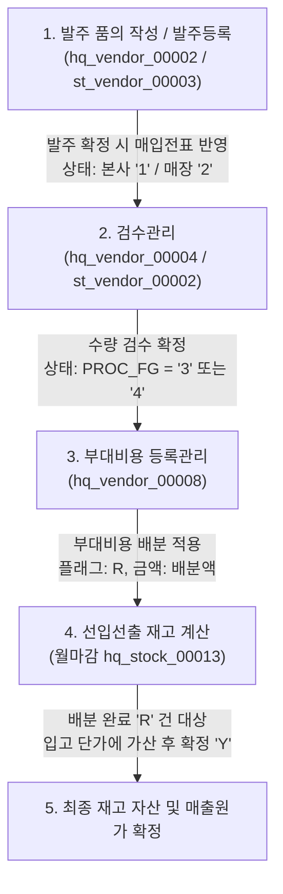

# 부대비용(Extra Cost) 데이터 라이프사이클 및 연쇄 분석 보고서

본 문서는 HMS 시스템 내에서 발생하는 **부대비용(Extra Cost)** 데이터가 최초 발제부터 배분, 검수, 그리고 최종 재고 선입선출(FIFO) 원가에 반영되는 전체 흐름과 기술적 매핑 관계를 상세히 정의합니다.

---

## 1. 부대비용 라이프사이클 개요

부대비용은 매입(입고) 시 발생하는 운반비, 포장비, 통관 수수료 등 물품의 순수 단가 외에 추가로 소요되는 모든 비용을 의미합니다. HMS 시스템은 이 부대비용을 개별 품목의 입고 원가에 적절히 안분(배분)하여 **정확한 매출원가(COGS) 및 재고 자산 평가**를 수행하도록 설계되어 있습니다.

실제 부대비용 등록 및 배분은 **매입전표의 검수가 최종 확정된 이후**에 진행됩니다. 전체적인 흐름은 다음과 같습니다.

<div class="mermaid-wrapper" style="position: relative; margin-bottom: 20px;">
  <button onclick="navigator.clipboard.writeText(this.nextElementSibling.innerText); alert('Mermaid 코드가 복사되었습니다.');" style="position: absolute; right: 10px; top: 10px; z-index: 100; background: #2563EB; color: white; border: none; padding: 5px 10px; border-radius: 6px; cursor: pointer; font-size: 11px; font-weight: 600; box-shadow: 0 2px 5px rgba(0,0,0,0.1);">코드 복사</button>

```text
graph TD
    A["1. 발주 품의 작성 / 발주등록<br>(hq_vendor_00002 / st_vendor_00003)"] -->|발주 확정 시 매입전표 반영<br>상태: 본사 '1' / 매장 '2'| B["2. 검수관리<br>(hq_vendor_00004 / st_vendor_00002)"]
    B -->|수량 검수 확정<br>상태: PROC_FG = '3' 또는 '4'| C["3. 부대비용 등록관리<br>(hq_vendor_00008)"]
    C -->|부대비용 배분 적용<br>플래그: R, 금액: 배분액| D["4. 선입선출 재고 계산<br>(월마감 hq_stock_00013)"]
    D -->|배분 완료 'R' 건 대상<br>입고 단가에 가산 후 확정 'Y'| E["5. 최종 재고 자산 및 매출원가 확정"]
```


</div>

---

## 2. 선행 프로세스 및 데이터 노출 조건 (Pre-requisites)

부대비용 등록관리 (`hq_vendor_00008`) 화면에 대상 매입전표가 조회되어 부대비용을 입력할 수 있게 하려면, 사전에 아래의 화면들을 거쳐 데이터가 완비되어 있어야 합니다.

### 2.1 선행 데이터 등록 화면
1. **발주 발제 및 확정**:
   * **`hq_vendor_00002` (본사 발주품의작성)**: 구매의뢰 후 발주 품의를 최종 확정하는 시점에 매입전표(`OBSLPHTB` / `OBSLPDTB`)가 최초 생성됩니다. (최초 생성 시 진행 구분 `PROC_FG = '1'`)
   * **`st_vendor_00003` (매장 발주등록)**: 매장에서 직접 등록할 때 매입전표가 최초 생성되며(이때 진행 구분 `PROC_FG = '0'`), 최종 발주 확정을 완료하는 시점에 진행 구분 `PROC_FG = '2'`로 갱신됩니다.
2. **검수(체크) 확정**:
   * **`hq_vendor_00004` (본사 검수관리)** 또는 **`st_vendor_00002` (매장 검수관리)** 화면에서 해당 매입전표를 조회하여 검수 수량을 입력하고 최종 **검수 확정(완료)** 처리를 수행해야 합니다. (이때 전표의 진행 구분 `PROC_FG`가 `'3'` 또는 `'4'`로 변경됨)

### 2.2 부대비용 화면 (`hq_vendor_00008`) 조회 쿼리 제약 조건
* `Hq_Vendor_00008_Sql.xml` 의 `selectVendorOrderList` 조회 조건에 맞아야 전표 목록에 나타납니다.
  - `BH.SLIP_FG = '0'` : 매입전표 형태여야 함.
  - `BH.NO_ORDER_YN = 'N'` : 정상 발주를 통한 입고 건이어야 함.
  - **`BH.PROC_FG IN ('3', '4')`** : 검수대기(`'3'`) 또는 검수완료(`'4'`) 상태의 정산 대상 전표여야 함.
  - `BH.PURCH_DATE` 가 설정한 검색 기간 내에 속해야 함.
  - **`MM.CHAIN_NO = #{chainNo}` (체인 코드 일치)**: 로그인한 본사 관리자 계정의 체인 번호와 매장(전표)의 체인 번호가 반드시 일치해야 함 (상이할 경우 조회에서 누락됨).

---

## 3. 단계별 상세 분석

### 3.1 [발제] 발주등록 및 품의작성
* **대상 화면**: 본사 발주품의작성 (`hq_vendor_00002`)
* **데이터 동작**: 
  - 본사에서 발주 품의를 최종 확정(`confirmSupply`)하는 시점에 매입 전표 테이블인 `OBSLPHTB` (헤더) 및 `OBSLPDTB` (상세) 레코드를 생성합니다.
  - 이 단계에서는 아직 배분할 부대비용이 확정되지 않았으므로 아래와 같이 **초기화 값**으로 삽입됩니다.
* **관련 쿼리 (`Hq_Vendor_00002_Sql.xml`):**
  ```sql
  INSERT INTO hmsfns.OBSLPDTB (
      ORDER_DATE, MS_NO, SLIP_NO, SLIP_FG, LINE_NO, GOODS_CD, 
      ...
      GOODS_EXTRA_COST_AMT, GOODS_EXTRA_COST_YN
  ) VALUES (
      #{orderDate}, #{msNo}, #{slipNo}, '0', #{lineNo}, #{goodsCd},
      ...
      0, 'N'  -- 부대비용 0원, 배분상태 'N'(미배분)으로 초기 세팅
  );
  ```

---

### 2.2 [배분] 부대비용 등록 및 적용
* **대상 화면**: 본사 부대비용 등록관리 (`hq_vendor_00008`)
* **데이터 동작**: 
  - 특정 월/매장 조건으로 입고 전표 목록을 조회한 후, 해당 전표에 추가로 발생한 부대비용 총액을 입력하고 배분 기준(금액 비율 or 수량 비율)을 선택하여 적용합니다.
  - 적용 시 `OBSLPDTB`의 각 품목별로 금액이 안분되어 저장되며, 배분 완료 플래그(`GOODS_EXTRA_COST_YN`)가 `'R'`(배분 완료)로 갱신됩니다.

#### 📊 부대비용 배분 관련 주요 테이블 및 컬럼 매핑

| 구분 | 물리 테이블명 | 논리 컬럼명 (물리 컬럼명) | 데이터 타입 | 설명 |
| :--- | :--- | :--- | :--- | :--- |
| **전표 헤더** | `hmsfns.OBSLPHTB` | 전표 부대비용 금액 (`SLIP_EXTRA_COST_AMT`) | `NUMERIC(15,3)` | 해당 전표에 발생한 총 부대비용 합계액 |
| | | 부대비용 생성일자 (`SLIP_EXTRA_COST_CREATE_DATE`) | `VARCHAR(8)` | 부대비용이 최초로 배분 및 저장된 일자 |
| **전표 상세** | `hmsfns.OBSLPDTB` | 상품 부대비용 금액 (`GOODS_EXTRA_COST_AMT`) | `NUMERIC(15,3)` | 전체 부대비용 중 해당 품목에 안분된 금액 |
| | | 부대비용 배분 상태 (`GOODS_EXTRA_COST_YN`) | `VARCHAR(1)` | **`N`**: 미배분, **`R`**: 배분완료, **`Y`**: 재고마감반영완료 |
| | | 부대비용 생성일자 (`GOODS_EXTRA_COST_CREATE_DATE`) | `VARCHAR(8)` | 상세 품목별 부대비용이 계산 및 입력된 일자 |

#### 📐 부대비용 배분 산식 공식

##### 1) 금액 비율 배분 (수식)
각 품목의 **매입 금액**이 차지하는 비율만큼 총 부대비용을 나눕니다.
$$\text{상품별 배분액} = \text{총 부대비용} \times \frac{\text{해당 품목 매입금액 (PURCH\_QTY} \times \text{PURCH\_UCOST)}}{\text{전표 내 전체 품목의 매입금액 총합}}$$
* *주의*: 최종 배분액은 소수점 첫째 자리에서 반올림(`ROUND`)하여 원 단위 정수로 처리됩니다.

##### 2) 수량 비율 배분 (수식)
각 품목의 **매입 수량**이 차지하는 비율만큼 총 부대비용을 나눕니다.
$$\text{상품별 배분액} = \text{총 부대비용} \times \frac{\text{해당 품목 매입수량 (PURCH\_QTY)}}{\text{전표 내 전체 품목의 매입수량 총합}}$$


#### 💡 배분 기준별 비교 및 안분 예시
만약 한 전표 안에 **A품목(고가/소량)**과 **B품목(저가/대량)**이 섞여 있고, 배분할 총 부대비용이 **10,000원**일 때의 차이입니다.
* **A품목**: 10개 매입, 단가 1,000원 $\rightarrow$ **매입금액: 10,000원**
* **B품목**: 90개 매입, 단가 100원 $\rightarrow$ **매입금액: 9,000원**
* **합계**: 총 수량 100개, 총 매입금액: 19,000원

| 배분 방식 | 품목 | 배분 비율 계산식 | 최종 배분액 (품목당) | 비즈니스적 의미 및 용도 |
| :--- | :--- | :--- | :--- | :--- |
| **금액 비율 배분**<br>`(procFg = '0')` | **A품목**<br>**B품목** | 10,000원 / 19,000원 = **52.6%**<br>9,000원 / 19,000원 = **47.4%** | **5,263원** (개당 526원)<br>**4,737원** (개당 53원) | 상품의 **가격(가치)에 비례**하여 비용을 얹는 방식.<br>(예: 보석과 포장용 상자가 섞여 있을 때 보석에 물류/보관비를 더 많이 책정하는 경우) |
| **수량 비율 배분**<br>`(procFg = '1')` | **A품목**<br>**B품목** | 10개 / 100개 = **10%**<br>90개 / 100개 = **90%** | **1,000원** (개당 100원)<br>**9,000원** (개당 100원) | 상품의 가격과 무관하게 **순수 수량(부피/무게)**에 비례하여 쪼개는 방식.<br>(예: 갯수당 일정하게 요금이 청구되는 택배비, 상하차 비용을 분배하는 경우) |

* **배분 기준별 쿼리 (`Hq_Vendor_00008_Sql.xml`):**
  
  **① 금액 비율 기준 배분 (`procFg = '0'`):**
  - 각 상세 품목의 매입금액(`PURCH_QTY * PURCH_UCOST`) 비율에 맞춰 부대비용을 안분합니다.
  ```sql
  UPDATE hmsfns.OBSLPDTB A
  SET A.GOODS_EXTRA_COST_AMT = (
      SELECT ROUND(#{extraCostAmt} * ((PURCH_QTY * PURCH_UCOST) / NULLIF(SUM(PURCH_QTY * PURCH_UCOST) OVER(), 0)))
      FROM hmsfns.OBSLPDTB B
      WHERE B.ORDER_DATE = A.ORDER_DATE AND B.MS_NO = A.MS_NO AND B.SLIP_NO = A.SLIP_NO AND B.LINE_NO = A.LINE_NO
  ),
  A.GOODS_EXTRA_COST_YN = 'R',
  A.GOODS_EXTRA_COST_CREATE_DATE = TO_CHAR(SYSDATE, 'YYYYMMDD')
  WHERE (ORDER_DATE, MS_NO, SLIP_NO) IN ((#{orderDate}, #{msNo}, #{slipNo}));
  ```

  **② 수량 비율 기준 배분 (`procFg = '1'`):**
  - 각 상세 품목의 매입수량(`PURCH_QTY`) 비율에 맞춰 부대비용을 안분합니다.
  ```sql
  UPDATE hmsfns.OBSLPDTB A
  SET A.GOODS_EXTRA_COST_AMT = (
      SELECT ROUND(#{extraCostAmt} * (PURCH_QTY / NULLIF(SUM(PURCH_QTY) OVER(), 0)))
      FROM hmsfns.OBSLPDTB B
      WHERE B.ORDER_DATE = A.ORDER_DATE AND B.MS_NO = A.MS_NO AND B.SLIP_NO = A.SLIP_NO AND B.LINE_NO = A.LINE_NO
  ),
  A.GOODS_EXTRA_COST_YN = 'R',
  A.GOODS_EXTRA_COST_CREATE_DATE = TO_CHAR(SYSDATE, 'YYYYMMDD')
  WHERE (ORDER_DATE, MS_NO, SLIP_NO) IN ((#{orderDate}, #{msNo}, #{slipNo}));
  ```

---

### 2.3 [검수] 검수관리 화면
* **대상 화면**: 본사 검수관리 (`hq_vendor_00004`) 및 매장 검수관리 (`st_vendor_00002`)
* **데이터 동작**: 
  - 검수 대상 전표의 상세 정보를 로드할 때 각 품목별로 배분되어 있는 부대비용(`GOODS_EXTRA_COST_AMT`)을 합산 조회하여 화면 그리드에 매입액과 함께 참고값으로 표기해 줍니다.
* **관련 쿼리 (`Hq_Vendor_00004_Sql.xml`):**
  ```sql
  SELECT A.ORDER_DATE, A.MS_NO, A.SLIP_NO,
         SUM(B.GOODS_EXTRA_COST_AMT) AS GOODS_EXTRA_COST_AMT
  FROM hmsfns.OBSLPHTB A
  INNER JOIN hmsfns.OBSLPDTB B 
    ON B.ORDER_DATE = A.ORDER_DATE AND B.MS_NO = A.MS_NO AND B.SLIP_NO = A.SLIP_NO
  ...
  GROUP BY A.ORDER_DATE, A.MS_NO, A.SLIP_NO;
  ```

---

### 2.4 [반영] 선입선출(FIFO) 재고 원가 가산
* **대상 프로세스**: 백엔드 재고 단가 계산 프로시저 (`Sp_SUB_STOCK_FIFO_MAIN_P`, `Sp_SUB_STOCK_FIFO_PROC_P`)
* **데이터 동작**:
  - 매장/본사의 마감 시점에 기동되는 선입선출 원가 정산 프로시저에서 입고 단가(원가)를 산정할 때 부대비용을 반영합니다.
  - 전표 상세 레코드 중 **배분 완료 플래그(`GOODS_EXTRA_COST_YN`)가 `'R'`인 건만 필터링**하여 해당 품목의 단품 부대비용(`부대비용총액 / 입고수량`)을 입고 단가에 플러스 가산합니다.
* **핵심 로직 쿼리 (`Sp_SUB_STOCK_FIFO_PROC_P.xml`):**
  ```sql
  -- 입고 원가 계산 시 부대비용을 수량으로 나눈 단가를 산출하여 합산함
  SELECT 
      DECODE(GOODS_EXTRA_COST_YN, 
             'R', ROUND(GOODS_EXTRA_COST_AMT / #{trbkQty}, 3), 
             0
      ) AS iGoodsExtraCostAmt
  FROM hmsfns.OBSLPDTB
  ...
  ```
  - 이렇게 합산된 부대비용 단가는 품목의 최종 **입고원가**에 더해지며, 해당 품목이 출고(판매)될 때 매출원가로 대응 처리됩니다.

---

### 2.5 [확정] 재고 마감 반영 완료 상태 ('Y') 처리
* **대상 프로세스**: 선입선출 일자별 마감 정산 서비스 (`Sp_SUB_STOCK_FIFO_PROC_P_Service`)
* **데이터 동작**:
  - 재고 정산 과정에서 부대비용이 정상적으로 재고 단가에 가산(합산) 처리 완료된 직후, 중복 정산 및 임의 변경을 방지하기 위해 배분상태 플래그를 **`'Y'` (재고반영 완료)**로 최종 변경합니다.
  - 이와 동시에 처리 일시(`GOODS_EXTRA_COST_PROC_DTIME`)와 마감월(`GOODS_EXTRA_COST_PROC_MONTH`)을 업데이트합니다.
  - 만약 이미 `'Y'`인 레코드를 재처리하려고 시도할 경우, 정합성 위반으로 판단하여 `-20102 GOODS_EXTRA_COST_YN ERROR!!` 예외를 던지며 전체 배치가 롤백됩니다.
* **관련 쿼리 및 Java 소스:**
  ```java
  // Sp_SUB_STOCK_FIFO_PROC_P_Service.java 내 로직
  if ("R".equals(iGoodsExtraCostYn)) {
      // 배분 완료('R') 상태인 건에 한해 'Y'(최종 반영)로 업데이트
      mapper.updateObslpdtb(iRowId, dto.getcEndMonth());
  } else if ("Y".equals(iGoodsExtraCostYn)) {
      // 이미 반영 완료('Y')인 경우 중복 처리 오류 차단
      handleError(dto, "-20102 SUB_STOCK_FIFO_PROC_P -> GOODS_EXTRA_COST_YN ERROR!!");
      return false;
  }
  ```
  ```sql
  -- Sp_SUB_STOCK_FIFO_PROC_P_Sql.xml (updateObslpdtb)
  UPDATE hmsfns.OBSLPDTB 
     SET GOODS_EXTRA_COST_YN = 'Y'
       , GOODS_EXTRA_COST_PROC_DTIME = TO_CHAR(SYSDATE, 'YYYYMMDDHH24MISS')
       , GOODS_EXTRA_COST_PROC_MONTH = #{cEndMonth}
   WHERE ROWID = CHARTOROWID(#{rowId});
  ```
* **마감 취소 시의 처리**:
  - 만약 마감 작업을 취소하게 되는 경우, 메인 마감 취소 프로세스(`Sp_SUB_STOCK_FIFO_MAIN_P_Service`)에 의해 해당 마감월에 속한 매입전표들의 상태를 다시 `'R'` (배분 완료)로 롤백시켜 줍니다.

---

## 3. 요약 및 주의사항

1. **단가 변동 시점의 구분 (핵심)**:
   * **부대비용 등록관리 화면 (`hq_vendor_00008`)**: 화면에서 적용 시 품목의 순수 매입단가(`PURCH_UCOST`)는 변경되지 않고 그대로 보존됩니다. 오직 안분된 배분액이 `GOODS_EXTRA_COST_AMT`에만 기록되고 플래그가 `'R'`로 변경됩니다.
   * **선입선출 정산 배치 (`Sp_SUB_STOCK_FIFO_PROC_P`)**: 후행 배치 프로세스가 돌 때 비로소 배분액을 수량으로 나눈 단가(`부대비용 / 입고수량`)를 계산하여, 기존 단가에 합산한 최종 **입고원가**를 재고원장(`STCKHITB`)에 반영합니다.
2. **수불 및 단가 갱신 트리거 배제 (Bypass)**:
   * 부대비용 적용 시 전표 상세(`OBSLPDTB`) 테이블에 업데이트(`U`)가 발생하므로 후행 자바 트리거 서비스(`Tr_OBSLPD_T01_Service`)가 자동으로 기동됩니다.
   * 그러나 전표 진행 상태(`procFg`)가 변동되지 않았기 때문에, 트리거 내부 로직에 의해 재고 수불 가감 및 수불 로그(`obslplog`) 적재, 그리고 즉각적인 단가 변경 등의 모든 작업은 **실행되지 않고 우회(Bypass)** 처리되어 안전하게 데이터 정합성이 보호됩니다.
3. **선후 관계 및 마감 배치 기동 시점 (업무 필수 제약)**:
   * **배치 실행 방식**: 선입선출 단가를 정산하는 배치는 주기적 자동 크론(Cron) 방식이 아닌, 본사 담당자가 **월마감 관리 (`hq_stock_00013`)** 화면에서 대상 월을 선택하고 **[월마감 처리] 버튼을 수동으로 클릭**하여 기동하는 방식입니다.
   * **업무적 선후 관계**: 특정 월에 발생한 부대비용 배분(`hq_vendor_00008`)은 반드시 담당자가 **`hq_stock_00013` 화면에서 월마감 버튼을 누르기 전에 완료(`'R'`)**되어 있어야 합니다. 
   * **마감 이후 차단**: 이미 월마감이 실행되어 전표 상세의 플래그가 `'Y'`(재고반영 완료)로 잠긴 이후에는, 부대비용 등록관리 화면에서 부대비용을 추가하거나 변경하려고 해도 이미 확정된 상태이므로 저장 처리가 엄격히 차단됩니다.
 4. **오류 방지 설계 (Division by zero)**: 분모(제수)가 `0`이 되는 상황을 방어하기 위해 `NULLIF(..., 0)` 표준 구문이 적용되어 비정상적인 데이터 연산 시에도 무조건적인 에러(Division by zero) 유발을 막고 `NULL`로 처리되도록 설계되었습니다.

---

### 5. 화면에서의 부대비용 배분액 확인 방법

배분 완료된 부대비용 데이터는 DB 직접 조회 외에 다음 화면들을 통해서도 확인 가능합니다.
* **`hq_vendor_00008` (본사 부대비용 등록관리) 화면 하단 그리드**:
  - 부대비용 적용 완료 후 화면 하단의 상세 내역 그리드를 조회하면, 각 품목별로 배분되어 들어간 `GOODS_EXTRA_COST_AMT` 금액이 그리드 상의 컬럼을 통해 직접 표기됩니다.
* **`hq_vendor_00004` / `st_vendor_00002` (검수관리) 화면**:
  - 품목별 부대비용 컬럼이 화면에 직접 제공되지는 않으나, 해당 전표의 상세 조회 시 헤더 정보에 합산된 총 부대비용(`SLIP_EXTRA_COST_AMT`)을 확인할 수 있어 전체 부대비용 반영 금액을 간접 모니터링할 수 있습니다.


---

## 4. 테스트 시나리오 및 추천 테스트 계정

로컬 테스트 시 본사(`hq`)와 매장(`st`) 프로세스를 올바르게 대조하고 데이터 노출을 검증하기 위한 추천 테스트 계정 및 상세 시나리오 정보입니다. (비밀번호는 모두 `0`입니다.)

> [!WARNING]
> **체인 코드(CHAIN_NO) 정합성 주의**
> 본사 관리자 계정과 매장(전표)은 동일한 체인(`CHAIN_NO`)에 속해 있어야만 `hq_vendor_00008` 등 본사 조회 화면에서 전표가 검색됩니다. 계정이 섞이지 않도록 반드시 동일한 열(Line)에 위치한 계정 쌍으로 테스트를 진행하십시오.

### 4.1 추천 테스트 계정 쌍

로컬 DB 마스터 데이터 세팅 기준, 현재 **`C002` (F&B 체인)** 소속의 매장 매니저 계정이 존재하지 않습니다. (매장 `NC0006`, `NC0019` 매장에 등록된 사용자가 없음) 
따라서 `fnbcafe` 계정(매장 `NC0007` - 체인 `C001`로 세팅됨)으로 발주한 내역은 F&B 본사 계정(`fnbadmin` - 체인 `C002`)이 아닌, **`shopadmin` (체인 `C001`)**으로 로그인해야만 조회할 수 있습니다.

| 구분 | C001 체인 (F&B 카페 및 Shop 매장) | C002 체인 (F&B 본부 전용) |
| :--- | :--- | :--- |
| **체인 번호 (CHAIN_NO)** | **`C001`** | **`C002`** |
| **본사 관리자 ID** | **`shopadmin`** (본부_SHOP) | **`fnbadmin`** (본부_고양 F&B) |
| **매장 매니저 ID** | **`fnbcafe`** (카페 매장) 또는 **`shopbrand`** (샵 매장) | (C002 소속 매장 계정 없음) |
| **매칭 매장 (MS_NO)** | `CAFE` (코드: `NC0007`) / `고양 Shop` (코드: `NC0003`) | `본부_고양 F&B` (코드: `NC0005`) |


---

### 4.2 테스트 진행 시나리오

최종 목표인 **`hq_vendor_00008` (본사 부대비용 등록관리) 화면에 데이터가 노출**되게 하려면, 발주 확정 이후 반드시 **검수 확정 처리**까지 완료하여 매입전표의 상태를 **`PROC_FG = '3'` (검수대기) 또는 `'4'` (검수완료)**로 변경해 주어야 합니다.

> [!IMPORTANT]
> 아래 시나리오 진행 시, 반드시 **4.1의 동일한 열(Line)에 있는 본사 계정-매장 계정 쌍**을 사용하십시오. 계정이 교차되어 섞일 경우(예: 매장은 `NC0007`로 발주하고 본사는 `fnbadmin`으로 로그인) 체인 불일치로 전표 조회가 불가능합니다.

#### 💡 시나리오 A : 매장 직접 발주 후 검수하여 데이터 적재
매장 화면에서 직접 발주를 등록하고 검수까지 완료하여 부대비용 등록 대상 전표를 만드는 흐름입니다.

1. **매장 발주 등록 및 확정 (`st_vendor_00003`)**:
   * 매장 매니저 계정(예: 카페 계열의 경우 `fnbcafe`, 샵 계열의 경우 `shopbrand`)으로 로그인합니다.
   * [발주관리] 화면에서 상품을 담아 발주를 등록(`PROC_FG = '0'`)한 뒤 **[확정]**을 완료합니다. (진행 구분 `PROC_FG = '2'` 상태의 매입전표 생성)
2. **매장 검수관리 및 검수 확정 (`st_vendor_00002` 또는 본사 `hq_vendor_00004`)**:
   * 앞서 로그인한 매장 매니저 계정으로 [검수관리] 화면으로 이동합니다.
   * 1단계에서 확정한 매입전표를 조회하여 **검수 수량을 입력하고 최종 [검수 확정]**을 처리합니다.
   * **결과**: 이 처리에 의해 매입전표 헤더(`OBSLPHTB`)의 **진행 구분(`PROC_FG`)이 `'3'` (입고-매장대기) 또는 `'4'` (입고-본사확정)**로 변경됩니다.
3. **부대비용 등록관리 조회 (`hq_vendor_00008`)**:
   * 매장 체인과 일치하는 **본사 관리자 계정(예: 카페 계열의 경우 `fnbadmin`, 샵 계열의 경우 `shopadmin`)**으로 로그인하여 [부대비용 등록관리] 화면으로 이동합니다.
   * 검색 조건을 입력하고 조회하면, 검수 확정된 매장(예: `CAFE` 또는 `고양 Shop`)의 전표가 목록에 정상 노출되며 부대비용 배분 테스트를 진행할 수 있습니다.

#### 💡 시나리오 B : 매장 요청 ➡ 본사 승인 및 검수하여 데이터 적재
매장의 요청을 본사가 품의/발주 승인하고, 이후 검수 처리를 거쳐 부대비용 등록 대상 전표를 만드는 흐름입니다.

1. **매장 구매요청 등록 및 확정 (`st_vendor_00001`)**:
   * 매장 매니저 계정(예: 카페 계열의 경우 `fnbcafe`, 샵 계열의 경우 `shopbrand`)으로 로그인 후 [구매요청] 화면에서 상품을 담아 임시저장(`PROC_FG = '0'`)하고 **[확정]** 처리합니다. (의뢰확정: `PROC_FG = '5'`)
2. **본사 발주품의 및 발주 확정 (`hq_vendor_00002`)**:
   * 매장 체인과 일치하는 **본사 관리자 계정(예: 카페 계열의 경우 `fnbadmin`, 샵 계열의 경우 `shopadmin`)**으로 로그인하여 [본사 발주품의작성] 화면에서 해당 의뢰 건을 조회합니다.
   * **[품의 확정]**(`PROC_FG = '1'`)을 거쳐 **[발주 확정]**(`PROC_FG = '3'`) 처리를 수행합니다.
   * **결과**: 이 시점에 최초 진행 구분 **`PROC_FG = '1'` (발주확정) 상태의 매입전표**가 자동으로 생성됩니다.
3. **본사 검수관리 및 검수 확정 (`hq_vendor_00004`)**:
   * 동일한 본사 관리자 계정으로 [본사 검수관리] 화면으로 이동합니다.
   * 매장 코드를 앞서 등록한 매장(예: `CAFE` 또는 `고양 Shop`)으로 설정하여 2단계에서 생성된 매입전표를 조회합니다.
   * 해당 전표의 상세 품목들에 대한 **검수 수량을 입력한 뒤 최종 [검수 확정]**을 완료합니다.
   * **결과**: 이 검수 확정에 의해 매입전표의 **진행 구분(`PROC_FG`)이 `'3'` 또는 `'4'`**로 변경됩니다.
4. **부대비용 등록관리 조회 (`hq_vendor_00008`)**:
   * 동일한 본사 관리자 계정으로 [부대비용 등록관리] 화면으로 이동하여 검색 조건을 입력하고 조회하면, 검수 완료된 매장 전표가 조회 대상 목록에 나타납니다.


