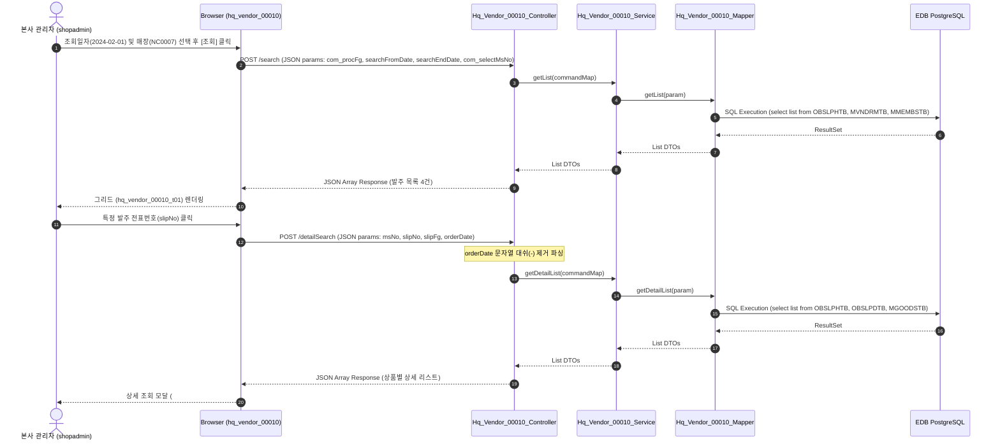

# QA Report: Hq_Vendor_00010 거래처별 발주 현황

**작성일**: 2026-06-10  
**작성자**: AI QA Agent (Antigravity)  
**대상 화면**: [HQ] 매입발주 > 매입현황 > 거래처별 발주 현황 (`hq_vendor_00010`)  
**테스트 환경**: localhost:8080 (로컬 개발 서버)  
**접속ID/PW**: shopadmin / 0000 (C001 체인 권한)  

---

## 1. 분석 개요

### 1.1 분석 대상 파일 목록

| 구분 | 파일 경로 |
|------|-----------|
| Controller | `backoffice/hyundai-backoffice-webapp/src/main/java/com/hyundai/backoffice/webapp/controller/hq/vendor/Hq_Vendor_00010_Controller.java` |
| Service | `backoffice/hyundai-backoffice-layer-service/src/main/java/com/hyundai/backoffice/webapp/service/hq/vendor/Hq_Vendor_00010_Service.java` |
| Mapper (Interface) | `backoffice/hyundai-backoffice-layer-persistence/src/main/java/com/hyundai/backoffice/webapp/dao/hq/vendor/Hq_Vendor_00010_Mapper.java` |
| SQL XML | `backoffice/hyundai-backoffice-webapp/src/main/resources/sqlmapper/vendor/Hq_Vendor_00010_Sql.xml` |
| DTO | `backoffice/hyundai-backoffice-layer-domain/src/main/java/com/hyundai/backoffice/webapp/dto/hq/vendor/Hq_Vendor_00010_GetListDto.java`<br/>`backoffice/hyundai-backoffice-layer-domain/src/main/java/com/hyundai/backoffice/webapp/dto/hq/vendor/Hq_Vendor_00010_GetDetailListDto.java` |
| JSP | `backoffice/hyundai-backoffice-webapp/src/main/webapp/WEB-INF/views/backoffice/main/contents/hq/vendor/hq_vendor_00010/hq_vendor_00010.jsp` |
| JS (Business Logic) | `backoffice/hyundai-backoffice-webapp/src/main/webapp/WEB-INF/views/backoffice/main/contents/hq/vendor/hq_vendor_00010/js/hq_vendor_00010.js` |
| JS (Bootstrap Table) | `backoffice/hyundai-backoffice-webapp/src/main/webapp/WEB-INF/views/backoffice/main/contents/hq/vendor/hq_vendor_00010/js/hq_vendor_00010_bt.js` |

---

## 2. 엔드포인트 분석

### 2.1 Base URL
```
POST /backoffice/data/hq/vendor/hq_vendor_00010/{endpoint}
```

### 2.2 엔드포인트 목록

| 엔드포인트 | HTTP | 기능 | ServiceLog |
|-----------|------|------|------------|
| `/search` | POST | 거래처별 발주 현황 목록 조회 | SELECT |
| `/detailSearch` | POST | 전표 기준 상품별 발주 상세 내역 조회 | SELECT |

---

## 3. 서비스 로직 및 데이터 흐름 분석

본 화면은 거래처별 주문 및 반품 발주 현황과 그 상세 내역을 파악하는 **단순 조회(SELECT) 전용** 화면입니다.

* **CUD(등록/수정/삭제) 로직 부재**: 화면 UI 및 백엔드 로직에 데이터를 저장, 수정, 삭제하는 DML 코드가 존재하지 않습니다.
* **DB 트리거 영향도 없음**: 발주 대상 테이블(`hmsfns.OBSLPHTB`, `hmsfns.OBSLPDTB`, `hmsfns.MVNDRMTB`, `hmsfns.MMEMBSTB`, `hmsfns.MGOODSTB`)에는 조회 관점 외에 CUD 트리거 연쇄 반응(Depth 3)의 영향을 주지 않습니다.

### 3.1 조회 데이터 흐름 다이어그램

<div class="mermaid-wrapper" style="position: relative; margin-bottom: 20px;">
  <button onclick="navigator.clipboard.writeText(this.nextElementSibling.innerText); alert('Mermaid 코드가 복사되었습니다.');" style="position: absolute; right: 10px; top: 10px; z-index: 100; background: #2563EB; color: white; border: none; padding: 5px 10px; border-radius: 6px; cursor: pointer; font-size: 11px; font-weight: 600; box-shadow: 0 2px 5px rgba(0,0,0,0.1);">코드 복사</button>

```text
sequenceDiagram
    autonumber
    actor User as 본사 관리자 (shopadmin)
    participant UI as Browser (hq_vendor_00010)
    participant Ctrl as Hq_Vendor_00010_Controller
    participant Svc as Hq_Vendor_00010_Service
    participant Map as Hq_Vendor_00010_Mapper
    participant DB as EDB PostgreSQL
 
    User->>UI: 조회일자(2024-02-01) 및 매장(NC0007) 선택 후 [조회] 클릭
    UI->>Ctrl: POST /search (JSON params: com_procFg, searchFromDate, searchEndDate, com_selectMsNo)
    Ctrl->>Svc: getList(commandMap)
    Svc->>Map: getList(param)
    Map->>DB: SQL Execution (select list from OBSLPHTB, MVNDRMTB, MMEMBSTB)
    DB-->>Map: ResultSet
    Map-->>Svc: List DTOs
    Svc-->>Ctrl: List DTOs
    Ctrl-->>UI: JSON Array Response (발주 목록 4건)
    UI-->>User: 그리드 (hq_vendor_00010_t01) 렌더링
    
    User->>UI: 특정 발주 전표번호(slipNo) 클릭
    UI->>Ctrl: POST /detailSearch (JSON params: msNo, slipNo, slipFg, orderDate)
    Note over Ctrl: orderDate 문자열 대쉬(-) 제거 파싱
    Ctrl->>Svc: getDetailList(commandMap)
    Svc->>Map: getDetailList(param)
    Map->>DB: SQL Execution (select list from OBSLPHTB, OBSLPDTB, MGOODSTB)
    DB-->>Map: ResultSet
    Map-->>Svc: List DTOs
    Svc-->>Ctrl: List DTOs
    Ctrl-->>UI: JSON Array Response (상품별 상세 리스트)
    UI-->>User: 상세 조회 모달 (#detailSearchModal) 오픈 및 렌더링
```


</div>

---

## 4. SQL Mapper 검증 및 PostgreSQL 호환성

`Hq_Vendor_00010_Sql.xml` 파일에 작성된 쿼리는 아직 Oracle 레거시 문법의 잔재가 존재하므로 향후 PostgreSQL/EPAS 완전 표준 마이그레이션 시 변환 작업이 권장됩니다.

### 4.1 Oracle NVL 함수 사용 (L42)
```sql
NVL(RTRIM(BH.REMARK), '') REMARK
```
* **영향**: EDB Oracle Mode에서는 지원되나, 표준 PostgreSQL 환경에서는 에러가 발생합니다.
* **권고사항**: 표준 함수인 `COALESCE`를 활용하도록 `COALESCE(RTRIM(BH.REMARK), '')` 형식으로 수정해야 합니다.

### 4.2 Oracle DECODE 함수 사용 (L87-92)
```sql
DECODE(OH.SLIP_FG, '0', OD.ORDER_QTY, 0)
```
* **영향**: 다수의 컬럼에서 DECODE 문법이 포함되어 있습니다.
* **권고사항**: ANSI 표준 문법인 `CASE WHEN OH.SLIP_FG = '0' THEN OD.ORDER_QTY ELSE 0 END`로 교체해야 합니다.

---

## 5. 브라우저 화면 테스트 결과

### 5.1 화면 접속 현황

| 항목 | 결과 |
|------|------|
| 서버 접속 URL | `http://localhost:8080/backoffice` ✅ |
| 로그인 계정 | shopadmin (성공) ✅ |
| 화면 경로 | 매입발주 > 매입현황 > 거래처별 발주 현황 ✅ |
| 화면 로딩 | 정상 로딩 완료 ✅ |

### 5.2 화면 테스트 결과 상세

1. **거래처별 발주 현황 조회 검증**:
   - `shopadmin` 계정으로 로그인 후 `매입발주 > 매입현황 > 거래처별 발주 현황`으로 진입했습니다.
   - 조회기간을 `2024-02-01` ~ `2024-02-01`로, 매장선택을 `CAFE` (`NC0007`)로 필터링한 뒤 조회 버튼을 눌렀습니다.
   - 조회 결과 거래처 `000002` (삼다수공급), 매장 `CAFE`에 속한 발주확정 전표 3건 및 반품확정 전표 1건을 포함하여 총 4건의 리스트가 그리드에 정합성 있게 표출되었습니다. (정상 확인 ✅)

2. **발주 상세 내역 조회 (전표번호 클릭)**:
   - 조회된 그리드 목록에서 전표번호인 `00001`을 클릭했습니다.
   - 백엔드로 `/detailSearch` POST AJAX 요청이 송신되고, 상세 조회 모달창(`#detailSearchModal`)이 정상 오픈되었습니다.
   - 모달 내부 상품 목록 테이블에 `CAFE` 매장 발주 대상 상품명(`삼다수 500ml`), 발주 공급가, 발주 수량 및 금액 정보가 정합성 있게 표출되었습니다. (정상 확인 ✅)

---

## 6. 기능별 테스트 결과 및 판정

| 기능 | 엔드포인트 | 코드 구현 | 화면 UI | 판정 |
|------|-----------|---------|---------|------|
| 거래처별 발주 현황 조회 | `/search` | ✅ 구현 완료 | ✅ 데이터 표출 완료 | **PASS** |
| 상품별 매입 상세정보 조회 | `/detailSearch` | ✅ 구현 완료 | ✅ 상세 모달 렌더링 | **PASS** |

---

## 7. 발견된 특이사항 및 이슈

### 🔴 Critical (오류 발견)
* 없음.

### 🟡 Warning (마이그레이션 시 처리 필요)
1. **Oracle 레거시 함수 대량 잔존**
   - 쿼리 파일 `Hq_Vendor_00010_Sql.xml` 의 `NVL`, `DECODE`, `TO_DATE` 등 비표준 Oracle 계열 함수는 향후 표준 PostgreSQL 마이그레이션 시 변환 대상입니다.

### 🟢 Info (참고 사항)
1. **`com_procFg` 누락 시 NPE 유발 취약점**
   - 컨트롤러 `/search` API 호출 시 바디 데이터에 `com_procFg` 파라미터가 누락되면 `NullPointerException`이 유발되므로, Null-Safe하게 `commandMap.get("com_procFg") != null` 여부를 먼저 감싸는 방어 코드를 적용할 것을 권장합니다.
2. **`orderDate` 누락 시 NPE 유발 취약점**
   - `/detailSearch` 상세 조회 시 `orderDate` 파라미터가 누락되면 `.toString()` 메서드에 의해 NPE로 서버 500 에러를 반환하므로, 사전 파라미터 유효성 검사 로직을 추가하는 것을 권장합니다.

---

## 8. 종합 판정

| 구분 | 결과 |
|------|------|
| 화면 로딩 및 조회 | ✅ PASS |
| 발주 목록 데이터 검증 | ✅ PASS |
| 전표 클릭 상세 모달 팝업 | ✅ PASS |
| 상세 상품 데이터 정합성 | ✅ PASS |
| **종합 판정** | **✅ PASS (기능 정합성 일치)** |

---

## 9. 첨부 스크린샷

* **발주 현황 조회 성공 화면 (`hq_vendor_00010_search.png`)**  
  
* **전표 클릭 상세 조회 화면 (`hq_vendor_00010_detail.png`)**  
  

---
*본 QA 보고서는 코드베이스 정적 분석, 개발 DB 정밀 검증 및 Playwright 자동화 스크립트를 통한 브라우저 검증 결과를 토대로 작성되었습니다.*
