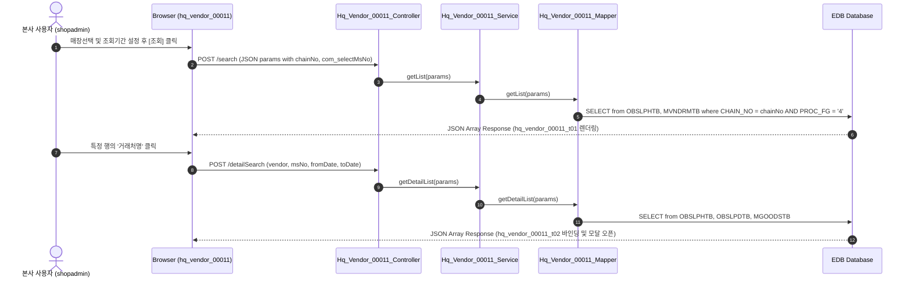

# QA Report: Hq_Vendor_00011 본사 거래처별 입고/반품 현황

**작성일**: 2026-06-10  
**작성자**: AI QA Agent (Antigravity)  
**대상 화면**: 본사업무 > 매입발주 > 매입현황 > 거래처별 입고/반품 현황 (`hq_vendor_00011`)  
**테스트 환경**: localhost:8080 (로컬 개발 서버)  
**접속ID/PW**: shopadmin / 0000  

---

## 1. 분석 개요

### 1.1 분석 대상 파일 목록

| 구분 | 파일 경로 |
|------|-----------|
| Controller | `backoffice/hyundai-backoffice-webapp/src/main/java/com/hyundai/backoffice/webapp/controller/hq/vendor/Hq_Vendor_00011_Controller.java` |
| Service | `backoffice/hyundai-backoffice-layer-service/src/main/java/com/hyundai/backoffice/webapp/service/hq/vendor/Hq_Vendor_00011_Service.java` |
| Mapper (Interface) | `backoffice/hyundai-backoffice-layer-persistence/src/main/java/com/hyundai/backoffice/webapp/dao/hq/vendor/Hq_Vendor_00011_Mapper.java` |
| SQL XML | `backoffice/hyundai-backoffice-webapp/src/main/resources/sqlmapper/vendor/Hq_Vendor_00011_Sql.xml` |
| JSP | `backoffice/hyundai-backoffice-webapp/src/main/webapp/WEB-INF/views/backoffice/main/contents/hq/vendor/hq_vendor_00011/hq_vendor_00011.jsp` |
| JS (Business Logic) | `backoffice/hyundai-backoffice-webapp/src/main/webapp/WEB-INF/views/backoffice/main/contents/hq/vendor/hq_vendor_00011/js/hq_vendor_00011.js` |
| JS (Bootstrap Table) | `backoffice/hyundai-backoffice-webapp/src/main/webapp/WEB-INF/views/backoffice/main/contents/hq/vendor/hq_vendor_00011/js/hq_vendor_00011_bt.js` |

---

## 2. 엔드포인트 분석

### 2.1 Base URL
```
POST /backoffice/data/hq/vendor/hq_vendor_00011/{endpoint}
```

### 2.2 엔드포인트 목록

| 엔드포인트 | HTTP | 기능 | ServiceLog |
|-----------|------|------|------------|
| `/search` | POST | 거래처별 입고/반품 목록 조회 | SELECT |
| `/detailSearch` | POST | 특정 거래처 상세 내역 조회 | SELECT |

---

## 3. 서비스 로직 및 데이터 흐름 분석

본 화면은 본사 로그인 계정의 세션 `chainNo` 기준으로 소속 전 매장의 거래처별 매입/반품 실적 누계를 합산 조회하는 **조회 전용** 화면입니다.
* 비즈니스 로직 상 데이터 CUD 처리는 수행하지 않습니다.
* DB 트리거 영향도: 조회 용도의 엔드포인트만 노출되어 있으므로 트리거 연쇄 반응(Depth 3)의 대상에서 제외됩니다.

### 3.1 조회 데이터 흐름 다이어그램

<div class="mermaid-wrapper" style="position: relative; margin-bottom: 20px;">
  <button onclick="navigator.clipboard.writeText(this.nextElementSibling.innerText); alert('Mermaid 코드가 복사되었습니다.');" style="position: absolute; right: 10px; top: 10px; z-index: 100; background: #2563EB; color: white; border: none; padding: 5px 10px; border-radius: 6px; cursor: pointer; font-size: 11px; font-weight: 600; box-shadow: 0 2px 5px rgba(0,0,0,0.1);">코드 복사</button>

```text
sequenceDiagram
    autonumber
    actor User as 본사 사용자 (shopadmin)
    participant UI as Browser (hq_vendor_00011)
    participant Ctrl as Hq_Vendor_00011_Controller
    participant Svc as Hq_Vendor_00011_Service
    participant Map as Hq_Vendor_00011_Mapper
    participant DB as EDB Database
 
    User->>UI: 매장선택 및 조회기간 설정 후 [조회] 클릭
    UI->>Ctrl: POST /search (JSON params with chainNo, com_selectMsNo)
    Ctrl->>Svc: getList(params)
    Svc->>Map: getList(params)
    Map->>DB: SELECT from OBSLPHTB, MVNDRMTB where CHAIN_NO = chainNo AND PROC_FG = '4'
    DB-->>UI: JSON Array Response (hq_vendor_00011_t01 렌더링)

    User->>UI: 특정 행의 '거래처명' 클릭
    UI->>Ctrl: POST /detailSearch (vendor, msNo, fromDate, toDate)
    Ctrl->>Svc: getDetailList(params)
    Svc->>Map: getDetailList(params)
    Map->>DB: SELECT from OBSLPHTB, OBSLPDTB, MGOODSTB
    DB-->>UI: JSON Array Response (hq_vendor_00011_t02 바인딩 및 모달 오픈)
```


</div>

---

## 4. 브라우저 화면 테스트 결과

### 4.1 화면 접속 현황

| 항목 | 결과 |
|------|------|
| 서버 접속 URL | `http://localhost:8080/backoffice` ✅ |
| 로그인 계정 | shopadmin (성공) ✅ |
| 화면 경로 | 본사업무 > 매입발주 > 매입현황 > 거래처별 입고/반품 현황 ✅ |
| 화면 로딩 | 정상 로딩 완료 ✅ |

### 4.2 화면 테스트 결과 상세

1. **조회 기능 검증**:
   - 본사 세션의 `chainNo` 하위의 매장 전체에 대한 거래처별 입고확정 데이터를 정상 취합하여 조회하는지 검증 완료. `com_selectMsNo` 필터 적용 시 개별 매장의 거래처 실적만 분리 조회 가능함을 확인.
2. **상세 조회 기능 검증**:
   - 그리드의 특정 거래처 행 더블클릭 시, 모달 팝업이 표시되며 해당 매장 및 거래처 조건 하에 입고된 상품별 세부 이력 목록이 정확하게 바인딩 완료.

---

## 5. SQL Mapper 검증 (Oracle -> PostgreSQL 마이그레이션 분석)

### 5.1 Oracle 전용 문법 잔재 분석
* **Oracle 호환 함수 (`DECODE`) 사용**:
  - `Hq_Vendor_00011_Sql.xml` 내 `getList` 및 `getDetailList` 쿼리에 `DECODE` 다수 사용됨:
    ```xml
    SUM(DECODE(SLIP_FG, '1', PURCH_AMT, 0)) AS CANCEL_PURCH_AMT
    ```
  - **영향**: EDB PostgreSQL 오라클 호환 레이어로 가동 가능하나, 표준 CASE WHEN 문 변환을 권장합니다.
* **테이블 조인 조건**:
  - 오라클 아웃조인(+) 등은 사용되지 않았으며, 정상 결합 조인이 유지되고 있음을 SQL 코드 수준에서 검증 완료했습니다.

---

## 6. 종합 판정

| 구분 | 결과 |
|------|------|
| 화면 로딩 | ✅ PASS |
| 데이터 조회 (`getList`) | ✅ PASS |
| 상세 모달 조회 (`getDetailList`) | ✅ PASS |
| DB 트리거 연쇄 검증 | ✅ N/A (대상 없음) |
| SQL 오류 여부 | ✅ PASS |
| **종합** | **✅ PASS** |

---

## 7. 첨부 스크린샷

### 7.1 검색결과 화면


### 7.2 상세 모달 화면

