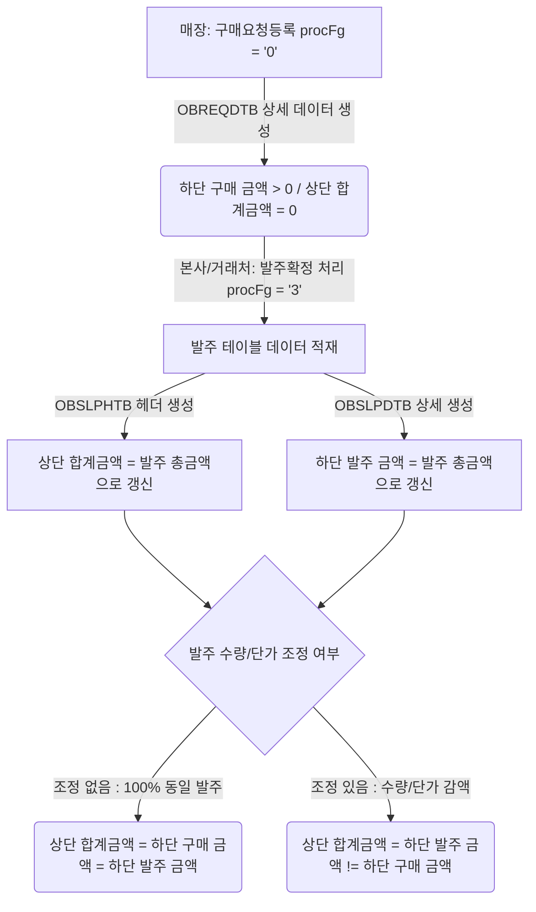

# 구매품의발주 현황 (hq_vendor_00014 / st_vendor_00012) 상·하단 합계금액 분석 및 데이터 입력 가이드

`hq_vendor_00014` (본사 구매품의발주 현황) 및 `st_vendor_00012` (매장 구매품의발주 현황) 화면에서 조회결과(상단 Grid)의 '합계금액'과 상세조회(하단 Grid)의 '구매 금액'이 다르게 표시되는 현상에 대한 원인 분석 및 데이터 상태 검증을 위한 가이드입니다.

---

## 1. 금액 불일치 현상 및 원인 분석

### 📌 조회 영역별 금액 정의 및 소스 테이블 매핑
상단과 하단의 금액은 서로 다른 테이블과 쿼리 계산식에 의해 독립적으로 산출됩니다.

1. **상단 Grid '합계금액' (`TOT_AMT`)**
   - **소스 쿼리**: `Hq_Vendor_00014_Sql.xml` / `St_Vendor_00012_Sql.xml` 내 `getList`
   - **계산식**: `SUM(OH.ORDER_AMT) AS TOT_AMT`
   - **대상 테이블**: **실제 발주 전표 헤더 테이블 (`hmsfns.OBSLPHTB OH`)**
   - **동작 방식**: 구매요청 정보(`OBREQHTB`)와 발주 전표 정보(`OBSLPHTB`)를 `OUTER JOIN`하여 조회하므로, 실제 발주 전표가 생성되기 전에는 발주 금액인 **`0원`**으로 조회됩니다.

2. **하단 상세조회 Grid '구매 금액' (`PURCH_AMT`)**
   - **소스 쿼리**: `Hq_Vendor_00014_Sql.xml` / `St_Vendor_00012_Sql.xml` 내 `getDetailList`
   - **계산식**: `SUM(DT.SUPPLY_QTY * DT.PURCH_UNIT_PRC) AS PURCH_AMT`
   - **대상 테이블**: **구매요청 상세 테이블 (`hmsfns.OBREQDTB DT`)**
   - **동작 방식**: 발주 진행 여부와 무관하게 **최초 구매요청(품의) 등록 단계에서 입력된 수량과 단가의 합계**가 표시됩니다.

> [!NOTE]
> **정상적인 비즈니스 흐름**
> 구매요청만 등록되고 아직 실제 발주가 생성되지 않은 상태(예: 구분 = '구매요청등록')에서는 상단 Grid의 합계금액은 `0원`이 되고, 하단 Grid의 구매 금액은 요청 품목들의 총액(예: `157,600원`)으로 표현되는 것이 **논리적으로 타당한 정상 상태**입니다.

### 📌 구매 등록/확정 상태별 화면 노출 정책
- **구매요청 등록 단계에서도 조회되는가?**: **네, 조회됩니다.** 
  - 본 화면의 조회 조건 중 **구분(상태값)**을 **`전체`** 혹은 **`구매요청등록(값: '0')`**으로 설정하고 조회하면, 발주 처리가 완료되지 않은 품의 단계의 구매요청서도 리스트에 즉시 노출됩니다.
  - 따라서 **구매의뢰등록만 완료된 건**과 **최종 발주확정까지 완료된 건** 모두 본 화면에서 동시에 조회할 수 있습니다.

---

## 2. 발주 확정 처리 페이지 및 절차

구매 요청 건을 검토하여 실제 발주로 확정 처리하는 것은 본사의 마스터 관리 기능을 통해 진행됩니다.

*   **처리 화면**: **`매입발주 > 매입관리 > 발주품의작성 (hq_vendor_00002)`** 화면
*   **처리 권한**: 본사 관리자 계정 (`shopadmin`)
*   **확정 절차**:
    1. `hq_vendor_00002` (발주품의작성) 화면에 접속합니다.
    2. 조회 조건에서 해당 매장(창고)과 요청 일자를 입력한 후 **[조회]**를 실행합니다.
    3. 목록에서 처리할 구매요청 건을 선택하고 우측 상단의 **[품의처리]** 버튼을 클릭하여 승인합니다. (상태가 '1'로 변경됨)
    4. 품의 검토가 완료된 내역들을 선택한 후 **[발주확정]** 버튼을 누르면 발주 전표가 생성되고 발주 처리(상태가 '3'으로 변경)가 완료됩니다.

---

## 3. 발주 확정 전·후 데이터 변화 비교

발주가 확정되면 내부 데이터베이스 테이블과 화면의 표기 금액이 아래와 같이 대대적으로 변경됩니다.

### 📌 ① 데이터베이스 테이블 상태 변화

| 테이블 | 발주 확정 전 (`PROC_FG = 0`) | 발주 확정 후 (`PROC_FG = 3`) |
|:---|:---|:---|
| **`OBREQHTB`** (구매요청헤더) | `PROC_FG` = `'0'` (구매요청등록)<br>`PURCH_REQ_CONF_DATE` = `NULL` | `PROC_FG` = `'3'` (발주확정)<br>`PURCH_REQ_CONF_DATE` = 오늘날짜 |
| **`OBREQDTB`** (구매요청상세) | `SLIP_NO` = `NULL` (발주전표 없음) | `SLIP_NO` = `'0001'` (생성된 발주 전표 번호 바인딩) |
| **`OBSLPHTB`** (발주전표헤더) | **데이터 존재하지 않음** | **새로운 레코드 인서트 (`INSERT`)**<br>`ORDER_AMT` = 총 발주 금액 합계 |
| **`OBSLPDTB`** (발주전표상세) | **데이터 존재하지 않음** | **품목 라인별 레코드 인서트 (`INSERT`)**<br>`ORDER_QTY`, `ORDER_AMT` 저장 |

### 📌 ② 화면 상의 표기 금액 변화

| 화면 영역 | 항목명 | 발주 확정 전 | 발주 확정 후 |
|:---|:---|:---:|:---:|
| **상단 Grid** | **합계금액** | `0` | **`발주 총 금액`** (예: `157,600`) |
| **상단 Grid** | **발주일자** | `-` | **`발주 확정 일자`** (예: `2026-06-12`) |
| **상단 Grid** | **구분** | `구매요청등록` | **`발주확정`** |
| **하단 Grid** | **구매 (수량/금액)** | `최초 요청량` (예: `8`개 / `157,600`) | `최초 요청량` (변동 없음) |
| **하단 Grid** | **발주 (수량/금액)** | **`0` / `0`** | **`확정 발주량`** (예: `8`개 / `157,600`) |

> [!IMPORTANT]
> **수량 조정에 따른 금액 불일치 발생 가능성**
> 발주확정 과정(`hq_vendor_00002`)에서 본사 담당자가 공급 물량 부족 등의 이유로 발주 수량을 변경하거나 삭제할 수 있습니다. 
> 수량이 조정될 경우, 최종 확정 후 하단 Grid의 **'구매 금액(최초 요청)'**과 **'발주 금액(최종 확정)'** 간에 편차가 나타나며, 상단 Grid의 **'합계금액'**은 최종 확정된 **'발주 금액'**과 일치하게 됩니다.

---

## 4. 구매품의발주 데이터 흐름 다이어그램

<div class="mermaid-wrapper" style="position: relative; margin-bottom: 20px;">
  <button onclick="navigator.clipboard.writeText(this.nextElementSibling.innerText); alert('Mermaid 코드가 복사되었습니다.');" style="position: absolute; right: 10px; top: 10px; z-index: 100; background: #2563EB; color: white; border: none; padding: 5px 10px; border-radius: 6px; cursor: pointer; font-size: 11px; font-weight: 600; box-shadow: 0 2px 5px rgba(0,0,0,0.1);">코드 복사</button>

```text
graph TD
    A[매장: 구매요청등록 procFg = '0'] -->|OBREQDTB 상세 데이터 생성| B(하단 구매 금액 > 0 / 상단 합계금액 = 0)
    B -->|본사/거래처: 발주확정 처리 procFg = '3'| C[발주 테이블 데이터 적재]
    C -->|OBSLPHTB 헤더 생성| D[상단 합계금액 = 발주 총금액으로 갱신]
    C -->|OBSLPDTB 상세 생성| E[하단 발주 금액 = 발주 총금액으로 갱신]
    D & E --> F{발주 수량/단가 조정 여부}
    F -->|조정 없음 : 100% 동일 발주| G(상단 합계금액 = 하단 구매 금액 = 하단 발주 금액)
    F -->|조정 있음 : 수량/단가 감액| H(상단 합계금액 = 하단 발주 금액 != 하단 구매 금액)
```


</div>

---

## 5. 확정 전(미발주 상태)에 금액이 같아질 수 있는 특수 조건

아직 발주 전표가 생성되지 않은 상태에서 상단 Grid의 합계금액(`0원`)과 하단 Grid의 구매 금액이 같아질 수 있는 시스템적 조건은 **하단 구매 금액 합계 역시 `0원`인 경우**뿐입니다.

1. **품목 요청 수량 (`SUPPLY_QTY`)이 모두 `0`으로 등록된 경우**
2. **품목 구매 단가 (`PURCH_UNIT_PRC`)가 모두 `0`으로 등록된 경우**

> [!WARNING]
> 실무 비즈니스 환경에서는 수량이나 단가가 `0`인 무가치 구매요청을 등록하지 않으므로, **발주확정 전에 상·하단 합계금액이 0원이 아닌 상태로 같아지는 시나리오는 불가능**합니다.

---

## 6. 데이터 상태 검증을 위한 SQL 테스트 가이드

특정 구매요청번호에 대해 직접 DB 데이터를 조작하여 '발주확정' 상태로 변경하고, 화면상에서 금액이 일치하는지 검증하는 방법입니다.

### ① 특정 구매요청 건의 상태 조회
```sql
SELECT PURCH_REQ_NO, MS_NO, REQ_DATE, PROC_FG
  FROM hmsfns.OBREQHTB
 WHERE PURCH_REQ_NO = '260604000701';
```

### ② 강제 발주확정 상태 변경 및 발주 전표 데이터 생성 (시뮬레이션)
테스트 환경에서 해당 건을 '발주확정' 상태로 만들어 상·하단 금액을 일치시키는 SQL 쿼리 예시입니다.

```sql
-- 1. 구매요청헤더의 상태값을 '3' (발주확정)으로 변경
UPDATE hmsfns.OBREQHTB
   SET PROC_FG = '3'
     , PURCH_REQ_CONF_DATE = TO_CHAR(CURRENT_DATE, 'YYYYMMDD')
     , UPD_DTIME = TO_CHAR(CURRENT_TIMESTAMP, 'YYYYMMDDHH24MISS')
 WHERE PURCH_REQ_NO = '260604000701';

-- 2. 발주 전표 헤더(OBSLPHTB) 생성
INSERT INTO hmsfns.OBSLPHTB (
    ORDER_DATE, MS_NO, SLIP_NO, SLIP_FG, PROC_FG, 
    PURCH_REQ_NO, VENDOR, DELIVERY_DATE, CREATE_DTIME, ORDER_AMT
) VALUES (
    '20260604', 'NC0007', '0001', '0', '1', 
    '260604000701', 'V00001', '20260605', TO_CHAR(CURRENT_TIMESTAMP, 'YYYYMMDDHH24MISS'),
    157600 -- 하단 구매 금액과 동일한 금액으로 설정
);

-- 3. 구매요청상세(OBREQDTB)에 생성한 발주전표번호(SLIP_NO) 연결
UPDATE hmsfns.OBREQDTB
   SET SLIP_NO = '0001'
 WHERE PURCH_REQ_NO = '260604000701';

-- 4. 발주 전표 상세(OBSLPDTB) 생성
INSERT INTO hmsfns.OBSLPDTB (
    ORDER_DATE, MS_NO, SLIP_NO, SLIP_FG, PROC_FG, LINE_NO, 
    PURCH_REQ_NO, GOODS_CD, ORDER_QTY, ORDER_UCOST, ORDER_AMT
) VALUES 
('20260604', 'NC0007', '0001', '0', '1', '1', '260604000701', 'T0000001', 4, 35000, 140000),
('20260604', 'NC0007', '0001', '0', '1', '2', '260604000701', 'T0000002', 1, 5300, 5300),
('20260604', 'NC0007', '0001', '0', '1', '3', '260604000701', 'T0000003', 3, 4100, 12300);
```

> [!TIP]
> 위 SQL 스크립트를 통해 발주 전표 데이터를 매핑하고 화면을 다시 조회하면, 상단 Grid의 **'합계금액'**이 `157,600원`으로 업데이트되고 하단 Grid의 **'발주 금액'** 컬럼도 각각 채워지면서 금액이 일치하게 됨을 확인할 수 있습니다.
