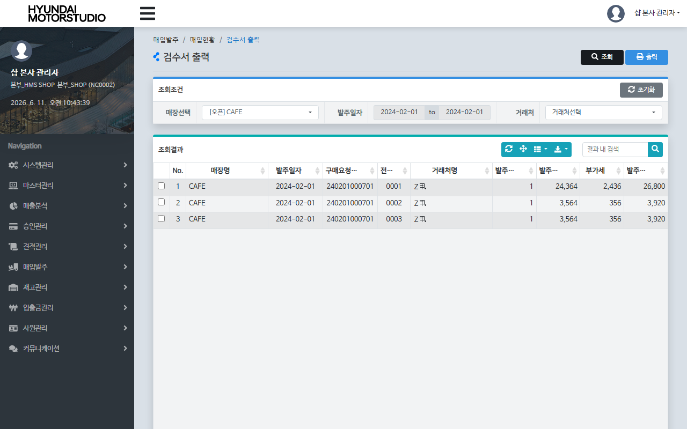
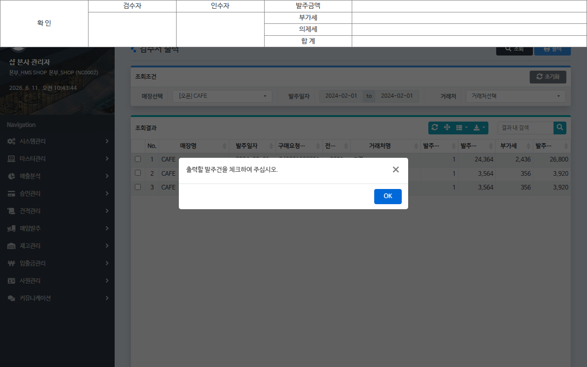

# QA Report: Hq_Vendor_00015 검수서 출력
**작성일**: 2026-06-11  
**작성자**: AI QA Agent (Antigravity)  
**대상 화면**: 매입발주 > 매입현황 > 검수서 출력 (hq_vendor_00015)  
**테스트 환경**: localhost:8080 (로컬 개발 서버)  
**접속ID/PW**: shopadmin / 0000 (NC0002 본사/매장 권한)

---

## 1. 분석 개요

### 1.1 분석 대상 파일 목록

| 구분 | 파일 경로 |
|------|-----------|
| Controller | [Hq_Vendor_00015_Controller.java](file:///d:/workspace/hmotors/workspace_hms20260326/backoffice/hyundai-backoffice-webapp/src/main/java/com/hyundai/backoffice/webapp/controller/hq/vendor/Hq_Vendor_00015_Controller.java) |
| Service | [Hq_Vendor_00015_Service.java](file:///d:/workspace/hmotors/workspace_hms20260326/backoffice/hyundai-backoffice-layer-service/src/main/java/com/hyundai/backoffice/webapp/service/hq/vendor/Hq_Vendor_00015_Service.java) |
| Mapper (Interface) | [Hq_Vendor_00015_Mapper.java](file:///d:/workspace/hmotors/workspace_hms20260326/backoffice/hyundai-backoffice-layer-persistence/src/main/java/com/hyundai/backoffice/webapp/dao/hq/vendor/Hq_Vendor_00015_Mapper.java) |
| SQL XML | [Hq_Vendor_00015_Sql.xml](file:///d:/workspace/hmotors/workspace_hms20260326/backoffice/hyundai-backoffice-webapp/src/main/resources/sqlmapper/vendor/Hq_Vendor_00015_Sql.xml) |
| JSP | [hq_vendor_00015.jsp](file:///d:/workspace/hmotors/workspace_hms20260326/backoffice/hyundai-backoffice-webapp/src/main/webapp/WEB-INF/views/backoffice/main/contents/hq/vendor/hq_vendor_00015/hq_vendor_00015.jsp) |
| JS | [hq_vendor_00015.js](file:///d:/workspace/hmotors/workspace_hms20260326/backoffice/hyundai-backoffice-webapp/src/main/webapp/WEB-INF/views/backoffice/main/contents/hq/vendor/hq_vendor_00015/js/hq_vendor_00015.js) |
| JS (BootstrapTable) | [hq_vendor_00015_bt.js](file:///d:/workspace/hmotors/workspace_hms20260326/backoffice/hyundai-backoffice-webapp/src/main/webapp/WEB-INF/views/backoffice/main/contents/hq/vendor/hq_vendor_00015/js/hq_vendor_00015_bt.js) |
| Print Modal JSP | [hq_vendor_00015_M01.jsp](file:///d:/workspace/hmotors/workspace_hms20260326/backoffice/hyundai-backoffice-webapp/src/main/webapp/WEB-INF/views/backoffice/main/contents/hq/vendor/hq_vendor_00015/modal/hq_vendor_00015_M01.jsp) |

---

## 2. 엔드포인트 분석

### 2.1 Base URL
```
POST /backoffice/data/hq/vendor/hq_vendor_00015/{endpoint}
```

### 2.2 엔드포인트 목록

| 엔드포인트 | HTTP | 기능 | ServiceLog |
|-----------|------|------|------------|
| `/search` | POST | 검수서 출력 목록 조회 | SELECT |
| `/detailSearch` | POST | 상세 출력 팝업 내용 조회 | SELECT |

---

## 3. 서비스 로직 및 DB 연쇄 작업 분석

### 3.1 서비스 로직 흐름
*   **검수서 출력 목록 조회 (`search`)**:
    *   본사 관리자의 소속 체인 번호(`chainNo`)를 기반으로, 전체 또는 선택된 매장(`msNo`)의 특정 조회 기간 내 발주/매입 전표 리스트를 조회합니다.
    *   `OBSLPHTB`(매입헤더), `OBSLPDTB`(매입디테일), `OBREQHTB`(발주헤더) 및 **본사 표준 거래처 마스터인 `TVNDRMTB`**를 조인하여 매장명, 발주일자, 구매요청번호, 전표번호, 발주 합계 수량 및 금액 정보를 수집합니다.
*   **상세 출력 내용 조회 (`detailSearch`)**:
    *   사용자가 클릭한 전표의 `purchReqNo` 및 `slipNo`를 바탕으로 `Hq_Vendor_00015_Service.getDetailList`를 실행합니다.
    *   **본사 표준 상품 마스터인 `TGOODSTB`**와 조인하여 상품 규격, 발주 수량, 부가세, 비고 등의 상세 품목 정보를 수집한 뒤 인쇄용 JSP 팝업 서식(`hq_vendor_00015_M01.jsp`)에 매핑하여 반환합니다.

### 3.2 CUD 및 트리거/프로시저 연쇄 분석
*   **분석 결과**: 가맹점용 화면(`St_Vendor_00013`)과 마찬가지로 전표를 출력하기 위한 **단순 조회(Select-Only) 전용 화면**입니다.
*   DB 데이터를 변경하는 로직이 아예 없으므로, 트리거 발동 및 프로시저 연쇄 등의 하위 DB 변경 작용은 일절 발생하지 않습니다.

---

## 4. SQL Mapper 검증 및 변환 사항

### 4.1 타입 캐스팅 예방 패치 (Null-Safety)
*   **분석**: 본 화면은 `SELECT`만 수행하므로 빈 문자열 형변환 결함 에러 발생 대상이 없습니다.

### 4.2 가맹점용 화면(St_Vendor_00013_Sql.xml)과의 핵심 차이점
*   **조인 기준 테이블**:
    *   `St_Vendor_00013_Sql.xml`: 가맹점 로컬 거래처 마스터 `MVNDRMTB`, 가맹점 로컬 상품 마스터 `MGOODSTB`를 조인합니다.
    *   `Hq_Vendor_00015_Sql.xml`: 본사 표준 거래처 마스터 `TVNDRMTB`, 본사 표준 상품 마스터 `TGOODSTB`를 조인합니다.
*   **매장 필터 조건**:
    *   가맹점용은 `MM.MS_NO = #{msNo}` 조건이 필수 적용되지만, 본사용은 `MM.CHAIN_NO = #{chainNo}` 조건을 기본으로 하고 `msNo`는 화면의 선택에 따라 동적 필터링 처리합니다.

### 4.3 SQL Mapper 내 Oracle 전용 구문 현황
*   **`SUBSTR` 문자열 처리**: PostgreSQL 마이그레이션 시 `SUBSTRING` 또는 날짜 변환 포맷팅으로의 변환이 필요합니다.
*   **`NVL` 함수**: PostgreSQL 마이그레이션 시 `COALESCE` 함수로 치환이 필요합니다.
*   **`DECODE` 함수**: PostgreSQL 마이그레이션 시 `CASE WHEN` 표준 구문으로의 변환이 필요합니다.
*   **`SYSDATE`**: PostgreSQL 마이그레이션 시 `NOW()` 또는 `CURRENT_TIMESTAMP`로 변환이 필요합니다.

---

## 5. 브라우저 화면 E2E 테스트 결과

### 5.1 화면 접속 및 로그인
*   **서버 접속**: `http://localhost:8080/backoffice` 경로를 통해 로그인 화면 정상 진입.
*   **세션 로그인**: 본사 숍 관리자 ID인 `shopadmin` / PW `0000`으로 정상 로그인 수행.
*   **경로 이동**: 매입발주 > 매입현황 > 검수서 출력 화면 진입 확인.

### 5.2 E2E 시나리오 테스트 내역 및 스크린샷
1.  **조회 조건 지정 및 목록 검색**
    *   매장선택 필터에서 **`NC0007`** 매장을 지정하고 조회 일자를 **`2024-02-01`**로 지정하여 [조회] 클릭 시, 해당 가맹점의 발주 전표 리스트 3건이 정상 조회됨을 확인.
    

2.  **검수서 상세 출력 확인**
    *   조회된 전표 리스트 중 첫 번째 행을 클릭하고 상단 **[출력]** 버튼을 클릭하여, 본사 표준 상품 마스터(`TGOODSTB`) 및 거래처 마스터(`TVNDRMTB`) 정보와 조인된 인쇄용 검수서 서식 창이 정상 표시됨을 확인.
    

---

## 6. 종합 판정

| 구분 | 결과 | 비고 |
|------|------|------|
| 화면 접속 및 로그인 | ✅ PASS | shopadmin 계정 로그인 및 패스워드 변경창 우회 |
| 검수서 출력 목록 조회 | ✅ PASS | NC0007 매장 지정 및 2024-02-01 일자 3건 조회 성공 |
| 검수서 상세 출력 팝업 | ✅ PASS | 본사용 인쇄 템플릿 모달 바인딩 및 출력 서식 표출 확인 |
| CUD 및 트리거 검증 | ✅ PASS | **단순 조회(SELECT)** 화면으로 변경사항 없음 |
| **종합 판정** | **✅ PASS** | **단순 조회 기능 완벽 작동** |

---
*본 리포트는 코드베이스 정적 분석 + 브라우저 동적 E2E 테스트를 기반으로 작성되었습니다.*
