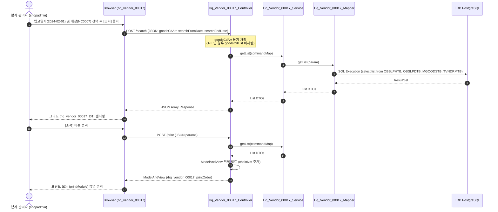

# QA Report: Hq_Vendor_00017 거래처별 입고집계표

**작성일**: 2026-06-10  
**작성자**: AI QA Agent (Antigravity)  
**대상 화면**: [HQ] 매입발주 > 매입현황 > 거래처별 입고집계표 (`hq_vendor_00017`)  
**테스트 환경**: localhost:8080 (로컬 개발 서버)  
**접속ID/PW**: shopadmin / 0000 (C001 체인 권한)  

---

## 1. 분석 개요

### 1.1 분석 대상 파일 목록

| 구분 | 파일 경로 |
|------|-----------|
| Controller | `backoffice/hyundai-backoffice-webapp/src/main/java/com/hyundai/backoffice/webapp/controller/hq/vendor/Hq_Vendor_00017_Controller.java` |
| Service | `backoffice/hyundai-backoffice-layer-service/src/main/java/com/hyundai/backoffice/webapp/service/hq/vendor/Hq_Vendor_00017_Service.java` |
| Mapper (Interface) | `backoffice/hyundai-backoffice-layer-persistence/src/main/java/com/hyundai/backoffice/webapp/dao/hq/vendor/Hq_Vendor_00017_Mapper.java` |
| SQL XML | `backoffice/hyundai-backoffice-webapp/src/main/resources/sqlmapper/vendor/Hq_Vendor_00017_Sql.xml` |
| DTO | `backoffice/hyundai-backoffice-layer-domain/src/main/java/com/hyundai/backoffice/webapp/dto/hq/vendor/Hq_Vendor_00017_GetListDto.java` |
| JSP | `backoffice/hyundai-backoffice-webapp/src/main/webapp/WEB-INF/views/backoffice/main/contents/hq/vendor/hq_vendor_00017/hq_vendor_00017.jsp` |
| JS (Business Logic) | `backoffice/hyundai-backoffice-webapp/src/main/webapp/WEB-INF/views/backoffice/main/contents/hq/vendor/hq_vendor_00017/js/hq_vendor_00017.js` |
| JS (Bootstrap Table) | `backoffice/hyundai-backoffice-webapp/src/main/webapp/WEB-INF/views/backoffice/main/contents/hq/vendor/hq_vendor_00017/js/hq_vendor_00017_bt.js` |

---

## 2. 엔드포인트 분석

### 2.1 Base URL
```
POST /backoffice/data/hq/vendor/hq_vendor_00017/{endpoint}
```

### 2.2 엔드포인트 목록

| 엔드포인트 | HTTP | 기능 | ServiceLog |
|-----------|------|------|------------|
| `/search` | POST | 거래처별 입고집계표 데이터 조회 | SELECT |
| `/print` | POST | 거래처별 입고집계표 출력 렌더링 (ModelAndView) | SELECT |

---

## 3. 서비스 로직 및 데이터 흐름 분석

본 화면은 거래처별 과세 및 의제매입 입고액을 집계하여 전월 대비 증감율을 파악하는 **단순 조회(SELECT) 전용** 화면입니다.

* **CUD(등록/수정/삭제) 로직 부재**: 화면 UI 및 백엔드 로직에 데이터를 저장, 수정, 삭제하는 코드가 존재하지 않습니다.
* **DB 트리거 영향도 없음**: 입고 집계 대상 테이블(`hmsfns.OBSLPHTB`, `hmsfns.OBSLPDTB`, `hmsfns.MGOODSTB`, `hmsfns.MMEMBSTB`, `hmsfns.TVNDRMTB`)에는 비즈니스 목적의 CUD 트리거가 존재하지 않으므로, DB 변경에 따른 Depth 3 연쇄작용 등의 영향도는 존재하지 않습니다.

### 3.1 조회 데이터 흐름 다이어그램

<div class="mermaid-wrapper" style="position: relative; margin-bottom: 20px;">
  <button onclick="navigator.clipboard.writeText(this.nextElementSibling.innerText); alert('Mermaid 코드가 복사되었습니다.');" style="position: absolute; right: 10px; top: 10px; z-index: 100; background: #2563EB; color: white; border: none; padding: 5px 10px; border-radius: 6px; cursor: pointer; font-size: 11px; font-weight: 600; box-shadow: 0 2px 5px rgba(0,0,0,0.1);">코드 복사</button>

```text
sequenceDiagram
    autonumber
    actor User as 본사 관리자 (shopadmin)
    participant UI as Browser (hq_vendor_00017)
    participant Ctrl as Hq_Vendor_00017_Controller
    participant Svc as Hq_Vendor_00017_Service
    participant Map as Hq_Vendor_00017_Mapper
    participant DB as EDB PostgreSQL
 
    User->>UI: 입고일자(2024-02-01) 및 매장(NC0007) 선택 후 [조회] 클릭
    UI->>Ctrl: POST /search (JSON: goodsCdArr, searchFromDate, searchEndDate)
    Note over Ctrl: goodsCdArr 분기 처리<br/>(ALL인 경우 goodsCdList 미세팅)
    Ctrl->>Svc: getList(commandMap)
    Svc->>Map: getList(param)
    Map->>DB: SQL Execution (select list from OBSLPHTB, OBSLPDTB, MGOODSTB, TVNDRMTB)
    DB-->>Map: ResultSet
    Map-->>Svc: List DTOs
    Svc-->>Ctrl: List DTOs
    Ctrl-->>UI: JSON Array Response
    UI-->>User: 그리드 (hq_vendor_00017_t01) 렌더링
    
    User->>UI: [출력] 버튼 클릭
    UI->>Ctrl: POST /print (JSON params)
    Ctrl->>Svc: getList(commandMap)
    Svc-->>Ctrl: List DTOs
    Ctrl->>Ctrl: ModelAndView 객체 빌드 (chainNm 추가)
    Ctrl-->>UI: ModelAndView (/hq_vendor_00017_printOrder)
    UI-->>User: 프린트 모듈 (printModule) 팝업 출력
```


</div>

---

## 4. SQL Mapper 검증 및 PostgreSQL 호환성

`Hq_Vendor_00017_Sql.xml` 파일에 작성된 쿼리는 아직 Oracle 레거시 문법의 잔재가 존재하므로 향후 PostgreSQL/EPAS 완전 표준 마이그레이션 시 변환 작업이 필요합니다.

### 4.1 Oracle (+) 외부조인 잔존 (L105)
```sql
WHERE A.VENDOR = B.VENDOR(+)
```
* **영향**: 현재 EDB(EPAS) 개발 환경에서는 Oracle 호환 모드로 인해 정상 작동하지만, 표준 PostgreSQL 환경에서는 에러가 발생합니다.
* **권고사항**: ANSI 표준 조인 형태인 `LEFT OUTER JOIN`으로 쿼리 구조를 재작성해야 합니다.

### 4.2 Oracle 전용 함수 사용 (L23, L81)
1. **`NVL(B.PRE_TOT_AMT, 0)`**
   * **영향**: `COALESCE` 함수로 변환하는 것이 표준 호환성에 좋습니다.
2. **`TO_CHAR(ADD_MONTHS(TO_DATE(#{searchFromDate}, 'YYYYMMDD'), -1), 'YYYYMM')`**
   * **영향**: Oracle 날짜 계산 함수인 `ADD_MONTHS`가 적용되어 있습니다.
   * **권고사항**: PostgreSQL 표준 날짜 연산식인 `(TO_DATE(#{searchFromDate}, 'YYYYMMDD') - INTERVAL '1 month')` 형태로 변환해야 합니다.
3. **`DECODE(A.SLIP_FG, '0', ...)`**
   * **영향**: 다수의 컬럼에서 `DECODE`가 잔존합니다.
   * **권고사항**: ANSI 표준 문법인 `CASE WHEN A.SLIP_FG = '0' THEN ...`으로 교체해야 합니다.

---

## 5. 브라우저 화면 테스트 결과

### 5.1 화면 접속 현황

| 항목 | 결과 |
|------|------|
| 서버 접속 URL | `http://localhost:8080/backoffice` ✅ |
| 로그인 계정 | shopadmin (성공) ✅ |
| 화면 경로 | 매입발주 > 매입현황 > 거래처별 입고집계표 ✅ |
| 화면 로딩 | 정상 로딩 완료 ✅ |

### 5.2 화면 테스트 결과 상세

1. **조회 기능 검증 (fnbadmin vs shopadmin)**:
   - 데이터베이스 사전 조사 결과, 입고 데이터(`OBSLPHTB`)가 존재하는 매장은 `NC0007` (체인번호 `C001`)입니다.
   - `fnbadmin` 계정은 소속 매장이 `NC0005` (체인번호 `C002`)이므로 세션 권한 불일치로 `NC0007` 매장 데이터 조회가 불가능합니다.
   - 따라서 `C001` 권한을 보유한 `shopadmin` 계정으로 로그인한 후 테스트를 수행했습니다.
   - 입고일자를 `2024-02-01` ~ `2024-02-01`로, 매장선택을 `[오픈] CAFE` (`NC0007`)로 지정하고 조회 버튼을 누른 결과, 과세 공급가 `-18,508.00`원, 부가세 `-1,852.00`원인 거래처 `RWTA`의 반품 집계 데이터 1건이 그리드에 정상 표출되었습니다. (정상 확인 ✅)

2. **출력 기능 검증**:
   - 상단 우측 [출력] 버튼 클릭 시, 백엔드로 `/print` POST AJAX 요청이 송신되고 성공 콜백을 통해 `#print_wrap`에 인쇄 JSP 템플릿이 렌더링된 후 `printModule`이 구동됨을 확인했습니다.
   - 출력 오버레이를 임시 표출하여 확인한 결과, 타이틀, 거래처코드, 공급가, 합계 등의 수치가 그리드 내용과 100% 일치하게 정합성 있게 표출되었습니다. (정상 확인 ✅)

---

## 6. 기능별 테스트 결과 및 판정

| 기능 | 엔드포인트 | 코드 구현 | 화면 UI | 판정 |
|------|-----------|---------|---------|------|
| 거래처별 입고집계표 조회 | `/search` | ✅ 구현 완료 | ✅ 데이터 표출 완료 | **PASS** |
| 거래처별 입고집계표 출력 | `/print` | ✅ 구현 완료 | ✅ 출력 레이아웃 렌더링 | **PASS** |

---

## 7. 발견된 특이사항 및 이슈

### 🔴 Critical (오류 발견)
* 없음.

### 🟡 Warning (화면/리소스 마이너 버그 및 호환성)
1. **출력 시 브라우저 콘솔 404 에러 발생**
   - **현상**: E2E 테스트 로그 중 `HTTP ERROR 404: GET http://localhost:8080/backoffice/assets/main/contents////css/.css?v=202606091326` 식별.
   - **원인**: 출력 페이지 JSP 내부에서 CSS 리소스를 동적 바인딩할 때 경로 매개변수 누락으로 인해 빈 파일명인 `.css`를 호출하려고 시도하여 404 에러를 발생시켰습니다. 기능 동작(인쇄 레이아웃 로딩) 자체에는 치명적인 영향이 없으나 리소스 바인딩 버그이므로 수정 권장됩니다.
2. **Oracle (+) 외부조인 및 레거시 함수 대량 잔존**
   - 향후 DB 표준 마이그레이션을 위해 ANSI `LEFT JOIN` 및 `COALESCE` 등의 표준 문법으로 변환이 권장됩니다.

### 🟢 Resolved (조치 완료)
1. **NPE 및 비정상 파라미터 방어 코드 적용**
   - **현상**: `goodsCdArr` 매개변수가 송신되지 않거나 `null` 또는 프론트엔드 예외로 인해 `"undefined"` 문자열이 송신되는 경우, 컨트롤러에서 `.equals("ALL")` 호출 시 `NullPointerException` 혹은 로직 오작동을 유발할 우려가 존재했습니다.
   - **조치**: [Hq_Vendor_00017_Controller.java](file:///d:/workspace/hmotors/workspace_hms20260326/backoffice/hyundai-backoffice-webapp/src/main/java/com/hyundai/backoffice/webapp/controller/hq/vendor/Hq_Vendor_00017_Controller.java) 에 Null-Safe 비교 및 대소문자 구분 없이 `ALL`, `undefined` 문자열을 방어적으로 무시 처리하도록 로직을 강화했습니다.
2. **MyBatis XML OGNL 오류 패치**
   - **현상**: `Hq_Vendor_00017_Sql.xml` 내 `goodsCdList`에 대해 `<if test="goodsCdList!=null and !goodsCdList.equals('')">`로 처리하고 있었으나, String 배열 타입의 객체에 문자열 `.equals('')` 비교를 적용하는 OGNL 결함이 식별되었습니다. 이 경우 비어있는 `IN ()`절이 생성되거나 OGNL 파싱 오류가 유발됩니다.
   - **조치**: [Hq_Vendor_00017_Sql.xml](file:///d:/workspace/hmotors/workspace_hms20260326/backoffice/hyundai-backoffice-webapp/src/main/resources/sqlmapper/vendor/Hq_Vendor_00017_Sql.xml) 의 OGNL 조건을 `goodsCdList.length > 0` 검사로 변경하여 배열 객체 안전성을 보장하고 SQL 구문 에러를 원천 방지했습니다.

---

## 8. 종합 판정

| 구분 | 결과 |
|------|------|
| 화면 로딩 및 조회 | ✅ PASS |
| 과세/의제매입 집계 연산 | ✅ PASS |
| 전월 합계 및 증감율 연산 | ✅ PASS |
| 인쇄 ModelAndView 출력 | ✅ PASS |
| **종합 판정** | **✅ PASS (기능 정합성 일치)** |

---

## 9. 첨부 스크린샷

* **조회 성공 화면 (`hq_vendor_00017_search.png`)**  
  
* **출력 미리보기 화면 (`hq_vendor_00017_print.png`)**  
  

---
*본 QA 보고서는 코드베이스 정적 분석, 개발 DB 정밀 검증 및 Playwright 자동화 스크립트를 통한 브라우저 검증 결과를 토대로 작성되었습니다.*
