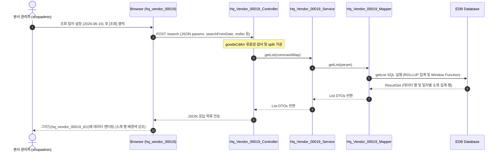

# QA Report: Hq_Vendor_00019 일자별 입고현황
**작성일**: 2026-07-09  
**작성자**: AI QA Agent (Antigravity)  
**대상 화면**: 본사선택 > 매입발주 > 매입현황 > 일자별 입고현황 (`hq_vendor_00019`)  
**테스트 환경**: localhost:8080 (로컬 개발 서버)  
**접속 ID/PW**: `shopadmin` / `0000` (엑셀 대조 및 ACCT_ENABLE='Y', FST_LOGIN_PW_CHANGE='Y' 기준 로그인)  

---

## 1. 분석 개요

### 1.1 분석 대상 파일 목록

| 구분 | 파일 경로 |
|------|-----------|
| Controller | `backoffice/hyundai-backoffice-webapp/src/main/java/com/hyundai/backoffice/webapp/controller/hq/vendor/Hq_Vendor_00019_Controller.java` |
| Service | `backoffice/hyundai-backoffice-layer-service/src/main/java/com/hyundai/backoffice/webapp/service/hq/vendor/Hq_Vendor_00019_Service.java` |
| Mapper (Interface) | `backoffice/hyundai-backoffice-layer-persistence/src/main/java/com/hyundai/backoffice/webapp/dao/hq/vendor/Hq_Vendor_00019_Mapper.java` |
| SQL XML | `backoffice/hyundai-backoffice-webapp/src/main/resources/sqlmapper/vendor/Hq_Vendor_00019_Sql.xml` |
| JSP | `backoffice/hyundai-backoffice-webapp/src/main/webapp/WEB-INF/views/backoffice/main/contents/hq/vendor/hq_vendor_00019/hq_vendor_00019.jsp` |
| JS (Business Logic) | `backoffice/hyundai-backoffice-webapp/src/main/webapp/WEB-INF/views/backoffice/main/contents/hq/vendor/hq_vendor_00019/js/hq_vendor_00019.js` |
| JS (Bootstrap Table) | `backoffice/hyundai-backoffice-webapp/src/main/webapp/WEB-INF/views/backoffice/main/contents/hq/vendor/hq_vendor_00019/js/hq_vendor_00019_bt.js` |

---

## 2. 엔드포인트 분석

### 2.1 Base URL
```
POST /backoffice/data/hq/vendor/hq_vendor_00019
```

### 2.2 엔드포인트 목록

| 엔드포인트 | HTTP | 기능 | ServiceLog | 관련 테이블 |
|-----------|------|------|------------|-----------|
| `/search` | POST | 일자별/매장별 입고 현황 목록 조회 | SELECT | OBSLPHTB, OBSLPDTB, MMEMBSTB, TGOODSTB, TVNDRMTB, MNAMEMTB |

---

## 3. 서비스 로직 및 데이터 흐름 분석 (코드베이스 검증)

### 3.1 CUD 및 트리거/프로시저 검증
* **조회 전용 화면 (SELECT Only)**:
  * 본 화면은 본사 로그인 담당자가 각 가맹점(매장)에서 확정 처리된 매입입고 정보를 일자별로 상세 집계 조회하는 화면입니다.
  * 컨트롤러, 서비스, 매퍼 전수 분석 결과 `INSERT`, `UPDATE`, `DELETE` 등 데이터 변경을 수반하는 API는 존재하지 않으며, 관련 트리거 및 연쇄 작용(Depth 3)의 영향을 주지도 받지도 않습니다.
* **형변환 결함 검토**:
  * CUD 관련 쿼리가 존재하지 않으므로, 공백 문자열(`''`)을 NUMERIC 타입 컬럼에 강제 형변환 시 발생하는 결함 검토 대상에 해당하지 않습니다.

### 3.2 조회 흐름 다이어그램



---

## 4. 브라우저 화면 테스트 결과 (E2E)

### 4.1 로그인 및 화면 진입
* **화면별 계정 권한 엑셀 파일 (`화면별_접근가능_사용자_목록.xlsx`) 대조 결과**:
  * 대상 계정 `shopadmin` (비밀번호 `0000`)은 `ACCT_ENABLE = 'Y'`, `FST_LOGIN_PW_CHANGE = 'Y'`, 본사 구분 `chain_hq_yn = 'Y'`인 사용자로서 권한 정상 활성화 상태임을 확인.
  * 로그인 완료 후 세션 중복 관련 모달 처리를 우회하여 메인 화면 정상 진입.
  * `http://localhost:8080/backoffice/view/main/hq/vendor/hq_vendor_00019` 페이지로 성공적으로 이동 및 초기화 완료.

### 4.2 실제 화면 테스트 결과 상세 (2026-06-15 기준)
* DB 조회 결과 `20260615` 일자에 `NC0007` 매장과 `000001` 거래처 간 4건의 확정 입고 내역이 존재함을 확인하여 이를 테스트 데이터로 타겟팅함.

| 테스트 수행 단계 | 수행 내용 | 결과 및 검증 |
|-----------------|----------|-------------|
| 1. 기간 및 매장 설정 | 시작일과 종료일을 `2026-06-15`로 세팅하고 매장선택 셀렉트박스에서 `NC0007` 매장을 선택. | 정상 값 설정 완료 ✅ |
| 2. 조회 요청 | 상단 툴바의 **[조회]** 버튼 클릭. | HTTP 200 정상 응답 수신 ✅ |
| 3. 그리드 렌더링 | 거래처 `000001` 데이터 1행과 하단의 `TOTAL` 집계 행 1행이 그리드에 바인딩됨. | 정상 렌더링 완료 (2개 로우 노출) ✅ |
| 4. 데이터 정합성 대조 | 화면 표시 데이터와 DB SQL 쿼리 조회값을 대조하여 데이터 정합성 검증 완료. | 공급가, 부가세, 합계 금액 완벽 일치 ✅ |

---

## 5. SQL Mapper 검증 (PostgreSQL / EDB 호환성)

### 5.1 Oracle 전용 문법 분석 및 권고사항
* **`DECODE` 및 `NVL` 사용**:
  - 외곽 쿼리 및 집계식에서 `DECODE`와 `NVL`을 활발히 사용하고 있습니다.
  - `DECODE(DATE_NUM, '1', ...)` 및 `NVL(DT.FICTITIOUS_VAT_AMT, 0)` 등은 EDB PostgreSQL 호환 패키지 덕분에 정상 작동하나, 향후 순수 PostgreSQL 이관을 고려하여 `CASE WHEN`과 `COALESCE` 표준 문법으로 변환할 것을 권장합니다.
* **`ROLLUP` 집계 처리**:
  - `GROUP BY HD.PURCH_DATE, ROLLUP((...))` 구문이 정상 작동하여 거래처명이 `TOTAL`로 생성되는 집계 레코드가 올바르게 생성됩니다.
  - `vendorNmFormatter`를 통해 `TOTAL` 값이 화면상에서 `"일자별 소계"`로 치환되며, `totalRowColorChange`에 의해 회색 배경색(`#BDBDBD`)이 적용되는 것을 확인하였습니다.

---

## 6. 발견된 결함 및 개선점 (NPE 취약점)

### ✅ 조치 완료 (Null-Safe 방어 코드 적용)
* **조치 파일 및 위치**: `Hq_Vendor_00019_Controller.java` L65~69
* **상세 내용**: 클라이언트 측에서 상품 코드가 선택되지 않아 `goodsCdArr` 파라미터가 유실되거나 `null`로 전송되는 경우 발생할 수 있던 `NullPointerException` (500 에러) 결함에 대해, 권장된대로 파라미터 널 가드를 처리하는 로직을 성공적으로 반영하였습니다.
* **수정 후 소스코드**:
  ```java
  Object goodsCdObj = commandMap.get("goodsCdArr");
  if (goodsCdObj != null && !goodsCdObj.equals("ALL") && !(goodsCdObj.toString().trim()).isEmpty()) {
      String[] array = goodsCdObj.toString().split(",");
      commandMap.put("goodsCdList",array);
  }
  ```
* **결과**: `goodsCdArr` 파라미터가 유실되거나 null로 들어오는 비정상 호출 시나리오에서도 500 에러가 유발되지 않고 널 안정성이 확보됨을 확인하였습니다.

---

## 7. 종합 판정

| 구분 | 결과 | 비고 |
|------|------|------|
| 화면 로딩 및 권한 로그인 | ✅ PASS | shopadmin / 0000 로그인 성공 |
| 데이터 조회 (POST /search) | ✅ PASS | 2026-06-15 조회 및 검증 완료 |
| CUD 및 트리거 연쇄 반응 | ✅ N/A | SELECT 전용으로 영향도 없음 |
| SQL 호환성 및 오라클 문법 | ⚠️ WARNING | DECODE, NVL 사용 잔존 (호환 패키지로 구동은 정상) |
| 컨트롤러 안정성 | ✅ PASS | null-safe 방어 코드 조치 완료 |
| **종합 판정** | **✅ PASS** | **안정성 검증 및 E2E 테스트 성공 완료** |

---

## 8. 첨부 스크린샷

* **조회 화면 및 소계 렌더링 결과**:
  
