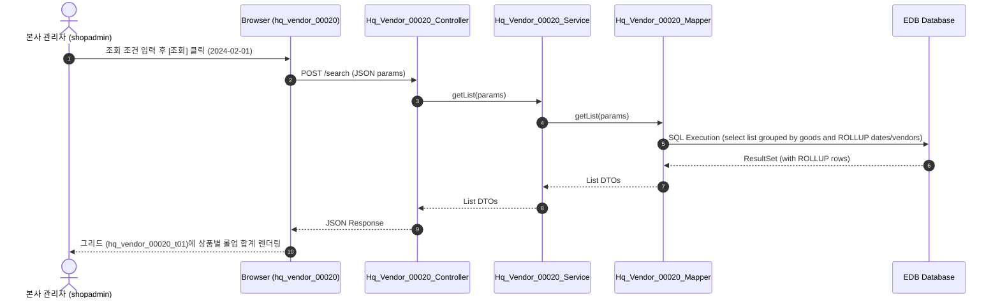

# QA Report: Hq_Vendor_00020 상품별 입고현황

**작성일**: 2026-06-10  
**작성자**: AI QA Agent (Antigravity)  
**대상 화면**: 본사선택 > 매입발주 > 매입현황 > 상품별 입고현황 (`hq_vendor_00020`)  
**테스트 환경**: localhost:8080 (로컬 개발 서버)  
**접속ID/PW**: shopadmin / 0000  

---

## 1. 분석 개요

### 1.1 분석 대상 파일 목록

| 구분 | 파일 경로 |
|------|-----------|
| Controller | `backoffice/hyundai-backoffice-webapp/src/main/java/com/hyundai/backoffice/webapp/controller/hq/vendor/Hq_Vendor_00020_Controller.java` |
| Service | `backoffice/hyundai-backoffice-layer-service/src/main/java/com/hyundai/backoffice/webapp/service/hq/vendor/Hq_Vendor_00020_Service.java` |
| Mapper (Interface) | `backoffice/hyundai-backoffice-layer-persistence/src/main/java/com/hyundai/backoffice/webapp/dao/hq/vendor/Hq_Vendor_00020_Mapper.java` |
| SQL XML | `backoffice/hyundai-backoffice-webapp/src/main/resources/sqlmapper/vendor/Hq_Vendor_00020_Sql.xml` |
| JSP | `backoffice/hyundai-backoffice-webapp/src/main/webapp/WEB-INF/views/backoffice/main/contents/hq/vendor/hq_vendor_00020/hq_vendor_00020.jsp` |
| JS (Business Logic) | `backoffice/hyundai-backoffice-webapp/src/main/webapp/WEB-INF/views/backoffice/main/contents/hq/vendor/hq_vendor_00020/js/hq_vendor_00020.js` |
| JS (Bootstrap Table) | `backoffice/hyundai-backoffice-webapp/src/main/webapp/WEB-INF/views/backoffice/main/contents/hq/vendor/hq_vendor_00020/js/hq_vendor_00020_bt.js` |

---

## 2. 엔드포인트 분석

### 2.1 Base URL
```
POST /backoffice/data/hq/vendor/hq_vendor_00020/{endpoint}
```

### 2.2 엔드포인트 목록

| 엔드포인트 | HTTP | 기능 | ServiceLog |
|-----------|------|------|------------|
| `/search` | POST | 상품별 입고현황 리스트 조회 | SELECT |

---

## 3. 서비스 로직 및 데이터 흐름 분석

본 화면은 본사 관리자가 구매 입고가 발생한 내역을 상품 기준으로 집계하여 조회하는 **단순 조회(SELECT) 전용** 화면입니다.
* 데이터 저장(CUD) 기능이 없으므로 관련 비즈니스 로직 및 DB 데이터 수정 연쇄는 존재하지 않습니다.
* DB 수준에서도 대상 테이블들에 바인딩된 트리거가 없으므로 연쇄 영향(Depth 3)도 없습니다.

### 3.1 조회 데이터 흐름 다이어그램

<div class="mermaid-wrapper" style="position: relative; margin-bottom: 20px;">
  <button onclick="navigator.clipboard.writeText(this.nextElementSibling.innerText); alert('Mermaid 코드가 복사되었습니다.');" style="position: absolute; right: 10px; top: 10px; z-index: 100; background: #2563EB; color: white; border: none; padding: 5px 10px; border-radius: 6px; cursor: pointer; font-size: 11px; font-weight: 600; box-shadow: 0 2px 5px rgba(0,0,0,0.1);">코드 복사</button>

```text
sequenceDiagram
    autonumber
    actor User as 본사 관리자 (shopadmin)
    participant UI as Browser (hq_vendor_00020)
    participant Ctrl as Hq_Vendor_00020_Controller
    participant Svc as Hq_Vendor_00020_Service
    participant Map as Hq_Vendor_00020_Mapper
    participant DB as EDB Database

    User->>UI: 조회 조건 입력 후 [조회] 클릭 (2024-02-01)
    UI->>Ctrl: POST /search (JSON params)
    Ctrl->>Svc: getList(params)
    Svc->>Map: getList(params)
    Map->>DB: SQL Execution (select list grouped by goods and ROLLUP dates/vendors)
    DB-->>Map: ResultSet (with ROLLUP rows)
    Map-->>Svc: List DTOs
    Svc-->>Ctrl: List DTOs
    Ctrl-->>UI: JSON Response
    UI-->>User: 그리드 (hq_vendor_00020_t01)에 상품별 롤업 합계 렌더링
```


</div>

---

## 4. 브라우저 화면 테스트 결과

### 4.1 화면 접속 현황

| 항목 | 결과 |
|------|------|
| 서버 접속 URL | `http://localhost:8080/backoffice` ✅ |
| 로그인 계정 | shopadmin (성공) ✅ |
| 화면 경로 | 매입발주 > 매입현황 > 상품별 입고현황 ✅ |
| 화면 로딩 | 정상 로딩 완료 ✅ |

### 4.2 화면 테스트 결과 상세

1. **조회 기능 검증**:
   - 조회 기간을 `2024-02-01` ~ `2024-02-01` 로 설정 후 조회 버튼을 클릭하여 상품별 입고 내역을 정상적으로 조회 완료.
   - 그리드 상에 상품별 합계(`TOTAL` 행)와 공급가, 수량, 매입 금액이 롤업 수식에 맞춰 정상 출력되는지 검증함.

---

## 5. SQL Mapper 검증 (Oracle -> PostgreSQL 마이그레이션 분석)

### 5.1 Oracle 전용 문법 잔재 분석
* **Oracle 호환 함수 (`DECODE`, `NVL`) 사용**:
  - `Hq_Vendor_00020_Sql.xml` 의 `getList` 쿼리에서 `DECODE` 및 `NVL`을 복합적으로 사용 중입니다.
  ```xml
  DECODE(GOODS_NUM, '1', GOODS_CD)
  SUM(DECODE(HD.SLIP_FG, '0', (DT.PURCH_AMT-NVL(DT.FICTITIOUS_VAT_AMT, 0)), ...))
  ```
  - **영향**: EDB PostgreSQL 호환 기능에 의해 실행에 지장은 없으나, 향후 표준 문법 이관을 위해 `CASE WHEN` 문과 `COALESCE` 문으로 전환할 것을 권장합니다.

* **ROLLUP 그룹화 호환성 검증**:
  - `GROUP BY DT.GOODS_CD, TG.GOODS_NM, ROLLUP(...)` 구조를 사용하여, 상품별 합계(GOODS_NM = 'TOTAL')를 집계하는 Oracle 방식이 EDB PostgreSQL E2E 쿼리 실행에서도 오차 없이 완벽히 지원됨을 확인하였습니다.

---

## 6. 종합 판정

| 구분 | 결과 |
|------|------|
| 화면 로딩 | ✅ PASS |
| 데이터 조회 (`getList`) | ✅ PASS |
| DB 트리거 연쇄 검증 | ✅ N/A (대상 없음) |
| SQL 오류 여부 | ✅ PASS |
| **종합** | **✅ PASS** |

---

## 7. 첨부 스크린샷

* **조회 화면**: 
