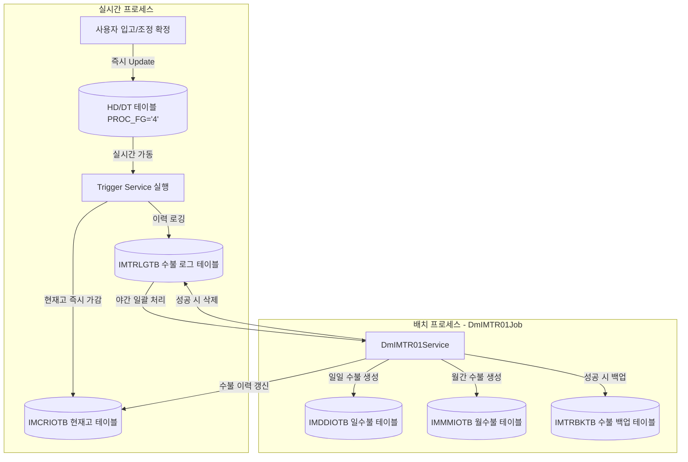

# HMS 재고 관리 데이터 흐름 및 워크플로우 명세 (Inventory Lifecycle)

본 문서는 HMS 영업정보시스템의 **실시간 재고 반영(트리거) 프로세스**와 **야간 재고 집계(배치) 프로세스**가 어떻게 연동되는지, 관련 테이블과 화면 맵핑 구조를 포함하여 상세하게 기술합니다.

---

## 1. 재고 관리 아키텍처 개요

HMS 시스템은 실시간성 판매/입고 대응과 대규모 데이터 정산의 안정성을 동시에 확보하기 위해 **실시간 트리거(Trigger Service)**와 **야간 배치 스케줄러(Batch)**를 혼합하여 사용합니다.

<div class="mermaid-wrapper" style="position: relative; margin-bottom: 20px;">
  <button onclick="navigator.clipboard.writeText(this.nextElementSibling.innerText); alert('Mermaid 코드가 복사되었습니다.');" style="position: absolute; right: 10px; top: 10px; z-index: 100; background: #2563EB; color: white; border: none; padding: 5px 10px; border-radius: 6px; cursor: pointer; font-size: 11px; font-weight: 600; box-shadow: 0 2px 5px rgba(0,0,0,0.1);">코드 복사</button>

```text
flowchart TD
    subgraph 실시간 반영 [실시간 프로세스]
        A[사용자 입고/조정 확정] -->|즉시 Update| B[(HD/DT 테이블 PROC_FG='4')]
        B -->|실시간 가동| C[Trigger Service 실행]
        C -->|현재고 즉시 가감| D[(IMCRIOTB 현재고 테이블)]
        C -->|이력 로깅| E[(IMTRLGTB 수불 로그 테이블)]
    end

    subgraph 야간 배치 [배치 프로세스 - DmIMTR01Job]
        E -->|야간 일괄 처리| F[DmIMTR01Service]
        F -->|수불 이력 갱신| D
        F -->|일일 수불 생성| G[(IMDDIOTB 일수불 테이블)]
        F -->|월간 수불 생성| H[(IMMMIOTB 월수불 테이블)]
        F -->|성공 시 백업| I[(IMTRBKTB 수불 백업 테이블)]
        F -->|성공 시 삭제| E
    end
```


</div>

---

## 2. 주요 재고 테이블 명세

| 테이블명 | 물리 테이블 명칭 | 주요 관리 데이터 | 연동 방식 |
| :--- | :--- | :--- | :--- |
| **현재고 테이블** | `IMCRIOTB` | 상품별 현재고 수량(`CUR_QTY`), 재고 단가 및 금액 | 실시간 트리거 & 야간 배치 양쪽에서 갱신 |
| **재고 수불 로그** | `IMTRLGTB` | 재고 변동 발생 시 임시 적재되는 로그 (대기 레코드) | 트리거가 생성하고, 배치가 처리 후 삭제 |
| **일 수불 테이블** | `IMDDIOTB` | 일자별 기초재고, 입출고 유형별 수량, 기말재고 | 배치를 통해 일 단위로 집계 및 누적 |
| **월 수불 테이블** | `IMMMIOTB` | 월 단위 기초재고, 월간 누적 입출고, 월말재고 | 배치를 통해 월 단위 및 차월 이월 집계 |
| **수불 로그 백업** | `IMTRBKTB` | 배치를 통해 성공적으로 처리 완료된 수불 로그 보관함 | 배치 이관 성공 시 `IMTRLGTB`에서 이동됨 |

---

## 3. 재고 변동 데이터 흐름 (Detailed Workflow)

### 3.1. [흐름 A] 실시간 재고 반영 (입고 확정 / 재고 조정 등록)
사용자가 백오프리스 화면에서 입고 또는 재고 조정을 확정하면, WAS(Java Service) 내에서 즉각적으로 재고 테이블이 최신화됩니다.

1. **사용자 액션**:
   - `st_vendor_00006` (무발주 입고) 또는 `st_stock_00001` (재고 조정 등록) 화면에서 **[확정]** 버튼을 클릭합니다.
2. **상태값 즉시 변경**:
   - WAS 서비스단(`St_Vendor_00006_Service.confirmOrdPurch` 등)이 호출되어 해당 전표 헤더와 디테일의 `PROC_FG`를 **`'4'`(확정완료)로 즉시 업데이트**합니다.
3. **트리거 서비스 가동**:
   - 쿼리 완료 직후, 서비스단에서 **`tr_OBSLPH_T01_Service`** 및 **`tr_OBSLPD_T01_Service`**가 호출됩니다.
   - **현재고 갱신**: 매장 현재고 테이블(`IMCRIOTB`)의 현재고(`CUR_QTY`) 값을 입고/조정 수량만큼 가감하여 즉시 실시간 갱신합니다.
   - **로그 적재**: 수불 로그 테이블(`IMTRLGTB`)에 변동 구분 코드(입고 `'I'`, 매입 `'P'`, 조정 `'A'` 등)로 1건의 로그 레코드를 생성합니다.

> [!NOTE]
> 입고와 재고 조정은 현장의 실시간 판매와 즉각 연결되어야 하므로 배치를 기다리지 않고 **화면 확정 즉시 실시간으로 재고가 변경**됩니다.

---

### 3.2. [흐름 B] 야간 배치 재고 누적 및 수불부 마감 (`DmIMTR01Job`)
주기적으로 가동되는 스케줄러 배치 프로그램(`hyundai-batch`)에 의해 재고 수불 대장이 마감되고 정합성이 비교 처리됩니다.

1. **배치 구동**:
   - 새벽 또는 스케줄러 주기에 따라 **`DmIMTR01Job`** (재고 반영 배치)이 가동되어 `DmIMTR01Service.SubService`가 실행됩니다.
2. **로그 테이블 스캔**:
   - 수불 로그 테이블(`IMTRLGTB`)에서 처리 상태가 대기 중인 데이터를 일괄 조회(`selectIMTRLGTB`)합니다.
3. **수불 이력 처리 및 장부 반영**:
   - 로그 데이터의 변동 구분(`PROC_FG`)을 판별하여 유형별 수량을 산출합니다.
     - **매출 `S`, 매출취소 `C`, 반품 `R`, 출고 `O`, 폐기 `D`, 매입 `P`, 입고 `I`, 조정 `A`, 대출 `X`, 대입 `E`**
   - **현재고 (`IMCRIOTB`)**: 실시간 누락분 또는 판매(POS 매출) 차감분을 최종 반영합니다.
   - **일수불 (`IMDDIOTB`)**: 해당 일자의 일 단위 수불 내역에 수량을 누적합니다.
   - **월수불 (`IMMMIOTB`)**: 당월 월수불 대장에 누적 반영하며, 당월 마감 후 잔여 재고를 차월 기초재고로 이월(`mergeNextIMMMIOTB`)하는 연쇄 처리를 수행합니다.
4. **로그 백업 및 삭제**:
   - 모든 처리가 예외 없이 성공하면, 해당 이력을 백업 테이블(`IMTRBKTB`)에 인서트하고 원본 `IMTRLGTB`에서 딜리트(`newTxProcIMTR01`)하여 로그 정리를 마무리합니다.

---

## 4. 백오프리스 재고 관리 화면 맵핑

재고 정보는 관리 목적에 따라 화면별로 바인딩되는 테이블이 명확히 분리되어 있습니다.

```
[백오프리스 UI 화면]
  │
  ├─► 현재고 실시간 조회 ──► [IMCRIOTB] 기반 조회
  │     ├─ st_stock_00007 (매장 현재고 조회)
  │     ├─ hq_stock_00001 (본사 현재고 조회)
  │     └─ hq_stock_00019 (본사 현재고 매장합계)
  │
  ├─► 수불 장부(수불부) 조회 ──► [IMDDIOTB / IMMIOTB] 기반 조회
  │     ├─ st_stock_00008 (매장 일수불 조회)
  │     ├─ st_stock_00009 (매장 월수불 조회)
  │     ├─ hq_stock_00002 (본사 일수불 조회)
  │     └─ hq_stock_00003 (본사 월수불 조회)
  │
  └─► 조정 및 실사 현황 ──► [IMREALTB] 기반 조회
        ├─ st_stock_00002 (매장 조정/실사 현황)
        └─ hq_stock_00006 (본사 조정/실사 현황)
```

---

## 5. 재고 정합성 대조 및 차이 확인 시나리오

### 5.1. 장부재고 vs 실사재고 대조 및 차이 반영
매장에서 실제 재고를 조사한 수량(실사재고)과 시스템상 수불 대장 수량(장부재고) 간에 차이가 발생하는 경우 처리하는 시나리오입니다.

1. **실사 수량 등록**:
   - `st_stock_00005` (전수실사등록) 화면에서 실사 일자를 기준으로 실제 창고의 실재고 수량을 입력 및 저장합니다.
2. **차이 내역 대조**:
   - **`st_stock_00002` (조정/실사 현황)** 화면으로 이동합니다.
   - 시스템은 배치를 통해 누적된 장부 수량과 입력된 실사 수량을 대조하여 **차이 수량**을 자동으로 계산하여 그리드에 보여줍니다.
3. **재고 조정 확정**:
   - 사용자가 실사 내용을 컨펌하고 확정하면, 그 차이만큼의 수량이 임시 수불 로그(`IMTRLGTB`)에 조정(`'A'`) 타입으로 적재되어 야간 배치를 통해 실제 테이블에 반영됩니다.

### 5.2. 현재고(`IMCRIOTB`)와 수불 데이터(`IMDDIOTB`) 간의 불일치 대조
시스템 오류 또는 배치 중단으로 인해 현재고 수량과 일수불 누계 수량 간에 정합성이 깨졌을 때의 확인 방법입니다.

> [!WARNING]
> 시스템 내부 현재고와 수불부 데이터 간의 불일치를 모니터링하는 직접적인 전용 메뉴 화면은 UI상에 제공되지 않습니다. 따라서 아래의 관리적 방법을 활용해야 합니다.

1. **화면 간 수량 교차 확인**:
   - 조정등록(`st_stock_00001`) 내 상품 추가 팝업 창에 노출되는 현재고(실시간 `IMCRIOTB` 값)와 현재고조회(`st_stock_00007`) 화면에 노출되는 현재고(수불부 테이블 가감 연산 값)의 수량이 일치하는지 비교합니다.
2. **배치 로그 분석**:
   - 수량이 불일치하는 경우, **`admin_system_00012` (배치 로그 조회)** 또는 **`admin_system_00014` (배치로그 조회)** 화면에 진입합니다.
   - `DmIMTR01Job` 배치가 돌면서 예외(Exception)를 뱉으며 트랜잭션이 롤백되었는지, 또는 처리 실패(`PROC_FG = 'E'`)로 빠진 로그가 존재하는지 로그 내역을 검색하여 조치합니다.
