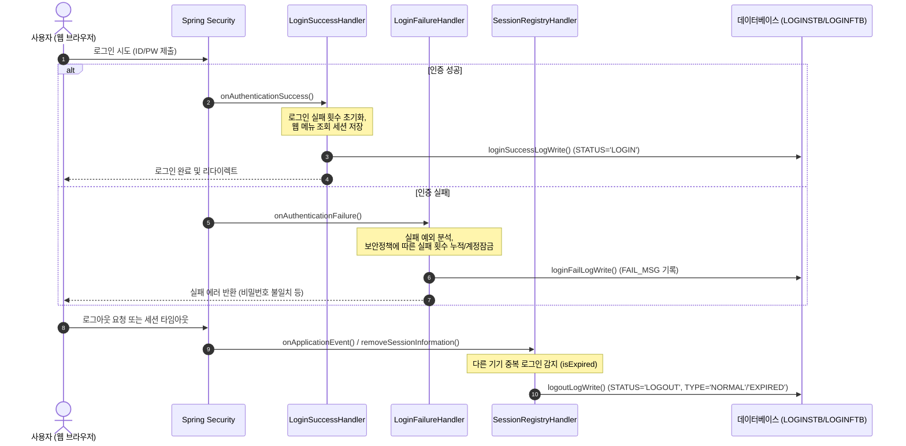

# 로그인 이력 테이블 데이터 누적 (Data Input Guide)

이 문서는 백오피스 시스템에서 로그인 및 로그아웃, 그리고 로그인 실패 시 데이터베이스에 로그 데이터가 누적되는 흐름과 대상 테이블 정보, 관련 자바 소스코드 및 SQL 매퍼 설정을 정리한 가이드입니다.

---

## 1. 대상 테이블 구조 및 컬럼 정의

사용자의 접속 이력 관리를 위해 시스템은 크게 두 개의 테이블을 사용합니다.
- **`LOGINSTB`**: 로그인 성공 및 로그아웃(세션 만료 포함) 이력을 저장하는 테이블
- **`LOGINFTB`**: 로그인 실패 이력을 저장하는 테이블

### 1.1 성공 및 로그아웃 이력 테이블 (`LOGINSTB`)

| 컬럼명 | 데이터 타입 | Null 여부 | 설명 / 비고 |
| :--- | :--- | :--- | :--- |
| **`LOG_SEQ`** | `NUMBER(20)` | `NOT NULL` | 로그 이력 SEQ (시퀀스 `hmsfns.LOGINSSQ.NEXTVAL` 사용) |
| **`USER_ID`** | `VARCHAR2(45)` | `NOT NULL` | 로그인에 성공한 사용자 ID |
| **`REMOTE_IP`** | `VARCHAR2(50)` | `NOT NULL` | 클라이언트의 원격지 IP 주소 (IPv4) |
| **`SERVER_IP`** | `VARCHAR2(50)` | `NOT NULL` | 웹 애플리케이션 서버 IP 및 포트 |
| **`STATUS`** | `VARCHAR2(10)` | `NOT NULL` | 상태구분 (`LOGIN` / `LOGOUT`) |
| **`TYPE`** | `VARCHAR2(20)` | `NULL 허용` | 세부 유형 (`NORMAL`: 일반 로그인/로그아웃, `SSO`: SSO연동 로그인, `EXPIRED`: 타 기기 중복 로그인으로 강제 로그아웃) |
| **`SESSION_ID`** | `VARCHAR2(40)` | `NULL 허용` | 서블릿 컨테이너(Tomcat) 세션 고유 ID |
| **`CREATE_DTIME`** | `VARCHAR2(14)` | `NOT NULL` | 데이터 최초 생성 일시 (`YYYYMMDDHH24MISS`) |
| **`CREATE_ID`** | `VARCHAR2(45)` | `NULL 허용` | 최초 생성 주체 (`BACKOFFICE_SECURITY` 고정) |

### 1.2 로그인 실패 이력 테이블 (`LOGINFTB`)

| 컬럼명 | 데이터 타입 | Null 여부 | 설명 / 비고 |
| :--- | :--- | :--- | :--- |
| **`LOG_SEQ`** | `NUMBER(20)` | `NOT NULL` | 로그 이력 SEQ (시퀀스 `hmsfns.LOGINFSQ.NEXTVAL` 사용) |
| **`USER_ID`** | `VARCHAR2(45)` | `NOT NULL` | 로그인을 시도한 사용자 ID |
| **`REMOTE_IP`** | `VARCHAR2(50)` | `NOT NULL` | 클라이언트의 원격지 IP 주소 (IPv4) |
| **`SERVER_IP`** | `VARCHAR2(50)` | `NOT NULL` | 웹 애플리케이션 서버 IP 및 포트 |
| **`TYPE`** | `VARCHAR2(20)` | `NULL 허용` | 세부 유형 (`NORMAL`: 일반 로그인 시도, `SSO`: SSO연동 로그인 시도) |
| **`SESSION_ID`** | `VARCHAR2(40)` | `NULL 허용` | 서블릿 컨테이너 세션 고유 ID |
| **`FAIL_MSG`** | `VARCHAR2(4000)`| `NULL 허용` | 로그인 실패 메시지 (예: 비밀번호 오류, 계정 잠김 등) |
| **`CREATE_DTIME`** | `VARCHAR2(14)` | `NOT NULL` | 데이터 최초 생성 일시 (`YYYYMMDDHH24MISS`) |
| **`CREATE_ID`** | `VARCHAR2(45)` | `NULL 허용` | 최초 생성 주체 (`BACKOFFICE_SECURITY` 고정) |

---

## 2. 데이터 누적 흐름 및 관련 자바 클래스

로그인 처리는 **Spring Security** 아키텍처를 기반으로 수행되며, 인증 성공/실패/로그아웃 이벤트 발생 시 전용 핸들러를 통해 데이터가 적재됩니다.

<div class="mermaid-wrapper" style="position: relative; margin-bottom: 20px;">
  <button onclick="navigator.clipboard.writeText(this.nextElementSibling.innerText); alert('Mermaid 코드가 복사되었습니다.');" style="position: absolute; right: 10px; top: 10px; z-index: 100; background: #2563EB; color: white; border: none; padding: 5px 10px; border-radius: 6px; cursor: pointer; font-size: 11px; font-weight: 600; box-shadow: 0 2px 5px rgba(0,0,0,0.1);">코드 복사</button>

```text
sequenceDiagram
    autonumber
    actor User as 사용자 (웹 브라우저)
    participant Sec as Spring Security
    participant SH as LoginSuccessHandler
    participant FH as LoginFailureHandler
    participant RH as SessionRegistryHandler
    participant DB as 데이터베이스 (LOGINSTB/LOGINFTB)

    User->>Sec: 로그인 시도 (ID/PW 제출)
    
    alt 인증 성공
        Sec->>SH: onAuthenticationSuccess()
        Note over SH: 로그인 실패 횟수 초기화,<br/>웹 메뉴 조회 세션 저장
        SH->>DB: loginSuccessLogWrite() (STATUS='LOGIN')
        SH-->>User: 로그인 완료 및 리다이렉트
    else 인증 실패
        Sec->>FH: onAuthenticationFailure()
        Note over FH: 실패 예외 분석,<br/>보안정책에 따른 실패 횟수 누적/계정잠금
        FH->>DB: loginFailLogWrite() (FAIL_MSG 기록)
        FH-->>User: 실패 에러 반환 (비밀번호 불일치 등)
    end

    User->>Sec: 로그아웃 요청 또는 세션 타임아웃
    Sec->>RH: onApplicationEvent() / removeSessionInformation()
    Note over RH: 다른 기기 중복 로그인 감지 (isExpired)
    RH->>DB: logoutLogWrite() (STATUS='LOGOUT', TYPE='NORMAL'/'EXPIRED')
```


</div>

### 2.1 로그인 성공 시 처리 (`LoginSuccessHandler`)
- **수행 위치**: [LoginSuccessHandler.java](file:///d:/workspace/hmotors/workspace_hms20260326/backoffice/hyundai-backoffice-webapp/src/main/java/com/hyundai/backoffice/webapp/auth/LoginSuccessHandler.java)
- **주요 로직**:
  1. `userService.initFailCnt(userId)`: 해당 사용자의 로그인 실패 카운트(`AUTH_FAILURE_CNT`)를 `0`으로 초기화.
  2. `userService.setLastLoginDtime(userId)`: `MUSERSTB` 테이블의 최종 로그인 시간(`LOGIN_LAST_DTIME`)을 현재 시각으로 갱신.
  3. `userService.loginSuccessLogWrite(...)`: `LOGINSTB` 테이블에 `STATUS = 'LOGIN'`으로 로그 적재.
     - **IP 정보 수집**: 클라이언트 IP(`request.getRemoteAddr()`), 서버 IP(`request.getLocalAddr() + ":" + request.getLocalPort()`)
     - **유형 분류**: SSO 파라미터 유무에 따라 `SSO` 또는 `NORMAL`로 지정.

### 2.2 로그인 실패 시 처리 (`LoginFailureHandler`)
- **수행 위치**: [LoginFailureHandler.java](file:///d:/workspace/hmotors/workspace_hms20260326/backoffice/hyundai-backoffice-webapp/src/main/java/com/hyundai/backoffice/webapp/auth/LoginFailureHandler.java)
- **주요 로직**:
  1. 인증 예외(`AuthenticationException`)에 따른 실패 사유 분류 (비밀번호 불일치, 계정 잠김, 계정 만료 등).
  2. **보안정책 적용**: 비밀번호 불일치 시 `increaseFailCnt`를 호출하여 실패 카운트를 누적하며, 실패 카운트가 `SECURETB`에 설정된 잠금 임계치에 도달할 경우 `setAccountLock`을 호출하여 계정을 잠금 처리 (`ACCT_LOCK = 'Y'`).
  3. `userService.loginFailLogWrite(...)`: `LOGINFTB` 테이블에 예외 내용에 매칭되는 실패 메시지(`failMsg`)와 함께 로그 적재.

### 2.3 로그아웃 및 세션 만료 시 처리 (`SessionRegistryHandler`)
- **수행 위치**: [SessionRegistryHandler.java](file:///d:/workspace/hmotors/workspace_hms20260326/backoffice/hyundai-backoffice-webapp/src/main/java/com/hyundai/backoffice/webapp/auth/SessionRegistryHandler.java)
- **주요 로직**:
  1. 사용자가 직접 로그아웃을 클릭하거나, 세션 만료 타임아웃이 되었을 때 `removeSessionInformation(sessionId)`가 호출됨.
  2. **중복 로그인 제어**: 해당 세션의 `isExpired()` 상태가 `true`인지 확인하여, 다른 기기에서 신규 로그인 함으로써 강제 로그아웃 처리가 된 것인지 판별.
  3. `userService.logoutLogWrite(...)`: `LOGINSTB` 테이블에 `STATUS = 'LOGOUT'`으로 로그 적재.
     - **유형 분류**: 중복 로그인으로 Expire 처리된 경우 `EXPIRED`, 그 외 일반 로그아웃인 경우 `NORMAL` 등으로 기록됨.

---

## 3. 실행 SQL MyBatis XML 정의

데이터를 적재할 때 호출되는 실제 SQL은 `UserAuth_Sql.xml` 파일 내에 아래와 같이 바인딩되어 동작합니다.

### 3.1 로그인 성공 기록 (`loginSuccessLogWrite`)
```xml
<insert id="loginSuccessLogWrite" parameterType="Map">
    INSERT INTO hmsfns.LOGINSTB ( 
        LOG_SEQ, 
        USER_ID, 
        REMOTE_IP, 
        SERVER_IP, 
        STATUS, 
        TYPE, 
        SESSION_ID, 
        CREATE_DTIME, 
        CREATE_ID 
    ) VALUES ( 
        hmsfns.LOGINSSQ.NEXTVAL, 
        #{userId}, 
        #{remoteIp}, 
        #{serverIp}, 
        'LOGIN', 
        #{loginType}, 
        #{sessionId}, 
        TO_CHAR(SYSDATE, 'YYYYMMDDHH24MISS'), 
        'BACKOFFICE_SECURITY'
    )
</insert>
```

### 3.2 로그인 실패 기록 (`loginFailLogWrite`)
```xml
<insert id="loginFailLogWrite" parameterType="Map">
    INSERT INTO hmsfns.LOGINFTB ( 
        LOG_SEQ, 
        USER_ID, 
        REMOTE_IP, 
        SERVER_IP, 
        TYPE, 
        SESSION_ID, 
        FAIL_MSG, 
        CREATE_DTIME, 
        CREATE_ID 
    ) VALUES ( 
        hmsfns.LOGINFSQ.NEXTVAL, 
        #{userId}, 
        #{remoteIp}, 
        #{serverIp}, 
        #{loginType}, 
        #{sessionId}, 
        #{failMsg}, 
        TO_CHAR(SYSDATE, 'YYYYMMDDHH24MISS'), 
        'BACKOFFICE_SECURITY'
    )
</insert>
```

### 3.3 로그아웃 기록 (`logoutLogWrite`)
```xml
<insert id="logoutLogWrite" parameterType="Map">
    INSERT INTO hmsfns.LOGINSTB ( 
        LOG_SEQ, 
        USER_ID, 
        REMOTE_IP, 
        SERVER_IP, 
        STATUS, 
        TYPE, 
        SESSION_ID, 
        CREATE_DTIME, 
        CREATE_ID 
    ) VALUES ( 
        hmsfns.LOGINSSQ.NEXTVAL, 
        #{userId}, 
        #{remoteIp}, 
        #{serverIp}, 
        'LOGOUT', 
        #{logoutType}, 
        #{sessionId}, 
        #{lastRequest}, 
        'BACKOFFICE_SECURITY'
    )
</insert>
```

---

## 4. 데이터 정합성 검증 및 포인트

1. **IP 자릿수 입력**:
   - `REMOTE_IP` 및 `SERVER_IP` 컬럼 길이는 `VARCHAR2(50 BYTE)`이므로 IPv4 또는 IPv6 형식의 IP 주소와 포트 번호 결합 형태가 안전하게 입력됩니다.
2. **날짜 포맷**:
   - `CREATE_DTIME`은 `VARCHAR2(14 BYTE)`이며, 자바의 날짜 생성 주입 또는 DB `TO_CHAR(SYSDATE, 'YYYYMMDDHH24MISS')` 구문을 사용하여 문자열 날짜 정합성을 유지합니다.
3. **사용자 부재 시 예외**:
   - `LOGINSTB`의 `USER_ID`는 `NOT NULL` 제약 조건이 존재하므로, 인증 시도 중 User 정보를 식별하지 못해 빈 값이 주입될 때 발생할 수 있는 데이터베이스 레벨 오류를 방지하기 위해 `LoginFailureHandler` 등에서 계정명이 존재하는지 null 방어 처리를 확인해야 합니다.
