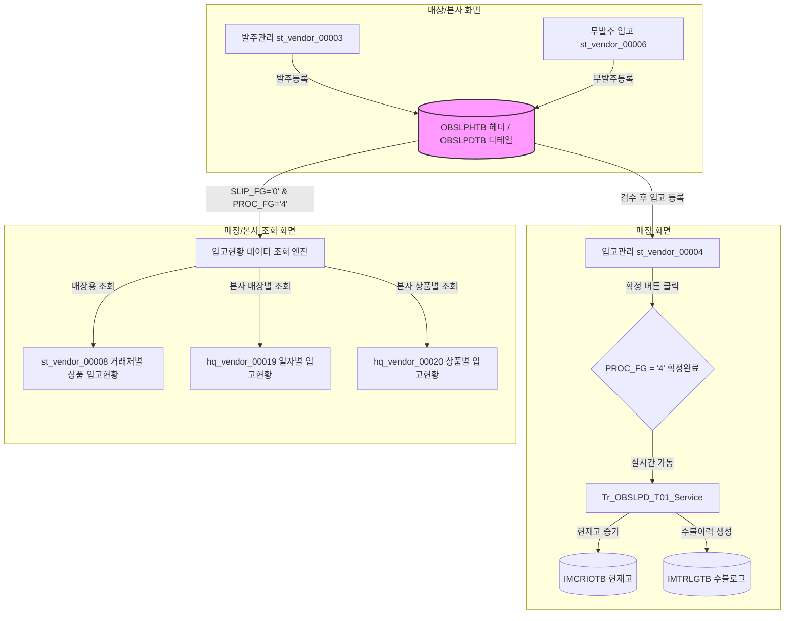

# HMS 입고 프로세스 및 입고현황 데이터 흐름 명세 (Receiving Lifecycle)

본 문서는 HMS 영업정보시스템의 **발주, 검수, 매입입고 등록, 확정**에 이르는 입고 비즈니스 프로세스와 이 데이터가 **매장/본사의 입고현황 화면에 어떻게 조회되고 취합되는지** 그 세부적인 흐름(Workflow)을 기술합니다.

---

## 1. 입고 비즈니스 데이터 흐름도

입고 프로세스는 발주(주문) 단계에서 시작하여 실물 상품의 검수를 거쳐 매장 입고(매입)로 확정되며, 최종적으로 현재고에 반영되고 현황 화면에 집계됩니다.

<div class="mermaid-wrapper" style="position: relative; margin-bottom: 20px;">
  <button onclick="navigator.clipboard.writeText(this.nextElementSibling.innerText); alert('Mermaid 코드가 복사되었습니다.');" style="position: absolute; right: 10px; top: 10px; z-index: 100; background: #2563EB; color: white; border: none; padding: 5px 10px; border-radius: 6px; cursor: pointer; font-size: 11px; font-weight: 600; box-shadow: 0 2px 5px rgba(0,0,0,0.1);">코드 복사</button>

```text
flowchart TD
    subgraph 1. 발주 및 검수 등록 [매장/본사 화면]
        A1[발주관리 st_vendor_00003] -->|발주등록| B1[(OBSLPHTB 헤더 / OBSLPDTB 디테일)]
        A2[무발주 입고 st_vendor_00006] -->|무발주등록| B1
        style B1 fill:#f9f,stroke:#333,stroke-width:2px
    end

    subgraph 2. 실물 검수 및 입고 확정 [매장 화면]
        B1 -->|검수 후 입고 등록| C1[입고관리 st_vendor_00004]
        C1 -->|확정 버튼 클릭| D1{PROC_FG = '4' 확정완료}
        D1 -->|실시간 가동| E1[Tr_OBSLPD_T01_Service]
        E1 -->|현재고 증가| F1[(IMCRIOTB 현재고)]
        E1 -->|수불이력 생성| G1[(IMTRLGTB 수불로그)]
    end

    subgraph 3. 입고현황 집계 및 조회 [매장/본사 조회 화면]
        B1 -->|SLIP_FG='0' & PROC_FG='4'| H1[입고현황 데이터 조회 엔진]
        H1 -->|매장용 조회| I1[st_vendor_00008 거래처별 상품 입고현황]
        H1 -->|본사 매장별 조회| I2[hq_vendor_00019 일자별 입고현황]
        H1 -->|본사 상품별 조회| I3[hq_vendor_00020 상품별 입고현황]
    end
```


</div>

---

## 2. 입고 관련 테이블 명세

| 테이블명 | 물리 테이블 명칭 | 주요 역할 | 핵심 컬럼 |
| :--- | :--- | :--- | :--- |
| **발주입고 헤더** | `OBSLPHTB` | 발주 및 입고 전표의 기본 정보 (거래처, 매장, 일자 등) | `SLIP_NO` (전표번호), `SLIP_FG` (슬립구분), `PROC_FG` (진행상태) |
| **발주입고 디테일**| `OBSLPDTB` | 전표별 상세 상품 내역 및 수량, 금액 정보 | `GOODS_CD` (상품코드), `PURCH_QTY` (매입수량), `PURCH_AMT` (매입금액) |
| **매장 거래처 마스터**| `MVNDRMTB` | 매장에 등록된 협력사(거래처) 정보 | `VD_NO` (거래처코드), `VD_NM` (거래처명) |
| **본사 거래처 마스터**| `TVNDRMTB` | 전사 표준 협력사 마스터 정보 | `VD_NO` (거래처코드), `VD_NM` (거래처명) |
| **상품 마스터** | `TGOODSTB` | 상품의 규격, 입수량, 과면세 구분 등 기본 마스터 | `GOODS_CD` (상품코드), `GOODS_NM` (상품명) |

---

## 3. 입고 라이프사이클 단계별 상태 변화 (Flag Matrix)

입고 전표 테이블(`OBSLPHTB`, `OBSLPDTB`)은 동일한 테이블 구조를 사용하면서, **슬립 구분(`SLIP_FG`)**과 **진행 상태(`PROC_FG`)** 플래그의 조합을 통해 비즈니스 단계를 식별합니다.

| 업무 단계 | 슬립 구분 (`SLIP_FG`) | 진행 상태 (`PROC_FG`) | 설명 |
| :--- | :---: | :---: | :--- |
| **1. 발주 등록 (임시)** | `1` (발주) | `1` (등록) | 매장에서 본사 또는 거래처로 주문 요청을 등록한 임시 상태 (수정 가능) |
| **2. 발주 확정** | `1` (발주) | `4` (확정완료) | 발주 전송이 완료되어 거래처로 주문이 넘어간 상태 |
| **3. 매입입고 등록 (임시)** | `0` (입고) | `1` (등록) | 실물이 도착하여 검수 후 입고 수량을 기재하고 임시 저장한 상태 |
| **4. 매입입고 확정 (최종)** | `0` (입고) | `4` (확정완료) | **[최종 확정 완료]** 상태. 실시간 재고가 반영되며, 입고현황 화면의 조회 대상이 됨 |

---

## 4. 입고현황 조회 화면별 데이터 취합 & 조인 흐름

최종 확정된 입고 데이터(`SLIP_FG = '0'` 및 `PROC_FG = '4'`)는 매장과 본사의 필요 항목에 따라 조인되어 가공 노출됩니다.

### 4.1. 🏪 매장용: 거래처별 상품 입고현황 (`st_vendor_00008`)
매장 점주가 우리 매장에 들어온 상품들을 거래처별로 묶어 입고량과 매입 금액을 대조하는 화면입니다.

* **핵심 조인 쿼리 구조**:
  ```sql
  SELECT A.VD_NO, V.VD_NM, B.GOODS_CD, G.GOODS_NM,
         SUM(B.PURCH_QTY) AS PURCH_QTY,  -- 총 입고 수량
         SUM(B.PURCH_AMT) AS PURCH_AMT   -- 총 공급가액
    FROM HMSFNS.OBSLPHTB A
    JOIN HMSFNS.OBSLPDTB B ON A.SLIP_NO = B.SLIP_NO AND A.MS_NO = B.MS_NO
    JOIN HMSFNS.MVNDRMTB V ON A.VD_NO = V.VD_NO AND A.MS_NO = V.MS_NO -- 매장 거래처
    JOIN HMSFNS.TGOODSTB G ON B.GOODS_CD = G.GOODS_CD                  -- 상품 마스터
   WHERE A.MS_NO = #{msNo}           -- 로그인한 세션 매장 제한
     AND A.SLIP_DATE BETWEEN #{fromDate} AND #{toDate}
     AND A.SLIP_FG = '0'             -- 매입 입고만 대상
     AND A.PROC_FG = '4'             -- 확정된 전표만 대상
   GROUP BY A.VD_NO, V.VD_NM, B.GOODS_CD, G.GOODS_NM
  ```
* **데이터 흐름**:
  1. **조회**: 해당 매장의 기간 내 확정 완료된 입고 데이터를 집계하여 목록에 렌더링합니다.
  2. **상세 팝업 (`/detailSearch`)**: 특정 상품 행을 더블클릭(또는 클릭)하면 모달창이 열리며, `OBSLPHTB`와 `OBSLPDTB`를 일자별로 다시 쪼개어 해당 상품의 일자별 세부 입고 단가, 수량 변동 이력을 추적합니다.

---

### 4.2. 🏢 본사용: 일자별(매장별) 입고현황 (`hq_vendor_00019`)
본사 MD나 관리자가 전체 혹은 특정 점포군에 들어간 입고(매입) 실적을 일자 단위로 모니터링하는 화면입니다.

* **핵심 조인 쿼리 구조**:
  ```sql
  SELECT A.SLIP_DATE, A.MS_NO, M.MS_NM, A.VD_NO, V.VD_NM,
         SUM(B.PURCH_QTY) AS TOTAL_QTY,
         SUM(B.PURCH_AMT) AS TOTAL_AMT
    FROM HMSFNS.OBSLPHTB A
    JOIN HMSFNS.OBSLPDTB B ON A.SLIP_NO = B.SLIP_NO AND A.MS_NO = B.MS_NO
    JOIN HMSFNS.TMARKETB M ON A.MS_NO = M.MS_NO                       -- 본사 매장 마스터
    JOIN HMSFNS.TVNDRMTB V ON A.VD_NO = V.VD_NO                       -- 본사 거래처 마스터
   WHERE A.SLIP_DATE BETWEEN #{fromDate} AND #{toDate}
     AND A.SLIP_FG = '0'
     AND A.PROC_FG = '4'
   GROUP BY A.SLIP_DATE, A.MS_NO, M.MS_NM, A.VD_NO, V.VD_NM
  ```
* **데이터 흐름**:
  - 매장 세션 제약이 없으므로 본사 권한을 가진 사용자가 **여러 매장 정보를 한눈에 취합**하여 조회할 수 있습니다.
  - 본부 거래처 마스터(`TVNDRMTB`) 및 매장 마스터(`TMARKETB`)와 조인하여 표준화된 정보를 출력합니다.

---

### 4.3. 🏢 본사용: 상품별 입고현황 (`hq_vendor_00020`)
본사 관점에서 전 점포에 입고된 상품 품목별 매입 수량과 금액 추이를 집계하여 분석하는 화면입니다.

* **핵심 조인 쿼리 구조**:
  ```sql
  SELECT B.GOODS_CD, G.GOODS_NM, G.SPEC,
         SUM(B.PURCH_QTY) AS TOTAL_QTY,
         SUM(B.PURCH_AMT) AS TOTAL_AMT,
         SUM(B.VAT) AS TOTAL_VAT
    FROM HMSFNS.OBSLPHTB A
    JOIN HMSFNS.OBSLPDTB B ON A.SLIP_NO = B.SLIP_NO AND A.MS_NO = B.MS_NO
    JOIN HMSFNS.TGOODSTB G ON B.GOODS_CD = G.GOODS_CD
   WHERE A.SLIP_DATE BETWEEN #{fromDate} AND #{toDate}
     AND A.SLIP_FG = '0'
     AND A.PROC_FG = '4'
   GROUP BY B.GOODS_CD, G.GOODS_NM, G.SPEC
  ```
* **데이터 흐름**:
  - 상품 대/중/소 분류 코드 및 체인 구분 조건에 따라 데이터를 조인하고 집계하여 본사 상품 기획 및 원가 분석 자료로 연동됩니다.

---

## 5. 핵심 확인 사항 및 장애 대처 시나리오

1. **입고 확정 후에도 현황 화면에서 조회가 안 되는 경우**:
   - **원인**: 전표의 마감 여부(`PROC_FG`)가 `'1'` (임시등록) 상태이거나, 슬립구분(`SLIP_FG`)이 `'1'` (발주) 상태인 경우 현황 집계 대상에서 누락됩니다.
   - **해결**: 입고등록 화면(`st_vendor_00004`)에서 해당 전표가 정확하게 **[확정]** 처리되었는지 확인하여 `PROC_FG`를 `'4'`로 갱신해 주어야 합니다.
2. **거래처명이 공백(Blank)으로 출력되는 경우**:
   - **원인**: 본사와 매장의 거래처 동기화 문제. 매장 테이블(`OBSLPHTB`)에 들어간 거래처코드(`VD_NO`)가 매장 거래처 마스터(`MVNDRMTB`)나 본사 거래처 마스터(`TVNDRMTB`)에 존재하지 않는 경우 Outer Join 맵핑 실패로 공백 노출이 발생합니다.
   - **해결**: 마스터 관리의 거래처 매핑 정보를 점검하고 마스터 데이터를 복사/보완해야 합니다.
