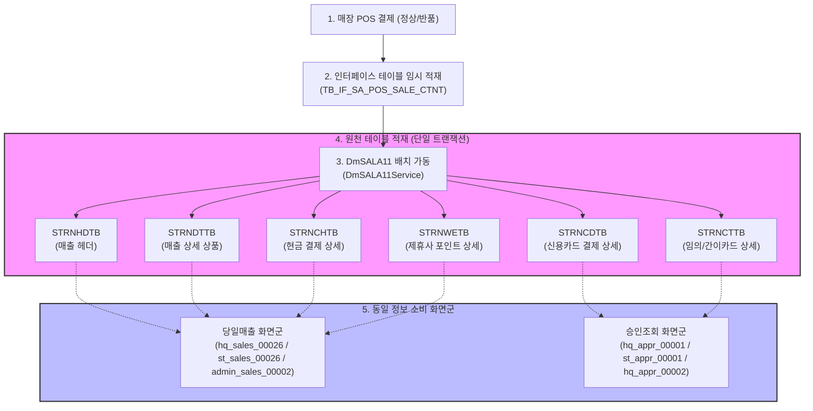

# 당일매출 및 카드승인 데이터 통합 흐름 가이드 (Integrated DataFlow Guide)

가맹점 POS 기기에서 발생한 매출 정보가 실시간/배치 연동을 통해 DB에 적재되는 과정과, 이 동일한 원천 데이터를 소비하는 화면들의 상관관계를 정리한 개발/검증용 통합 데이터 가이드입니다.

---

## 1. 데이터 연동 구조 (POS → DB)

매장에서 결제가 완료되면 POS 기기는 매출 헤더, 매출 상세(상품), 결제 상세(현금, 카드, 제휴사포인트 등)가 하나로 묶인 **JSON 저널 데이터**를 서버로 송신합니다.
서버는 인터페이스 테이블(`TB_IF_SA_POS_SALE_CTNT`)에 임시 저장한 후, **`DmSALA11`** 배치 프로그램을 실행하여 연관 테이블군에 동시 적재(INSERT/UPDATE)합니다.

---

## 2. 테이블 스키마 관계 및 주요 키 (ER-Relation)

모든 매출 및 결제 테이블은 POS에서 생성된 고유의 거래 식별 키 조합(Composite Key)을 공유하며 조인됩니다.

* **기준 식별 복합키 (Composite Join Key)**:
  `SALE_DATE` (영업일자) + `MS_NO` (매장코드) + `POS_NO` (포스번호) + `BILL_NO` (전표번호)

| 테이블명 | 테이블 설명 | 주요 소비 화면군 | 주요 컬럼 |
|---------|-----------|----------------|----------|
| **`STRNHDTB`** | 매출 거래 헤더 정보 | 당일매출, 영업일보/월보 | 총 매출액, 부가세액, 현금/카드/포인트 결제총액 등 |
| **`STRNDTTB`** | 매출 상세 상품 정보 | 당일매출, 매출상세조회 모달 | 상품코드, 상품별 수량, 단가, 할인금액, 순매출액 등 |
| **`STRNCHTB`** | 현금 결제 정보 | 당일매출, 시재관리 화면 | 현금결제액, 거스름돈 등 |
| **`STRNCDTB`** | 신용카드 결제 상세 | 당일 승인현황, 카드사 승인내역 | 승인번호, 카드사코드, 카드번호, 승인금액 등 |
| **`STRNCTTB`** | 임의등록/간이카드 상세 | 당일 승인현황 | 임의등록카드 승인액, 카드사 임시 정보 등 |
| **`STRNWETB`** | 제휴사 포인트 사용 상세 | 당일매출 | 제휴사코드, 포인트 사용/할인액 등 |

---

## 3. 동일 테이블 정보 소비 화면 목록

동일한 `DmSALA11` 배치 트랜잭션에서 생성된 테이블 데이터를 소비하여 비즈니스 처리를 수행하는 화면군 목록입니다.

### 3.1 승인조회 화면군 (카드 거래 전용)
* **`hq_appr_00001` (본사 당일 승인현황)**
  - **소비 테이블**: `STRNCDTB` ∪ `STRNCTTB` (UNION ALL)
  - **특징**: 당일 영업시간 내 발생한 일반 신용카드와 임의등록 카드의 모든 승인 내역을 실시간으로 집계 및 대조 조회합니다.
* **`st_appr_00001` (매장 당일 승인현황)**
  - **소비 테이블**: `STRNCDTB` ∪ `STRNCTTB` (UNION ALL)
  - **특징**: 로그인한 매장 세션의 카드 거래 정보만 자동 한정하여 조회합니다.
* **`hq_appr_00002` / `st_appr_00002` (카드사 승인내역)**
  - **소비 테이블**: `STRNCDTB` 조인 `MCARDMTB` (카드사 마스터)
  - **특징**: 카드사별 수수료 및 정산 대조를 위해 매입 카드사별 승인 실적을 요약 조회합니다.

### 3.2 매출분석/영업리포트 화면군 (종합 매출)
* **`hq_sales_00026` (본사 당일매출)**
  - **소비 테이블**: `STRNHDTB` ⋈ `STRNDTTB` (기본 조인), `STRNCHTB`, `STRNWETB` 서브쿼리 조회
  - **특징**: 당일 발생한 전체 매출(정상/반품) 건수와 품목 상세, 각 결제수단별 금액 합계를 요약 및 목록으로 시각화합니다.
* **`st_sales_00026` (매장 당일매출)**
  - **소비 테이블**: `STRNHDTB` ⋈ `STRNDTTB`, `STRNCHTB` 등
  - **특징**: 매장 단위의 당일 매출 마감 대조를 위해 사용합니다.
* **`admin_sales_00002` (어드민 당일매출)**
  - **소비 테이블**: `STRNHDTB` ⋈ `STRNDTTB`, `STRNCHTB` 등
  - **특징**: 관리자 권한으로 시스템 전체 가맹점의 당일 실시간 매출 현황을 통합 모니터링합니다.

---

## 4. 데이터 정합성 검증 기준 (QA Check Point)
* **합계 일치성**: 
  - `STRNHDTB.CARD_AMT` (카드 결제액 합계) = `STRNCDTB` 및 `STRNCTTB`에 적재된 카드 승인 금액의 합
  - `STRNHDTB.SALE_AMT` (헤더 매출총액) = `STRNDTTB.SALE_AMT` (상세 매출상품의 합)
* **동시성**:
  - `DmSALA11` 배치가 수행 완료되면, 위 소비 화면군 전체에서 동일한 `SALE_DATE`에 대해 일관되게 매출과 승인 내역이 실시간으로 동기화되어 조회되어야 합니다.
