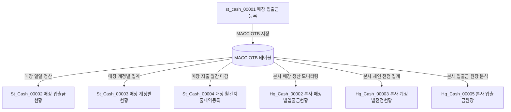

# 매장 현금시재 입출금 데이터(MACCIOTB) 연동 및 활용 가이드

본 가이드는 매장 현금시재 입출금내역등록(`st_cash_00001`) 화면을 통해 데이터베이스에 누적된 실적 데이터(`MACCIOTB`)가 백오피스 시스템 전체(본사 및 가맹점)에서 어떻게 조회되고 연동되는지 그 활용처와 데이터 정합성 설계를 상세 기술합니다.

---

## 1. 데이터 소스 및 테이블 개요

### 1.1 입출금 등록 대상 테이블 (`MACCIOTB`)
`st_cash_00001` 화면에서 [내역추가] 시 저장되는 테이블입니다. 매장의 일별 현금 입금/출금 거래 실적을 고유 시계번호(`ACCIO_NO`) 단위로 기록합니다.

| 물리 컬럼명 | 논리 컬럼명 | 데이터 타입 | 설명 | 필수 여부 |
|:---|:---|:---|:---|:---|
| **`ACCIO_DATE`** | 입출금일자 | `varchar(8)` | 거래가 발생한 영업일자 (PK) | **필수** |
| **`MS_NO`** | 매장코드 | `varchar(15)` | 거래가 발생한 가맹점 코드 (PK) | **필수** |
| **`ACCIO_NO`** | 시계번호 | `varchar(4)` | 당일 매장별 일련번호 (0001부터 순차 LPAD 채움) (PK) | **필수** |
| **`ACNT_FG`** | 계정구분 | `character(1)` | `'0'`: 입금, `'1'`: 출금 | **필수** |
| **`ACNT_CD`** | 계정코드 | `varchar(20)` | `MMACNTTB` 테이블에 매핑된 상세 계정코드 | **필수** |
| **`ACNT_AMT`** | 계정금액 | `numeric(11,2)` | 실제 거래 입출금 금액 | **필수** |
| **`VAT`** | 부가세 | `numeric(11,2)` | 거래에 발생한 부가세액 | **필수** |
| **`CUST_CD`** | 거래처코드 | `varchar(16)` | 거래 협력업체 코드 | **선택 (공백 가능)** |
| **`REMARK`** | 비고 | `varchar(30)` | 거래 상세 적요 | **선택 (공백 가능)** |
| **`DELETE_YN`** | 삭제여부 | `character(1)` | `'Y'`: 삭제, `'N'`: 사용 | **필수** |

---

## 2. 입출금 누적 데이터(MACCIOTB) 전체 활용처 (화면별 연동 분석)

매장에서 등록한 현금 시재 정보는 본사와 매장의 다양한 자금/정산/일계 분석 화면에서 다각도로 집계 및 조회됩니다.

<div class="mermaid-wrapper" style="position: relative; margin-bottom: 20px;">
  <button onclick="navigator.clipboard.writeText(this.nextElementSibling.innerText); alert('Mermaid 코드가 복사되었습니다.');" style="position: absolute; right: 10px; top: 10px; z-index: 100; background: #2563EB; color: white; border: none; padding: 5px 10px; border-radius: 6px; cursor: pointer; font-size: 11px; font-weight: 600; box-shadow: 0 2px 5px rgba(0,0,0,0.1);">코드 복사</button>

```text
graph TD
    A[st_cash_00001 매장 입출금 등록] -->|MACCIOTB 저장| B[(MACCIOTB 테이블)]
    
    B -->|매장 일일 정산| C[St_Cash_00002 매장 입출금현황]
    B -->|매장 계정별 집계| D[St_Cash_00003 매장 계정별현황]
    B -->|매장 지출 월간 마감| E[St_Cash_00004 매장 월간지출내역등록]
    
    B -->|본사 매장 정산 모니터링| F[Hq_Cash_00002 본사 매장별입출금현황]
    B -->|본사 체인 전점 집계| G[Hq_Cash_00003 본사 계정별전점현황]
    B -->|본사 입출금 원장 분석| H[Hq_Cash_00005 본사 입출금원장]
```


</div>

### 2.1 매장(가맹점) 권한 화면에서의 활용

#### ① [조회] 매장 입출금현황 (`st_cash_00002`)
- **기능**: 매장 사용자가 기간별로 등록한 입출금 내역을 리스트 및 일자별 통계로 조회하여 일일 현금 마감 시 대조합니다.
- **SQL 매퍼**: `St_Cash_00002_Sql.xml` -> `selectMmaList`, `selectDetailMMaList`
- **조인 관계**: `MMACNTTB` (매장 계정코드 마스터) 테이블과 `MS_NO`, `ACNT_FG`, `ACNT_CD`를 기준으로 조인하여 상세 계정명(`ACNT_NM`)을 화면에 출력합니다.

#### ② [조회] 매장 계정별현황 (`st_cash_00003`)
- **기능**: 기간 내 매장에서 발생한 입출금 금액을 계정코드별(소계)로 합산하여 어느 지출 항목에 자금이 가장 많이 집중되었는지 집계합니다.
- **SQL 매퍼**: `St_Cash_00003_Sql.xml` -> `selectMmaList` (GROUP BY 집계)
- **조인 관계**: `MMACNCTB` (가맹점 계정분류) 및 `MMACNTTB` (가맹점 계정코드) 테이블과 조인하여 계정코드명(`ACNT_CDNM`)별 합산 금액(`SUM(ACNT_AMT)`)을 표기합니다.

#### ③ [조회] 매장 월간지출내역등록 (`st_cash_00004`)
- **기능**: 매장에서 월간 주기로 발생하는 고정 지출(월세, 관리비 등)을 별도로 등록하고 관리하는 화면으로, 기존 입출금 실적 데이터(`MACCIOTB`)를 참조하여 대조 검증합니다.

---

### 2.2 본사(HQ) 권한 화면에서의 활용

#### ① [조회] 본사 매장별 입출금현황 (`hq_cash_00002`)
- **기능**: 본사 관리자가 산하 가맹점들을 선택하여 해당 매장이 당일 혹은 기간 내 등록한 현금 시재 입출금 원장을 조회하고 이상 여부를 모니터링합니다.
- **SQL 매퍼**: `Hq_Cash_00002_Sql.xml` -> `selectMmaList`, `selectDetailMMaList`
- **연동 키**: 로그인한 본사 관리자가 선택한 가맹점 코드(`selectMsNo`)를 바인딩하여 조회합니다.

#### ② [조회] 본사 계정별 전점현황 (`hq_cash_00003`)
- **기능**: 본사에서 체인 내 모든 가맹점을 대상으로 특정 계정(예: 잡이익, 수수료지출 등)의 전점 합계를 구하여 체인 자금 흐름의 거시 통계를 냅니다.
- **SQL 매퍼**: `Hq_Cash_00003_Sql.xml` -> `selectMmaList`
- **조인 관계**: `MMEMBSTB` (매장 마스터) 및 `MMACNTTB` (가맹점 계정코드) 테이블과 조인하여, 가맹점의 사용 여부(`USE_YN = 'Y'`)가 활성화된 매장의 데이터만 합산 집계합니다.

#### ③ [조회] 본사 입출금원장 (`hq_cash_00005`)
- **기능**: 본사 재무 담당자가 체인 전체 가맹점의 입출금 거래 내역 전체를 일자별, 매장별, 계정코드별로 상세 필터링하여 엑셀 등으로 다운로드하거나 원장을 대조 검증합니다.
- **SQL 매퍼**: `Hq_Cash_00005_Sql.xml` -> `selectMmaList`, `selectDetailMMaList`

---

## 3. `CUST_CD` (거래처코드) 및 `REMARK` (비고) 누락 타당성 검증

사용자가 현금 시재를 등록할 때 `CUST_CD`와 `REMARK`가 빈 값(`""`)으로 저장되어도 시스템 정합성 및 다른 화면 통계에 영향이 없는 명확한 기술적 근거입니다.

### 3.1 쿼리 조인 관계 분석 (Join-Safe)
`MACCIOTB`를 참조하는 본사 및 매장의 모든 조회 SQL XML(`Hq_Cash_00002`, `Hq_Cash_00003`, `Hq_Cash_00005`, `St_Cash_00002`, `St_Cash_00003` 등)을 분석한 결과:
1. **거래처 마스터 조인 없음**:
   - 거래처 코드(`CUST_CD`)를 통해 거래처 정보 테이블(`TVNDRMTB` 등)과 `INNER JOIN`을 맺는 쿼리가 **단 하나도 존재하지 않습니다.**
   - 즉, `CUST_CD`가 누락되거나 존재하지 않는 코드라 하더라도 **조인 누락으로 인해 목록에서 데이터가 누락되는 등의 심각한 오류가 절대 발생하지 않습니다.**
2. **단순 Null-Safe String 처리**:
   - 상세 내역 조회 시 `CUST_CD`와 `REMARK`는 모두 `NVL(A.CUST_CD, '')` 및 `NVL(A.REMARK, '')` 처리를 거쳐 자바 서버단으로 전달됩니다.
   - 따라서 DB에 공백(`''`)이나 NULL로 저장되어도 NullPointerException 및 타입 오류 없이 안전하게 파싱됩니다.

### 3.2 비즈니스적 설계 의도
- 매장의 일일 현금 보유고(시재금)를 맞추고 기록하는 '현금 시재 등록' 업무 특성상, **자금의 흐름 금액(ACNT_AMT)과 계정 분류(ACNT_CD)**가 핵심 정합성 요소입니다.
- 거래처 정보(`CUST_CD`) 및 적요(`REMARK`)는 매장 직원이 필수적으로 알기 어렵거나 불필요한 입력 요소가 될 수 있어, **화면 기획 단계에서 폼 입력 요소 자체를 주석 처리하여 입력을 배제**하도록 화면 설계가 의도된 상태입니다.

### 3.3 결론
- `custCd`와 `remark`는 입력하지 않고 빈 문자열(`""`)로 저장되는 것이 **기획적/설계적으로 의도된 사양**입니다.
- 자바 컨트롤러의 파라미터 방어 코드(`map.containsKey()`)와 MyBatis의 기본 빈 문자열 처리가 잘 되어 있어, 데이터 누락에 대한 사이드 이펙트는 전혀 없습니다.

---

## 4. 데이터 무결성 및 계정 삭제 제한 규정

본사 계정 마스터와 가맹점 실적 장부 간의 데이터 무결성을 유지하기 위해, 거래 실적이 있는 계정의 삭제를 시스템적으로 제한하고 있습니다.

### 4.1 본사 계정 삭제 시의 `MACCIOTB` 연계 제한
본사 입출금계정관리(`hq_cash_00001`) 화면에서 계정을 삭제하려고 할 때, 백엔드 서비스([Hq_Cash_00001_Service.java](file:///d:/workspace/hmotors/workspace_hms20260326/backoffice/hyundai-backoffice-layer-service/src/main/java/com/hyundai/backoffice/webapp/service/hq/cash/Hq_Cash_00001_Service.java#L135))는 삭제 대상 코드가 가맹점에서 기사용 중인지 여부를 먼저 확인합니다.

* **사용 여부 체크 쿼리 (`useCdChk`)**:
  ```xml
  SELECT COUNT(*)
    FROM hmsfns.MACCIOTB
   WHERE CHAIN_NO  = #{chainNo}
     AND ACNT_FG   = #{acntFg}
     AND ACNT_CD   = LPAD(#{acntCd},2,'0')
     AND DELETE_YN = 'N'
  ```
* **제한 규칙**: `MACCIOTB` 테이블 내에 대상 계정 코드(`ACNT_CD`)로 등록되고 활성화된 거래 실적(`DELETE_YN = 'N'`)이 **단 1건이라도 존재한다면**, 삭제 연쇄 작업을 강제 중단(fail 카운트 처리)하여 본사 마스터 계정이 함부로 유실되지 않도록 보호합니다.

### 4.2 `MACCIOTB`에 영향을 미치는 원천 업무 화면 (CUD)
가맹점에서 입출금 거래 이력을 발생시켜 본사의 삭제 제한 조건을 충족시키는 원천 CRUD 화면은 다음과 같습니다.

| 화면 ID | 화면명 | 처리 방식 | 계정 매핑 역할 |
|:---|:---|:---|:---|
| **`st_cash_00001`** | 매장 입출금내역등록 | CUD (등록/수정/삭제) | 매장의 일일 현금 시재 입/출금 발생 시 계정 코드 지정 및 이력 적재 |
| **`st_cash_00004`** | 매장 지출결의등록 | CUD (등록/수정/삭제) | 매장 고정 및 변동 지출(월세 등) 비용 결의서 기입 시 해당 계정 매핑 |

### 4.3 설계 타당성 및 정합성 수칙
* **고아 데이터 방지**: 가맹점 입출금 통계 및 전점 현황 화면은 `MACCIOTB`와 본사 마스터 `TMACNTTB`를 조인하여 조회합니다. 만약 실적이 존재하는 본사 계정이 지워지면 조인 관계가 유실되어 거래 정보가 깨지는 오류가 발생합니다.
* **업무 룰**: 따라서 이력을 가진 계정은 삭제할 수 없으며, 불필요해진 계정은 향후 삭제하는 대신 본사의 `USE_YN` 사용 여부 플래그를 `'N'`으로 처리하여 비활성화하는 업무적 운영 방식을 따라야 합니다.

