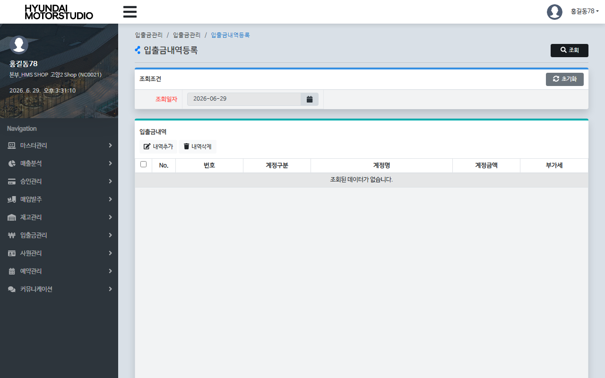
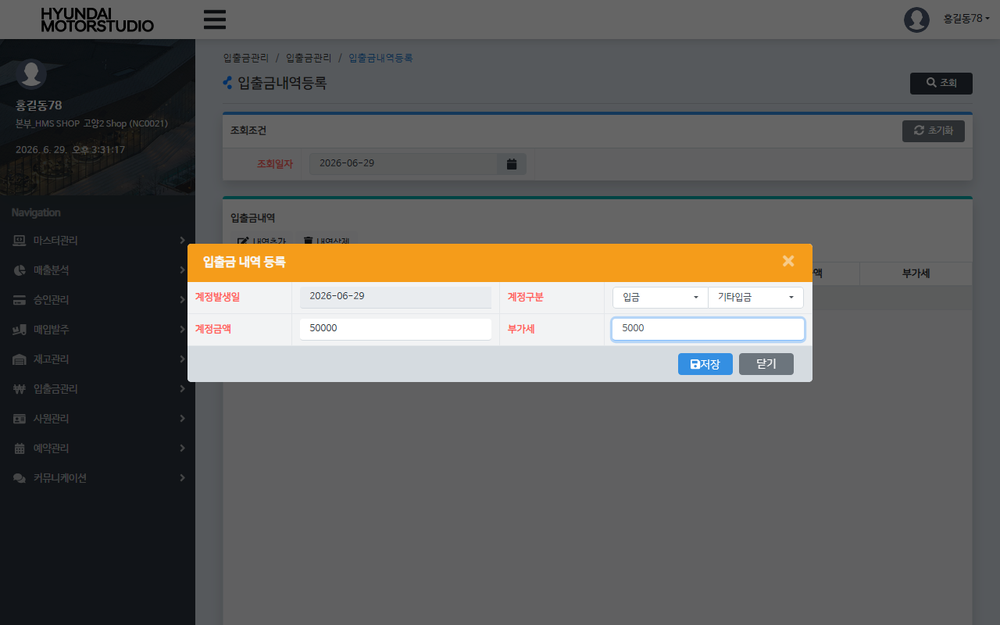
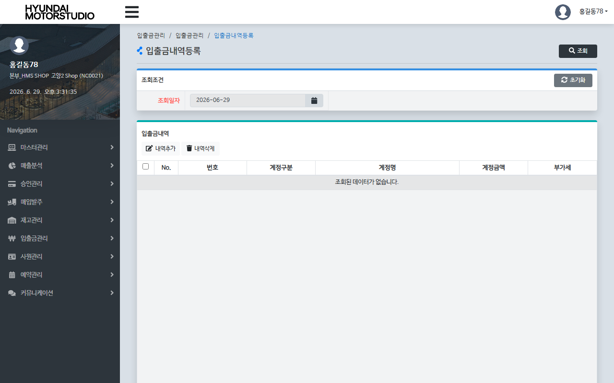

# QA Report: St_Cash_00001 입출금내역등록
**작성일**: 2026-06-29  
**작성자**: AI QA Agent (Antigravity)  
**대상 화면**: 현금관리 > 입출금관리 > 입출금내역등록 (`st_cash_00001`)  
**테스트 환경**: localhost:8080 (로컬 WAS 개발 서버)  
**대상 데이터베이스**: `192.168.10.206 / edb` (schema: `hmsfns`)  
**테스트 가맹점 ID / 계정**: `NC0021` / `I000034b` (비밀번호: `0000`)

---

## 1. 분석 개요

### 1.1 분석 대상 파일 목록

| 구분 | 파일 경로 |
|------|-----------|
| Controller | `com.hyundai.backoffice.webapp.controller.st.cash.St_Cash_00001_Controller.java` |
| Service | `com.hyundai.backoffice.webapp.service.st.cash.St_Cash_00001_Service.java` |
| Mapper (Interface) | `com.hyundai.backoffice.webapp.dao.st.cash.St_Cash_00001_Mapper.java` |
| SQL XML | `hyundai-backoffice-webapp/src/main/resources/sqlmapper/cash/St_Cash_00001_Sql.xml` |
| JSP | `hyundai-backoffice-webapp/src/main/webapp/WEB-INF/views/backoffice/main/contents/st/cash/st_cash_00001/st_cash_00001.jsp` |
| JSP Modal | `hyundai-backoffice-webapp/src/main/webapp/WEB-INF/views/backoffice/main/contents/st/cash/st_cash_00001/modal/st_cash_00001_M01.jsp` |
| JS | `hyundai-backoffice-webapp/src/main/webapp/WEB-INF/views/backoffice/main/contents/st/cash/st_cash_00001/js/st_cash_00001.js` |
| JS BT | `hyundai-backoffice-webapp/src/main/webapp/WEB-INF/views/backoffice/main/contents/st/cash/st_cash_00001/js/st_cash_00001_bt.js` |

---

## 2. 엔드포인트 분석

### 2.1 Base URL
```
POST /backoffice/data/st/cash/st_cash_00001/{endpoint}
```

### 2.2 엔드포인트 목록

| 엔드포인트 | HTTP | 기능 | ServiceLog | 관련 테이블 |
|-----------|------|------|------------|------------|
| `/selectAcntCd` | POST | 입출금계점 콤보 조회 | SELECT | `hmsfns.TMACNTTB` |
| `/selectMmaList` | POST | 등록된 내역 조회 | SELECT | `hmsfns.MACCIOTB`, `hmsfns.MMACNTTB` |
| `/cashSave` | POST | 입출금 내역 등록 (MAX_ID 채번 및 99건 제한 체크) | INSERT | `hmsfns.MACCIOTB` |
| `/cashUpdate` | POST | 입출금 내역 수정 | UPDATE | `hmsfns.MACCIOTB` |
| `/cashDel` | POST | 입출금 내역 논리 삭제 (DELETE_YN = 'Y') | UPDATE | `hmsfns.MACCIOTB` |

---

## 3. 서비스 로직 및 DB 영향도 분석

### 3.1 등록 흐름 (`cashSave` -> `insertCashList`)
1. `St_Cash_00001_Mapper.getAccioNo`를 통해 해당 매장(`msNo`) 및 발생일자(`accioDate`) 기준의 다음 일련번호(`MAX_ID`)를 생성합니다 (`LPAD(NVL(MAX(TO_NUMBER(ACCIO_NO)), 0)+1, 4, '0')`).
2. `St_Cash_00001_Mapper.selectChkCnt`를 통해 해당 매장/일자의 기존 등록 건수를 조회합니다.
3. 등록 건수가 **98건을 초과(count > 98, 즉 99건 이상)**하는 경우 `0`을 반환하며 등록이 차단됩니다.
4. 등록 건수 기준을 충족하는 경우 `insertCash` 쿼리를 실행하여 새 내역을 삽입합니다.

### 3.2 수정 및 삭제 흐름
* **수정 (`cashUpdate` -> `updateCash`)**:
  - `accioDate`, `msNo`, `accioNo` 키 조건으로 `ACNT_AMT`, `VAT`, `USER_ID`, `LAST_DTIME` 등의 값을 업데이트합니다.
* **삭제 (`cashDel` -> `deleteYnUpdate`)**:
  - 선택된 삭제 대상 번호 배열(`delAccioNoArr`)을 순회하며 파라미터 리스트(`List<Map>`)를 구성한 후, MyBatis `<foreach>` 구문을 사용하여 **단 한 번의 DML 실행**으로 대상 행들의 `DELETE_YN` 필드를 `'Y'`로 일괄 논리 삭제 업데이트합니다.

### 3.3 트리거 및 프로시저 영향도 검증
* EDB PostgreSQL 데이터베이스의 스키마 분석 결과, `hmsfns.MACCIOTB` 테이블에는 **연동된 어떠한 DB 트리거(Trigger)나 내장 프로시저(Stored Procedure)도 존재하지 않습니다**.
* 따라서 입출금 내역의 등록/수정/삭제 시 다른 테이블로 전파되는 연쇄 데이터 변경 영향도(Depth 2 ~ Depth 3)는 전혀 없는 단순 설정 테이블임을 확인했습니다.

### 3.4 형변환 결함 에러 체크
* 데이터베이스의 금액(`ACNT_AMT`) 및 부가세(`VAT`) 컬럼은 `numeric` 타입으로 설계되어 있습니다.
* 프론트엔드 단(`st_cash_00001.js`)에서 저장 시 필수값 체크를 통해 빈 값(`""`) 전송을 사전 차단하며, 키보드 입력 필터(`removeChar()`)를 사용해 오직 숫자만 입력받도록 보장합니다 (`event.target.value.replace(/[^0-9]/g, "")`).
* 따라서 백엔드 쿼리 바인딩 시 `''` 문자열로 인한 숫자 형변환 결함(Type Mismatch Error) 발생 위험은 없습니다.

---

## 4. E2E 테스트 시나리오 및 결과

### 4.1 E2E 테스트 개요
* **수행 방식**: Playwright 기반 E2E 자동화 스크립트 작성 및 실행
* **계정 정보**: `I000034b` (매장 권한, 매장코드: `NC0021`)
* **테스트 일자**: `2026-06-29`
* **검증 시나리오**:
  1. `I000034b` 계정 로그인 후 `st_cash_00001` 화면으로 이동.
  2. 조회 일자를 `'2026-06-29'`로 지정 후 조회 실행 (초기 빈 리스트 화면).
  3. [내역추가] 버튼 클릭 ➡️ 입금 구분의 첫 번째 계정코드 선택 ➡️ 금액 `50,000` / 부가세 `5,000` 입력 후 [저장] 확인.
  4. 데이터베이스 `hmsfns.MACCIOTB` 직접 조회를 통해 신규 행 등록 정합성 검증 ✅
  5. 화면 목록에 등록된 행의 계정명(`td.table-onclick`) 클릭 ➡️ 금액 `60,000` / 부가세 `6,000` 수정 입력 후 [저장] 확인.
  6. 데이터베이스 직접 조회를 통해 데이터 업데이트 정합성 검증 ✅
  7. 해당 행의 체크박스를 선택 ➡️ [내역삭제] 버튼 클릭 후 삭제 승인.
  8. 데이터베이스 직접 조회를 통해 해당 행의 `DELETE_YN`이 `'Y'`로 변경된 것 최종 검증 ✅

### 4.2 스크린샷 검증
* **초기 조회 화면**:
  
* **내역 추가 모달 입력 화면**:
  
* **내역 삭제 완료 후 화면**:
  

---

## 5. 정적 코드 분석 결과 및 권고사항

### 🟢 Info (특이사항 및 팁)
1. **수정 모달 진입 트리거 설계**:
   - `st_cash_00001_bt.js`의 `click-row.bs.table` 핸들러 구현을 살펴보면, 사용자가 행의 아무 곳이나 클릭할 때 수정 모달이 열리는 것이 아니라, 오직 **계정명 컬럼(`ACNT_NM` 필드, CSS 클래스 `table-onclick`)**을 클릭했을 때만 `fnDetailNM()` 함수가 실행되도록 조건 분기 처리되어 있습니다 (`if( JSON.stringify(value) == '"ACNT_NM"')`).
   - 일반적인 테이블 전체 행 클릭 동작과 다르므로 매뉴얼 및 QA 테스트 시 유의가 필요합니다.
2. **`deleteYnUpdate` 구현 개선 확인**:
   - 이전 버전의 명세에는 삭제 루프 내에서 Mapper가 중복 다중 호출되는 이슈(O(N^2) DB 부하 유발)가 있는 것으로 기재되어 있었으나, 현재 소스 코드 검토 결과 루프 내에서는 단순 파라미터 리스트만 빌드하고, 루프 종료 후 최종적으로 `St_Cash_00001_Mapper.deleteYnUpdate(list)`를 단일 호출하여 일괄 DML 처리하도록 안전하게 리팩토링되어 있음을 확인하였습니다.

---

## 6. 종합 판정

| 검증 항목 | 결과 | 비고 |
|------|------|------|
| 화면 로딩 및 레이아웃 | ✅ PASS | 정상 로딩 완료 |
| 계정 콤보 박스 조회 | ✅ PASS | TMACNTTB 연동 정상 동작 |
| 신규 내역 등록 (C) | ✅ PASS | MACCIOTB INSERT 완료 |
| 기존 내역 수정 (U) | ✅ PASS | MACCIOTB UPDATE 완료 |
| 기존 내역 삭제 (D) | ✅ PASS | DELETE_YN = 'Y' 업데이트 완료 |
| 데이터베이스 정합성 | ✅ PASS | DB 실시간 DML 변경 데이터 확인 및 원복 완료 |
| **종합 판정** | **✅ PASS** | **안정적인 CRUD 동작 완료** |

---
*본 리포트는 Playwright E2E 브라우저 테스트 및 EDB PostgreSQL DB 검증을 통하여 작성되었습니다.*
