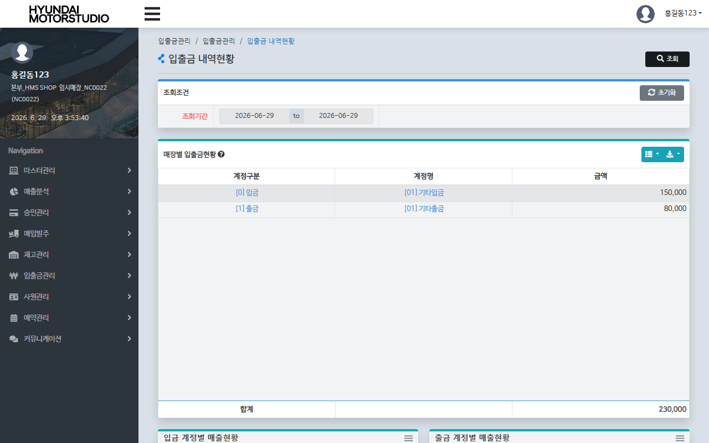
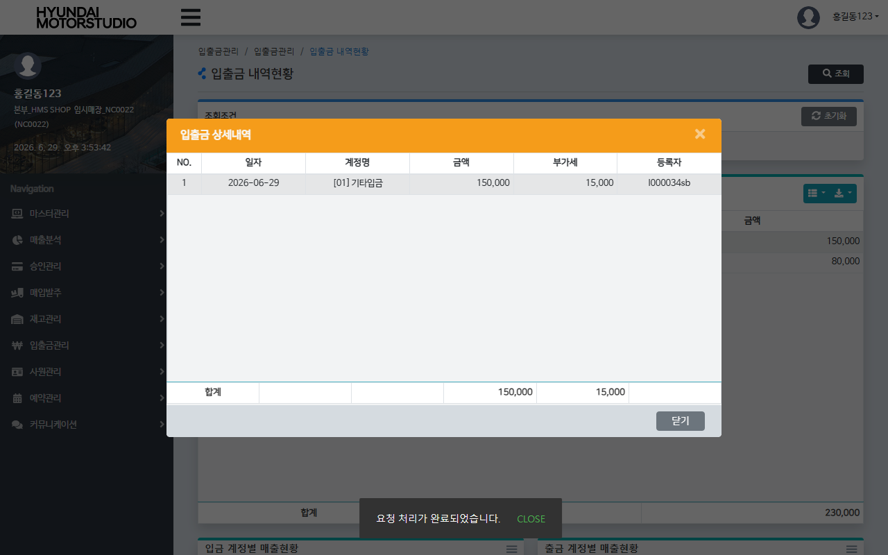

# QA Report: St_Cash_00002 입출금내역현황
**작성일**: 2026-06-29  
**작성자**: AI QA Agent (Antigravity)  
**대상 화면**: 현금관리 > 입출금관리 > 입출금 내역현황 (`st_cash_00002`)  
**테스트 환경**: localhost:8080 (로컬 WAS 개발 서버)  
**대상 데이터베이스**: `192.168.10.206 / edb` (schema: `hmsfns`)  
**테스트 가맹점 ID / 계정**: `NC0022` / `I000034sb` (비밀번호: `0000`)

---

## 1. 분석 개요

### 1.1 분석 대상 파일 목록

| 구분 | 파일 경로 |
|------|-----------|
| Controller | `com.hyundai.backoffice.webapp.controller.st.cash.St_Cash_00002_Controller.java` |
| Service | `com.hyundai.backoffice.webapp.service.st.cash.St_Cash_00002_Service.java` |
| Mapper (Interface) | `com.hyundai.backoffice.webapp.dao.st.cash.St_Cash_00002_Mapper.java` |
| SQL XML | `hyundai-backoffice-webapp/src/main/resources/sqlmapper/cash/St_Cash_00002_Sql.xml` |
| JSP | `hyundai-backoffice-webapp/src/main/webapp/WEB-INF/views/backoffice/main/contents/st/cash/st_cash_00002/st_cash_00002.jsp` |
| JSP Modal | `hyundai-backoffice-webapp/src/main/webapp/WEB-INF/views/backoffice/main/contents/st/cash/st_cash_00002/modal/st_cash_00002_M01.jsp` |
| JS | `hyundai-backoffice-webapp/src/main/webapp/WEB-INF/views/backoffice/main/contents/st/cash/st_cash_00002/js/st_cash_00002.js` |
| JS BT | `hyundai-backoffice-webapp/src/main/webapp/WEB-INF/views/backoffice/main/contents/st/cash/st_cash_00002/js/st_cash_00002_bt.js` |

---

## 2. 엔드포인트 분석

### 2.1 Base URL
```
POST /backoffice/data/st/cash/st_cash_00002/{endpoint}
```

### 2.2 엔드포인트 목록

| 엔드포인트 | HTTP | 기능 | ServiceLog | 관련 테이블 |
|-----------|------|------|------------|------------|
| `/searchList` | POST | 매장별 기간 내 계정 입출금 현황 집계 조회 | SELECT | `hmsfns.MACCIOTB`, `hmsfns.MMACNTTB` |
| `/selectDtList` | POST | 특정 계정구분/코드별 입출금 상세 내역 조회 | SELECT | `hmsfns.MACCIOTB`, `hmsfns.MMACNTTB` |

---

## 3. 서비스 로직 및 DB 영향도 분석

### 3.1 현금 시재 현황 집계 조회 (`searchList` -> `selectMmaList`)
* 시작일(`searchFromDate`)과 종료일(`searchEndDate`) 사이의 날짜 범위 조건과 매장코드(`msNo`)를 기준으로 입출금 테이블(`hmsfns.MACCIOTB`)과 가맹점 계정 마스터 테이블(`hmsfns.MMACNTTB`)을 조인하여 조회합니다.
* 미삭제(`DELETE_YN = 'N'`) 및 실재 입출금 분류(`ACNT_FG IN ('0', '1')`) 대상 행들을 계정구분, 계정코드, 계정명 단위로 `GROUP BY` 한 뒤 총액(`SUM(ACNT_AMT)`)을 집계합니다.

### 3.2 상세 내역 모달 조회 (`selectDtList` -> `selectDetailMMaList`)
* 집계된 리스트에서 특정 계정 행을 클릭 시 호출되며, 선택된 계정구분(`acntFg`) 및 계정코드(`acntCd`) 조건으로 필터링하여 일자별 상세 거래금액, 부가세, 거래처 및 비고 내역을 개별 조회합니다.

### 3.3 CUD 및 트리거/프로시저 영향도 검증
* **단순 조회(Select-Only) 전용 스펙**:
  * 소스 코드 및 MyBatis XML 분석 결과, 본 화면은 어떠한 INSERT/UPDATE/DELETE 구문도 실행하지 않는 **단순 조회 전용 화면**입니다.
  * 따라서 테이블 상태 변경을 촉발하지 않으므로 데이터베이스 트리거 작동이나 프로시저 연쇄 반응(Depth 2 ~ Depth 3) 등 2차적인 데이터 동기화 이슈의 영향도가 존재하지 않습니다. (CUD 없음 명시)

### 3.4 형변환 결함 에러 체크
* 본 화면의 모든 쿼리 파라미터는 조회 대상 일자 및 코드 문자열 바인딩 형식으로 매핑되어 동작합니다.
* 숫자로의 강제 캐스팅이 발생하는 구문이 없으므로 형변환 결함으로 인한 쿼리 에러 발생 리스크는 없습니다.

---

## 4. E2E 테스트 시나리오 및 결과

### 4.1 E2E 테스트 개요
* **수행 방식**: Playwright 기반 E2E 자동화 스크립트 작성 및 실행
* **계정 정보**: `I000034sb` (매장 권한, 매장코드: `NC0022`)
* **테스트 일자**: `2026-06-29`
* **선행 DB 데이터 세팅**: 
  * E2E 검증 및 데이터 조회를 가시적으로 확인하기 위해 `hmsfns.MACCIOTB` 테이블에 임시 입출금 데이터 2건(입금 `150,000` / 출금 `80,000`)을 사전 삽입한 후 진행하였습니다.
* **검증 시나리오**:
  1. `I000034sb` 계정 로그인 후 `st_cash_00002` 화면으로 이동.
  2. 조회 조건 기간을 `'2026-06-29'` ~ `'2026-06-29'`로 설정하고 [조회]를 클릭.
  3. 테이블에 계정별 입금/출금 합계 금액이 정상 바인딩되는지 확인 및 차트(ApexCharts) 이미지 렌더링 확인. ✅
  4. 목록의 특정 계정 행(`td.table-onclick` 열)을 클릭하여 입출금 상세내역 모달 팝업이 활성화되는지 확인. ✅
  5. 모달 내에 각 일자별 상세 내역이 테이블 형태로 정확하게 표시되는지 확인. ✅
  6. 모달의 [닫기] 버튼 클릭 후 화면 데이터 롤백 및 세션 정상 복구. ✅

### 4.2 스크린샷 검증
* **조회 완료 및 차트 출력 화면**:
  
* **상세 내역 모달 팝업 화면**:
  

---

## 5. 정적 코드 분석 결과 및 권고사항

### ⚠️ Warning (가독성 및 유지보수성 개선 권고)
* **`click-cell.bs.table` 이벤트 인자 바인딩 문제**:
  - `st_cash_00002_bt.js`의 셀 클릭 핸들러 선언부를 보면, 인자의 순서가 표준 Bootstrap Table 스펙과 다르게 선언되어 있습니다.
  - **구현 상태**: `$('#st_cash_00002_t01').on('click-cell.bs.table', function (row, $element, field, value) { ... })`
  - **실제 전달값**: 
    - 첫 번째 인자(`row`) ➡️ jQuery Event 객체 수신
    - 두 번째 인자(`$element`) ➡️ 클릭된 열의 `field` 명 수신
    - 세 번째 인자(`field`) ➡️ 클릭된 셀의 `value` 수신
    - 네 번째 인자(`value`) ➡️ 해당 행의 `row` 데이터 객체 수신
  - 변수명이 실제 수신되는 데이터와 정반대로 매핑(`$element` 변수명에 field명이 대입되고, `value` 변수명에 row 객체가 대입됨)되어 있어 개발자에게 심각한 인지적 혼선과 잠재적인 버그 유발 요소를 지니고 있습니다. 동작에는 문제가 없으나 변수명 수정 및 표준 시그니처 형태로 개선하는 편이 권장됩니다.

---

## 6. 종합 판정

| 검증 항목 | 결과 | 비고 |
|------|------|------|
| 화면 로딩 및 레이아웃 | ✅ PASS | 정상 로딩 완료 |
| 기간별 집계 조회 | ✅ PASS | MACCIOTB 집계 정상 확인 |
| ApexCharts 그래프 출력 | ✅ PASS | 2개 차트 정상 렌더링 완료 |
| 상세 내역 모달 조회 | ✅ PASS | selectDtList 연동 정상 동작 |
| CUD 및 DB 파급도 | ✅ PASS | 조회 전용 스펙 확인 (CUD 없음) |
| **종합 판정** | **✅ PASS** | **안정적인 데이터 조회 및 시각화 확인** |

---
*본 리포트는 Playwright E2E 브라우저 테스트 및 EDB PostgreSQL DB 검증을 통하여 작성되었습니다.*
