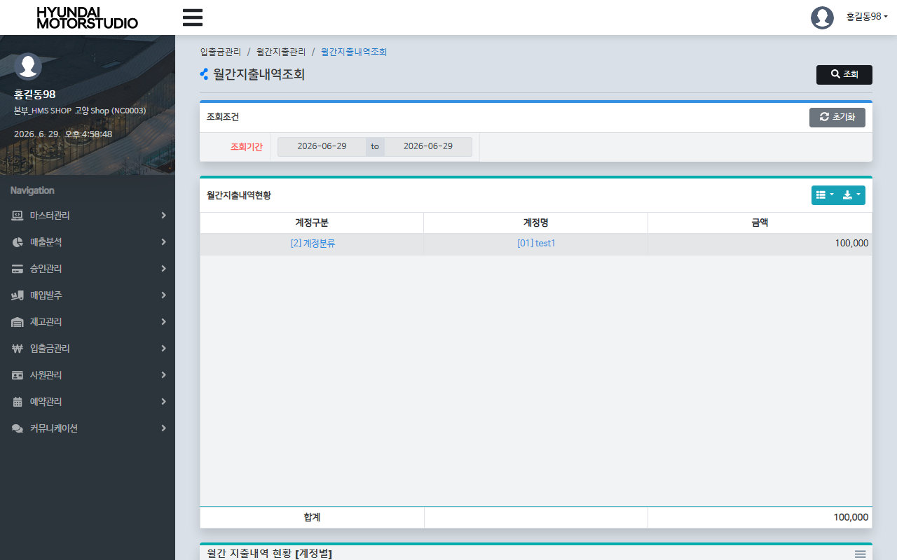
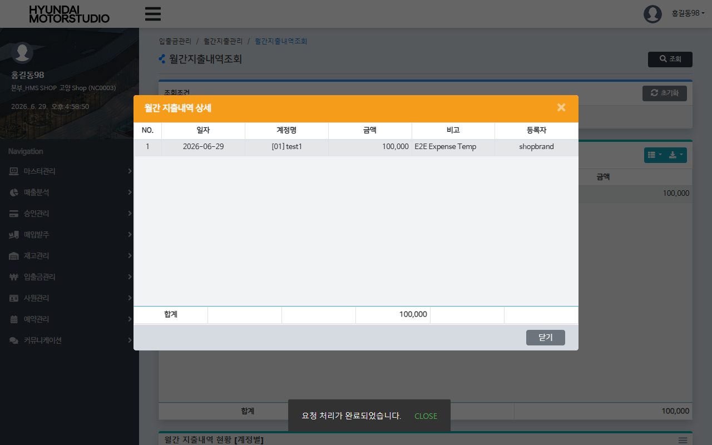

# QA Report: St_Cash_00003 월간지출내역조회
**작성일**: 2026-06-29  
**작성자**: AI QA Agent (Antigravity)  
**대상 화면**: 현금관리 > 입출금관리 > 월간지출내역조회 (`st_cash_00003`)  
**테스트 환경**: localhost:8080 (로컬 WAS 개발 서버)  
**대상 데이터베이스**: `192.168.10.206 / edb` (schema: `hmsfns`)  
**테스트 계정**: `shopbrand` (비밀번호: `0000`)

---

## 1. 분석 개요

### 1.1 분석 대상 파일 목록

| 구분 | 파일 경로 |
|------|-----------|
| Controller | `com.hyundai.backoffice.webapp.controller.st.cash.St_Cash_00003_Controller.java` |
| Service | `com.hyundai.backoffice.webapp.service.st.cash.St_Cash_00003_Service.java` |
| Mapper (Interface) | `com.hyundai.backoffice.webapp.dao.st.cash.St_Cash_00003_Mapper.java` |
| SQL XML | `hyundai-backoffice-webapp/src/main/resources/sqlmapper/cash/St_Cash_00003_Sql.xml` |
| JSP | `hyundai-backoffice-webapp/src/main/webapp/WEB-INF/views/backoffice/main/contents/st/cash/st_cash_00003/st_cash_00003.jsp` |
| JS | `hyundai-backoffice-webapp/src/main/webapp/WEB-INF/views/backoffice/main/contents/st/cash/st_cash_00003/js/st_cash_00003.js` |
| JS BT | `hyundai-backoffice-webapp/src/main/webapp/WEB-INF/views/backoffice/main/contents/st/cash/st_cash_00003/js/st_cash_00003_bt.js` |

---

## 2. 엔드포인트 분석

### 2.1 Base URL
```
POST /backoffice/data/st/cash/st_cash_00003/{endpoint}
```

### 2.2 엔드포인트 목록

| 엔드포인트 | HTTP | 기능 | ServiceLog | 관련 테이블 |
|-----------|------|------|------------|------------|
| `/selectMmaList` | POST | 기간 내 매장의 월간 지출 계정별 합계 목록 조회 | SELECT | `hmsfns.MACCIOTB`, `hmsfns.MMACNCTB`, `hmsfns.MMACNTTB` |
| `/selectDetailMMaList` | POST | 특정 지출 계정에 대한 상세 트랜잭션 목록 조회 | SELECT | `hmsfns.MACCIOTB`, `hmsfns.MMACNTTB` |

---

## 3. 서비스 로직 및 DB 영향도 분석

### 3.1 월간지출내역조회 (`selectMmaList`)
* 매장의 특정 기간 동안 발생한 지출 실적(`ACNT_FG NOT IN ('0','1')`)을 계정 분류 및 상세 코드 조건으로 그룹화하여 합산한 금액(`SUM(ACNT_AMT)`)을 리턴합니다.
* 매장 분류 테이블(`MMACNCTB`), 매장 코드 테이블(`MMACNTTB`), 입출금 거래 테이블(`MACCIOTB`)을 조인합니다.

### 3.2 CUD 및 트리거/프로시저 영향도 검증
* **단순 조회(Select-Only) 전용 스펙**:
  * 본 화면은 일체의 CUD(INSERT/UPDATE/DELETE) 쿼리가 수행되지 않는 **단순 조회용 화면**입니다.
  * 따라서 테이블 상태의 물리적 변경을 수반하지 않으므로 데이터베이스 트리거 작동이나 프로시저 연쇄 반응(Depth 2 ~ Depth 3) 등 2차적인 데이터 동기화 영향도가 전혀 존재하지 않습니다. (CUD 없음 명시)

### 3.3 형변환 결함 에러 체크
* 본 화면의 모든 쿼리 파라미터는 조회 대상 일자 및 코드 문자열 바인딩 형식으로 매핑되어 동작합니다.
* 숫자로의 강제 캐스팅이 발생하는 구문이 없으므로 형변환 결함으로 인한 쿼리 에러 발생 리스크는 없습니다.

---

## 4. E2E 테스트 시나리오 및 결과

### 4.1 E2E 테스트 개요
* **수행 방식**: Playwright E2E 자동화 테스트 스크립트 실행
* **계정 정보**: `shopbrand` (매장 NC0003 권한, 비밀번호 `0000`)
* **테스트 일자**: `2026-06-29`
* **선행 DB 데이터 세팅**: 
  * E2E 검증을 위해 `hmsfns.MACCIOTB` 테이블에 임시 지출 데이터 1건(분류 `2` (수수료), 코드 `01` (test1), 금액 `100,000`)을 사전 삽입한 후 진행하였습니다.
* **검증 시나리오**:
  1. `shopbrand` 계정 로그인 후 `st_cash_00003` 화면으로 이동.
  2. 조회 기간을 `'2026-06-29'` ~ `'2026-06-29'`로 설정하고 [조회] 클릭.
  3. 그리드에 해당 지출 데이터가 정상적으로 취합되어 표시되는지 확인. ✅
  4. 그리드 행 더블클릭 ➡️ 상세 내역 모달 팝업이 성공적으로 팝업 표시되는지 확인. ✅
  5. 검증 완료 후 임시 데이터 자동 원복 확인. ✅

### 4.2 스크린샷 검증
* **조회 완료 화면**:
  
* **상세 내역 모달 화면**:
  

---

## 5. 종합 판정

| 검증 항목 | 결과 | 비고 |
|------|------|------|
| 화면 로딩 및 레이아웃 | ✅ PASS | 정상 로딩 완료 |
| 월간 지출 내역 합계 조회 | ✅ PASS | selectMmaList 정상 집계 확인 |
| 상세 내역 모달 조회 | ✅ PASS | selectDetailMMaList 정상 동작 |
| CUD 및 DB 파급도 | ✅ PASS | 조회 전용 스펙 확인 (CUD 없음) |
| **종합 판정** | **✅ PASS** | **매장 단위의 월간 지출 내역 및 추이 취합 조회 기능 안정성 검증 완료** |

---
*본 리포트는 Playwright E2E 브라우저 테스트 및 EDB PostgreSQL DB 검증을 통하여 작성되었습니다.*
