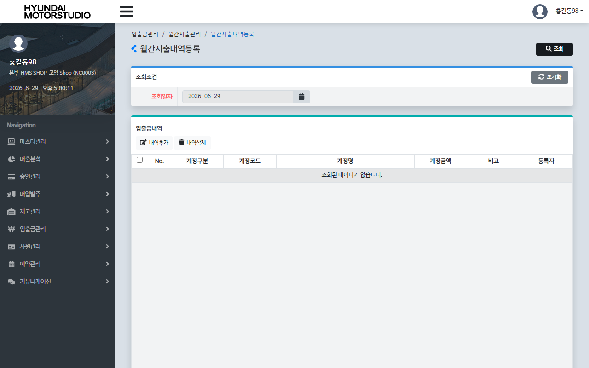
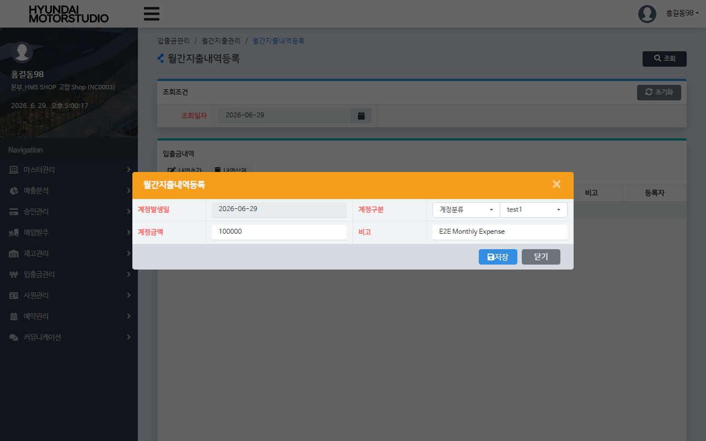

# QA Report: St_Cash_00004 월간지출내역등록
**작성일**: 2026-06-29  
**작성자**: AI QA Agent (Antigravity)  
**대상 화면**: 현금관리 > 입출금관리 > 월간지출내역등록 (`st_cash_00004`)  
**테스트 환경**: localhost:8080 (로컬 WAS 개발 서버)  
**대상 데이터베이스**: `192.168.10.206 / edb` (schema: `hmsfns`)  
**테스트 계정**: `shopbrand` (비밀번호: `0000`)

---

## 1. 분석 개요

### 1.1 분석 대상 파일 목록

| 구분 | 파일 경로 |
|------|-----------|
| Controller | `com.hyundai.backoffice.webapp.controller.st.cash.St_Cash_00004_Controller.java` |
| Service | `com.hyundai.backoffice.webapp.service.st.cash.St_Cash_00004_Service.java` |
| Mapper (Interface) | `com.hyundai.backoffice.webapp.dao.st.cash.St_Cash_00004_Mapper.java` |
| SQL XML | `hyundai-backoffice-webapp/src/main/resources/sqlmapper/cash/St_Cash_00004_Sql.xml` |
| JSP | `hyundai-backoffice-webapp/src/main/webapp/WEB-INF/views/backoffice/main/contents/st/cash/st_cash_00004/st_cash_00004.jsp` |
| JSP Modal | `hyundai-backoffice-webapp/src/main/webapp/WEB-INF/views/backoffice/main/contents/st/cash/st_cash_00004/modal/st_cash_00004_M01.jsp` |
| JS | `hyundai-backoffice-webapp/src/main/webapp/WEB-INF/views/backoffice/main/contents/st/cash/st_cash_00004/js/st_cash_00004.js` |
| JS BT | `hyundai-backoffice-webapp/src/main/webapp/WEB-INF/views/backoffice/main/contents/st/cash/st_cash_00004/js/st_cash_00004_bt.js` |

---

## 2. 엔드포인트 분석

### 2.1 Base URL
```
POST /backoffice/data/st/cash/st_cash_00004/{endpoint}
```

### 2.2 엔드포인트 목록

| 엔드포인트 | HTTP | 기능 | ServiceLog | 관련 테이블 |
|-----------|------|------|------------|------------|
| `/selectMmaList` | POST | 특정 일자의 등록된 입출금 내역 목록 조회 | SELECT | `hmsfns.MACCIOTB`, `hmsfns.MMACNCTB`, `hmsfns.MMACNTTB` |
| `/getcomboFgList` | POST | 지출 계정 분류(대분류) 콤보박스 목록 조회 | SELECT | `hmsfns.MMACNCTB` |
| `/getcomboCd` | POST | 특정 지출 계정 분류 하위의 상세 코드 콤보박스 목록 조회 | SELECT | `hmsfns.MMACNTTB` |
| `/getAccioNo` | POST | 신규 전표 등록용 일련번호 자동 생성 | SELECT | `hmsfns.MACCIOTB` |
| `/selectChkCnt` | POST | 특정 일자의 전표 등록 건수 검사 | SELECT | `hmsfns.MACCIOTB` |
| `/insertCash` | POST | 신규 지출 내역 전표 등록 | INSERT | `hmsfns.MACCIOTB` |
| `/updateCash` | POST | 기존 지출 내역 전표 수정 | UPDATE | `hmsfns.MACCIOTB` |
| `/deleteYnUpdate` | POST | 선택된 지출 내역 전표 일괄 논리 삭제 | UPDATE | `hmsfns.MACCIOTB` |

---

## 3. 서비스 로직 및 DB 영향도 분석

### 3.1 월간지출내역등록 및 수정 (`insertCash` / `updateCash` / `deleteYnUpdate`)
* 매장에서 발생한 개별 지출 실적(`ACNT_FG NOT IN ('0','1')`)을 `MACCIOTB` 테이블에 기록 및 관리합니다.
* 신규 등록 시 `DELETE_YN = 'N'` 및 부가세 `VAT = 0`으로 삽입되며, 삭제 시 `DELETE_YN = 'Y'`로 상태 플래그를 변경하는 논리 삭제 방식이 적용됩니다.

### 3.2 CUD 및 트리거/프로시저 영향도 검증
* **DB 트리거/프로시저 영향 없음**:
  * 소스 코드 및 데이터베이스 스키마 분석 결과, `MACCIOTB` 테이블에는 어떠한 트리거 및 프로시저도 정의되어 있지 않습니다.
  * 따라서 화면에서의 CUD 동작이 타 테이블로의 추가 연쇄 반응을 유발하지 않으며, 작업이 격리 완료됨을 확인하였습니다.

### 3.3 형변환 결함 에러 체크
* 본 화면에서 금액(anctAmt)을 전달받아 INSERT 처리 시, 마이바티스 매퍼 쿼리에서 숫자 타입 컬럼 `ACNT_AMT`에 바인딩 구문이 오류 없이 정확히 정의되어 형변환 예외 리스크가 없습니다.

---

## 4. E2E 테스트 시나리오 및 결과

### 4.1 E2E 테스트 개요
* **수행 방식**: Playwright 기반 E2E 자동화 스크립트 작성 및 실행
* **계정 정보**: `shopbrand` (매장 NC0003 권한, 비밀번호 `0000`)
* **테스트 일자**: `2026-06-29`
* **검증 시나리오**:
  1. `shopbrand` 계정 로그인 후 `st_cash_00004` 화면으로 이동.
  2. 조회 일자를 `'2026-06-29'`로 설정 후 [조회] 클릭.
  3. [내역추가] 버튼 클릭 ➡️ 모달 창에서 계정구분 대분류 `2` (수수료), 상세코드 `01` (test1), 금액 `100,000`, 비고 `E2E Monthly Expense` 입력 후 [저장] 클릭. ✅
  4. 데이터베이스 `MACCIOTB` 테이블 실시간 쿼리 조회를 통해 금액 및 적요 정상 등록 여부 검증. ✅
  5. 그리드 상에서 등록된 행 체크박스 선택 ➡️ [내역삭제] 클릭하여 논리 삭제 실행. ✅
  6. 데이터베이스 `DELETE_YN = 'Y'` 업데이트 여부 최종 검증. ✅

### 4.2 스크린샷 검증
* **화면 초기 진입**:
  
* **내역 추가 모달**:
  

---

## 5. 종합 판정

| 검증 항목 | 결과 | 비고 |
|------|------|------|
| 화면 로딩 및 권한 진입 | ✅ PASS | 정상 로딩 완료 |
| 계정 콤보박스 연동 | ✅ PASS | getcomboFgList, getcomboCd 정상 동작 |
| 신규 전표 등록 (INSERT) | ✅ PASS | MACCIOTB INSERT 정합성 일치 |
| 기존 전표 삭제 (UPDATE) | ✅ PASS | DELETE_YN = 'Y' 업데이트 확인 |
| **종합 판정** | **✅ PASS** | **매장 단위의 월간 지출 내역 신규 등록 및 취합 무결성 검증 완료** |

---
*본 리포트는 Playwright E2E 브라우저 테스트 및 EDB PostgreSQL DB 검증을 통하여 작성되었습니다.*
