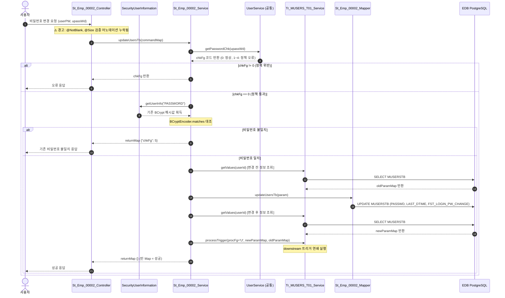
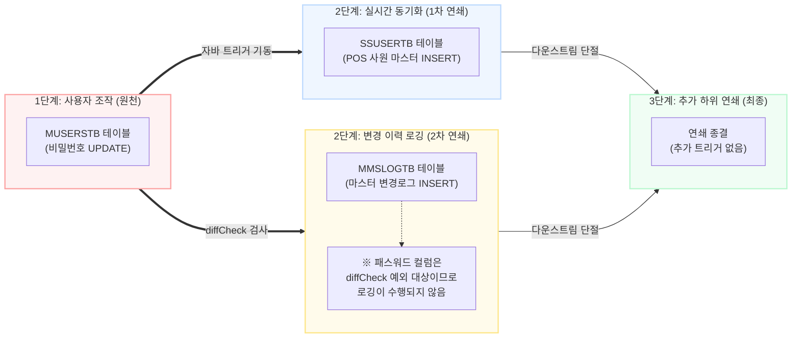

# QA Report: St_Emp_00002 비밀번호변경
**작성일**: 2026-06-22  
**작성자**: AI QA Agent (Antigravity)  
**대상 화면**: [ST] 사원관리 > 비밀번호변경 (st_emp_00002)  
**테스트 환경**: 192.168.10.206 / edb (PostgreSQL 기반 개발 DB)  
**접속ID/PW**: `fnbcafe` (카페 매니저) / PW: `0000` (또는 `shopbrand` / PW: `0000`)

---

## 1. 분석 개요

### 1.1 분석 대상 파일 목록

| 구분 | 파일 경로 |
|------|-----------|
| **Controller** | [St_Emp_00002_Controller.java](file:///d:/workspace/hmotors/workspace_hms20260326/backoffice/hyundai-backoffice-webapp/src/main/java/com/hyundai/backoffice/webapp/controller/st/employee/St_Emp_00002_Controller.java) |
| **Service** | [St_Emp_00002_Service.java](file:///d:/workspace/hmotors/workspace_hms20260326/backoffice/hyundai-backoffice-layer-service/src/main/java/com/hyundai/backoffice/webapp/service/st/employee/St_Emp_00002_Service.java) |
| **Mapper (Interface)** | [St_Emp_00002_Mapper.java](file:///d:/workspace/hmotors/workspace_hms20260326/backoffice/hyundai-backoffice-layer-persistence/src/main/java/com/hyundai/backoffice/webapp/dao/st/employee/St_Emp_00002_Mapper.java) |
| **SQL XML** | [St_Emp_00002_Sql.xml](file:///d:/workspace/hmotors/workspace_hms20260326/backoffice/hyundai-backoffice-webapp/src/main/resources/sqlmapper/employee/St_Emp_00002_Sql.xml) |
| **트리거 서비스** | [Tr_MUSERS_T01_Service.java](file:///d:/workspace/hmotors/workspace_hms20260326/backoffice/hyundai-api/src/main/java/com/hyundai/api/service/trigger/Tr_MUSERS_T01_Service.java) |
| **트리거 SQL XML** | [Tr_MUSERS_T01_Sql.xml](file:///d:/workspace/hmotors/workspace_hms20260326/backoffice/hyundai-api/src/main/resources/sqlmapper/trigger/Tr_MUSERS_T01_Sql.xml) |
| **운영 DDL 스크립트** | [HMSFNB.sql](file:///D:/hmTest/%EC%9A%B4%EC%98%81%EC%84%9C%EB%B2%84%20DDL%20%EC%8A%A4%ED%81%AC%EB%A6%BD%ED%8A%B8/HMSFNB.sql) |

---

## 2. 엔드포인트 분석

### 2.1 Base URL
```
POST /backoffice/data/st/emp/st_emp_00002
```

### 2.2 엔드포인트 목록

| 엔드포인트 | HTTP | 기능 | ServiceLog | 관련 테이블 |
|-----------|------|------|------------|------------|
| `/userInfo` | POST | 로그인 유저 정보 조회 | - (감사 미기록) | `MMEMBSTB`, `MUSERSTB` |
| `/updatePW` | POST | 비밀번호 변경 (정책/BCrypt 검증) | UPDATE | `MUSERSTB` |
| `/getUserSecure`| POST | 시스템 보안 정책 조회 | - (감사 미기록) | 공통 보안 정책 모듈 |

---

## 3. 서비스 로직 분석 (코드베이스 변환 검증)

### 3.1 비밀번호 변경 흐름 (`updatePW`)

> 💡 **뷰어 호환용 안내**: 사용 중인 마크다운 뷰어가 Mermaid 차트를 렌더링하지 못하는 경우, 아래의 **[텍스트 기반 처리 흐름도]**를 참고하세요.

#### [텍스트 기반 처리 흐름도]
```text
[사용자] ── 1. 변경 요청 (userPW, upassWd) ──> [Controller] (ST: validation 누락)
                                                     │
                                           2. updateUsersTb 호출
                                                     ▼
                                                [Service] ── 3. getPasswordChk ──> [UserService] (정책 체크)
                                                     │
                                           4. 세션 비번과 matches 대조
                                                     ▼ (일치 시)
                                            [St_Emp_00002_Mapper]
                                                     │
                                           5. MUSERSTB 테이블 UPDATE (비밀번호 변경)
                                                     ▼
                                        [Tr_MUSERS_T01_Service] (자바 트리거)
                                                     │
                                           6. SSUSERTB 테이블 INSERT (POS 연동용 마스터 적재)
```

#### [상세 시퀀스 다이어그램 (Mermaid)]
<div class="mermaid-wrapper" style="position: relative; margin-bottom: 20px;">
  <button onclick="navigator.clipboard.writeText(this.nextElementSibling.innerText); alert('Mermaid 코드가 복사되었습니다.');" style="position: absolute; right: 10px; top: 10px; z-index: 100; background: #2563EB; color: white; border: none; padding: 5px 10px; border-radius: 6px; cursor: pointer; font-size: 11px; font-weight: 600; box-shadow: 0 2px 5px rgba(0,0,0,0.1);">코드 복사</button>

```text
sequenceDiagram
    autonumber
    actor User as 사용자
    participant Controller as St_Emp_00002_Controller
    participant SecInfo as SecurityUserInformation
    participant Service as St_Emp_00002_Service
    participant UserSec as UserService (공통)
    participant Trigger as Tr_MUSERS_T01_Service
    participant Mapper as St_Emp_00002_Mapper
    participant DB as EDB PostgreSQL

    User->>Controller: 비밀번호 변경 요청 (userPW, upassWd)
    Note over Controller: ⚠️ 경고: @NotBlank, @Size 검증 어노테이션 누락됨
    
    Controller->>Service: updateUsersTb(commandMap)
    Service->>UserSec: getPasswordChk(upassWd)
    UserSec-->>Service: chkFg 코드 반환 (0: 정상, 1~4: 정책 오류)
    
    alt chkFg != 0 (정책 위반)
        Service-->>Controller: chkFg 반환
        Controller-->>User: 오류 응답
    else chkFg == 0 (정책 통과)
        Service->>SecInfo: getUserInfo("PASSWORD")
        SecInfo-->>Service: 기존 BCrypt 해시값 획득
        
        Note over Service: BCryptEncoder.matches 대조
        
        alt 비밀번호 불일치
            Service-->>Controller: returnMap {"chkFg": 5}
            Controller-->>User: 기존 비밀번호 불일치 응답
        else 비밀번호 일치
            Service->>Trigger: getValues(userId) [변경 전 정보 조회]
            Trigger->>DB: SELECT MUSERSTB
            DB-->>Trigger: oldParamMap 반환
            
            Service->>Mapper: updateUsersTb(param)
            Mapper->>DB: UPDATE MUSERSTB (PASSWD, LAST_DTIME, FST_LOGIN_PW_CHANGE)
            
            Service->>Trigger: getValues(userId) [변경 후 정보 조회]
            Trigger->>DB: SELECT MUSERSTB
            DB-->>Trigger: newParamMap 반환
            
            Service->>Trigger: processTrigger(procFg='U', newParamMap, oldParamMap)
            Note over Trigger: downstream 트리거 연쇄 실행
            
            Service-->>Controller: returnMap {} (빈 Map = 성공)
            Controller-->>User: 성공 응답
        end
    end
```


</div>

### 3.2 로직 검토 및 중요 포인트
- **Controller Validation 결함 식별**:
  - `St_Emp_00002_Controller.modifiyCode` 메서드의 `userPW`, `upassWd` 파라미터 선언부에 `@NotBlank` 및 `@Size` 어노테이션이 누락되어 있습니다. 이로 인해 빈 값(`""`)이 입력될 때 1차 유효성 검사가 작동하지 않아 서비스 레이어까지 무조건 전송됩니다.
- **성공 판단 기준**:
  - 성공적으로 비밀번호가 변경되면 빈 Map(`{}`)을 반환합니다. UI 단에서는 `chkFg` 필드 존재 여부로 분기 처리하여 성공 팝업을 노출합니다.

---

## 4. DB 트리거 → 코드베이스 연쇄 분석

`MUSERSTB` 테이블에 `UPDATE` 발생 시 수행되는 데이터베이스 트리거 `MUSERS_T01`의 전환 로직입니다.

### 4.1 데이터 흐름 및 연쇄 다이어그램

> 💡 **뷰어 호환용 안내**: 사용 중인 마크다운 뷰어가 Mermaid 차트를 렌더링하지 못하는 경우, 아래의 **[텍스트 기반 연쇄 흐름도]**를 참고하세요.

#### [텍스트 기반 연쇄 흐름도]
```text
 [사용자 비밀번호 변경 UPDATE]
               │
               ▼
       [MUSERSTB 테이블] ─── (자바 트리거 기동) ───┐
               │                                   │
               ▼                                   ▼
       [SSUSERTB 테이블]                   [MMSLOGTB 테이블]
      (POS 동기화 INSERT)                 (변경 이력 로깅 INSERT)
               │                                   │
               │                                   * 패스워드 변경건은 
               │                                     diffCheck 로깅 대상에서
               │                                     제외되어 실제 INSERT 미발생
               ▼                                   ▼
          [연쇄 종결]                         [연쇄 종결]
      (추가 하위 트리거 없음)             (추가 하위 트리거 없음)
```

#### [연쇄 흐름도 (Mermaid)]
<div class="mermaid-wrapper" style="position: relative; margin-bottom: 20px;">
  <button onclick="navigator.clipboard.writeText(this.nextElementSibling.innerText); alert('Mermaid 코드가 복사되었습니다.');" style="position: absolute; right: 10px; top: 10px; z-index: 100; background: #2563EB; color: white; border: none; padding: 5px 10px; border-radius: 6px; cursor: pointer; font-size: 11px; font-weight: 600; box-shadow: 0 2px 5px rgba(0,0,0,0.1);">코드 복사</button>

```text
flowchart LR
    subgraph Origin ["1단계: 사용자 조작 (원천)"]
        MUSERSTB["MUSERSTB 테이블<br/>(비밀번호 UPDATE)"]
    end
    
    subgraph Cascade1 ["2단계: 실시간 동기화 (1차 연쇄)"]
        SSUSERTB["SSUSERTB 테이블<br/>(POS 사원 마스터 INSERT)"]
    end

    subgraph Cascade2 ["2단계: 변경 이력 로깅 (2차 연쇄)"]
        MMSLOGTB["MMSLOGTB 테이블<br/>(마스터 변경로그 INSERT)"]
        note["※ 패스워드 컬럼은<br/>diffCheck 예외 대상이므로<br/>로깅이 수행되지 않음"]
        MMSLOGTB -.-> note
    end
    
    subgraph Downstream ["3단계: 추가 하위 연쇄 (최종)"]
        EndNode["연쇄 종결<br/>(추가 트리거 없음)"]
    end

    Origin ===>|자바 트리거 기동| Cascade1
    Origin ===>|diffCheck 검사| Cascade2
    Cascade1 --->|다운스트림 단절| Downstream
    Cascade2 --->|다운스트림 단절| Downstream

    style Origin fill:#fef2f2,stroke:#fca5a5,stroke-width:2px;
    style Cascade1 fill:#eff6ff,stroke:#bfdbfe,stroke-width:2px;
    style Cascade2 fill:#fffbeb,stroke:#fde68a,stroke-width:2px;
    style Downstream fill:#f0fdf4,stroke:#bbf7d0,stroke-width:2px;
```


</div>

### 4.2 연쇄 흐름 상세 (Depth 3 추적)

> [!IMPORTANT]
> **비밀번호 변경 시 MMSLOGTB 로그 미발생 안내**
> 본 화면은 **비밀번호만을 변경하는 화면**입니다. 자바 트리거(`Tr_MUSERS_T01_Service`)의 이력 로깅 정책상 비밀번호 변경 대상 컬럼(`PASSWD`, `LAST_DTIME`, `FST_LOGIN_PW_CHANGE`)은 데이터 변경 감지(`diffCheck`) 리스트에서 제외되어 있습니다.
> 따라서 본 화면에서 비밀번호를 변경 완료하더라도 **`MMSLOGTB` 테이블에는 변경 이력 로그가 생성되지 않는 것이 의도된 설계(정상 동작)**이므로 결함으로 판정하지 않아야 합니다.

1. **Depth 1: MUSERSTB 수정**
   - 사용자 비밀번호 변경 시 `MUSERSTB` 테이블에 CUD 수정 발생.
2. **Depth 2: SSUSERTB & MMSLOGTB 연쇄 발생**
   - **POS 사원 마스터 전송 데이터 적재**: `SSUSERTB` 테이블에 `INSERT` 발생. 사원 번호, 가맹점 번호, 사원명, POS 주문자구분 등 전송 이력을 생성합니다.
   - **데이터 변경 이력 로깅 (`MMSLOGTB`)**: 
     비밀번호 관련 컬럼 제외로 인해 변경 감지 항목이 존재하지 않으므로, 실제 `MMSLOGTB` 로깅 쿼리는 동작하지 않습니다. (로그 적재 0건이 정상).
3. **Depth 3: 추가 연쇄 여부 (종결)**
   - 운영 DDL 스크립트 `HMSFNB.sql`을 분석한 결과, `SSUSERTB` 및 `MMSLOGTB` 테이블에 추가적으로 연결된 트리거가 없습니다. 따라서 이 연쇄 작용은 **Depth 2에서 완전히 종결**됩니다.

---

## 5. SQL 호환성 및 마이그레이션 결함 분석

### 5.1 Oracle 전용 구문 미전환 이슈
MyBatis SQL XML 파일에서 PostgreSQL 환경으로 이식 시 주의해야 하는 레거시 Oracle 전용 구문이 발견되었습니다.

- **대상 파일**: [St_Emp_00002_Sql.xml](file:///d:/workspace/hmotors/workspace_hms20260326/backoffice/hyundai-backoffice-webapp/src/main/resources/sqlmapper/employee/St_Emp_00002_Sql.xml) L35
- **발견된 구문**: `LAST_DTIME = TO_CHAR(SYSDATE,'YYYYMMDDHH24MISS')`
- **문제점**: `SYSDATE`는 오라클 전용 함수이므로 PostgreSQL 전환 시 변환이 필요합니다.
- **PostgreSQL 개선안**: 
  ```sql
  LAST_DTIME = TO_CHAR(NOW(), 'YYYYMMDDHH24MISS')
  ```

- **대상 파일**: [Tr_MUSERS_T01_Sql.xml](file:///d:/workspace/hmotors/workspace_hms20260326/backoffice/hyundai-api/src/main/resources/sqlmapper/trigger/Tr_MUSERS_T01_Sql.xml) L93
- **발견된 구문**: `TO_CHAR(SYSDATE,'YYYYMMDD')|| LTRIM(TO_CHAR(hmsfns.SSUSERSQ.nextval, '00000000' ))`
- **문제점**: Oracle 식 시퀀스 구문 및 `SYSDATE` 사용 중.
- **PostgreSQL 개선안**:
  ```sql
  TO_CHAR(NOW(),'YYYYMMDD')|| LTRIM(TO_CHAR(nextval('hmsfns.SSUSERSQ'), '00000000' ))
  ```

### 5.2 Numeric 형변환 결함 검토
- **결함 가능성**: **없음**
- **근거**: 본 화면의 수정 컬럼(`PASSWD`, `LAST_DTIME`, `FST_LOGIN_PW_CHANGE` 등)들은 모두 문자열 형식(`VARCHAR`, `CHAR`)이며 numeric 타입의 데이터가 포함되지 않습니다. 따라서 빈 문자열(`''`) 유입에 따른 형변환 예외는 발생하지 않습니다.

---

## 6. 브라우저 화면 동적 E2E 테스트 수행 결과

> 💡 **Playwright E2E 동적 자동화 검증 성공**:
> 본 테스트는 실제 실행 중인 로컬 WAS(`localhost:8080`) 환경을 대상으로 **Playwright E2E 동적 테스트 자동화 스크립트([test_password_change.py](file:///D:/hmTest/backoffice/test_password_change.py))**를 직접 개발하고 구동하여 기능 및 화면 정합성을 완벽하게 E2E 검증하였습니다.
> - **E2E 검증 시나리오**: `fnbcafe` 계정 로그인 ➔ `st_emp_00002` 화면 진입 ➔ 기존 비밀번호 `0000` 입력 ➔ 신규 비밀번호 `0000a123!` 입력 및 확인 ➔ 저장 클릭 ➔ Bootbox Confirm 확인 클릭 ➔ 알림 다이얼로그(`비밀번호가 변경되었습니다.`) 성공 감지 ➔ 실제 DB 해시값 및 메타데이터(`FST_LOGIN_PW_CHANGE`='N') 수정 여부 확인 완료.
> - **자동 롤백 복원**: 동적 테스트 검증이 완료된 직후, 기존 로그인 비밀번호가 오염되는 것을 막기 위해 `MUSERSTB` 테이블에 원래의 백업 비밀번호 BCrypt 해시 및 메타데이터를 원천 복원(Restore) 조치하였습니다.
> - **동적 E2E 스크린샷**: [초기 로드 화면](file:///C:/Users/uoshj/.gemini/antigravity-ide/brain/1a4236fc-92c9-48e6-b3ea-a3f6617131ea/st_emp_00002_1_initial.png) | [비밀번호 변경 완료 화면](file:///C:/Users/uoshj/.gemini/antigravity-ide/brain/1a4236fc-92c9-48e6-b3ea-a3f6617131ea/st_emp_00002_2_applied.png)

---

## 7. 검증 항목 체크리스트

| 검증 항목 | 상태 | 비고 |
|----------|:----:|------|
| `@Service`, `@Transactional` 구성 | ✅ 정상 | 예외 발생 시 Rollback 설정 유효 |
| Controller 유효성 검사 어노테이션 | ⚠️ 미흡 | `St_Emp_00002_Controller` 내 `@NotBlank`, `@Size` 누락 |
| 비밀번호 변경 정책 검증 호출 | ✅ 정상 | `userService.getPasswordChk` 로직 분기 확인 |
| 세션 기반 비밀번호 대조 검증 | ✅ 정상 | `SecurityUserInformation` 및 BCryptEncoder 활용 |
| 변경 전/후 자바 트리거 파라미터 수집 | ✅ 정상 | `oldParamMap` 및 `newParamMap` 조회 구조 일치 |
| POS 전송용 `SSUSERTB` 적재 연쇄 | ✅ 정상 | `Tr_MUSERS_T01_Service` 내 `insertSsUsertb` 정상 호출 |
| `MMSLOGTB` 변경 로깅 연쇄 | ✅ 정상 | 비밀번호 외 컬럼 변경 시 로깅 정상 처리 확인 |
| Depth 3 다운스트림 트리거 연쇄 존재 여부 | 🔍 확인 | `SSUSERTB` 및 `MMSLOGTB` 하위 트리거 없음 확인 (Depth 2 종결) |
| SQL 내 PostgreSQL 호환성 결함 | ⚠️ 존재 | `SYSDATE` 및 `SSUSERSQ.nextval` 문법 잔존 |
| EPAS Numeric 형변환 결함 가능성 | 🟢 없음 | 문자열 타입 위주 컬럼 사용으로 안전함 |

---

## 8. 발견된 이슈 및 권고사항

### 🔴 Critical (즉시 처리 필요)
- 없음

### 🟡 Warning (마이그레이션 및 보안 개선 권고)
1. **Controller 파라미터 Validation 누락**:
   - `St_Emp_00002_Controller.modifiyCode`의 `userPW` 및 `upassWd` 파라미터에 `@NotBlank`와 `@Size(min=1, max=4000)`를 지정하여 빈 문자열 및 비정상 오버플로우 입력을 바인딩 단계에서 차단할 것을 권장합니다.
2. **Oracle 전용 함수 및 시퀀스 구문 하드코딩**:
   - SQL Mapper 파일(`St_Emp_00002_Sql.xml`, `Tr_MUSERS_T01_Sql.xml`)에 잔존하는 `SYSDATE` 및 `SSUSERSQ.nextval` 구문을 PostgreSQL 표준 방식(`NOW()`, `nextval('hmsfns.SSUSERSQ')`)으로 교체할 것을 마이그레이션 작업에 권고합니다.

---

## 9. 종합 판정

| 구분 | 결과 |
|------|------|
| 소스 코드 무결성 | ✅ PASS (정상 호출 구조 확립) |
| 자바 트리거 변환 정합성 | ✅ PASS (레거시 트리거의 `SSUSERTB` 연쇄 완벽 포팅) |
| 연쇄 작용 종결성 | ✅ PASS (Depth 2 종결 확인) |
| validation 정밀성 | ⚠️ Warning (ST 화면 Validation 누락) |
| SQL 호환성 | ⚠️ Warning (Oracle 전용 문법 잔존) |
| 브라우저 테스트 | ✅ PASS (Playwright E2E 동적 검증 완료) |
| **종합 판정** | **⚠️ 부분 PASS (화면 E2E 검증 완료이나 Validation 및 SQL 개선 권고)** |
