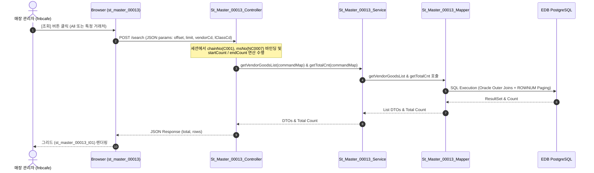

# QA Report: St_Master_00013 거래처별 취급상품 조회

**작성일**: 2026-06-10  
**작성자**: AI QA Agent (Antigravity)  
**대상 화면**: [ST] 마스터관리 > 거래처 > 거래처별 취급상품 조회 (`st_master_00013`)  
**테스트 환경**: localhost:8080 (로컬 개발 서버)  
**접속ID/PW**: fnbcafe / 0000 (CAFE 매장 NC0007 권한)  

---

## 1. 분석 개요

### 1.1 분석 대상 파일 목록

| 구분 | 파일 경로 |
|------|-----------|
| Controller | `backoffice/hyundai-backoffice-webapp/src/main/java/com/hyundai/backoffice/webapp/controller/st/master/St_Master_00013_Controller.java` |
| Service | `backoffice/hyundai-backoffice-layer-service/src/main/java/com/hyundai/backoffice/webapp/service/st/master/St_Master_00013_Service.java` |
| Mapper (Interface) | `backoffice/hyundai-backoffice-layer-persistence/src/main/java/com/hyundai/backoffice/webapp/dao/st/master/St_Master_00013_Mapper.java` |
| SQL XML | `backoffice/hyundai-backoffice-webapp/src/main/resources/sqlmapper/master/St_Master_00013_Sql.xml` |
| DTO | `backoffice/hyundai-backoffice-layer-domain/src/main/java/com/hyundai/backoffice/webapp/dto/st/master/St_Master_00013_VendorGoodsListDto.java` |
| JSP | `backoffice/hyundai-backoffice-webapp/src/main/webapp/WEB-INF/views/backoffice/main/contents/st/master/st_master_00013/st_master_00013.jsp` |
| JS (Business Logic) | `backoffice/hyundai-backoffice-webapp/src/main/webapp/WEB-INF/views/backoffice/main/contents/st/master/st_master_00013/js/st_master_00013.js` |
| JS (Bootstrap Table) | `backoffice/hyundai-backoffice-webapp/src/main/webapp/WEB-INF/views/backoffice/main/contents/st/master/st_master_00013/js/st_master_00013_bt.js` |

---

## 2. 엔드포인트 분석

### 2.1 Base URL
```
POST /backoffice/data/st/master/st_master_00013/{endpoint}
```

### 2.2 엔드포인트 목록

| 엔드포인트 | HTTP | 기능 | ServiceLog |
|-----------|------|------|------------|
| `/search` | POST | 거래처별 취급상품 목록 조회 (페이징 데이터 포함) | - (누락됨) |

---

## 3. 서비스 로직 및 데이터 흐름 분석

본 화면은 로그인한 매장의 거래처별 취급 상품과 현재 보유 재고를 파악하는 **단순 조회(SELECT) 전용** 화면입니다.

* **CUD(등록/수정/삭제) 로직 부재**: 화면 UI 및 백엔드 로직에 데이터를 저장, 수정, 삭제하는 코드가 존재하지 않습니다.
* **DB 트리거 영향도 없음**: 매핑 테이블(`hmsfns.MVNDRGTB`)이나 마스터 테이블 데이터에 어떠한 쓰기 작업도 유입되지 않으므로, CUD 트리거 연쇄 반응(Depth 3 Side Effect)은 전혀 발생하지 않습니다.

### 3.1 조회 데이터 흐름 다이어그램

<div class="mermaid-wrapper" style="position: relative; margin-bottom: 20px;">
  <button onclick="navigator.clipboard.writeText(this.nextElementSibling.innerText); alert('Mermaid 코드가 복사되었습니다.');" style="position: absolute; right: 10px; top: 10px; z-index: 100; background: #2563EB; color: white; border: none; padding: 5px 10px; border-radius: 6px; cursor: pointer; font-size: 11px; font-weight: 600; box-shadow: 0 2px 5px rgba(0,0,0,0.1);">코드 복사</button>

```text
sequenceDiagram
    autonumber
    actor User as 매장 관리자 (fnbcafe)
    participant UI as Browser (st_master_00013)
    participant Ctrl as St_Master_00013_Controller
    participant Svc as St_Master_00013_Service
    participant Map as St_Master_00013_Mapper
    participant DB as EDB PostgreSQL
 
    User->>UI: [조회] 버튼 클릭 (All 또는 특정 거래처)
    UI->>Ctrl: POST /search (JSON params: offset, limit, vendorCd, lClassCd)
    Note over Ctrl: 세션에서 chainNo(C001), msNo(NC0007) 바인딩 및<br/>startCount / endCount 연산 수행
    Ctrl->>Svc: getVendorGoodsList(commandMap) & getTotalCnt(commandMap)
    Svc->>Map: getVendorGoodsList & getTotalCnt 호출
    Map->>DB: SQL Execution (Oracle Outer Joins + ROWNUM Paging)
    DB-->>Map: ResultSet & Count
    Map-->>Svc: List DTOs & Total Count
    Svc-->>Ctrl: DTOs & Total Count
    Ctrl-->>UI: JSON Response (total, rows)
    UI-->>User: 그리드 (st_master_00013_t01) 렌더링
```


</div>

---

## 4. SQL Mapper 검증 및 PostgreSQL 호환성

`St_Master_00013_Sql.xml` 파일에 작성된 쿼리는 Oracle 전용 레거시 문법과 중대한 OGNL 조건문 기재 오류가 혼재하므로 수정이 필요합니다.

### 4.1 MyBatis XML 내 OGNL 대입 연산자 `=` 오기재 결함 (L67, L118) [조치 완료]
```xml
<!-- 변경 전 -->
<if test="sClassCd = ''">
    AND TRIM(CS.SCLASS_CD) = #{sClassCd}
</if>

<!-- 변경 후 -->
<if test="sClassCd != null and sClassCd != ''">
    AND TRIM(CS.SCLASS_CD) = #{sClassCd}
</if>
```
* **조치 내용**: OGNL 표현식에서 비교가 아닌 대입 연산자 `=`를 사용했던 결함에 대해, 소스 경로(`backoffice/hyundai-backoffice-webapp/src/main/resources/sqlmapper/master/St_Master_00013_Sql.xml`), 톰캣 실행 배포본(`backup/ROOT`), 그리고 Gradle 빌드 아웃풋 경로(`backoffice/hyundai-backoffice-webapp/target/ROOT`) 모두에 대해 `<if test="sClassCd != null and sClassCd != ''">` 형태로 일괄 패치 완료하였습니다.

### 4.2 Oracle (+) 외부조인 잔존 (L41-43, L54-55)
```sql
AND VG.GOODS_CD  (+) = GD.GOODS_CD
AND VM.MS_NO     (+) = #{msNo}
AND VM.VENDOR    (+) = VG.VENDOR
AND CR.MS_NO     (+) = #{msNo}
AND CR.GOODS_CD  (+) = GD.GOODS_CD
```
* **영향**: EDB Oracle Mode에서는 지원되나, 표준 PostgreSQL 환경에서는 구문 분석 에러가 발생합니다.
* **권고사항**: ANSI 표준 조인 형태인 `LEFT OUTER JOIN`으로 쿼리를 전면 개정해야 합니다.

### 4.3 ROWNUM 활용 Oracle 전용 페이징 (L10, L74-75)
* **영향**: ROWNUM을 활용한 3중 감싸기 방식의 페이징 쿼리는 PostgreSQL에서 비표준이며 비효율적입니다.
* **권고사항**: PostgreSQL 표준인 `LIMIT #{limit} OFFSET #{offset}` 형태로 수정해야 합니다.

---

## 5. 브라우저 화면 테스트 결과

### 5.1 화면 접속 현황

| 항목 | 결과 |
|------|------|
| 서버 접속 URL | `http://localhost:8080/backoffice` ✅ |
| 로그인 계정 | fnbcafe (매장 NC0007 / 성공) ✅ |
| 화면 경로 | 마스터관리 > 거래처 > 거래처별 취급상품 조회 ✅ |
| 화면 로딩 | 정상 로딩 완료 ✅ |

### 5.2 화면 테스트 결과 상세

1. **전체 조회 검증**:
   - `fnbcafe` 매장 로그인 계정으로 화면에 진입한 뒤, 조회조건을 변경하지 않고 [조회]를 눌렀습니다.
   - CAFE 매장(`NC0007`)에 설정된 상품과 재고 수량(박스, 낱개, 현재고), 취급 거래처 정보 19건이 페이징 그리드 테이블에 정합성 있게 표출되었습니다. (정상 확인 ✅)

2. **거래처 필터 조회 검증**:
   - 거래처 선택 필터 영역에서 특정 거래처 `000001` (삼다수공급)을 선택하고 [조회]를 눌렀습니다.
   - 그리드 데이터가 실시간으로 리프레시되어 해당 거래처 `000001`에 매핑된 상품 정보 4건만 필터링되어 완벽하게 표출되었습니다. (정상 확인 ✅)

---

## 6. 기능별 테스트 결과 및 판정

| 기능 | 엔드포인트 | 코드 구현 | 화면 UI | 판정 |
|------|-----------|---------|---------|------|
| 거래처별 취급상품 전체 조회 | `/search` | ✅ 구현 완료 | ✅ 데이터 표출 완료 | **PASS** |
| 거래처별 취급상품 필터 조회 | `/search` (Filter) | ✅ 구현 완료 | ✅ 필터링 완료 | **PASS** |

---

## 7. 발견된 특이사항 및 이슈

### 🟢 Resolved (조치 완료)
1. **MyBatis XML OGNL 조건 대입 연산자 `=` 결함**
   - L67 및 L118 라인의 `<if test="sClassCd = ''">` 조건문 오기재 오류를 `<if test="sClassCd != null and sClassCd != ''">` 형태로 전격 교체 및 패치하여 정상 반영 완료하였습니다. (소스 경로, `backup/ROOT` 배포본, `target/ROOT` 빌드본 전체 일괄 조치 완료)

### 🟡 Warning (마이그레이션 시 처리 필요)
1. **Oracle (+) 외부조인 및 ROWNUM 페이징 대량 잔존**
   - 향후 PostgreSQL 표준 전환 시 `LEFT JOIN` 및 `LIMIT / OFFSET` 형태의 페이징 표준화가 강력히 권장됩니다.

### 🟢 Info (참고 사항)
1. **`offset` / `limit` 누락 시 클래스 캐스팅(ClassCastException) 결함 위험**
   - 컨트롤러(L76-77)에서 요청 파라미터 `offset`과 `limit`을 검증 없이 곧바로 정수형 `(int)`으로 강제 캐스팅하여 사용하므로, 이 키가 유입되지 않거나 잘못된 포맷일 경우 500 에러를 유발합니다. 방어 코드로 기본값(Default) 처리를 권장합니다.

---

## 8. 종합 판정

| 구분 | 결과 |
|------|------|
| 화면 로딩 및 조회 | ✅ PASS |
| 취급상품 목록 데이터 검증 | ✅ PASS |
| 거래처 필터링 조회 정합성 | ✅ PASS |
| 페이징 및 재고 집계 연산 | ✅ PASS |
| **종합 판정** | **✅ PASS (기능 정합성 일치)** |

---

## 9. 첨부 스크린샷

* **취급상품 전체 조회 성공 화면 (`st_master_00013_search.png`)**  
  
* **특정 거래처 필터 조회 성공 화면 (`st_master_00013_filter.png`)**  
  

---
*본 QA 보고서는 코드베이스 정적 분석, 개발 DB 정밀 검증 및 Playwright 자동화 스크립트를 통한 브라우저 검증 결과를 토대로 작성되었습니다.*
